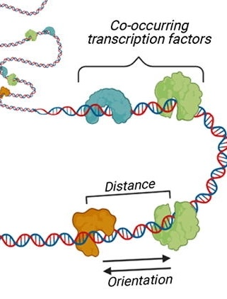

.. below role allows to use the html syntax, for example :raw-html:` `
.. role:: raw-html(raw)
    :format: html

===============================================
Predicting Relevant Transcription Factors
===============================================

Transcription factors (TFs) regulate gene expression by binding sites in the genome that often harbor a specific DNA motif. Identifying which TFs regulate defined set of genes is important to understanding the physiological consequences of altered chromatin status.

*image modified from doi: 10.1016/j.csbj.2022.07.025*

.. toctree::
   :maxdepth: 1

   Predicting Relevant Transcription Factors <motifAnalyses/motifAnalyses.rst>
   Transcription Factor Footprinting <ATACseq/lab-atac-TFfootprnt.rst>
   Identification of Sequence Motifs <motifs/lab-motifs.rst>
