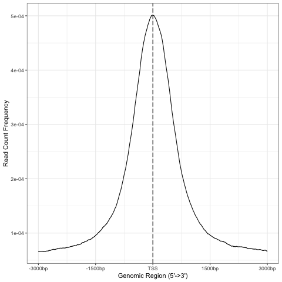
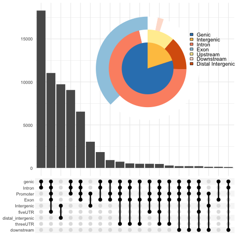

.. below role allows to use the html syntax, for example :raw-html:` `
.. role:: raw-html(raw)
    :format: html

===============
Peak Annotation
===============

:Date: 2025-09-15

.. contents::
   :depth: 3
..

:raw-html:` `

Learning outcomes
=================

Using ``ChIPseeker`` package

-  to profile ATAC-seq signal by genomic location and by proximity to
   TSS regions

-  to annotate peaks with the nearest feature

-  to perform functional annotation

:raw-html:` `

.. Note::

   We continue working with data from (Tsao et al. 2022). We will use the
   count table derived from non subset data (already prepared).

:raw-html:` `

Introduction
============

In this tutorial we use an R / Bioconductor package ``ChIPseeker`` (Yu,
Wang, and He 2015), to have a look at the ATAC / ChIP profiles, annotate
peaks and visualise annotations. We will also perform functional
annotation of peaks using ``clusterProfiler`` (Yu et al. 2012).

This tutorial is based on the `ChIPseeker package
tutorial <https://bioconductor.org/packages/release/bioc/vignettes/ChIPseeker/inst/doc/ChIPseeker.html>`__
so feel free to have this open alongside to read and experiment more.

:raw-html:` `

Data & Methods
==============

We will build upon the main lab:

-  :doc:`ATAC data analysis <../ATACseq/lab-atacseq-bulk>`: detected peaks (merged consensus peaks);

:raw-html:` `

Setting Up
-------------

You can continue working in the directory ``atacseq/analysis``.

We will use counts table which summarises reads in peaks detected using non-subset data in file
``AB_Batf_KO_invivo.genrich_joint.merged_peaks.featureCounts``
and annotation libraries, which are preinstalled.

We can create a new directory which will be our ``workdir`` in the subsequent code:

.. code-block:: bash

   mkdir DA
   cd DA

We can link all necessary files:

.. code-block:: bash
   
   ln -s ../counts

   ln -s ../../results/DA/annotation/

We access the R environment via:

.. code-block:: bash

   module load R_packages/4.3.1

:raw-html:` `

We activate R console upon typing ``R`` in the terminal.

:raw-html:` `

We begin by loading necessary libraries:

.. container:: cell

   .. code:: r

      library(tidyverse)
      library(dplyr)
      library(kableExtra)

      library(GenomicRanges)

      library(ChIPseeker)
      library(biomaRt)
      library(txdbmaker)

      library(clusterProfiler)
      library(org.Mm.eg.db)
      library(ReactomePA)

We need to set the path to ``workdir`` first, as other paths are relative to it:

.. container:: cell

   .. code:: r

      workdir=getwd()

To set working directory to your desired path (other than the current directory the R session started at) you can use these commands:

.. code-block:: R

   workdir="/path/to/workdir"

   workdir=setwd()

.. Note::

We take advantage of the module system on Rackham in this tutorial. The
code was tested under ``R 4.3.1`` The lab was developed under different
R version, as stated in session info.

:raw-html:` `

Preparing Annotations
-------------------------

We will use TSS annotations from Ensembl. We can fetch them from
``biomaRt``:

.. code-block:: R

   txdb_mm39 = makeTxDbFromBiomart(biomart="ensembl",
                                  dataset="mmusculus_gene_ensembl",
                                  circ_seqs=NULL,
                                  host="https://www.ensembl.org",
                                  taxonomyId=NA,
                                  miRBaseBuild=NA)

   ensembl <- useEnsembl(biomart = "genes", dataset = "mmusculus_gene_ensembl")
   all_genes=names(transcriptsBy(txdb_mm39, "gene"))

   gene_annot_mm39=getBM(attributes = 
      c('ensembl_gene_id', 'ensembl_transcript_id','external_gene_name','entrezgene_id','description','gene_biotype','chromosome_name','start_position','end_position','strand','transcription_start_site'),
          filters = 'ensembl_gene_id',
          values = all_genes, 
           mart = ensembl)

We have prepared these for you, so you can load them via:

.. container:: cell

   .. code:: r

      annotdir=file.path(workdir,"annotation")

      pth_txdbens=file.path(annotdir,"Ensembl.txdb.GRCm39.Rdata")
      txdb_mm39=loadDb(pth_txdbens)

      gene_annot_mm39=read.delim(file.path(annotdir,"mm39_gene_names.tab"), sep="\t", header=TRUE, quote = "")

:raw-html:` `

You can inspect the objects:

.. container:: cell

   .. code:: r

      txdb_mm39
      ## TxDb object:
      ## # Db type: TxDb
      ## # Supporting package: GenomicFeatures
      ## # Data source: BioMart
      ## # Organism: Mus musculus
      ## # Taxonomy ID: 10090
      ## # Resource URL: www.ensembl.org:443
      ## # BioMart database: ENSEMBL_MART_ENSEMBL
      ## # BioMart database version: Ensembl Genes 115
      ## # BioMart dataset: mmusculus_gene_ensembl
      ## # BioMart dataset description: Mouse genes (GRCm39)
      ## # BioMart dataset version: GRCm39
      ## # Full dataset: yes
      ## # miRBase build ID: NA
      ## # Nb of transcripts: 278396
      ## # Db created by: txdbmaker package from Bioconductor
      ## # Creation time: 2025-09-08 11:35:27 +0200 (Mon, 08 Sep 2025)
      ## # txdbmaker version at creation time: 1.0.1
      ## # RSQLite version at creation time: 2.4.3
      ## # DBSCHEMAVERSION: 1.2

      head(gene_annot_mm39)
      ##      ensembl_gene_id ensembl_transcript_id external_gene_name entrezgene_id
      ## 1 ENSMUSG00000000103    ENSMUST00000187148               Zfy2         22768
      ## 2 ENSMUSG00000000103    ENSMUST00000115891               Zfy2         22768
      ## 3 ENSMUSG00000001700    ENSMUST00000237355            Gramd2b        107022
      ## 4 ENSMUSG00000001700    ENSMUST00000237422            Gramd2b        107022
      ## 5 ENSMUSG00000001700    ENSMUST00000235794            Gramd2b        107022
      ## 6 ENSMUSG00000001700    ENSMUST00000237716            Gramd2b        107022
      ##                                                         description
      ## 1 zinc finger protein 2, Y-linked [Source:MGI Symbol;Acc:MGI:99213]
      ## 2 zinc finger protein 2, Y-linked [Source:MGI Symbol;Acc:MGI:99213]
      ## 3     GRAM domain containing 2B [Source:MGI Symbol;Acc:MGI:1914815]
      ## 4     GRAM domain containing 2B [Source:MGI Symbol;Acc:MGI:1914815]
      ## 5     GRAM domain containing 2B [Source:MGI Symbol;Acc:MGI:1914815]
      ## 6     GRAM domain containing 2B [Source:MGI Symbol;Acc:MGI:1914815]
      ##     gene_biotype chromosome_name start_position end_position strand
      ## 1 protein_coding               Y        2106015      2170409     -1
      ## 2 protein_coding               Y        2106015      2170409     -1
      ## 3 protein_coding              18       56533409     56636864      1
      ## 4 protein_coding              18       56533409     56636864      1
      ## 5 protein_coding              18       56533409     56636864      1
      ## 6 protein_coding              18       56533409     56636864      1
      ##   transcription_start_site
      ## 1                  2150346
      ## 2                  2170409
      ## 3                 56533409
      ## 4                 56533447
      ## 5                 56552242
      ## 6                 56602339

:raw-html:` `
:raw-html:` `

.. Hint::

If you would rather annotate TSS using the gene models from UCSC you can
use the Bioconductor package directly:

::

   library(TxDb.Mmusculus.UCSC.mm39.knownGene)
   txdb=TxDb.Mmusculus.UCSC.mm39.knownGene

Please note that UCSC and Ensembl use different contig naming schemes,
so it is advisable to use the annotation matching the genome reference
used for read mapping.

:raw-html:` `
:raw-html:` `

Data
-------------------------

We can now load data. We will subset the count table to only contain the
peaks on assembled chromosomes.

.. container:: cell

   .. code:: r

      count_table_fname="AB_Batf_KO_invivo.genrich_joint.merged_peaks.featureCounts"
      cnt_table_pth=file.path(file.path(workdir,"counts"),count_table_fname)

      cnt_table=read.table(cnt_table_pth, sep="\t", header=TRUE, blank.lines.skip=TRUE, comment.char = "#")
      rownames(cnt_table)=cnt_table$Geneid
      rownames(cnt_table)=c(gsub("AB_Batf_KO_invivo.genrich_joint.","",rownames(cnt_table)))
      colnames(cnt_table)=c(colnames(cnt_table)[1:6],gsub(".filt.bam","",colnames(cnt_table)[7:10]))

      colnames(cnt_table)[7:10]=c("B1_WT_Batf-floxed","B2_WT_Batf-floxed","A1_Batf_cKO","A2_Batf_cKO")

      #remove peaks not on the assembled chromosomes
      cnt_table_chr=cnt_table|>
        dplyr::filter(Chr%in%c(1:19) | Chr%in%c("X","Y"))

      reads.peak=cnt_table_chr[,c(7:10)]

      head(reads.peak)
      ##                B1_WT_Batf-floxed B2_WT_Batf-floxed A1_Batf_cKO A2_Batf_cKO
      ## merged_peaks_1               299               238         325         330
      ## merged_peaks_2               106                83         162         174
      ## merged_peaks_3                19                24          25          21
      ## merged_peaks_4                27                31          40          29
      ## merged_peaks_5               114               101          65         151
      ## merged_peaks_6               129               137         120         204

-  All peaks: n = 65027.

-  Peaks on assembled chromosomes: n = 64879. These peaks will be used
   for further analysis.

:raw-html:` `
:raw-html:` `

Peak Annotation
===============

We will be working on a ``GRanges`` object ``peaks_gr`` containing
non-subset peaks (i.e. all assebled chromosome peaks).

Let’s create the object:

.. container:: cell

   .. code:: r

      peaks_gr=GRanges(seqnames=cnt_table_chr$Chr, ranges=IRanges(cnt_table_chr$Start, cnt_table_chr$End), strand="*", mcols=data.frame(peakID=rownames(cnt_table_chr)))

and inspect it:

.. container:: cell

   .. code:: r

      peaks_gr
      ## GRanges object with 64879 ranges and 1 metadata column:
      ##           seqnames            ranges strand |       mcols.peakID
      ##              <Rle>         <IRanges>  <Rle> |        <character>
      ##       [1]        1   3050939-3052959      * |     merged_peaks_1
      ##       [2]        1   3053048-3054634      * |     merged_peaks_2
      ##       [3]        1   3054861-3055532      * |     merged_peaks_3
      ##       [4]        1   3057260-3057785      * |     merged_peaks_4
      ##       [5]        1   3059375-3061360      * |     merged_peaks_5
      ##       ...      ...               ...    ... .                ...
      ##   [64875]        Y 90814281-90815165      * | merged_peaks_64875
      ##   [64876]        Y 90815739-90816707      * | merged_peaks_64876
      ##   [64877]        Y 90818033-90819321      * | merged_peaks_64877
      ##   [64878]        Y 90819900-90820364      * | merged_peaks_64878
      ##   [64879]        Y 90821996-90824312      * | merged_peaks_64879
      ##   -------
      ##   seqinfo: 21 sequences from an unspecified genome; no seqlengths

We’re ready to annotate the peaks to their closest feature. Regions up to 3kb from TSS are annotated as "promoter".

::

   peakAnno=annotatePeak(peaks_gr, tssRegion=c(-3000, 3000),TxDb=txdb_mm39)

Summary of the regions annotated to peaks:

.. code-block:: R

   peakAnno

::

   ## Annotated peaks generated by ChIPseeker
   ## 64879/64879  peaks were annotated
   ## Genomic Annotation Summary:
   ##               Feature   Frequency
   ## 9    Promoter (<=1kb) 36.09642565
   ## 10   Promoter (1-2kb)  8.69464696
   ## 11   Promoter (2-3kb)  6.88204196
   ## 4              5' UTR  0.12022380
   ## 3              3' UTR  1.63843462
   ## 1            1st Exon  0.04469859
   ## 7          Other Exon  3.04104564
   ## 2          1st Intron 10.21594044
   ## 8        Other Intron 18.13838068
   ## 6  Downstream (<=300)  0.13717844
   ## 5   Distal Intergenic 14.99098321

Over 30% peaks localised to TSS, as expected in an ATAC-seq experiment.

:raw-html:` `
:raw-html:` `

Let’s inspect peak annotations:

.. code-block:: R

   peakAnno_df=as.data.frame(peakAnno)

     seqnames   start     end width strand   mcols.peakID        annotation geneChr geneStart geneEnd geneLength geneStrand             geneId       transcriptId distanceToTSS
   1        1 3050939 3052959  2021      * merged_peaks_1 Distal Intergenic       1   3143476 3144545       1070          1 ENSMUSG00000102693 ENSMUST00000193812        -90517
   2        1 3053048 3054634  1587      * merged_peaks_2 Distal Intergenic       1   3143476 3144545       1070          1 ENSMUSG00000102693 ENSMUST00000193812        -88842
   3        1 3054861 3055532   672      * merged_peaks_3 Distal Intergenic       1   3143476 3144545       1070          1 ENSMUSG00000102693 ENSMUST00000193812        -87944
   4        1 3057260 3057785   526      * merged_peaks_4 Distal Intergenic       1   3143476 3144545       1070          1 ENSMUSG00000102693 ENSMUST00000193812        -85691
   5        1 3059375 3061360  1986      * merged_peaks_5 Distal Intergenic       1   3143476 3144545       1070          1 ENSMUSG00000102693 ENSMUST00000193812        -82116
   6        1 3066555 3069092  2538      * merged_peaks_6 Distal Intergenic       1   3143476 3144545       1070          1 ENSMUSG00000102693 ENSMUST00000193812        -74384

We may want to include more gene related information:

::

   peakAnno_df=peakAnno_df|>left_join(gene_annot_mm39, by=c("transcriptId"="ensembl_transcript_id"))

It can be saved to a file as a table:

::

   write.table(peakAnno_df, "Batf_WT_KO.merged_peaks.tsv", 
       append = FALSE, 
       quote = FALSE, 
       sep = "\t",
       row.names = FALSE,
       col.names = TRUE, 
       fileEncoding = "")

Or as R data object ``rds`` ::

   saveRDS(peakAnno_df, file = "Allpeaks_annot.Ensembl.rds")

We can inspect read density at annotated TSS regions:

::

   promoter=getPromoters(TxDb=txdb_mm39, upstream=3000, downstream=3000)
   tagMatrix=getTagMatrix(peaks_gr, windows=promoter)

   TSS_profile=plotAvgProf(tagMatrix, xlim=c(-3000, 3000), xlab="Genomic Region (5'->3')", ylab = "Read Count Frequency")

Plot of all peaks in relation to transcription start sites (TSS) is
presented on Figure below. Expected is an enrichment of signal in the
vicinity of TSS.

   TSS profile

We can also plot summary of the annotations:

::

   peakAnnoplot=upsetplot(peakAnno, vennpie=TRUE)

   Annotation summary

To save these plots:

::

   pdf("TSSdist.pdf")
     TSS_profile
   dev.off()

   pdf("AnnotVis.pdf")
     peakAnnoplot
   dev.off()

:raw-html:` `
:raw-html:` `

Functional Analysis
===================

Having obtained annotations to nearest genes, we can perform functional
enrichment analysis to identify predominant biological themes among
these genes by incorporating knowledge provided by biological
ontologies, e.g. GO (Gene Ontology, (Ashburner et al. 2000)) and
Reactome (Griss et al. 2020).

We will perform Enrichment Analysis using functions ``enrichGO`` from ``clusterProfiler`` and 
``enrichPathway`` from ``ReactomePA``. These functions do not take size effect into account.

In this tutorial we use the merged consensus peaks set. This analysis
can also be performed on results of differential accessibility /
occupancy.

Let’s first annotate the peaks with **Reactome**.

Reactome annotations support **entrez gene ID** space. 

Reactome pathway enrichment of genes defined as the nearest feature to
the peaks:

::

   entrez_ids=peakAnno_df$entrezgene_id
   entrez_ids=entrez_ids[!is.na(unique(entrez_ids))]

   pathway.reac=ReactomePA::enrichPathway(entrez_ids, organism = "mouse")

   #previewing enriched Reactome pathways
   colnames(as.data.frame(pathway.reac))
   [1] "ID"          "Description" "GeneRatio"   "BgRatio"     "pvalue"      "p.adjust"    "qvalue"      "geneID"      "Count"      

   #we skip the preview of some columns which consist of long strings of gene IDs
   pathway.reac[1:10,c(1:7,9)]

::

                            ID                                                 Description GeneRatio  BgRatio       pvalue     p.adjust       qvalue Count
   R-MMU-9012999 R-MMU-9012999                                            RHO GTPase cycle  359/6685 394/8654 1.331007e-13 7.933191e-11 5.346233e-11   359
   R-MMU-983168   R-MMU-983168 Antigen processing: Ubiquitination & Proteasome degradation  265/6685 284/8654 1.399152e-13 7.933191e-11 5.346233e-11   265
   R-MMU-983169   R-MMU-983169      Class I MHC mediated antigen processing & presentation  310/6685 339/8654 2.043365e-12 7.723919e-10 5.205203e-10   310
   R-MMU-73887     R-MMU-73887                                    Death Receptor Signaling  127/6685 133/8654 5.339536e-09 1.513759e-06 1.020132e-06   127
   R-MMU-3700989 R-MMU-3700989                          Transcriptional Regulation by TP53  259/6685 288/8654 1.151777e-08 2.612231e-06 1.760401e-06   259
   R-MMU-1280215 R-MMU-1280215                         Cytokine Signaling in Immune system  407/6685 467/8654 1.887907e-08 3.568145e-06 2.404598e-06   407
   R-MMU-2555396 R-MMU-2555396                              Mitotic Metaphase and Anaphase  200/6685 219/8654 2.618777e-08 4.242419e-06 2.858996e-06   200
   R-MMU-68882     R-MMU-68882                                            Mitotic Anaphase  199/6685 218/8654 3.117447e-08 4.418982e-06 2.977983e-06   199
   R-MMU-8951664 R-MMU-8951664                                                 Neddylation  198/6685 218/8654 9.569964e-08 1.205815e-05 8.126075e-06   198
   R-MMU-195258   R-MMU-195258                                        RHO GTPase Effectors  213/6685 237/8654 2.721884e-07 3.086617e-05 2.080093e-05   213

We can see familar terms which can be connected to sample biology:

-  Cytokine Signaling in Immune system

-  Class I MHC mediated antigen processing & presentation

Let’s search for enriched GO terms:

::

   pathway.GO=enrichGO(entrez_ids, org.Mm.eg.db, ont = "BP")

   pathway.GO[1:10,c(1:7,9)]

These results look roughly in agreement with analyses using reactome:

::

                      ID                                                       Description GeneRatio   BgRatio RichFactor FoldEnrichment   zScore     p.adjust
   GO:0044772 GO:0044772                               mitotic cell cycle phase transition 390/14290 442/28905  0.8823529       1.784773 16.44034 3.595678e-64
   GO:0022411 GO:0022411                                    cellular component disassembly 424/14290 496/28905  0.8548387       1.729119 16.19597 3.178532e-61
   GO:0007264 GO:0007264                         small GTPase-mediated signal transduction 383/14290 439/28905  0.8724374       1.764717 15.96487 2.157761e-60
   GO:0051656 GO:0051656                           establishment of organelle localization 423/14290 498/28905  0.8493976       1.718113 15.98419 1.140876e-59
   GO:1901987 GO:1901987                         regulation of cell cycle phase transition 386/14290 453/28905  0.8520971       1.723574 15.34868 4.164055e-55
   GO:0022613 GO:0022613                              ribonucleoprotein complex biogenesis 376/14290 442/28905  0.8506787       1.720705 15.09815 2.621815e-53
   GO:0007059 GO:0007059                                            chromosome segregation 360/14290 419/28905  0.8591885       1.737918 15.04509 2.648496e-53
   GO:0002764 GO:0002764                      immune response-regulating signaling pathway 413/14290 497/28905  0.8309859       1.680871 15.13974 4.541242e-53
   GO:0043161 GO:0043161 proteasome-mediated ubiquitin-dependent protein catabolic process 342/14290 394/28905  0.8680203       1.755782 14.93600 5.798655e-53
   GO:0002757 GO:0002757                      immune response-activating signaling pathway 405/14290 486/28905  0.8333333       1.685619 15.07275 9.214974e-53

-  immune response-regulating signaling pathway

-  immune response-activating signaling pathway

Similar strategy can be used for analysis of subset peaks, i.e. differentially accessible peaks, peaks following similar level changes over a range of conditions etc.

Please remember that the results of functional analysis like the one
presented above can be only as accurate as the annotations.

:raw-html:` `
:raw-html:` `

Session Info
============

.. admonition:: Session Info.
   :class: dropdown, warning

   .. container:: cell

      ::

         ## R version 4.4.2 (2024-10-31)
         ## Platform: x86_64-apple-darwin20
         ## Running under: macOS Sonoma 14.5
         ## 
         ## Matrix products: default
         ## BLAS:   /Library/Frameworks/R.framework/Versions/4.4-x86_64/Resources/lib/libRblas.0.dylib 
         ## LAPACK: /Library/Frameworks/R.framework/Versions/4.4-x86_64/Resources/lib/libRlapack.dylib;  LAPACK version 3.12.0
         ## 
         ## locale:
         ## [1] en_US.UTF-8/en_US.UTF-8/en_US.UTF-8/C/en_US.UTF-8/en_GB.UTF-8
         ## 
         ## time zone: Europe/Stockholm
         ## tzcode source: internal
         ## 
         ## attached base packages:
         ## [1] stats4    stats     graphics  grDevices utils     datasets  methods  
         ## [8] base     
         ## 
         ## other attached packages:
         ##  [1] ReactomePA_1.48.0      org.Mm.eg.db_3.19.1    clusterProfiler_4.12.6
         ##  [4] txdbmaker_1.0.1        GenomicFeatures_1.56.0 AnnotationDbi_1.66.0  
         ##  [7] Biobase_2.64.0         biomaRt_2.60.1         ChIPseeker_1.40.0     
         ## [10] GenomicRanges_1.56.2   GenomeInfoDb_1.40.1    IRanges_2.38.1        
         ## [13] S4Vectors_0.42.1       BiocGenerics_0.50.0    kableExtra_1.4.0      
         ## [16] lubridate_1.9.4        forcats_1.0.0          stringr_1.5.2         
         ## [19] dplyr_1.1.4            purrr_1.1.0            readr_2.1.5           
         ## [22] tidyr_1.3.1            tibble_3.3.0           ggplot2_3.5.2         
         ## [25] tidyverse_2.0.0        bookdown_0.44          knitr_1.50            
         ## 
         ## loaded via a namespace (and not attached):
         ##   [1] splines_4.4.2                          
         ##   [2] BiocIO_1.14.0                          
         ##   [3] bitops_1.0-9                           
         ##   [4] ggplotify_0.1.2                        
         ##   [5] filelock_1.0.3                         
         ##   [6] R.oo_1.27.1                            
         ##   [7] polyclip_1.10-7                        
         ##   [8] graph_1.82.0                           
         ##   [9] XML_3.99-0.19                          
         ##  [10] lifecycle_1.0.4                        
         ##  [11] httr2_1.2.1                            
         ##  [12] lattice_0.22-7                         
         ##  [13] MASS_7.3-65                            
         ##  [14] magrittr_2.0.3                         
         ##  [15] rmarkdown_2.29                         
         ##  [16] yaml_2.3.10                            
         ##  [17] plotrix_3.8-4                          
         ##  [18] cowplot_1.2.0                          
         ##  [19] DBI_1.2.3                              
         ##  [20] RColorBrewer_1.1-3                     
         ##  [21] abind_1.4-8                            
         ##  [22] zlibbioc_1.50.0                        
         ##  [23] R.utils_2.13.0                         
         ##  [24] ggraph_2.2.2                           
         ##  [25] RCurl_1.98-1.17                        
         ##  [26] yulab.utils_0.2.1                      
         ##  [27] tweenr_2.0.3                           
         ##  [28] rappdirs_0.3.3                         
         ##  [29] GenomeInfoDbData_1.2.12                
         ##  [30] enrichplot_1.24.4                      
         ##  [31] ggrepel_0.9.6                          
         ##  [32] tidytree_0.4.6                         
         ##  [33] reactome.db_1.88.0                     
         ##  [34] svglite_2.2.1                          
         ##  [35] codetools_0.2-20                       
         ##  [36] DelayedArray_0.30.1                    
         ##  [37] DOSE_3.30.5                            
         ##  [38] xml2_1.4.0                             
         ##  [39] ggforce_0.5.0                          
         ##  [40] tidyselect_1.2.1                       
         ##  [41] aplot_0.2.8                            
         ##  [42] UCSC.utils_1.0.0                       
         ##  [43] farver_2.1.2                           
         ##  [44] viridis_0.6.5                          
         ##  [45] matrixStats_1.5.0                      
         ##  [46] BiocFileCache_2.12.0                   
         ##  [47] GenomicAlignments_1.40.0               
         ##  [48] jsonlite_2.0.0                         
         ##  [49] tidygraph_1.3.1                        
         ##  [50] systemfonts_1.2.3                      
         ##  [51] tools_4.4.2                            
         ##  [52] progress_1.2.3                         
         ##  [53] treeio_1.28.0                          
         ##  [54] TxDb.Hsapiens.UCSC.hg19.knownGene_3.2.2
         ##  [55] Rcpp_1.1.0                             
         ##  [56] glue_1.8.0                             
         ##  [57] gridExtra_2.3                          
         ##  [58] SparseArray_1.4.8                      
         ##  [59] xfun_0.53                              
         ##  [60] qvalue_2.36.0                          
         ##  [61] MatrixGenerics_1.16.0                  
         ##  [62] withr_3.0.2                            
         ##  [63] fastmap_1.2.0                          
         ##  [64] boot_1.3-32                            
         ##  [65] caTools_1.18.3                         
         ##  [66] digest_0.6.37                          
         ##  [67] timechange_0.3.0                       
         ##  [68] R6_2.6.1                               
         ##  [69] gridGraphics_0.5-1                     
         ##  [70] textshaping_1.0.3                      
         ##  [71] colorspace_2.1-1                       
         ##  [72] GO.db_3.19.1                           
         ##  [73] gtools_3.9.5                           
         ##  [74] RSQLite_2.4.3                          
         ##  [75] R.methodsS3_1.8.2                      
         ##  [76] generics_0.1.4                         
         ##  [77] data.table_1.17.8                      
         ##  [78] rtracklayer_1.64.0                     
         ##  [79] prettyunits_1.2.0                      
         ##  [80] graphlayouts_1.2.2                     
         ##  [81] httr_1.4.7                             
         ##  [82] htmlwidgets_1.6.4                      
         ##  [83] S4Arrays_1.4.1                         
         ##  [84] scatterpie_0.2.5                       
         ##  [85] graphite_1.50.0                        
         ##  [86] pkgconfig_2.0.3                        
         ##  [87] gtable_0.3.6                           
         ##  [88] blob_1.2.4                             
         ##  [89] S7_0.2.0                               
         ##  [90] XVector_0.44.0                         
         ##  [91] shadowtext_0.1.6                       
         ##  [92] htmltools_0.5.8.1                      
         ##  [93] fgsea_1.30.0                           
         ##  [94] scales_1.4.0                           
         ##  [95] png_0.1-8                              
         ##  [96] ggfun_0.2.0                            
         ##  [97] rstudioapi_0.17.1                      
         ##  [98] tzdb_0.5.0                             
         ##  [99] reshape2_1.4.4                         
         ## [100] rjson_0.2.23                           
         ## [101] uuid_1.2-1                             
         ## [102] nlme_3.1-168                           
         ## [103] curl_7.0.0                             
         ## [104] cachem_1.1.0                           
         ## [105] KernSmooth_2.23-26                     
         ## [106] parallel_4.4.2                         
         ## [107] restfulr_0.0.16                        
         ## [108] pillar_1.11.0                          
         ## [109] grid_4.4.2                             
         ## [110] vctrs_0.6.5                            
         ## [111] gplots_3.2.0                           
         ## [112] dbplyr_2.5.0                           
         ## [113] evaluate_1.0.5                         
         ## [114] cli_3.6.5                              
         ## [115] compiler_4.4.2                         
         ## [116] Rsamtools_2.20.0                       
         ## [117] rlang_1.1.6                            
         ## [118] crayon_1.5.3                           
         ## [119] plyr_1.8.9                             
         ## [120] fs_1.6.6                               
         ## [121] ggiraph_0.9.0                          
         ## [122] stringi_1.8.7                          
         ## [123] viridisLite_0.4.2                      
         ## [124] BiocParallel_1.38.0                    
         ## [125] Biostrings_2.72.1                      
         ## [126] lazyeval_0.2.2                         
         ## [127] GOSemSim_2.30.2                        
         ## [128] Matrix_1.7-4                           
         ## [129] hms_1.1.3                              
         ## [130] patchwork_1.3.2                        
         ## [131] bit64_4.6.0-1                          
         ## [132] KEGGREST_1.44.1                        
         ## [133] SummarizedExperiment_1.34.0            
         ## [134] igraph_2.1.4                           
         ## [135] memoise_2.0.1                          
         ## [136] ggtree_3.12.0                          
         ## [137] fastmatch_1.1-6                        
         ## [138] bit_4.6.0                              
         ## [139] gson_0.1.0                             
         ## [140] ape_5.8-1

:raw-html:` `
:raw-html:` `

References
==========

.. container:: references csl-bib-body hanging-indent
   :name: refs

   .. container:: csl-entry
      :name: ref-GO

      Ashburner, M., C. A. Ball, J. A. Blake, D. Botstein, H. Butler, J.
      M. Cherry, A. P. Davis, et al. 2000. “Gene ontology: tool for the
      unification of biology. The Gene Ontology Consortium.” *Nat Genet*
      25 (1): 25–29.

   .. container:: csl-entry
      :name: ref-reactome

      Griss, J., G. Viteri, K. Sidiropoulos, V. Nguyen, A. Fabregat, and
      H. Hermjakob. 2020. “ReactomeGSA - Efficient Multi-Omics
      Comparative Pathway Analysis.” *Mol Cell Proteomics* 19 (12):
      2115–25.

   .. container:: csl-entry
      :name: ref-Tsao2022

      Tsao, Hsiao-Wei, James Kaminski, Makoto Kurachi, R. Anthony
      Barnitz, Michael A. DiIorio, Martin W. LaFleur, Wataru Ise, et al.
      2022. “Batf-Mediated Epigenetic Control of Effector CD8 + t Cell
      Differentiation.” *Science Immunology* 7 (68).
      https://doi.org/10.1126/sciimmunol.abi4919.

   .. container:: csl-entry
      :name: ref-Yu2012

      Yu, Guangchuang, Li-Gen Wang, Yanyan Han, and Qing-Yu He. 2012.
      “clusterProfiler: An r Package for Comparing Biological Themes
      Among Gene Clusters.” *OMICS: A Journal of Integrative Biology* 16
      (5): 284–87. https://doi.org/10.1089/omi.2011.0118.

   .. container:: csl-entry
      :name: ref-Yu2015

      Yu, Guangchuang, Li-Gen Wang, and Qing-Yu He. 2015. “ChIPseeker:
      An r/Bioconductor Package for ChIP Peak Annotation, Comparison and
      Visualization.” *Bioinformatics* 31 (14): 2382–83.
      https://doi.org/10.1093/bioinformatics/btv145.
