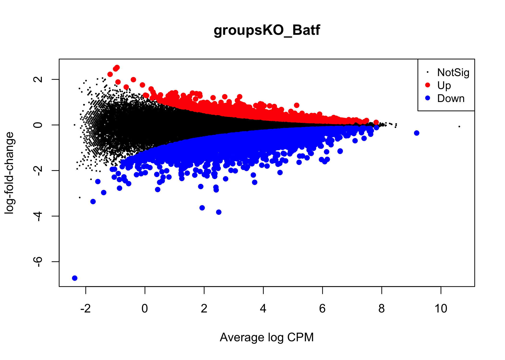

.. below role allows to use the html syntax, for example :raw-html:` `
.. role:: raw-html(raw)
    :format: html

======================================
Differential Accessibility in ATAC-seq
======================================

:Date: 2025-09-16

.. contents::
   :depth: 3
..

:raw-html:` `

Learning outcomes
=================

-  to interrogate GC bias in ATAC-seq data

-  to select appropriate scaling normalisation of ATAC-seq data

-  to detect differentially accessible regions using ``edgeR``

.. Note::

   We continue working with data from (Tsao et al. 2022). We will use the
   count table derived from non subset data (already prepared).

:raw-html:` `
:raw-html:` `

Introduction
============

In this tutorial we use an R / Bioconductor packages ``edgeR`` (Robinson
and Oshlack 2010), (Chen, Lun, and Smyth 2016), ``EDASeq`` (Risso et al.
2011) and ``cqn`` (Hansen, Irizarry, and WU 2012) to perform
normalisation and analysis of differential accessibility in ATAC-seq
data.

:raw-html:` `
:raw-html:` `

Data & Methods
==============

We will build upon the main lab ATACseq data analysis:

-  we will interrogate GC bias in peaks and in adjacent non-overlapping
   genomic bins;

-  we will use the counts table encompassing **complete data** for
   differential accessibility analysis;

:raw-html:` `

Setting Up
----------

You can continue working in the directory ``atacseq/analysis/DA``.
This directory contains count tables derived from summarising of non-subset data to merged peaks called by genrich in the **joint** mode. We
will use file
``AB_Batf_KO_invivo.genrich_joint.merged_peaks.featureCounts``.

:raw-html:` `

We can link additional files:

.. code-block:: bash
   
   mkdir bam_dir
   cd bam_dir
   find ../../../data_proc/ -name \*.ba* -exec ln -vs "{}" ';'
   cd ..

:raw-html:` `

We access the R environment via:

::

   module load R_packages/4.3.1

We activate R console upon typing ``R`` in the terminal.

:raw-html:` `

We begin by loading necessary libraries:

.. container:: cell

   .. code:: r

      library(tidyverse)
      library(dplyr)
      library(kableExtra)

      library(ggplot2)
      library(wesanderson)

      library(GenomicRanges)
      library(Hmisc)
      library(Biostrings)
      library(regioneR)
      library(bamsignals)
      require(MASS)

      library(BSgenome.Mmusculus.UCSC.mm39)

      library(edgeR)
      library(limma)
      library(SummarizedExperiment)
      library(EDASeq)
      library(cqn)

:raw-html:` `

.. container:: cell

   .. code:: r

      workdir="/path/to/workdir"

To set working directory to your desired path you can use these
commands:

::

   workdir=getwd()

   workdir=setwd()

:raw-html:` `

.. Note::

   We take advantage of the module system on Rackham in this tutorial. The
   code was tested under ``R 4.3.1`` The lab was developed under different
   R version, as stated in session info.

:raw-html:` `

Data
----

We can now load data. We will subset the count table to only contain the
peaks on assembled chromosomes.

.. container:: cell

   .. code:: r

      count_table_fname="AB_Batf_KO_invivo.genrich_joint.merged_peaks.featureCounts"
      cnt_table_pth=file.path(file.path(workdir,"data"),count_table_fname)

      cnt_table=read.table(cnt_table_pth, sep="\t", header=TRUE, blank.lines.skip=TRUE)
      rownames(cnt_table)=cnt_table$Geneid
      rownames(cnt_table)=c(gsub("AB_Batf_KO_invivo.genrich_joint.","",rownames(cnt_table)))
      colnames(cnt_table)=c(colnames(cnt_table)[1:6],gsub(".filt.bam","",colnames(cnt_table)[7:10]))

      colnames(cnt_table)[7:10]=c("B1_WT_Batf-floxed","B2_WT_Batf-floxed","A1_Batf_cKO","A2_Batf_cKO")

      #remove peaks not on the assembled chromosomes
      cnt_table_chr=cnt_table|>
        dplyr::filter(Chr%in%c(1:19) | Chr%in%c("X","Y"))

      reads.peak=cnt_table_chr[,c(7:10)]

      head(reads.peak)
      ##                B1_WT_Batf-floxed B2_WT_Batf-floxed A1_Batf_cKO A2_Batf_cKO
      ## merged_peaks_1               299               238         325         330
      ## merged_peaks_2               106                83         162         174
      ## merged_peaks_3                19                24          25          21
      ## merged_peaks_4                27                31          40          29
      ## merged_peaks_5               114               101          65         151
      ## merged_peaks_6               129               137         120         204

-  All peaks: n = 65027.

-  Peaks on assembled chromosomes: n = 64879. These peaks will be used
   for further analysis.

:raw-html:` `
:raw-html:` `

GC Bias
=======

GC Bias in Genomic Bins
-----------------------

To ivestigate the GC bias in adjacent genomic bins (background), we
start with creating the ``GRanges`` object holding the tiled genome
intervals. We will do it for one chromosome only (chr1), to save compute
time.

.. container:: cell

   .. code:: r

      chr.lengths = seqlengths(Mmusculus)[1:21]
      chr.lengths.chr1=chr.lengths[1]

      #tiles
      tiles_chr1=GenomicRanges::tileGenome(chr.lengths.chr1,tilewidth=5000, cut.last.tile.in.chrom=TRUE)

      #sequence
      tileSeqs=BSgenome::getSeq(Mmusculus,tiles_chr1)

      #GCcontent
      gcContentTiles=Biostrings::letterFrequency(tileSeqs, "GC",as.prob=TRUE)[,1]
      mcols(tiles_chr1)$gc=gcContentTiles

:raw-html:` `

We need to tweak chromosome names to match the genome reference used for
read mapping:

.. container:: cell

   .. code:: r

      # tiles_chr1
      # remove chr from granges obj
      seqlevels(tiles_chr1)=gsub("chr","",seqlevels(tiles_chr1))

:raw-html:` `

We can now count reads in all bam files in the data set, and plot them.

.. container:: cell

   .. code:: r

      bam_dir=file.path(workdir,"bam_dir")
      bam_fnames=list.files(bam_dir,pattern = "\\.bam$",)

      par(mfrow = c(2, length(bam_fnames)/2 ) )

      for (bam_fname in bam_fnames){

          bam_path=file.path(bam_dir,bam_fname)

          tiles_bam=tiles_chr1

          tiled_counts=bamCount(bam_path, tiles_bam, verbose=FALSE)
          mcols(tiles_bam)$readcount=tiled_counts

          smoothScatter(tiles_bam$gc, log2(tiles_bam$readcount+1), 
            main=paste("Logcounts vs GC in bins",bam_fname,sep="\n"), ylab="log(counts+1)", xlab="GC content")

      }

:raw-html:` `

We can see that the signal of logcounts vs GC content looks very similar
in all libraries.

:raw-html:` `

GC Bias in Peaks
----------------

To ivestigate the GC bias in peaks (signal), we start with creating the
``GRanges`` object holding the peak intervals.

We need to prefix the chromosome name by “chr” (per UCSC convention) in
the first step to be able to use a ``BSgenome`` object from the
Bioconductor package ``BSgenome.Mmusculus.UCSC.mm39``. Please note this
only works with assembled chromosomes; the non-assembled contigs follow
different naming conventions in Ensembl (the source of the reference
assembly for read mapping) and UCSC (the source of BSgenome package).

.. container:: cell

   .. code:: r

      peaks_gr=GRanges(seqnames=paste0("chr",cnt_table_chr$Chr), ranges=IRanges(cnt_table_chr$Start, cnt_table_chr$End), strand="*", mcols=data.frame(peakID=rownames(cnt_table_chr)))

We now prepare data with GC content of the peak regions for GC-aware
normalisation.

.. container:: cell

   .. code:: r

      peakSeqs=BSgenome::getSeq(Mmusculus,peaks_gr)

      gcContentPeaks=Biostrings::letterFrequency(peakSeqs, "GC",as.prob=TRUE)[,1]

      #divide into 20 bins by GC content
      gcGroups=Hmisc::cut2(gcContentPeaks, g=20)
      mcols(peaks_gr)$gc=gcContentPeaks
      mcols(peaks_gr)$gc_group=gcGroups

      peaks_gr
      ## GRanges object with 64879 ranges and 3 metadata columns:
      ##           seqnames            ranges strand |       mcols.peakID        gc
      ##              <Rle>         <IRanges>  <Rle> |        <character> <numeric>
      ##       [1]     chr1   3050939-3052959      * |     merged_peaks_1  0.392875
      ##       [2]     chr1   3053048-3054634      * |     merged_peaks_2  0.379962
      ##       [3]     chr1   3054861-3055532      * |     merged_peaks_3  0.345238
      ##       [4]     chr1   3057260-3057785      * |     merged_peaks_4  0.376426
      ##       [5]     chr1   3059375-3061360      * |     merged_peaks_5  0.402316
      ##       ...      ...               ...    ... .                ...       ...
      ##   [64875]     chrY 90814281-90815165      * | merged_peaks_64875  0.505085
      ##   [64876]     chrY 90815739-90816707      * | merged_peaks_64876  0.430341
      ##   [64877]     chrY 90818033-90819321      * | merged_peaks_64877  0.493406
      ##   [64878]     chrY 90819900-90820364      * | merged_peaks_64878  0.369892
      ##   [64879]     chrY 90821996-90824312      * | merged_peaks_64879  0.469141
      ##                gc_group
      ##                <factor>
      ##       [1] [0.234,0.396)
      ##       [2] [0.234,0.396)
      ##       [3] [0.234,0.396)
      ##       [4] [0.234,0.396)
      ##       [5] [0.396,0.417)
      ##       ...           ...
      ##   [64875] [0.505,0.514)
      ##   [64876] [0.417,0.431)
      ##   [64877] [0.487,0.496)
      ##   [64878] [0.234,0.396)
      ##   [64879] [0.461,0.470)
      ##   -------
      ##   seqinfo: 21 sequences from an unspecified genome; no seqlengths

Figure below shows that the accessibility measure of a particular
genomic region is associated with its GC content. In this data set, the
curves are almost identical for all samples, indicating no difference in
GC bias between samples.

However, in some cases the slope and shape of the curves may differ
between samples, which indicates that GC content effects are
sample–specific and can therefore bias between–sample comparisons.

We start by creating a data frame with gc contents and read count in
each peak in each sample as well as perform ``lowess`` (locally weighted
scatterplot smoothing) regression to fit the trend:

.. container:: cell

   .. code:: r

      lowListGC = list()
      for(kk in 1:ncol(reads.peak)){
        set.seed(kk)
        lowListGC[[kk]] = lowess(x=gcContentPeaks, y=log1p(reads.peak[,kk]), f=1/10)
      }

      names(lowListGC)=colnames(reads.peak)

      dfList = list()
      for(ss in 1:length(lowListGC)){
        oox = order(lowListGC[[ss]]$x)
        dfList[[ss]] = data.frame(x=lowListGC[[ss]]$x[oox], y=lowListGC[[ss]]$y[oox], sample=names(lowListGC)[[ss]])
      }
      dfAll = do.call(rbind, dfList)
      dfAll$sample = factor(dfAll$sample)

We can now plot the relationship of logcounts vs GC content:

.. container:: cell

   .. code:: r

      plotGCHex <- function(gr, counts){
        counts2 <- counts
        df <- as_tibble(cbind(counts2,gc=mcols(gr)$gc))
        df <- gather(df, sample, value, -gc)
        ggplot(data=df, aes(x=gc, y=log(value+1)) ) + 
          ylab("log(count + 1)") + xlab("GC-content") + 
          geom_hex(bins = 50) + theme_bw()
      }

      plot_GC_bias=plotGCHex(peaks_gr, rowMeans(reads.peak)) +
        theme(axis.title = element_text(size=16)) +
        labs(fill="Nr. of peaks") + 
        geom_line(aes(x=x, y=y, group=sample, color=sample), data=dfAll, linewidth=1) +
        scale_color_discrete()

:raw-html:` `
:raw-html:` `

Differential Accessibility
==========================

We can define experimental groups:

.. container:: cell

   .. code:: r

      groups=factor(c(rep("ctrl",2),rep("KO_Batf",2)))
      groups
      ## [1] ctrl    ctrl    KO_Batf KO_Batf
      ## Levels: ctrl KO_Batf

      design=model.matrix(~groups)
      rownames(design)=colnames(reads.peak)
      design
      ##                   (Intercept) groupsKO_Batf
      ## B1_WT_Batf-floxed           1             0
      ## B2_WT_Batf-floxed           1             0
      ## A1_Batf_cKO                 1             1
      ## A2_Batf_cKO                 1             1
      ## attr(,"assign")
      ## [1] 0 1
      ## attr(,"contrasts")
      ## attr(,"contrasts")$groups
      ## [1] "contr.treatment"

:raw-html:` `

We’ll detect differentially accessible regions using ``edgeR``. As we do
not observe strong effects of GC content on signal neither in peaks nor
in genomic bins, we decided to use the scaling normalisation by trimmed
mean of M-values (TMM) (Robinson and Oshlack 2010).

We start by creating ``DGEList``, the object ``edgeR`` uses to store
data for calculations. Before we start the DA analysis, it’s advisable
to remove peaks with very low counts.

.. container:: cell

   .. code:: r

      reads.dge = DGEList(counts=reads.peak, group=groups)
      keep = filterByExpr(reads.dge)
      reads.dge=reads.dge[keep,,keep.lib.sizes=FALSE]

      summary(keep)
      ##    Mode   FALSE    TRUE 
      ## logical     418   64461

      reads.dge
      ## An object of class "DGEList"
      ## $counts
      ##                B1_WT_Batf-floxed B2_WT_Batf-floxed A1_Batf_cKO A2_Batf_cKO
      ## merged_peaks_1               299               238         325         330
      ## merged_peaks_2               106                83         162         174
      ## merged_peaks_3                19                24          25          21
      ## merged_peaks_4                27                31          40          29
      ## merged_peaks_5               114               101          65         151
      ## 64456 more rows ...
      ## 
      ## $samples
      ##                     group lib.size norm.factors
      ## B1_WT_Batf-floxed    ctrl 43359738            1
      ## B2_WT_Batf-floxed    ctrl 33327965            1
      ## A1_Batf_cKO       KO_Batf 43438468            1
      ## A2_Batf_cKO       KO_Batf 46400831            1

:raw-html:` `

These steps perform the standard ``edgeR`` workflow for differential
analysis:

.. container:: cell

   .. code:: r

      reads.dge.tmm = normLibSizes(reads.dge)

:raw-html:` `

We can inspect sample grouping on multidimensional scaling (MDS) plot
before proceeding:

:raw-html:` `

All looks as expected, we can proceed with the differential analysis:

.. container:: cell

   .. code:: r

      reads.dge.tmm = estimateDisp(reads.dge.tmm, design)
      qlf.fit.tmm=glmQLFit(reads.dge.tmm, design, robust=TRUE)
      qlf.ftest.tmm=glmQLFTest(qlf.fit.tmm, coef=2)
      DA_res.qlf.tmm=as.data.frame(topTags(qlf.ftest.tmm, nrow(qlf.ftest.tmm$table)))
      DA_res.qlf.tmm=DA_res.qlf.tmm|>dplyr::mutate(peakID=rownames(DA_res.qlf.tmm))

:raw-html:` `

This results in a table with results of DA analysis:

.. container:: cell

   .. code:: r

      head(DA_res.qlf.tmm)
      ##                        logFC   logCPM        F       PValue          FDR
      ## merged_peaks_28038 -1.610768 6.074221 756.5472 1.722979e-90 1.110650e-85
      ## merged_peaks_51767 -1.508490 6.159745 710.5749 3.363346e-87 1.084023e-82
      ## merged_peaks_2997  -1.517878 5.964106 638.5088 9.578557e-82 2.058145e-77
      ## merged_peaks_1873  -1.157643 6.593339 534.2112 4.151681e-73 6.690538e-69
      ## merged_peaks_36974 -1.141022 6.596217 524.9430 2.716748e-72 3.502486e-68
      ## merged_peaks_40709 -1.638902 5.206780 468.3368 4.081673e-67 4.385146e-63
      ##                                peakID
      ## merged_peaks_28038 merged_peaks_28038
      ## merged_peaks_51767 merged_peaks_51767
      ## merged_peaks_2997   merged_peaks_2997
      ## merged_peaks_1873   merged_peaks_1873
      ## merged_peaks_36974 merged_peaks_36974
      ## merged_peaks_40709 merged_peaks_40709

:raw-html:` `

We should also take a look at the diagnostic plots to verify that they
look as expected.

:raw-html:` `

At this point we can add the information from peak annotation
:doc:`Peak Annotation <./PeakAnnot_tsao2022.fulldata_rtds.12ix2025>` 

If you are still in **the same R session**, you can skip the step below.

If you started a **new R session**, you can read in the table with peak
annotations:

.. container:: cell

   .. code:: r

      peak_annots_pth=file.path(workdir,"Allpeaks_annot.Ensembl.rds")

      peakAnno_df=readRDS(peak_annots_pth)

:raw-html:` `

.. Note::
   
   If you did not follow the Peak Annotation lab, you copy the saved file from
   ``../../results/DA/Allpeaks_annot.Ensembl.rds``

:raw-html:` `

We can now join the tables with peak annotations and DA results:

.. container:: cell

   .. code:: r

      DA_res_table=DA_res.qlf.tmm |>
        dplyr::left_join(peakAnno_df,by="peakID")|>
        dplyr::select(seqnames,start,end,peakID,logFC,FDR,gc,annotation,geneChr,geneStart,geneEnd,geneStrand,geneId,transcriptId,external_gene_name,distanceToTSS)

.. container:: cell

   .. code:: r

      head(DA_res_table)
      ##   seqnames     start       end             peakID     logFC          FDR
      ## 1       17  66268427  66269247 merged_peaks_28038 -1.610768 1.110650e-85
      ## 2        6 122504236 122505014 merged_peaks_51767 -1.508490 1.084023e-82
      ## 3        1 155076669 155077704  merged_peaks_2997 -1.517878 2.058145e-77
      ## 4        1  95195320  95196614  merged_peaks_1873 -1.157643 6.690538e-69
      ## 5        2 162944874 162945676 merged_peaks_36974 -1.141022 3.502486e-68
      ## 6        3 138125917 138126743 merged_peaks_40709 -1.638902 4.385146e-63
      ##          gc                                                    annotation
      ## 1 0.4360536                                             Distal Intergenic
      ## 2 0.4801027 Intron (ENSMUST00000032210/ENSMUSG00000030116, intron 8 of 8)
      ## 3 0.5009653                                                        3' UTR
      ## 4 0.4617761                                             Distal Intergenic
      ## 5 0.5031133                                             Distal Intergenic
      ## 6 0.4087062     Exon (ENSMUST00000161312/ENSMUSG00000037797, exon 4 of 6)
      ##   geneChr geneStart   geneEnd geneStrand             geneId       transcriptId
      ## 1      17  66261129  66265392          1 ENSMUSG00000139744 ENSMUST00000355127
      ## 2       6 122499458 122505594          1 ENSMUSG00000030116 ENSMUST00000126357
      ## 3       1 155070767 155077993          1 ENSMUSG00000026470 ENSMUST00000194158
      ## 4       1  95183688  95184535          2 ENSMUSG00000099592 ENSMUST00000190584
      ## 5       2 162934819 162934943          1 ENSMUSG00002076785 ENSMUST00020181897
      ## 6       3 138121256 138136653          1 ENSMUSG00000037797 ENSMUST00000013458
      ##   external_gene_name distanceToTSS
      ## 1            Gm65735          7298
      ## 2              Mfap5          4778
      ## 3               Stx6          5902
      ## 4             Gm5264        -10785
      ## 5            Gm56299         10055
      ## 6               Adh4          4661

:raw-html:` `

We can save the complete results of peak annotation, GC content and DA analysis:

.. code-block:: R

   saveRDS(DA_res_table, file = "FiltPeaks.DA.TMM.annot.rds")

:raw-html:` `

You can now follow with other downstream tutorials listed under 
:doc:`Downstream Analyses <../downstream_tutorials>` 

:raw-html:` `

GC Bias Correction
========================

Plotting Log2FC in GC Bins
-----------------------------

When a strong effect of GC content on signal is observed, a GC aware
scaling normalisation can be considered. It is important to perform all
diagnostic plots, however, to verify whether it does not distort the
data in an unexpected manner. One should always be aware that the GC
bias, although technical, may also reflect sample biology, therefore
removing it may lead to signal loss.

We can first verify whether there is a GC bias in log2FC detection using
GC agnostic TMM scaling.

We can plot log2FC distribution in GC content bins.

For this we will need the GC bins we calculated before, so we need to
join that information to the results of DA analysis:

.. container:: cell

   .. code:: r

      peak_info_df=as.data.frame(peaks_gr)|>
        dplyr::rename(peakID=mcols.peakID)

      df_GCbias=DA_res.qlf.tmm |>
          dplyr::left_join(peak_info_df, by="peakID") |>
          dplyr::select(logFC,gc_group)

Let’s plot the log2FC in GC bins:

.. container:: cell

   .. code:: r

      plot_lfc_GC_TMM = ggplot(df_GCbias) +
        aes(x=gc_group, y=logFC, color=gc_group) +
        geom_violin(width=0.95) +
        geom_boxplot(width=0.15, color="grey20") +
        scale_color_manual(values=wesanderson::wes_palette("Zissou1", nlevels(df_GCbias$gc_group), "continuous")) +
        geom_abline(intercept = 0, slope = 0, col="black", lty=2) +
        #ylim(c(-1,1)) + ## this was in the original code from EDAseq paper; it calculates medians for values within the ylim interval - not from the entire data
        coord_cartesian(ylim=c(-1,1)) +
        ggtitle(paste0("log2FCs in bins by GC content, normalisation: TMM")) +
        xlab("GC-content bin") +
        theme_bw()+
        theme(axis.text.x = element_text(angle = 45, vjust = .5),
              legend.position = "none",
              axis.title = element_text(size=16))

      plot_lfc_GC_TMM

A negligible bias in log2FC can be observed within the range of log2FC
(-1,1).

You can alter the plotted range by changing
``coord_cartesian(ylim=c(-1,1))`` to your desired range.

In any case, **for this data set** the systematic effect of GC contents
on detected log2FC is very small, and below the reasonable size effect
cutoff.

:raw-html:` `

Correcting for GC contents
-------------------------------

If required, the raw counts can be scaled in a GC aware manner, rather
than using the TMM method.

Two related methods are presented below. Both perform conditional
quantile scaling, and output the *offsets* which can then be used in
``edgeR`` statistical framework.

:raw-html:` `

Full Quantile GC-GC Scaling
^^^^^^^^^^^^^^^^^^^^^^^^^^^

This method is implemented in Bioconductor package ``EDASeq`` (Risso et
al. 2011).

To calculate the offsets, which correct for library size as well as GC
content (full quantile normalisation in both cases):

.. container:: cell

   .. code:: r

      exprsSet.eda=newSeqExpressionSet(reads.dge$counts)
      peaks_gr.keep=peaks_gr[keep]
      fData(exprsSet.eda)$gc=peaks_gr.keep$gc

      exprsSet.eda.wl=withinLaneNormalization(exprsSet.eda,"gc",num.bins=20, which="full",offset=TRUE)
      exprsSet.eda.bl=betweenLaneNormalization(exprsSet.eda.wl,which="full",offset=TRUE)

The offsets can be inspected:

.. container:: cell

   .. code:: r

      head(offst(exprsSet.eda.bl))
      ##                B1_WT_Batf-floxed B2_WT_Batf-floxed A1_Batf_cKO A2_Batf_cKO
      ## merged_peaks_1         1.2280870         1.5061165   1.2441529   1.1811897
      ## merged_peaks_2         1.0093249         1.2584039   1.1587582   1.0848913
      ## merged_peaks_3         0.6129416         0.9425809   0.7350182   0.5523253
      ## merged_peaks_4         0.7139578         0.9909705   0.8238461   0.6286266
      ## merged_peaks_5         0.6563096         0.9560009   0.5779452   0.6904069
      ## merged_peaks_6         0.6932922         1.0369034   0.7632731   0.7825120

We will input the offset matrix to ``edgeR``:

.. container:: cell

   .. code:: r

      reads.dge.edaseq = reads.dge
      reads.dge.edaseq$offset = -offst(exprsSet.eda.bl)

The statistical testing follows:

.. container:: cell

   .. code:: r

      reads.dge.edaseq=estimateDisp(reads.dge.edaseq, design)
      qlf.fit.edaseq=glmQLFit(reads.dge.edaseq, design, robust=TRUE)
      qlf.ftest.edaseq=glmQLFTest(qlf.fit.edaseq, coef=2)
      DA_res.qlf.edaseq=as.data.frame(topTags(qlf.ftest.edaseq, nrow(qlf.ftest.edaseq$table)))
      DA_res.qlf.edaseq=DA_res.qlf.edaseq|>dplyr::mutate(peakID=rownames(DA_res.qlf.edaseq))

We can now plot the log2FC in GC bins, as for TMM scaling:

.. container:: cell

   .. code:: r

      df_GCbias=DA_res.qlf.edaseq |>
          dplyr::left_join(peak_info_df, by="peakID") |>
          dplyr::select(logFC,gc_group)

      plot_lfc_GC_edaseq = ggplot(df_GCbias) +
        aes(x=gc_group, y=logFC, color=gc_group) +
        geom_violin(width=0.95) +
        geom_boxplot(width=0.15, color="grey20") +
        scale_color_manual(values=wesanderson::wes_palette("Zissou1", nlevels(df_GCbias$gc_group), "continuous")) +
        geom_abline(intercept = 0, slope = 0, col="black", lty=2) +
        #ylim(c(-1,1)) + ## this was in the original code from EDAseq paper; it calculates medians for values within the ylim interval - not from the entire data
        coord_cartesian(ylim=c(-1,1)) +
        ggtitle(paste0("log2FCs in bins by GC content, normalisation: GC FQ-FQ")) +
        xlab("GC-content bin") +
        theme_bw()+
        theme(axis.text.x = element_text(angle = 45, vjust = .5),
              legend.position = "none",
              axis.title = element_text(size=16))

      plot_lfc_GC_edaseq

:raw-html:` `

Conditional Quantile Normalization
^^^^^^^^^^^^^^^^^^^^^^^^^^^^^^^^^^

This method is implemented in Bioconductor package ``cqn`` (Hansen,
Irizarry, and WU 2012).

In calculating offsets, it can correct both for GC content as well as
peak length.

.. container:: cell

   .. code:: r

      #assuming we have the subset peaks_gr
      peaks_gr.keep=peaks_gr[keep]

      peaks=as.data.frame(cbind(
            gc=peaks_gr.keep$gc,
            length=width(peaks_gr.keep)
          ))
      rownames(peaks)=peaks_gr.keep$mcols.peakID

      cqn_out=cqn(counts=reads.dge$counts,lengths=peaks$length,x=peaks$gc,
                   sizeFactors=reads.dge$samples$lib.size,verbose=TRUE)
      ## RQ fit ....
      ## SQN
      ## .

      cqn_out
      ## 
      ## Call:
      ##  cqn(counts = reads.dge$counts, x = peaks$gc, lengths = peaks$length, 
      ##     sizeFactors = reads.dge$samples$lib.size, verbose = TRUE) 
      ## 
      ## Object of class 'cqn' with
      ##   64461 regions
      ##   4 samples
      ## fitted using smooth length

      head(cqn_out$glm.offset)
      ##                B1_WT_Batf-floxed B2_WT_Batf-floxed A1_Batf_cKO A2_Batf_cKO
      ## merged_peaks_1          6.077630          5.849091    6.038654    6.142638
      ## merged_peaks_2          5.602194          5.392023    5.695700    5.805515
      ## merged_peaks_3          3.810420          3.669992    3.829517    3.872245
      ## merged_peaks_4          3.460506          3.172147    3.333104    3.457118
      ## merged_peaks_5          5.812975          5.660115    5.655834    6.000880
      ## merged_peaks_6          5.993356          5.874478    5.930493    6.225818

We will input the offset matrix to ``edgeR``:

.. container:: cell

   .. code:: r

      reads.dge.cqn = reads.dge
      reads.dge.cqn$offset = cqn_out$glm.offset

The statistical testing follows:

.. container:: cell

   .. code:: r

      reads.dge.cqn=estimateDisp(reads.dge.cqn, design)
      qlf.fit.cqn=glmQLFit(reads.dge.cqn, design, robust=TRUE)
      qlf.ftest.cqn=glmQLFTest(qlf.fit.cqn, coef=2)
      DA_res.qlf.cqn=as.data.frame(topTags(qlf.ftest.cqn, nrow(qlf.ftest.cqn$table)))
      DA_res.qlf.cqn=DA_res.qlf.cqn|>dplyr::mutate(peakID=rownames(DA_res.qlf.cqn))

We can now plot the log2FC in GC bins, as for TMM scaling:

.. container:: cell

   .. code:: r

      df_GCbias=DA_res.qlf.cqn |>
          dplyr::left_join(peak_info_df, by="peakID") |>
          dplyr::select(logFC,gc_group)

      plot_lfc_GC_cqn = ggplot(df_GCbias) +
        aes(x=gc_group, y=logFC, color=gc_group) +
        geom_violin(width=0.95) +
        geom_boxplot(width=0.15, color="grey20") +
        scale_color_manual(values=wesanderson::wes_palette("Zissou1", nlevels(df_GCbias$gc_group), "continuous")) +
        geom_abline(intercept = 0, slope = 0, col="black", lty=2) +
        #ylim(c(-1,1)) + ## this was in the original code from EDAseq paper; it calculates medians for values within the ylim interval - not from the entire data
        coord_cartesian(ylim=c(-1,1)) +
        ggtitle(paste0("log2FCs in bins by GC content, normalisation: cqn")) +
        xlab("GC-content bin") +
        theme_bw()+
        theme(axis.text.x = element_text(angle = 45, vjust = .5),
              legend.position = "none",
              axis.title = element_text(size=16))

      plot_lfc_GC_cqn

.. Note::

   It is advised to verify the estimated model parameters and fit using the
   diagnostic plots provided in ``edgeR`` i.e. ``plotBCV(reads.dge)`` and
   ``plotQLDisp(fit)``

:raw-html:` `
:raw-html:` `

Session Info
============

.. admonition:: Session Info.
   :class: dropdown, warning

   .. container:: cell

      ::

         ## R version 4.4.2 (2024-10-31)
         ## Platform: x86_64-apple-darwin20
         ## Running under: macOS Sonoma 14.5
         ## 
         ## Matrix products: default
         ## BLAS:   /Library/Frameworks/R.framework/Versions/4.4-x86_64/Resources/lib/libRblas.0.dylib 
         ## LAPACK: /Library/Frameworks/R.framework/Versions/4.4-x86_64/Resources/lib/libRlapack.dylib;  LAPACK version 3.12.0
         ## 
         ## locale:
         ## [1] en_US.UTF-8/en_US.UTF-8/en_US.UTF-8/C/en_US.UTF-8/en_GB.UTF-8
         ## 
         ## time zone: Europe/Stockholm
         ## tzcode source: internal
         ## 
         ## attached base packages:
         ## [1] splines   stats4    stats     graphics  grDevices utils     datasets 
         ## [8] methods   base     
         ## 
         ## other attached packages:
         ##  [1] cqn_1.50.0                         quantreg_6.1                      
         ##  [3] SparseM_1.84-2                     preprocessCore_1.66.0             
         ##  [5] nor1mix_1.3-3                      mclust_6.1.1                      
         ##  [7] EDASeq_2.38.0                      ShortRead_1.62.0                  
         ##  [9] GenomicAlignments_1.40.0           Rsamtools_2.20.0                  
         ## [11] BiocParallel_1.38.0                SummarizedExperiment_1.34.0       
         ## [13] Biobase_2.64.0                     MatrixGenerics_1.16.0             
         ## [15] matrixStats_1.5.0                  edgeR_4.2.2                       
         ## [17] limma_3.60.6                       BSgenome.Mmusculus.UCSC.mm39_1.4.3
         ## [19] BSgenome_1.72.0                    rtracklayer_1.64.0                
         ## [21] BiocIO_1.14.0                      MASS_7.3-65                       
         ## [23] bamsignals_1.36.0                  regioneR_1.36.0                   
         ## [25] Biostrings_2.72.1                  XVector_0.44.0                    
         ## [27] Hmisc_5.2-3                        GenomicRanges_1.56.2              
         ## [29] GenomeInfoDb_1.40.1                IRanges_2.38.1                    
         ## [31] S4Vectors_0.42.1                   BiocGenerics_0.50.0               
         ## [33] wesanderson_0.3.7                  kableExtra_1.4.0                  
         ## [35] lubridate_1.9.4                    forcats_1.0.0                     
         ## [37] stringr_1.5.2                      dplyr_1.1.4                       
         ## [39] purrr_1.1.0                        readr_2.1.5                       
         ## [41] tidyr_1.3.1                        tibble_3.3.0                      
         ## [43] ggplot2_3.5.2                      tidyverse_2.0.0                   
         ## [45] bookdown_0.44                      knitr_1.50                        
         ## 
         ## loaded via a namespace (and not attached):
         ##   [1] RColorBrewer_1.1-3      rstudioapi_0.17.1       jsonlite_2.0.0         
         ##   [4] magrittr_2.0.3          GenomicFeatures_1.56.0  farver_2.1.2           
         ##   [7] rmarkdown_2.29          zlibbioc_1.50.0         vctrs_0.6.5            
         ##  [10] memoise_2.0.1           RCurl_1.98-1.17         base64enc_0.1-3        
         ##  [13] progress_1.2.3          htmltools_0.5.8.1       S4Arrays_1.4.1         
         ##  [16] curl_7.0.0              SparseArray_1.4.8       Formula_1.2-5          
         ##  [19] KernSmooth_2.23-26      htmlwidgets_1.6.4       httr2_1.2.1            
         ##  [22] cachem_1.1.0            lifecycle_1.0.4         pkgconfig_2.0.3        
         ##  [25] Matrix_1.7-4            R6_2.6.1                fastmap_1.2.0          
         ##  [28] GenomeInfoDbData_1.2.12 digest_0.6.37           colorspace_2.1-1       
         ##  [31] AnnotationDbi_1.66.0    textshaping_1.0.3       RSQLite_2.4.3          
         ##  [34] hwriter_1.3.2.1         labeling_0.4.3          filelock_1.0.3         
         ##  [37] timechange_0.3.0        httr_1.4.7              abind_1.4-8            
         ##  [40] compiler_4.4.2          bit64_4.6.0-1           withr_3.0.2            
         ##  [43] htmlTable_2.4.3         backports_1.5.0         DBI_1.2.3              
         ##  [46] hexbin_1.28.5           R.utils_2.13.0          biomaRt_2.60.1         
         ##  [49] rappdirs_0.3.3          DelayedArray_0.30.1     rjson_0.2.23           
         ##  [52] tools_4.4.2             foreign_0.8-90          nnet_7.3-20            
         ##  [55] R.oo_1.27.1             glue_1.8.0              restfulr_0.0.16        
         ##  [58] grid_4.4.2              checkmate_2.3.3         cluster_2.1.8.1        
         ##  [61] generics_0.1.4          gtable_0.3.6            tzdb_0.5.0             
         ##  [64] R.methodsS3_1.8.2       data.table_1.17.8       hms_1.1.3              
         ##  [67] xml2_1.4.0              pillar_1.11.0           BiocFileCache_2.12.0   
         ##  [70] lattice_0.22-7          survival_3.8-3          aroma.light_3.34.0     
         ##  [73] bit_4.6.0               deldir_2.0-4            tidyselect_1.2.1       
         ##  [76] locfit_1.5-9.12         gridExtra_2.3           svglite_2.2.1          
         ##  [79] xfun_0.53               statmod_1.5.0           stringi_1.8.7          
         ##  [82] UCSC.utils_1.0.0        yaml_2.3.10             evaluate_1.0.5         
         ##  [85] codetools_0.2-20        interp_1.1-6            cli_3.6.5              
         ##  [88] rpart_4.1.24            systemfonts_1.2.3       Rcpp_1.1.0             
         ##  [91] dbplyr_2.5.0            png_0.1-8               XML_3.99-0.19          
         ##  [94] parallel_4.4.2          MatrixModels_0.5-4      blob_1.2.4             
         ##  [97] prettyunits_1.2.0       latticeExtra_0.6-30     jpeg_0.1-11            
         ## [100] bitops_1.0-9            pwalign_1.0.0           viridisLite_0.4.2      
         ## [103] scales_1.4.0            crayon_1.5.3            rlang_1.1.6            
         ## [106] KEGGREST_1.44.1

References
==========

.. container:: references csl-bib-body hanging-indent
   :name: refs

   .. container:: csl-entry
      :name: ref-Chen2016

      Chen, Yunshun, Aaron T. L. Lun, and Gordon K. Smyth. 2016. “From
      Reads to Genes to Pathways: Differential Expression Analysis of
      RNA-Seq Experiments Using Rsubread and the edgeR Quasi-Likelihood
      Pipeline.” *F1000Research* 5 (August): 1438.
      https://doi.org/10.12688/f1000research.8987.2.

   .. container:: csl-entry
      :name: ref-Hansen2012

      Hansen, K. D., R. A. Irizarry, and Z. WU. 2012. “Removing
      Technical Variability in RNA-Seq Data Using Conditional Quantile
      Normalization.” *Biostatistics* 13 (2): 204–16.
      https://doi.org/10.1093/biostatistics/kxr054.

   .. container:: csl-entry
      :name: ref-Risso2011

      Risso, Davide, Katja Schwartz, Gavin Sherlock, and Sandrine
      Dudoit. 2011. “GC-Content Normalization for RNA-Seq Data.” *BMC
      Bioinformatics* 12 (1). https://doi.org/10.1186/1471-2105-12-480.

   .. container:: csl-entry
      :name: ref-TMM

      Robinson, M. D., and A. Oshlack. 2010. “A scaling normalization
      method for differential expression analysis of RNA-seq data.”
      *Genome Biol* 11 (3): R25.

   .. container:: csl-entry
      :name: ref-Tsao2022

      Tsao, Hsiao-Wei, James Kaminski, Makoto Kurachi, R. Anthony
      Barnitz, Michael A. DiIorio, Martin W. LaFleur, Wataru Ise, et al.
      2022. “Batf-Mediated Epigenetic Control of Effector CD8 + t Cell
      Differentiation.” *Science Immunology* 7 (68).
      https://doi.org/10.1126/sciimmunol.abi4919.

.. |image1| image:: PeakDA_tsao2022.fulldata_rtds.12ix2025_files/figure-rst/unnamed-chunk-6-1.png
   :width: 99.0%
.. |image2| image:: PeakDA_tsao2022.fulldata_rtds.12ix2025_files/figure-rst/unnamed-chunk-7-1.png
   :width: 99.0%
.. |image3| image:: PeakDA_tsao2022.fulldata_rtds.12ix2025_files/figure-rst/unnamed-chunk-12-1.png
   :width: 99.0%
.. |image4| image:: PeakDA_tsao2022.fulldata_rtds.12ix2025_files/figure-rst/unnamed-chunk-16-1.png
   :width: 99.0%
.. |image5| image:: PeakDA_tsao2022.fulldata_rtds.12ix2025_files/figure-rst/unnamed-chunk-19-1.png
   :width: 99.0%
.. |image6| image:: PeakDA_tsao2022.fulldata_rtds.12ix2025_files/figure-rst/unnamed-chunk-24-1.png
   :width: 99.0%
.. |image7| image:: PeakDA_tsao2022.fulldata_rtds.12ix2025_files/figure-rst/unnamed-chunk-29-1.png
   :width: 99.0%
.. |image8| image:: PeakDA_tsao2022.fulldata_rtds.12ix2025_files/figure-rst/unnamed-chunk-33-1.png
   :width: 99.0%
