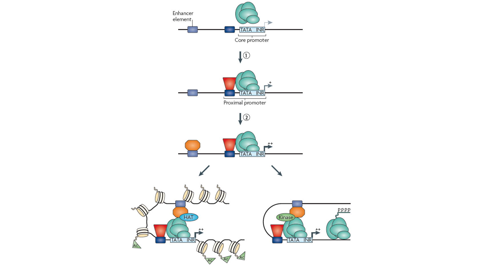
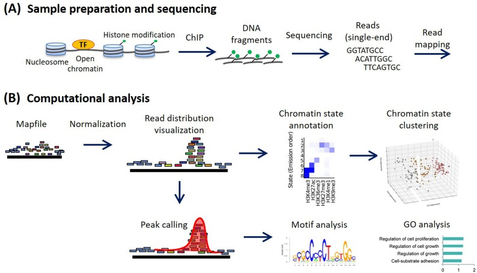

.. below role allows to use the html syntax, for example :raw-html:` `
.. role:: raw-html(raw)
    :format: html

=========
ChIP-seq
=========

ChIP-sequencing, also known as ChIP-seq, is a method used to analyze protein interactions with DNA. ChIP-seq combines chromatin immunoprecipitation (ChIP) with massively parallel DNA sequencing to identify the occupancy sites of DNA-associated proteins. It can be used to map global binding sites precisely for any protein of interest.

:raw-html:` `

The workflow in a typical ChIP-seq experiment can be divided into sample preparation (A) and data analysis (B). In this course we focus on the data analysis part. Some practical considerations for experiment design and sample preparation are given in :doc:`Experiment Design for ChIP seq <./expdesign/expdes-ChIPseq>` .

*Image source: Nakato et al, 2021*

:raw-html:` `
:raw-html:` `

These are tutorials for quality control and processing of ChIP-seq data:

.. toctree::
   :maxdepth: 1

   ChIPseq: processing and narrow peak detection <chipseqProc/lab-chipseq-processing.rst>
   ChIPseq: broad peaks detection <chipseqBroadPeaks/lab-broadpeaks.rst>
   ChIPseq: alternative QC <chipseqQC/lab-chipqc.rst>
   Signal visualisation <visDeepTools/lab-vis-deepTools.rst>

Tutorials for processing the results after identification of occupancy regions (i.e. peaks or broad domains) can be found in :doc:`Downstream Processing <./chip_downstream_tutorials>` .