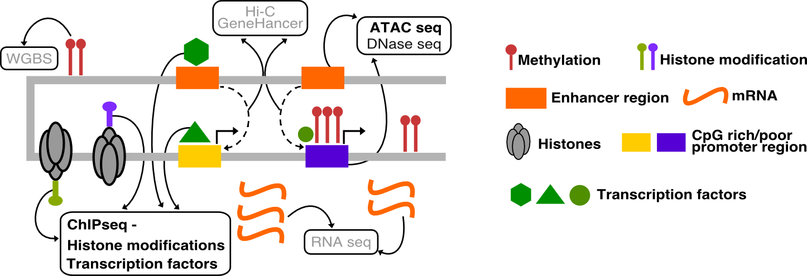
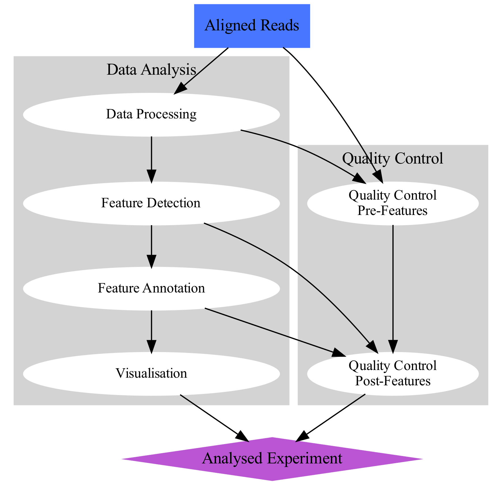

.. below role allows to use the html syntax, for example :raw-html:` `
.. role:: raw-html(raw)
    :format: html

==================================================================
Data Pre-Processing and Quality Control for Functional Genomics
==================================================================

This section introduces concepts and methods for data pre-processing and quality control used in functional genomics experiments.

:raw-html:` `

.. contents:: Contents
    :local:

:raw-html:` `

Introduction
===============

Data in any high-throughput sequencing experiment rarely represents "pure signal" due to technical and biological reasons. Data pre-processing is a practice of removal of data fraction which does not reflect the biological signal we are seeking to analyse, but rather it is a reminiscence of biases often present in this type of experiments. This is done to enhance performance and avoid analytic artifacts.

In parallel to the processing and analysis, the data should be subject to quality control at practially every step of the workflow. This is to ensure the biases are correctly removed and that the data quality supports the analytic findings.

The workflow for data analysis in a functional genomics experiment can de depicted as on the concept map below.

:raw-html:` `

Data from functional genomics experiments based on high-throughput sequencing usually share similar bias profile, hence the pre-processing and quality control is very similar for many types of data sets. In this course we work on ATAC-seq and ChIP-seq data, so the tutorials are focused on these types of experiments. Data type specific methods are indicated as such where appropriate.

:raw-html:` `

Tutorials
=============

These are tutorials for data pre-processing and quality control used in functional genomics experiments, as summarised on the flowchart below. We assume that starting point are reads mapped to a reference sequence.

.. image:: data-preproc/figures/workflow-proc.png
   			:height: 600px

.. toctree::
   :maxdepth: 1

   Data Preprocessing for Functional Genomics <data-preproc/data-preproc.rst>
   Quality Control for Functional Genomics <data-preproc/data-qc1.rst>
   Quality Control for ATAC-seq <data-preproc/data-qc-atac.rst>
   Quality Control for ChIP-seq <chipseqProc/lab-chipseq-processing.rst>

:raw-html:` `

*image source: https://www.hdsu.org/chipatac2020/*
