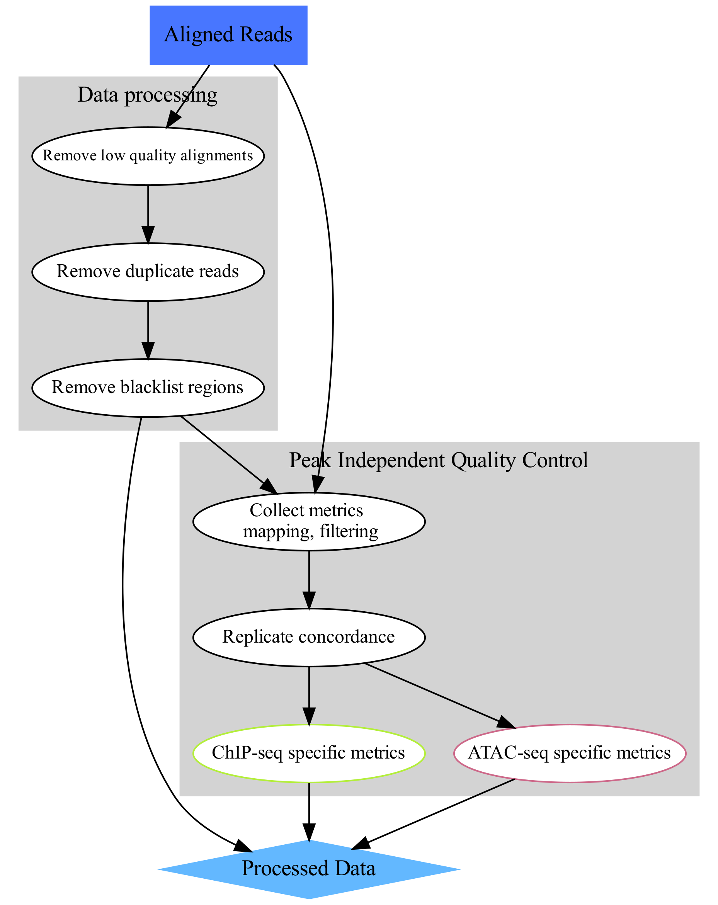

.. below role allows to use the html syntax, for example :raw-html:` `
.. role:: raw-html(raw)
    :format: html

================================================
Data Preprocessing for Functional Genomics
================================================

**Learning outcomes**

- apply standard processing methods used in functional genomics on an example of ATAC-seq data

- become accustomed to work on Rackham cluster

:raw-html:` `

.. contents:: Table of Contents
   :depth: 1
   :local:
   :backlinks: none

:raw-html:` `

The aim of this part of the data analysis workflow is to remove alignments which most likely are artifacts and could interfere with data analysis (upper-left part of the concept map). These include:

* alignments to organelles (mitchondria);

* alignments within "blacklisted regions": regions of unusually high signal in many functional genomics experiments, described in `Amemiya et al <https://doi.org/10.1038/s41598-019-45839-z>`_;

* low quality alignments;

* duplicate alignments (i.e. both mates of a pair map to identical genomic locations).

We assume that starting point are reads mapped to a reference sequence.

:raw-html:` `

Before we start
==================

Today we are going to work on `Rackham <https://www.uppmax.uu.se/support/user-guides/rackham-user-guide>`_, an HPC cluster hosted by `Uppmax <https://www.uppmax.uu.se>`_.

Please follow the setup procedure to book a node and log in to it as described in section :doc:`Setting up <../setup/lab-setup>`.

Data
=====

We will work with **ATAC-seq** data in this tutorial, however the same principles apply to other functional genomics data types. In particular, **ChIP-seq data** used in this workshop has been processed using similar workflow.

We will use data that come from `ENCODE <www.encodeproject.org>`_ consortium. These are **ATAC-seq** libraries (in duplicates) prepared to analyse chromatin accessibility status in natural killer (NK) cells prior to and upon stimulation.

Natural killer (NK) cells are innate immune cells that show strong cytolytic function against physiologically stressed cells such as tumor cells and virus-infected cells. NK cells express several activating and inhibitory receptors that recognize the altered expression of proteins on target cells and control the cytolytic function. To read more about NK cells please refer to `Paul and Lal <https://doi.org/10.3389/fimmu.2017.01124>`_ . The interleukin cocktail used to stimulate NK cells induces proliferation and activation (`Lauwerys et al <https://doi.org/10.1006/cyto.1999.0501>`_ ).

ENCODE sample accession numbers are listed in Table 1.

.. list-table:: Table 1. ENCODE accession numbers for data set used in this tutorial.
   :widths: 10 25 25 50
   :header-rows: 1

   * - No
     - Accession
     - Cell type
     - Description
   * - 1
     - ENCFF398QLV
     - Homo sapiens natural killer cell female adult
     - untreated
   * - 2
     - ENCFF363HBZ
     - Homo sapiens natural killer cell female adult
     - untreated
   * - 3
     - ENCFF045OAB
     - Homo sapiens natural killer cell female adult
     - Interleukin-18, Interleukin-12-alpha, Interleukin-12-beta, Interleukin-15
   * - 4
     - ENCFF828ZPN
     - Homo sapiens natural killer cell female adult
     - Interleukin-18, Interleukin-12-alpha, Interleukin-12-beta, Interleukin-15

We have processed the data, starting from reads aligned to **hg38** reference assembly using **bowtie2**. The alignments were obtained from ENCODE in *bam* format and further processed:

* alignments were subset to include chromosome 14 and 1% of reads mapped to chromosomes 1 to 6 and chrM.

This allows you to see a realistic coverage of one selected chromosome and collect QC metrics while allowing shorter computing times. Non-subset ATAC-seq data contains 100 - 200 M PE reads, too many to conveniently process during a workshop.

Setting up directory structure and files
------------------------------------------

Normally you process several files from your data set using the same workflow. We are going to process just one file, as an example. In addition to the file with unprocessed alignments which will be our starting point, we will need annotation files. Files produced in this part will be used in downstream tutorials, therefore saving files in a structured manner is essential to keep track of the analysis steps (and always a good practice). We have preset data access and environment for you. To use these settings run:

* ``atac_data.sh`` that sets up directory structure and creates symbolic links to data as well as copies smaller files **[RUN ONLY ONCE]**

* ``atac_env.sh`` that sets several environmental variables you will use in the exercise: **[RUN EVERY TIME when the connection to Uppmax has been broken, i.e. via logging out]**

.. Note::
	
	In many commands in this workshop we use certain environmental variables, which are preset for you in the ``*_env.sh`` scripts which are used to set up some tutorials.
	These variables are:

		* ``$USER`` - expands to your user id

		* ``$COURSE_DIR`` - contains path to the course storage directory

		
.. * ``$COURSE_ALLOC`` - contains the course CPU allocation

Copy the scripts to your home directory and execute them:

.. code-block:: bash

  cp /proj/epi2023/atacseq_proc/atacseq_data.sh .
  cp /proj/epi2023/atacseq_proc/atacseq_env.sh .

  source atacseq_env.sh 
  source atacseq_data.sh

You should see a newly created directory named ``atacseq``. Everything you need for completing the ATAC-seq tutorials is located there. When you enter ``atacseq`` you'll see several other directories. ``results`` contains precomputed results of (most of) the steps, so you can continue in case something goes wrong along the way. You can enter ``analysis``; this is where we'll be working today.

.. code-block:: bash

	cd atacseq
  	ls .
  	cd analysis

Read Mapping Statistics
=========================

As stated above, we use data which has already been mapped to a reference.
To start with, we can inspect the statistics of these unprocessed data. We will be working in directory ``processedData``:

.. code-block:: bash

	mkdir processedData
	cd processedData

	module load bioinfo-tools
	module load samtools/1.8

	samtools idxstats ../../data/ENCFF045OAB.chr14.bam  >ENCFF045OAB.chr14.bam.idxstats
	samtools stats ../../data/ENCFF045OAB.chr14.bam  >ENCFF045OAB.chr14.bam.stats

One of the characteristics of the ATAC-seq signal is the presence of reads mapped to organelles. These reads may constitute even 40% of the library, depending on the library preparation method. Mt contents be used to flag failed libraries early on. 

We can inspect the Mt contents of our data::

	#total fragments
	awk '{sum += $3} END {print sum}' ENCFF045OAB.chr14.bam.idxstats
	4947098

	#chrM fragments
	awk '$1 ~ /chrM/ {print $3}' ENCFF045OAB.chr14.bam.idxstats
	53737

``chrM/total`` ratio in this file is ``0.011`` (thanks to data subsetting). The fraction of Mt reads in the nonsubset file was ``0.053``, a value to be expected if using the `Omni ATAC library prep <https://doi.org/10.1038/nmeth.4396>`_. Older protocols result in much higher values.

Let's inspect the read mapping statistics in ``ENCFF045OAB.chr14.bam.stats``::

	grep ^SN ENCFF045OAB.chr14.bam.stats | cut -f 2-

	raw total sequences:	3344316
	filtered sequences:	0
	sequences:	3344316
	is sorted:	1
	1st fragments:	1672719
	last fragments:	1671597
	reads mapped:	3314986
	reads mapped and paired:	3285656	# paired-end technology bit set + both mates mapped
	reads unmapped:	29330
	reads properly paired:	3259566	# proper-pair bit set
	reads paired:	3344316	# paired-end technology bit set
	reads duplicated:	0	# PCR or optical duplicate bit set
	reads MQ0:	5113	# mapped and MQ=0
	reads QC failed:	0
	non-primary alignments:	1632112
	total length:	285098443	# ignores clipping
	bases mapped:	282153143	# ignores clipping
	bases mapped (cigar):	282153143	# more accurate
	bases trimmed:	0
	bases duplicated:	0
	mismatches:	1645084	# from NM fields
	error rate:	5.830465e-03	# mismatches / bases mapped (cigar)
	average length:	85
	maximum length:	101
	average quality:	35.5
	insert size average:	284.8
	insert size standard deviation:	150.6
	inward oriented pairs:	1005958
	outward oriented pairs:	10041
	pairs with other orientation:	77
	pairs on different chromosomes:	1719

Processing alignments
======================

We start by removing alignments within problematic genomic regions.

We use **hg38** specific blacklist from ENCODE, accession ``ENCFF356LFX``.

First, we remove alignments within the blacklisted regions:

.. code-block:: bash

	module load NGSUtils/0.5.9

	bamutils filter ../../data/ENCFF045OAB.chr14.bam ENCFF045OAB.chr14.blacklist_filt.bam -excludebed ../../annot/ENCFF356LFX.bed nostrand

The output::

	Done! (1:48)                                                                                             
	4574099 kept
	402329 failed

Next, we remove alignments to mitochondrial genome:

.. code-block:: bash

	bamutils filter ENCFF045OAB.chr14.blacklist_filt.bam ENCFF045OAB.chr14.blacklist_M_filt.bam -excluderef chrM

The output::

	Done! (1:23)                                                                             
	4520362 kept
	53737 failed

Next, we remove low quality (by MAPQ) and incorrect alignments (as specified by the aligner). We also need to index the resulting bam file for the next step.

.. code-block:: bash

	samtools view -f 0x2 -q 5 -hbo ENCFF045OAB.chr14.blacklist_M_filt.mapq5.bam ENCFF045OAB.chr14.blacklist_M_filt.bam
	samtools index ENCFF045OAB.chr14.blacklist_M_filt.mapq5.bam

Finally, we can remove duplicated alignments.

.. code-block:: bash

	module load picard/2.23.4

	java -Xmx31G -jar $PICARD_HOME/picard.jar MarkDuplicates -I ENCFF045OAB.chr14.blacklist_M_filt.mapq5.bam \
	 -O ENCFF045OAB.chr14.blacklist_M_filt.mapq5.dedup.bam -M ENCFF045OAB.dedup_metrics \
	 -VALIDATION_STRINGENCY LENIENT -REMOVE_DUPLICATES true -ASSUME_SORTED true

	samtools index ENCFF045OAB.chr14.blacklist_M_filt.mapq5.dedup.bam

Resulting file ``ENCFF045OAB.chr14.blacklist_M_filt.mapq5.dedup.bam`` containes preprocessed alignments we can use in the analysis and visualisations.

While we are at it, we can inspect the duplication status of the library. This is another early QC step we perform, and it informs us of library complexity.

.. code-block:: bash

	head ENCFF045OAB.dedup_metrics

Key information from ``ENCFF045OAB.dedup_metrics``::

	READ_PAIRS_EXAMINED 1544973
	READ_PAIR_DUPLICATES 105752
	PERCENT_DUPLICATION 0.068449

.. admonition:: Inspecting file contents.
   :class: dropdown, warning

   head ENCFF045OAB.dedup_metrics

Good news, low duplication level in this library, we can proceed with further :doc:`QC <data-qc1>` and :doc:`analysis <../ATACseq/lab-atacseq-bulk>`. 

