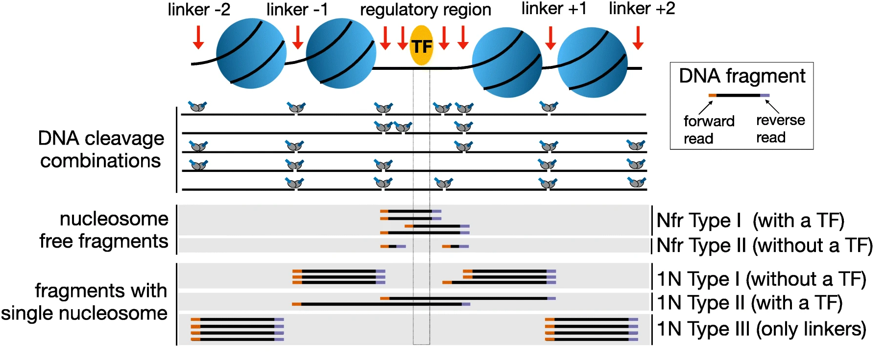

.. below role allows to use the html syntax, for example :raw-html:` `
.. role:: raw-html(raw)
    :format: html

===============================
Quality Control for ATAC-seq
===============================

This tutorial is a continuation of :doc:`General QC <data-qc1>`.

**Learning outcomes**

- understand and interpret quality control metrics specific to ATAC-seq data

:raw-html:` `

.. contents:: Table of Contents
   :depth: 1
   :local:
   :backlinks: none

:raw-html:` `

The aim of this part of the data analysis workflow is to collect ATAC-seq specific quality metrics:

* fragment length distribution;

* presence of signal in nuclesome-free regions (NFR) and mononucleosome fractions;

* enrichment of signal in transcription start site (TSS) regions.

:raw-html:` `

Fragment Length Distribution
================================

In ATAC-seq experiments, tagmentation of Tn5 transposases produces signature size pattern of fragments derived from nucleosome-free regions (NFR), mononucleosome, dinucleosome, trinucleosome and longer oligonucleosome from open chromatin regions (Figure below, adapted from `Li et al <https://doi.org/10.1186/s13059-019-1642-2>`_ ).

Please note the pre-filtered BAM files need to be used to get an unbiased distribution of insert fragment size in the ATAC-seq library.

To compute fragment length distribution for processed bam file in our ATAC-seq data set (assuming we are in drectory ``analysis``):

.. code-block:: bash

	mkdir QC
	cd QC

	ln -s ../../processedData/ENCFF045OAB.chr14.blacklist_M_filt.mapq5.dedup.bam  .
	ln -s ../../processedData/ENCFF045OAB.chr14.blacklist_M_filt.mapq5.dedup.bam.bai  .
	
	module load picard/2.23.4

	java -Xmx63G -jar $PICARD_HOME/picard.jar CollectInsertSizeMetrics \
	 -I ENCFF045OAB.chr14.blacklist_M_filt.mapq5.dedup.bam \
	 -O ENCFF045OAB.chr14.proc.fraglen.stats \
	 -H ENCFF045OAB.chr14.proc.fraglen.pdf -M 0.5

You can copy the resulting file to your local system to view it.

Have a look at ``ENCFF045OAB.chr14.proc.fraglen.pdf``, and answer

- does it indicate a good sample quality? is the chromatin structure preserved?

- what do the periodic peaks correspond to?

.. admonition:: Fragment length histogram of ATAC-seq signal in NK cells.
   :class: dropdown, warning

   .. image:: figures/ENCFF045OAB.chr14.proc.fraglen.png
          :width: 300px

Data Preparation for Probing Signal at TSS
==============================================

We will be working in ``R`` in this section. First, we load the required version together with libraries:

.. code-block:: bash

	module load R_packages/4.1.1

We activate R console upon typing ``R`` in the terminal.

We begin by loading necessary libraries:

.. code-block:: R

	library(ATACseqQC)
	library(BSgenome.Hsapiens.UCSC.hg38)
	library(TxDb.Hsapiens.UCSC.hg38.knownGene)
	library(ChIPpeakAnno)
	library(Rsamtools)

We can now give the path to the processed bam file:

.. code-block:: R

	bamFile="ENCFF045OAB.chr14.blacklist_M_filt.mapq5.dedup.bam"
	bamFileLabels <- "ENCFF045OAB"

We collect library statistics:

.. code-block:: R

	bam_qc=bamQC(bamFile, outPath = NULL)

We can now inspect the statistics:

.. code-block:: R

	bam_qc[1:10]

The output::

	bam_qc[1:10]

	$totalQNAMEs
	[1] 1439244

	$duplicateRate
	[1] 0

	$mitochondriaRate
	[1] 0

	$properPairRate
	[1] 1

	$unmappedRate
	[1] 0

	$hasUnmappedMateRate
	[1] 0

	$notPassingQualityControlsRate
	[1] 0

	$nonRedundantFraction
	[1] 0.9999958

	$PCRbottleneckCoefficient_1
	[1] 0.9999979

	$PCRbottleneckCoefficient_2
	[1] 479746

Most of these values are meaningless at this point, as we have already processed the bam file.

.. admonition:: Summary statistics for unprocessed ENCFF045OAB.chr14 data
   :class: dropdown, warning

	bam_qc_unproc[1:10]::

		$totalQNAMEs
		[1] 1673636

		$duplicateRate
		[1] 0

		$mitochondriaRate
		[1] 0.01487629

		$properPairRate
		[1] 0.9746585

		$unmappedRate
		[1] 0.008770104

		$hasUnmappedMateRate
		[1] 0.008770104

		$notPassingQualityControlsRate
		[1] 0

		$nonRedundantFraction
		[1] 0.8793997

		$PCRbottleneckCoefficient_1
		[1] 0.9408998

		$PCRbottleneckCoefficient_2
		[1] 17.92948

Shiftig and Splitting Aligned Reads
-------------------------------------

Tagmentation by Tn5 transposase produces 5’ overhang of 9 base long, the coordinates of reads mapping to the positive and negative strands need to be shifted by + 4 and - 5, respectively, to account for the 9-bp duplication created by DNA repair of the nick by Tn5 transposase and achieve base-pair resolution of TF footprint and motif-related analyses.

We perform it at this point to **plot signal at TSS**, and we save the resulting object for later use.

We create a directory where the processed bam files will be saved:

.. code-block:: R

	## files will be output into outPath
	outPath <- "splitBam"
	dir.create(outPath)

First, we collect information on which SAM/BAM tags are present in our bam file:

.. code-block:: R

	possibleTag <- combn(LETTERS, 2)
	possibleTag <- c(paste0(possibleTag[1, ], possibleTag[2, ]),
	                 paste0(possibleTag[2, ], possibleTag[1, ]))
	
	bamTop100 <- scanBam(BamFile(bamFile, yieldSize = 100),
	                     param = ScanBamParam(tag = possibleTag))[[1]]$tag
	tags <- names(bamTop100)[lengths(bamTop100)>0]

We **shift the coordinates** only for alignments on chr14, which is where most of our data is:

.. code-block:: R

	seqlev <- "chr14"
	which <- as(seqinfo(Hsapiens)[seqlev], "GRanges")

We create an object with genomic alignments:

.. code-block:: R

	gal <- readBamFile(bamFile, tag=tags, which=which,asMates=TRUE, bigFile=TRUE)

This object is empty, because we used ``bigFile=TRUE`` - this is expected, so do not be alarmed.

The function ``shiftGAlignmentsList`` in the ``ATACseqQC`` package is used for shifting the alignments:

.. code-block:: R

	shiftedBamFile <- file.path(outPath, "shifted.bam")
	gal1 <- shiftGAlignmentsList(gal, outbam=shiftedBamFile)

	### save the GRanges object for future use
	saveRDS(gal1, file = "gal1.rds", ascii = FALSE, version = NULL,compress = TRUE, refhook = NULL)

Next, we **split** the shifted alignments into different fractions **by length** (nucleosome free, mononucleosome, dinucleosome, and trinucleosome).

Shifted reads that do not fit into any of the above bins can be discarded. 

Splitting reads is a time-consuming step because we are using random forest to classify the fragments based on fragment length and GC content.

By default, we assign the top 10% of short reads (reads below 100_bp) as nucleosome-free regions and the top 10% of intermediate length reads as (reads between 180 and 247 bp) mononucleosome. This serves as the training set to classify the rest of the fragments using random forest.

We need genomic locations of TSS:

.. code-block:: R

	txs <- transcripts(TxDb.Hsapiens.UCSC.hg38.knownGene)
	txs <- txs[seqnames(txs) %in% "chr14"]
	genome <- Hsapiens

We split the alignments (this process takes a few minutes):

.. code-block:: R

		objs <- splitGAlignmentsByCut(gal1, txs=txs, genome=genome, outPath = outPath)

When done, we save the object for later use:

.. code-block:: R

	saveRDS(objs, file = "objs.rds", ascii = FALSE, version = NULL,compress = TRUE, refhook = NULL)

Finally, we have prepared the data for **plotting the signal in NFR and mononuclesome fraction** and calculating **signal distribution at TSS**.

Signal in NFR and Mononucleosome Fractions
==============================================

Files we are going to use and TSS coordinates:

.. code-block:: R

	bamFiles <- file.path(outPath,
	                     c("NucleosomeFree.bam",
	                     "mononucleosome.bam",
	                     "dinucleosome.bam",
	                     "trinucleosome.bam"))

	TSS <- promoters(txs, upstream=0, downstream=1)
	TSS <- unique(TSS)

Calculate and log2 transform the signal around TSS:

.. code-block:: R

	librarySize <- estLibSize(bamFiles)

	NTILE <- 101
	dws <- ups <- 1010
	sigs <- enrichedFragments(gal=objs[c("NucleosomeFree",
	                                     "mononucleosome",
	                                     "dinucleosome",
	                                     "trinucleosome")],
	                          TSS=TSS,
	                          librarySize=librarySize,
	                          seqlev=seqlev,
	                          TSS.filter=0.5,
	                          n.tile = NTILE,
	                          upstream = ups,
	                          downstream = dws)

	sigs.log2 <- lapply(sigs, function(.ele) log2(.ele+1))

We can now save the heatmap:

.. code-block:: R

	pdf("Heatmap_splitbam.pdf")
	featureAlignedHeatmap(sigs.log2, reCenterPeaks(TSS, width=ups+dws),
	                      zeroAt=.5, n.tile=NTILE)

	dev.off()

* What are the differences in the signal profile in these two fractions? Why do we observe them?

.. admonition:: Heatmap of ATAC-seq signal in NFR and mononculeosome fractions.
   :class: dropdown, warning

   .. image:: figures/Heatmap_splitbam.png
          :width: 300px

Signal at TSS
==============================================

We can now calculate signal distribution at TSS:

.. code-block:: R

	out <- featureAlignedDistribution(sigs, 
	                                  reCenterPeaks(TSS, width=ups+dws),
	                                  zeroAt=.5, n.tile=NTILE, type="l", 
	                                  ylab="Averaged coverage")

	## rescale the nucleosome-free and nucleosome signals to 0~1 for plotting
	range01 <- function(x){(x-min(x))/(max(x)-min(x))}
	out <- apply(out, 2, range01)

And plot it:

.. code-block:: R

	pdf("TSSprofile_splitbam.pdf")
		matplot(out, type="l", xaxt="n",
	        xlab="Position (bp)",
	        ylab="Fraction of signal")
		axis(1, at=seq(0, 100, by=10)+1,
	     labels=c("-1K", seq(-800, 800, by=200), "1K"), las=2)
		abline(v=seq(0, 100, by=10)+1, lty=2, col="gray")
	dev.off()

* What are the differences in the signal profile in these two fractions? Why do we observe them?

.. admonition:: Heatmap of ATAC-seq signal in NFR and mononculeosome fractions.
   :class: dropdown, warning

   .. image:: figures/TSSprofile_splitbam.png
          :width: 300px

After the QC performed in this tutorial and in :doc:`general QC <data-qc1>`, we can now move to ATAC-seq data :doc:`analysis <../ATACseq/lab-atacseq-bulk>`. 

