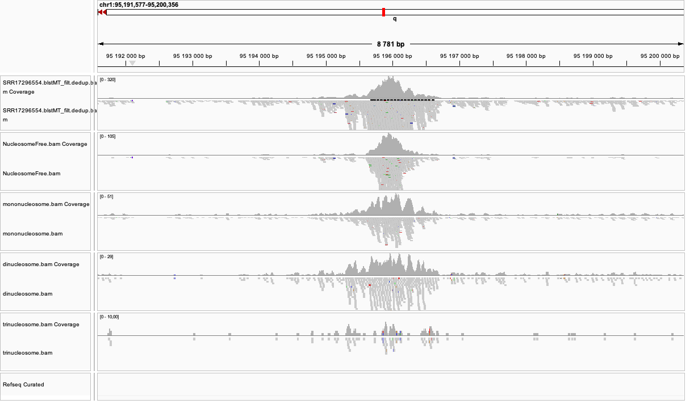
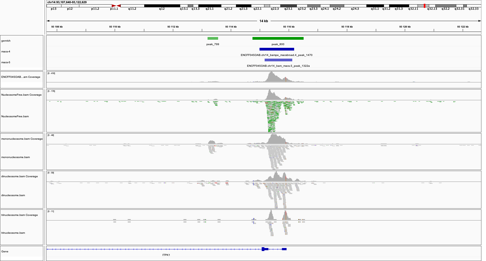

.. below role allows to use the html syntax, for example :raw-html:` `
.. role:: raw-html(raw)
    :format: html

===============================
Quality Control for ATAC-seq
===============================

This tutorial is a continuation of :doc:`General QC <data-qc1>`.

**Learning outcomes**

- assess quality of the ATAC-seq libraries with a range of quality metrics

- work interactively with ATAC-seq signal using Integrative Genome Viewer (IGV)

:raw-html:` `

.. contents:: Table of Contents
   :depth: 1
   :local:
   :backlinks: none

:raw-html:` `

The aim of this part of the data analysis workflow is to collect ATAC-seq specific quality metrics:

* fragment length distribution;

* presence of signal in nuclesome-free regions (NFR) and mononucleosome fractions;

* enrichment of signal in transcription start site (TSS) regions.

:raw-html:` `

.. Important::

	We assume that the environment and directory structure has been already set in :doc:`Data preprocessing <data-preproc>`.

Fragment Length Distribution
================================

In ATAC-seq experiments, tagmentation of Tn5 transposases produces signature size pattern of fragments derived from nucleosome-free regions (NFR), mononucleosome, dinucleosome, trinucleosome and longer oligonucleosome from open chromatin regions (Figure below, adapted from `Li et al <https://doi.org/10.1186/s13059-019-1642-2>`_ ).

Please note the pre-processed BAM files need to be used to get an unbiased distribution of insert fragment size in the ATAC-seq library.

.. image:: figures/Lietal_atacTn5.png
   			:width: 600px

To compute fragment length distribution for processed bam file in our ATAC-seq data set (assuming we are in drectory ``analysis``):

.. code-block:: bash

	mkdir QC
	cd QC

	ln -s ../processedData/SRR17296554.blstMT_filt.dedup.bam  .
	ln -s ../processedData/SRR17296554.blstMT_filt.dedup.bam.bai  .
	
	module load picard/3.1.1

	java -Xmx31G -jar $PICARD CollectInsertSizeMetrics \
	-I SRR17296554.blstMT_filt.dedup.bam \
	-O SRR17296554.chr1.proc.fraglen.stats \
	-H SRR17296554.chr1.proc.fraglen.pdf -M 0.5

You can copy the resulting file to your local system to view it.

Have a look at ``SRR17296554.chr1.proc.fraglen.pdf``, and answer

- does it indicate a good sample quality? is the chromatin structure preserved?

- what do the periodic peaks correspond to?

.. admonition:: Fragment length histogram of ATAC-seq signal in sample SRR17296554.
   :class: dropdown, warning

   .. image:: figures/SRR17296554.chr1.proc.fraglen.png
          :width: 300px

Generating this key QC plot is only possible for **PE libraries**. Can you tell what the peaks at approximately 50bp, 200bp, 400bp and 600bp correspond to?

To give some context compare to plots on Figure 2. 

.. list-table:: Figure 2. Examples of insert size distribution for ATAC-seq experiments.
   :widths: 25 25 25 25
   :header-rows: 1

   * - Naked DNA
     - Failed ATAC-seq
     - Noisy ATAC-seq
     - Successful ATAC-seq
   * - .. image:: figures/Screenshot_sizeDistribution_Naked.png
   			:width: 200px
     - .. image:: figures/Screenshot_sizeDistribution_Failed.png
   			:width: 200px
     - .. image:: figures/Screenshot_sizeDistribution_Failed2.png
   			:width: 200px
     - .. image:: figures/Screenshot_sizeDistribution_Good.png
   			:width: 200px

:raw-html:` `

Data Preparation for Probing Signal at TSS
==============================================

We will be working in ``R`` in this section. First, we load the required version together with libraries:

.. code-block:: bash

	module load R_packages/4.3.1

We activate R console upon typing ``R`` in the terminal. 

It is possible to use a more sophisticated graphical interface to R, however, some steps in this tutorial can be time consuming, therefore using a simple terminal interface, while not very conveninet, may be more efficient in this case.

We begin by loading necessary libraries:

.. code-block:: R

	library(ATACseqQC)
	library(BSgenome.Mmusculus.UCSC.mm39)
	library(TxDb.Mmusculus.UCSC.mm39.knownGene)
	library(ChIPpeakAnno)
	library(Rsamtools)

We can now give the path to the processed bam file:

.. code-block:: R

	bamFile="SRR17296554.blstMT_filt.dedup.bam"
	bamFileLabels <- "SRR17296554"

We collect library statistics:

.. code-block:: R

	bam_qc=bamQC(bamFile, outPath = NULL)

We can now inspect the statistics:

.. code-block:: R

	bam_qc[1:10]

The output::

	bam_qc[1:10]

	$totalQNAMEs
	[1] 4720683

	$duplicateRate
	[1] 0.2942896

	$mitochondriaRate
	[1] 0

	$properPairRate
	[1] 1

	$unmappedRate
	[1] 0

	$hasUnmappedMateRate
	[1] 0

	$notPassingQualityControlsRate
	[1] 0

	$nonRedundantFraction
	[1] 0.5100756

	$PCRbottleneckCoefficient_1
	[1] 0.710388

	$PCRbottleneckCoefficient_2
	[1] 3.366668

Some of these values are meaningless at this point, as we have already processed the bam file (i.e. filtered fragments in problematic regions etc.) To compare the statistics for the non-subset file, please see below.

.. admonition:: Summary statistics for filtered non-subset SRR17296554.filt.bam data
   :class: dropdown, warning

	bam_qc_nonsub[1:10]::

		$totalQNAMEs
		[1] 58847066

		$duplicateRate
		[1] 0.302227

		$mitochondriaRate
		[1] 0

		$properPairRate
		[1] 1

		$unmappedRate
		[1] 0

		$hasUnmappedMateRate
		[1] 0

		$notPassingQualityControlsRate
		[1] 0

		$nonRedundantFraction
		[1] 0.4967934

		$PCRbottleneckCoefficient_1
		[1] 0.699404

		$PCRbottleneckCoefficient_2
		[1] 3.18878

Shiftig and Splitting Aligned Reads
-------------------------------------

Tagmentation by Tn5 transposase produces 5’ overhang of 9 base long, the coordinates of reads mapping to the positive and negative strands need to be shifted by + 4 and - 5, respectively, to account for the 9-bp duplication created by DNA repair of the nick by Tn5 transposase and achieve base-pair resolution of TF footprint and motif-related analyses.

We perform it at this point to **plot signal at TSS**, and we save the resulting object for later use.

We create a directory where the processed bam files will be saved:

.. code-block:: R

	## files will be saved into outPath respective to the working directory
	outPath = "splitBam"
	dir.create(outPath)

First, we collect information on which SAM/BAM tags are present in our bam file:

.. code-block:: R

	possibleTag = combn(LETTERS, 2)
	possibleTag = c(paste0(possibleTag[1, ], possibleTag[2, ]),
	                 paste0(possibleTag[2, ], possibleTag[1, ]))
	
	bamTop100 = scanBam(BamFile(bamFile, yieldSize = 100),
	                     param = ScanBamParam(tag = possibleTag))[[1]]$tag
	tags = names(bamTop100)[lengths(bamTop100)>0]

We **shift the coordinates** only for alignments on chr1, which is where most of our data is. We need to rename the chromosome id few times during this lab because of mismatch between annotation packages available via _Bioconductor_ and the reference genome used for read mapping. Please note that prepending / removing "chr" only works for assembled chromosomes, and is a somewhat hacky, so for other genomes, use it at your own risk.

.. code-block:: R

	seqlev = "chr1"
	which = as(seqinfo(Mmusculus)[seqlev], "GRanges")
	
	#rename chr ids to match reference genome
	seqlevels(which)=gsub("chr","",seqlevels(which))

We create an object with genomic alignments:

.. code-block:: R

	gal = readBamFile(bamFile, tag=tags, which=which,asMates=TRUE, bigFile=TRUE)

This object is empty, because we used ``bigFile=TRUE`` - this is expected, so do not be alarmed.

The function ``shiftGAlignmentsList`` in the ``ATACseqQC`` package is used for shifting the alignments:

.. code-block:: R

	shiftedBamFile = file.path(outPath, "shifted.bam")
	gal1 = shiftGAlignmentsList(gal, outbam=shiftedBamFile)

Next, we **split** the shifted alignments into different fractions **by length** (nucleosome free, mononucleosome, dinucleosome, and trinucleosome).

Shifted reads that do not fit into any of the above bins can be discarded. 

Splitting reads is a time-consuming step because we are using random forest to classify the fragments based on fragment length and GC content.

By default, we assign the top 10% of short reads (reads below 100_bp) as nucleosome-free regions and the top 10% of intermediate length reads as (reads between 180 and 247 bp) mononucleosome. This serves as the training set to classify the rest of the fragments.

We need genomic locations of TSS:

.. code-block:: R

	txs = transcripts(TxDb.Mmusculus.UCSC.mm39.knownGene)
	txs = txs[seqnames(txs) %in% "chr1"]
	seqlevels(txs)=gsub("chr","",seqlevels(txs))

We need to rename chromosome ids in the ``BSgenome`` object:

.. code-block:: R

	seqlevelsStyle(BSgenome.Mmusculus.UCSC.mm39) <- "NCBI"
	seqinfo(BSgenome.Mmusculus.UCSC.mm39)

	genome = Mmusculus

We split the alignments (this process takes a few minutes):

.. code-block:: R

		objs = splitGAlignmentsByCut(gal1, txs=txs, genome=genome, outPath = outPath)

		saveRDS(objs, file="atacsqQC.objs.rds")

Finally, we have prepared the data for **plotting the signal in NFR and mononuclesome fraction** and calculating **signal distribution at TSS**.

:raw-html:` `

Signal in NFR and Mononucleosome Fractions
==============================================

Files we are going to use and TSS coordinates:

.. code-block:: R

	bamFiles <- file.path(outPath,
	                     c("NucleosomeFree.bam",
	                     "mononucleosome.bam",
	                     "dinucleosome.bam",
	                     "trinucleosome.bam"))

	TSS <- promoters(txs, upstream=0, downstream=1)
	TSS <- unique(TSS)

Calculate and log2 transform the signal around TSS:

.. code-block:: R

	librarySize <- estLibSize(bamFiles)

	seqlev="1"
	
	NTILE <- 101
	dws <- ups <- 1010
	sigs <- enrichedFragments(gal=objs[c("NucleosomeFree",
	                                     "mononucleosome",
	                                     "dinucleosome",
	                                     "trinucleosome")],
	                          TSS=TSS,
	                          librarySize=librarySize,
	                          seqlev=seqlev,
	                          TSS.filter=0.5,
	                          n.tile = NTILE,
	                          upstream = ups,
	                          downstream = dws)

	saveRDS(sigs, file="atacsqQC.sigs.rds")

	sigs.log2 <- lapply(sigs, function(.ele) log2(.ele+1))

We can now save the heatmap:

.. code-block:: R

	pdf("Heatmap_splitbam.pdf")
	featureAlignedHeatmap(sigs.log2, reCenterPeaks(TSS, width=ups+dws),
	                      zeroAt=.5, n.tile=NTILE)

	dev.off()

* What are the differences in the signal profile in these two fractions? Why do we observe them?

.. admonition:: Heatmap of ATAC-seq signal in NFR and mononculeosome fractions.
   :class: dropdown, warning

   .. image:: figures/Heatmap_splitbam.png
          :width: 300px

:raw-html:` `

Signal at TSS
==============================================

We can now calculate signal distribution at TSS:

.. code-block:: R

	out <- featureAlignedDistribution(sigs, 
	                                  reCenterPeaks(TSS, width=ups+dws),
	                                  zeroAt=.5, n.tile=NTILE, type="l", 
	                                  ylab="Averaged coverage")

	## rescale the nucleosome-free and nucleosome signals to 0~1 for plotting
	range01 <- function(x){(x-min(x))/(max(x)-min(x))}
	out <- apply(out, 2, range01)

And plot it:

.. code-block:: R

	pdf("TSSprofile_splitbam.pdf")
		matplot(out, type="l", xaxt="n",
	        xlab="Position (bp)",
	        ylab="Fraction of signal")
		axis(1, at=seq(0, 100, by=10)+1,
	     labels=c("-1K", seq(-800, 800, by=200), "1K"), las=2)
		abline(v=seq(0, 100, by=10)+1, lty=2, col="gray")
	dev.off()

:raw-html:` `

* What are the differences in the signal profile in these two fractions? Why do we observe them?

.. admonition:: Profiles of ATAC-seq signal in NFR and mononculeosome fractions.
   :class: dropdown, warning

   .. image:: figures/TSSprofile_splitbam.png
          :width: 300px

.. Note::

	To finish working in ``R`` type ``q()``. Do not save workspace image - in this case, to save space.

:raw-html:` `

Signal Visualisation Using IGV
=================================

In this part we will look more closely at our data, which is a good practice, as data summaries can be at times misleading. In principle we could look at the data on Uppmax using installed tools but it is much easier (and glitch-free) to work with genome browser locally. 
If you have not done this before the course, install Interactive Genome Browser `IGV <https://www.broadinstitute.org/igv/>`_.

We would like to visualise processed alignments (bam and corresponding bai) at several loci with strong signal. We can also view the bam files split into nucleosome-free, mono- di- and tri- nucleosome fractions. *Data has been mapped to hg38, so choose the appropriate reference*.

We will need the following files:

* ``atacseq/analysis/processedData/SRR17296554.blstMT_filt.dedup.bam`` and ``bai``

* ``atacseq/analysis/QC/splitBam/NucleosomeFree.bam`` and ``bai``

* ``atacseq/analysis/QC/splitBam/mononucleosome.bam`` and ``bai``

* ``atacseq/analysis/QC/splitBam/dinucleosome.bam`` and ``bai``

* ``atacseq/analysis/QC/splitBam/trinucleosome.bam`` and ``bai``

:raw-html:` `

.. admonition:: Copying files from Rackham
   :class: dropdown, warning

   To copy files from Rackham you need to know the path to the file on Rackham  (i.e. the remote side). Type in the terminal::

   	pwd

   This gives you the path to the working directory, e.g::

   	$pwd

   	/proj/epi2025/nobackup/agata/tst/atac_proc/atacseq/analysis/QC

   To copy file ``SRR17296554.blstMT_filt.dedup.bam`` to *current directory*, type in the **local** terminal::

   	scp <username>@rackham.uppmax.uu.se:/path/to/file .

   E.g.::

   	scp agata@rackham.uppmax.uu.se:/proj/epi2025/nobackup/agata/tst/atac_proc/atacseq/analysis/QC/SRR17296554.blstMT_filt.dedup.bam .

   **when connecting from abroad**

   You need to login in another session to be able to copy files, as 2FA does not work with ``scp``. This mock-login serves only to refresh your credentials and results in a few minutes of grace time, during which each session from the same host is accepted without the need to provide 2FA. This time window is sufficient for copying files.

.. Note::
	
	The reads are mapped to genome assembly **GRCm39**  / **mm39** which may need to be downloaded in your IGV version. To download a new genome, in IGV: Genomes > Hosted Genomes, then search for mm39.

:raw-html:` `

You will have to zoom in to view the alignments and coverage tracks.

Change the default viewing settings in IGV by ``shift-clicking`` onto a track name (left panel):

**bam** tracks:

* alignment view to ``Squished``

* colour alignments to ``insert size and pair orientation``

**coverage** tracks:

* pay attention to track scale; it is set to ``Auto``; the tracks won't show at the same scale, you can harmonise the scale if you want to see the differences in signal range

:raw-html:` `

You can move long the chromosome 1 and you will spot locations with high signal density.

Examples:

* ``chr1:10,009,356-10,018,135``

* ``chr1:10,105,613-10,114,392``

* ``chr1:161,497,776-161,499,970``

* ``chr1:155,074,991-155,079,380``

* ``chr1:95,191,577-95,200,356``

:raw-html:` `

:raw-html:` `

Another example is shown on the figure below (different data set). This figure includes also detected peak intervals - we will discuss them in detail in the following sections).

*Bonus question*

* Why does the NFR track show unusually high fraction of discordant alignments (labeled green)?

After the QC performed in this tutorial and in :doc:`general QC <data-qc1>`, we can now move to ATAC-seq data :doc:`analysis <../ATACseq/lab-atacseq-bulk>`. 

