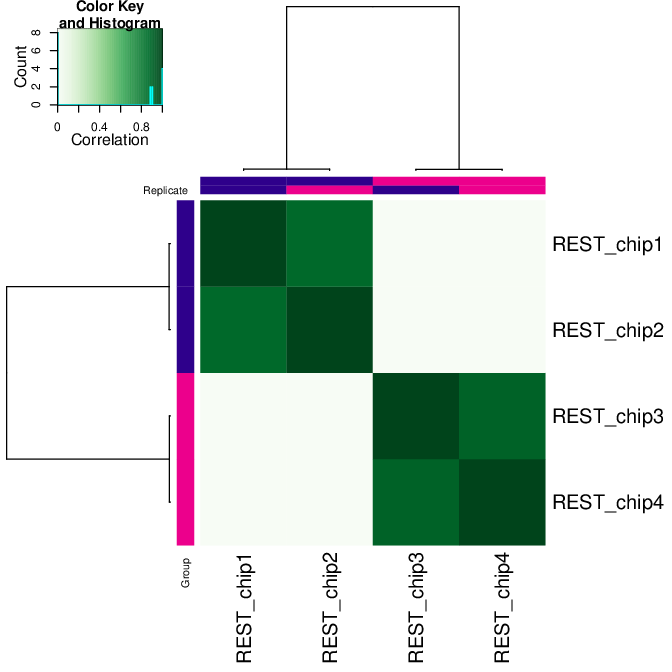
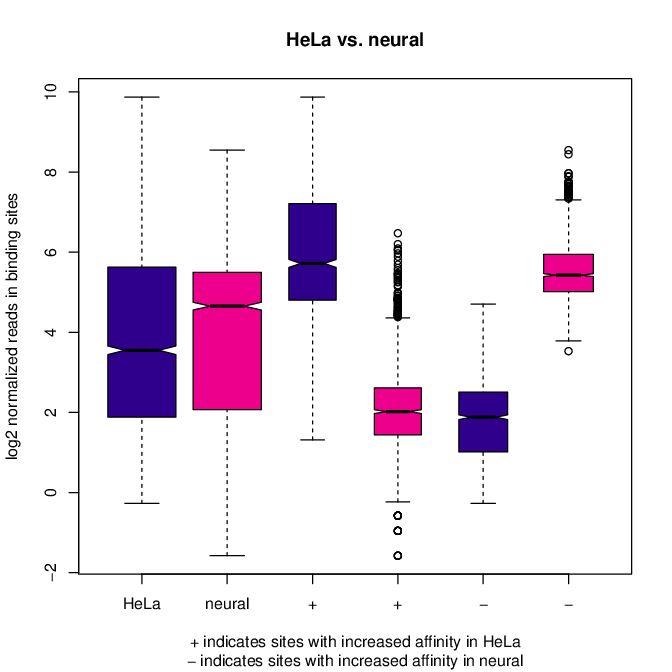
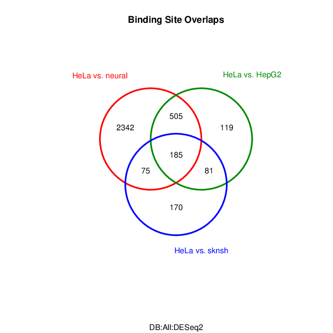
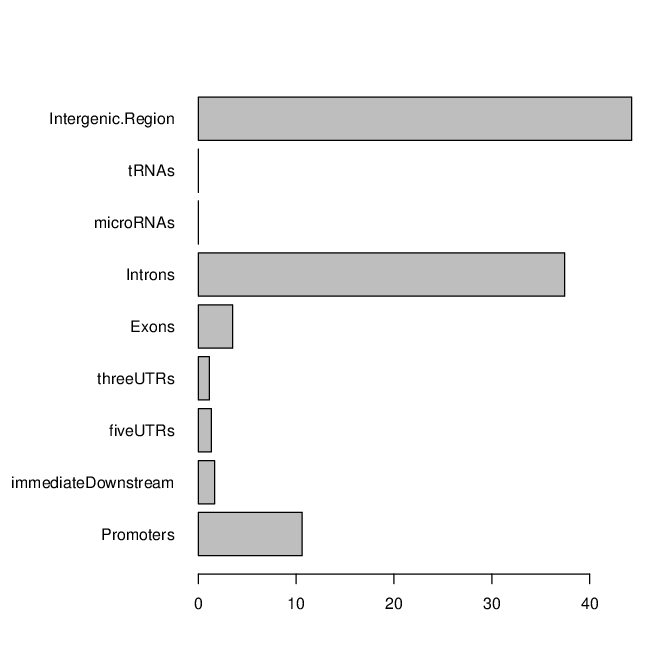

.. below role allows to use the html syntax, for example :raw-html:` `
.. role:: raw-html(raw)
    :format: html

################################
ChIP-seq down-stream analysis
################################

**Learning outcomes**

- obtain differentially bound sites with ``DiffBind``

- annotate differentially bound sites with nearest genes and genomic features with ``ChIPpeakAnno``

- perform functional enrichment analysis to identify predominant biological themes with ``ChIPpeakAnno`` and ``reactome.db``

.. Contents
.. =========

.. contents:: 
    :local:

Introduction
===============

Welcome back to the second part of the tutorial. In the first part we have learnt how to access the quality of ChIP-seq data and we how to derive a consensus peakset for downstream analyses.

In this part we will learn how to place our peaks in a biological context, by identifying differentially bound sites between two sample groups and annotating these sites to find out predominant biological themes separating the groups.

Data & Methods
==============

We will continue using the same data as in the first part of the tutorial. Please note that usually **three biological replicates** are the **minimum requirement** for statistical analysis such as in factor occupancy.

.. HINT::

	The ENCODE data we are using have only two replicates and we are using them to demonstrate the tools and methodologies. No biological conclusions should be drawn from them, or as a matter of fact, from any other dataset with duplicates only. Just because the tool computes the results does not make it right!

Setting-up
============

The setting-up is the same as for the :doc:`data processing <../chipseqProc/lab-chipseq-processing>` tutorial, described in detail in section "Setting up directory structure and files".

If you have not logged out from Uppmax: skip this part.

If you have logged out: log back in, open interactive session, and run ``chipseq_env.sh`` script. Note to use correct reservation name.

.. code-block:: bash

	ssh -Y <username>@rackham.uppmax.uu.se
	interactive -A g2020022 -p core -n 4 --reservation=g2020022_2
	source ~/chipseq_env.sh

Differential binding
======================================

Intro
--------

We will usage ``Bioconductor`` package `DiffBind <http://bioconductor.org/packages/release/bioc/html/DiffBind.html>`_ to **identify sites that are differentially bound** between two sample groups.

The package includes `"functions to support the processing of peak sets, including overlapping and merging peak sets, counting sequencing reads overlapping intervals in peak sets, and identifying statistically significantly differentially bound sites based on evidence of binding affinity (measured by differences in read densities). To this end it uses statistical routines developed in an RNA-Seq context (primarily the Bioconductor packages edgeR and DESeq2). Additionally, the package builds on Rgraphics routines to provide a set of standardized plots to aid in binding analysis."`

 This means that we will **repeat deriving a consensus peakset** in a more powerful way before identifying differentially bound sites. Actually, identifying the consensus peaks is an important step that takes up entire chapter in the ``DiffBind`` manual. We recommend reading entire section:  `6_2 Deriving consensus peaksets <http://bioconductor.org/packages/devel/bioc/vignettes/DiffBind/inst/doc/DiffBind.pdf>`_.

So how does the differential binding affinity analysis work?

`"The core functionality of DiffBind is the differential binding affinity analysis, which enables binding sites to be identified that are statistically significantly differentially bound between sample groups. To accomplish this, first a contrast (or contrasts) is established, dividing the samples into groups to be compared. Next the core analysis routines are executed, by default using DESeq2. This will assign a p-value and FDR to each candidate binding site indicating confidence that they are differentially bound."`

Setting-up ``DiffBind``
-----------------------

Let's
- load `R packges module <https://www.uppmax.uu.se/support/user-guides/r_packages-module-guide/>`_ that has a bunch of R packages, including ``DiffBind`` package, installed on Uppmax.
-  go to the right directory given you are keeping files structure as for the first part of the tutorial.

.. HINT::
	
	If you start from a different location, you should ``cd ~/chipseq/analysis/R``

You can now load the version of R for which we tested this class along with other dependencies:

.. code-block:: bash

   module load R_packages/4.0.4

The remaining part of the exercise is performed in ``R``.

.. HINT::

	We are running 
	``R version 4.0.4 (2021-02-15) -- "Lost Library Book"``

In this directory we have placed a `sample sheet file` named ``samples_REST.txt`` that points to our BAM files as well as BED files with called peaks, following ``DiffBind`` specifications, and as created in :doc:`data processing <../chipseqProc/lab-chipseq-processing>` tutorial. To inspect sample sheet file:

.. code-block:: R

	head samples_REST.txt

Let's open R on Uppmax by simply typing R

.. code-block:: R

	R

From within R we need to load DiffBind library

.. code-block:: R

	library(DiffBind)

Running ``DiffBind``
----------------------

We will now follow ``DiffBind`` example to obtain differentially bound sites, given our samples. You may want to open ``DiffBind`` tutorial and read section `3 Example Obtaining differentially bound sites <http://bioconductor.org/packages/devel/bioc/vignettes/DiffBind/inst/doc/DiffBind.pdf>`_ while typing the command to get more information about each step.

First we need to create the object which holds data.

.. code-block:: R

	# reading in the sample information (metadata)
	samples = read.csv("samples_REST.txt", sep="\t")

	#	inspecting the metadata
	samples

	#	creating an object containing data
	res=dba(sampleSheet=samples, config=data.frame(RunParallel=TRUE))

	# inspecting the object: how many peaks are identified given the default settings?
	res

.. admonition:: res
   :class: dropdown, warning

   .. code-block:: R

	   8 Samples, 6518 sites in matrix (17056 total):
	          ID Tissue Factor Replicate Intervals
	1 REST_chip1   HeLa   REST         1      2252
	2 REST_chip2   HeLa   REST         2      2344
	3 REST_chip3 neural   REST         1      5948
	4 REST_chip4 neural   REST         2      3003
	5 REST_chip5  HepG2   REST         1      2663
	6 REST_chip6  HepG2   REST         2      4326
	7 REST_chip7  sknsh   REST         1      8700
	8 REST_chip8  sknsh   REST         2      3524

Let's continue with the analysis. The wrapper function ``dba.count`` reads in data.

.. code-block:: R

	# counting reads mapping to intervals (peaks)
	res.cnt = dba.count(res, minOverlap=2, score=DBA_SCORE_TMM_MINUS_FULL, fragmentSize=130)
	
	# at this step the TMM normalisation is applied
	res.norm=dba.normalize(res.cnt, normalize=DBA_NORM_TMM)

	# inspecting the object: notice the FRiP values!
	res.norm

.. admonition:: res.norm
   :class: dropdown, warning

   .. code-block:: R

	   > res.norm
		8 Samples, 6389 sites in matrix:
		          ID Tissue Factor Replicate   Reads FRiP
		1 REST_chip1   HeLa   REST         1 1637778 0.10
		2 REST_chip2   HeLa   REST         2 1991560 0.07
		3 REST_chip3 neural   REST         1 3197782 0.05
		4 REST_chip4 neural   REST         2 4924672 0.06
		5 REST_chip5  HepG2   REST         1 2988915 0.05
		6 REST_chip6  HepG2   REST         2 4812034 0.05
		7 REST_chip7  sknsh   REST         1 2714033 0.09
		8 REST_chip8  sknsh   REST         2 4180463 0.05

To inspect the normalisation factors::

	dba.normalize(res.norm, bRetrieve=TRUE)

We will set the contrasts to test:

.. code-block:: R

	# setting the contrast
	res.cnt2 = dba.contrast(res.cnt, categories=DBA_TISSUE, minMembers=2)

	# inspecting the object: how many contrasts were set in the previous step
	res.cnt2

These are the contrasts we can test::

	 res.cnt2
	8 Samples, 6389 sites in matrix:
	          ID Tissue Factor Replicate   Reads FRiP
	1 REST_chip1   HeLa   REST         1 1637778 0.10
	2 REST_chip2   HeLa   REST         2 1991560 0.07
	3 REST_chip3 neural   REST         1 3197782 0.05
	4 REST_chip4 neural   REST         2 4924672 0.06
	5 REST_chip5  HepG2   REST         1 2988915 0.05
	6 REST_chip6  HepG2   REST         2 4812034 0.05
	7 REST_chip7  sknsh   REST         1 2714033 0.09
	8 REST_chip8  sknsh   REST         2 4180463 0.05

	Design: [~Tissue] | 6 Contrasts:
	  Factor  Group Samples Group2 Samples2
	1 Tissue   HeLa       2 neural        2
	2 Tissue   HeLa       2  HepG2        2
	3 Tissue   HeLa       2  sknsh        2
	4 Tissue neural       2  HepG2        2
	5 Tissue neural       2  sknsh        2
	6 Tissue  sknsh       2  HepG2        2

We can save some plots of data exploration, to copy to your local computer and view later::

	# plotting the correlation of libraries based on normalised counts of reads in peaks
	pdf("correlation_libraries_normalised.pdf")
	plot(res.cnt)
	dev.off()

	# PCA scores plot: data overview
	pdf("PCA_normalised_libraries.pdf")
	dba.plotPCA(res.cnt,DBA_TISSUE,label=DBA_TISSUE)
	dev.off()

.. admonition:: correlation_libraries_normalised.pdf
   :class: dropdown, warning

   .. image:: figures/correlation_libraries_normalised.png
   			:width: 600px
   			:alt: correlation_librarires_normalised

.. admonition:: PCA_normalised_libraries.pd
   :class: dropdown, warning

   .. image:: figures/PCA_normalised_libraries.png
   			:width: 600px
   			:alt: PCA

The analysis of differential occupancy is performed by a wrapper function ``dba.analyze``. You can adjust the settings using variables from the ``DBA`` class, for details consult `DiffBind User Guide <https://bioconductor.org/packages/release/bioc/vignettes/DiffBind/inst/doc/DiffBind.pdf>`_ and `DiffBind manual <https://bioconductor.org/packages/release/bioc/manuals/DiffBind/man/DiffBind.pdf>`_ .

.. code-block:: R

	# performing analysis of differential binding
	res.cnt3 = dba.analyze(res.cnt2)

	# inspecting the object: which condition are most alike, which are most different, is this in line with part one of the tutorial?
	dba.show(res.cnt3, bContrasts = T)

The ``res.cnt3`` object::

	>dba.show(res.cnt3, bContrasts = T)
	  Factor  Group Samples Group2 Samples2 DB.DESeq2
	1 Tissue   HeLa       2 neural        2      3107
	2 Tissue   HeLa       2  HepG2        2       890
	3 Tissue   HeLa       2  sknsh        2       511
	4 Tissue neural       2  HepG2        2      2183
	5 Tissue neural       2  sknsh        2      3158
	6 Tissue  sknsh       2  HepG2        2       576

We can save some more of many useful plots implemented in ``DiffBind``::

	# correlation heatmap  using only significantly differentially bound sites
	# choose the contrast of interest e.g. HeLa vs. neuronal (#1)
	pdf("correlation_HeLa_vs_neuronal.pdf")
	plot(res.cnt3, contrast=1)
	dev.off()

	# boxplots to view how read distributions differ between classes of binding sites
	# are reads distributed evenly between those that increase binding affinity HeLa vs. in neuronal?
	pdf("Boxplot_HeLa_vs_neuronal.pdf")
	pvals <- dba.plotBox(res.cnt3, contrast=1)
	dev.off()

.. admonition:: correlation_HeLa_vs_neuronal.pdf
   :class: dropdown, warning

   .. image:: figures/correlation_HeLa_vs_neuronal.png
   			:width: 600px
   			:alt: Heatmap

.. admonition:: Boxplot_HeLa_vs_neuronal.pdf
   :class: dropdown, warning

   .. image:: figures/Boxplot_HeLa_vs_neuronal.png
   			:width: 600px
   			:alt: Boxplot

Finally, we can save the results, for HeLa vs neural cells::

	# extracting differentially binding sites in GRanges
	res.db1 = dba.report(res.cnt3, contrast=1)
	head(res.db1)

``res.db1`` contains::

	GRanges object with 6 ranges and 6 metadata columns:
	       seqnames              ranges strand |      Conc Conc_HeLa Conc_neural
	          <Rle>           <IRanges>  <Rle> | <numeric> <numeric>   <numeric>
	   922     chr1   55913188-55913588      * |      7.46      8.45        0.25
	  2372     chr1 205023130-205023530      * |      7.11      8.10        0.61
	  1018     chr1   64808799-64809199      * |      7.11      8.09        1.96
	  2250     chr1 200466043-200466443      * |      7.21      8.20        0.77
	  1420     chr1 108534954-108535354      * |      6.94      7.92        1.68
	  3622     chr2   52108800-52109200      * |      5.83      6.79        1.61
	            Fold   p-value       FDR
	       <numeric> <numeric> <numeric>
	   922      7.06  1.75e-10  7.09e-07
	  2372      6.54  3.72e-10  7.09e-07
	  1018      5.57  5.77e-10  7.09e-07
	  2250      6.53  7.54e-10  7.09e-07
	  1420      5.60  9.13e-10  7.09e-07
	  3622      4.78  9.45e-10  7.09e-07
	  -------
	  seqinfo: 2 sequences from an unspecified genome; no seqlengths

Results summary in a Venn diagram::

	# plotting overlaps of sites bound by REST in different cell types
	pdf("binding_site_overlap.pdf")
	dba.plotVenn(res.cnt3, contrast=c(1:3))
	dev.off()

.. admonition:: binding_site_overlap.pdf
   :class: dropdown, warning

   .. image:: figures/binding_site_overlap.png
   			:width: 600px
   			:alt: Venn

Save the session::

	# finally, let's save our R session including the generated data. We will need everything in the next section
	save.image("diffBind.RData")

.. admonition:: relevant information from sessionInfo()
   :class: dropdown, warning

   .. code-block:: R
	
	other attached packages:
	 [1] DiffBind_3.0.15             SummarizedExperiment_1.20.0
	 [3] Biobase_2.50.0              MatrixGenerics_1.2.1       
	 [5] matrixStats_0.58.0          GenomicRanges_1.42.0       
	 [7] GenomeInfoDb_1.26.7         IRanges_2.24.1             
	 [9] S4Vectors_0.28.1            BiocGenerics_0.36.0        

Peak Annotation
====================

So now we have list of differentially bound sites for comparisons of interest but we do not know much about them besides the genomic location. It is time to them in a biological context. To do so, we will use another ``Bioconductor`` package `ChIPpeakAnno <http://bioconductor.org/packages/release/bioc/vignettes/ChIPpeakAnno/inst/doc/pipeline.html>`_.

ChIPpeakAnno `"is for facilitating the downstream analysis for ChIP-seq experiments. It includes functions to find the nearest gene, exon, miRNA or custom features such as the most conserved elements and other transcription factor binding sites supplied by users, retrieve the sequences around the peak, obtain enriched Gene Ontology (GO) terms or pathways. Starting 2.0.5, new functions have been added for finding the peaks with bi-directional promoters with summary statistics (peaksNearBDP), for summarizing the occurrence of motifs in peaks (summarizePatternInPeaks) and for adding other IDs to annotated peaks or enrichedGO (addGeneIDs). Starting 3.4, permutation test has been added to determine whether there is a significant overlap between two sets of peaks. In addition, binding patterns of multiple transcription factors (TFs) or distributions of multiple epigenetic markers around genomic features could be visualized and compared easily using a side-by-side heatmap and density plot.`

Here, we will annotate deferentially bound sites, summarise them in a genomic feature context and obtain enriched GO terms and pathways.

Setting-up ``ChIPpeakAnno``
-----------------------------

We will continue our R session. If you have logged-out or lost connection or simply want to start fresh: check pathways to R libraries and re-set if needed, navigate to R directory, load R packages, open R and load back the data saved in the differential binding session. We will build on them.

.. code-block:: R

	cd ~/chipseq/analysis/R
	
    module load R_packages/4.0.4

The remaining part of the exercise is performed in ``R``::

	R

	load("diffBind.RData")

Running ``ChIPpeakAnno``
--------------------------

Like with DiffBind package there is a nice `ChIPpeakAnno tutorial <http://bioconductor.org/packages/release/bioc/vignettes/ChIPpeakAnno/inst/doc/pipeline.html#annotate-peaks>`_ that you can view along this exercise to read more about the various steps.

.. code-block:: R

	# Loading DiffBind library
	# we will need it to extract interesting peaks for down-stream analysis
	library(DiffBind)

	# Loading ChIPpeakAnno library
	library(ChIPpeakAnno)

	# Loading TSS Annotation For Human Sapiens (GRCh37) Obtained From BiomaRt
	data(TSS.human.GRCh37)

	# Choosing the peaks for the comparison of interest, e.g.
	data.peaks = dba.report(res.cnt3, contrast=1)
	head(data.peaks)

This is the content of ``data.peaks``::

	GRanges object with 6 ranges and 6 metadata columns:
	       seqnames              ranges strand |      Conc Conc_HeLa Conc_neural
	          <Rle>           <IRanges>  <Rle> | <numeric> <numeric>   <numeric>
	   922     chr1   55913188-55913588      * |      7.46      8.45        0.25
	  2372     chr1 205023130-205023530      * |      7.11      8.10        0.61
	  1018     chr1   64808799-64809199      * |      7.11      8.09        1.96
	  2250     chr1 200466043-200466443      * |      7.21      8.20        0.77
	  1420     chr1 108534954-108535354      * |      6.94      7.92        1.68
	  3622     chr2   52108800-52109200      * |      5.83      6.79        1.61
	            Fold   p-value       FDR
	       <numeric> <numeric> <numeric>
	   922      7.06  1.75e-10  7.09e-07
	  2372      6.54  3.72e-10  7.09e-07
	  1018      5.57  5.77e-10  7.09e-07
	  2250      6.53  7.54e-10  7.09e-07
	  1420      5.60  9.13e-10  7.09e-07
	  3622      4.78  9.45e-10  7.09e-07
	  -------
	  seqinfo: 2 sequences from an unspecified genome; no seqlengths

	# Annotate peaks with information on closest TSS using precompiled annotation data
	data.peaksAnno=annotatePeakInBatch(data.peaks, AnnotationData=TSS.human.GRCh37)

	# View annotated peaks: can you see the added information in comparsition to data.peaks?
	head(as.data.frame(data.peaksAnno))

Annotated peaks::

	                      seqnames     start       end width strand Conc Conc_HeLa
	X922.ENSG00000199831      chr1  55913188  55913588   401      * 7.46      8.45
	X2372.ENSG00000184144     chr1 205023130 205023530   401      * 7.11      8.10
	X1018.ENSG00000238653     chr1  64808799  64809199   401      * 7.11      8.09
	X2250.ENSG00000230623     chr1 200466043 200466443   401      * 7.21      8.20
	X1420.ENSG00000134215     chr1 108534954 108535354   401      * 6.94      7.92
	X3622.ENSG00000230840     chr2  52108800  52109200   401      * 5.83      6.79
	                      Conc_neural Fold  p.value      FDR peak         feature
	X922.ENSG00000199831         0.25 7.06 1.75e-10 7.09e-07  922 ENSG00000199831
	X2372.ENSG00000184144        0.61 6.54 3.72e-10 7.09e-07 2372 ENSG00000184144
	X1018.ENSG00000238653        1.96 5.57 5.77e-10 7.09e-07 1018 ENSG00000238653
	X2250.ENSG00000230623        0.77 6.53 7.54e-10 7.09e-07 2250 ENSG00000230623
	X1420.ENSG00000134215        1.68 5.60 9.13e-10 7.09e-07 1420 ENSG00000134215
	X3622.ENSG00000230840        1.61 4.78 9.45e-10 7.09e-07 3622 ENSG00000230840
	                      start_position end_position feature_strand insideFeature
	X922.ENSG00000199831        55842194     55842525              -      upstream
	X2372.ENSG00000184144      205012416    205047144              +        inside
	X1018.ENSG00000238653       64850082     64850142              -    downstream
	X2250.ENSG00000230623      200380970    200447421              +    downstream
	X1420.ENSG00000134215      108113783    108507858              -      upstream
	X3622.ENSG00000230840       52152831     52152971              -    downstream
	                      distancetoFeature shortestDistance
	X922.ENSG00000199831             -70663            70663
	X2372.ENSG00000184144             10714            10714
	X1018.ENSG00000238653             41343            40883
	X2250.ENSG00000230623             85073            18622
	X1420.ENSG00000134215            -27096            27096
	X3622.ENSG00000230840             44171            43631
	                      fromOverlappingOrNearest
	X922.ENSG00000199831           NearestLocation
	X2372.ENSG00000184144          NearestLocation
	X1018.ENSG00000238653          NearestLocation
	X2250.ENSG00000230623          NearestLocation
	X1420.ENSG00000134215          NearestLocation
	X3622.ENSG00000230840          NearestLocation

Save the results::

	# Saving results
	write.table(data.peaksAnno, file="peaks_HeLa_vs_neuronal.txt", sep="\t", row.names=F)

Feel free to build more on the exercises. Follow the `ChIPpeakAnno tutorial <http://bioconductor.org/packages/release/bioc/vignettes/ChIPpeakAnno/inst/doc/pipeline.html#annotate-peaks>`_ for ideas.

Functional analysis
====================

At this point we have annotated results for comparison of REST binding in HeLa vs neural cells.

In this part, we will ask which GO terms and pathways are overrepresented amongst the differentially bound sites. Below is a rudimentary example just to have an overview of functional categories present in the experiment. More focused analyses and sophisticated visualisations are available via many Bioconductor packages. We like ``clusterProfiler`` and ``enrichplot``; unfortunately presenting them is beyond the scope of this course.

We are still in the same ``R`` session, let's load the necessary annotation libraries and check the distribution of peaks over genomic features.

.. code-block:: R

	library(org.Hs.eg.db)
	library(reactome.db)
	library(TxDb.Hsapiens.UCSC.hg19.knownGene)

	# Peak distribution over genomic features
	txdb <- TxDb.Hsapiens.UCSC.hg19.knownGene
	peaks.featuresDist<-assignChromosomeRegion(data.peaksAnno, nucleotideLevel=FALSE, precedence=c("Promoters", "immediateDownstream", "fiveUTRs", "threeUTRs","Exons", "Introns"), TxDb=txdb)

	pdf("peaks_featuresDistr_HeLa_vs_neuronal.pdf")
	par(mar=c(5, 10, 4, 2) + 0.1)
	barplot(peaks.featuresDist$percentage, las=1, horiz=T)
	dev.off()

.. admonition:: peaks_featuresDistr_HeLa_vs_neuronal.pdf
   :class: dropdown, warning

   .. image:: figures/peaks_featuresDistr_HeLa_vs_neuronal.png
   			:width: 600px
   			:alt: Features

To test for overrepresented GO terms:

.. code-block:: R

	# GO ontologies
	peaks.go <- getEnrichedGO(data.peaksAnno, orgAnn="org.Hs.eg.db", maxP=.1, minGOterm=10, multiAdjMethod="BH", condense=TRUE)

	# Preview GO ontologies results
	head(peaks.go$bp[, 1:2])
	head(peaks.go$mf[, 1:2])
	head(peaks.go$cc[, 1:2])

.. admonition:: top overrpresented GOs
   :class: dropdown, warning

   .. code-block:: R

   	> head(peaks.go$bp[, 1:2])
		       go.id                                        go.term
		1 GO:0000902                             cell morphogenesis
		2 GO:0000904 cell morphogenesis involved in differentiation
		3 GO:0006928      movement of cell or subcellular component
		4 GO:0007275             multicellular organism development
		5 GO:0007399                     nervous system development
		6 GO:0007409                                   axonogenesis
		> head(peaks.go$mf[, 1:2])
		       go.id                                        go.term
		1 GO:0019199 transmembrane receptor protein kinase activity
		2 GO:0048306              calcium-dependent protein binding
		> head(peaks.go$cc[, 1:2])
		       go.id                                 go.term
		1 GO:0008076 voltage-gated potassium channel complex
		2 GO:0030054                           cell junction
		3 GO:0030424                                    axon
		4 GO:0030425                                dendrite
		5 GO:0031012                    extracellular matrix
		6 GO:0034703                  cation channel complex

To test for overrepresented reactome pathways:

.. code-block:: R

	# REACTOME pathways
	peaks.pathways <- getEnrichedPATH(data.peaksAnno, "org.Hs.eg.db", "reactome.db", maxP=.05)

	# REACTOME pathways: preview data
	head(peaks.pathways)

	# REACTOME pathways: list all pathways
	print(head((unique(peaks.pathways$path.term)), n=20))

.. admonition:: overrepresented reactome pathways
   :class: dropdown, warning

   .. code-block:: R

   	> print(head(unique(peaks.pathways$path.term), n=20))
	 [1] "Homo sapiens: Hemostasis"                             
	 [2] "Homo sapiens: Opioid Signalling"                      
	 [3] "Homo sapiens: PKA-mediated phosphorylation of CREB"   
	 [4] "Homo sapiens: Calmodulin induced events"              
	 [5] "Homo sapiens: Ca-dependent events"                    
	 [6] "Homo sapiens: CaM pathway"                            
	 [7] "Homo sapiens: Neuronal System"                        
	 [8] "Homo sapiens: Potassium Channels"                     
	 [9] "Homo sapiens: Voltage gated Potassium channels"       
	[10] "Homo sapiens: Tandem pore domain potassium channels"  
	[11] "Homo sapiens: Common Pathway of Fibrin Clot Formation"
	[12] "Homo sapiens: Extracellular matrix organization"      
	[13] "Homo sapiens: Collagen formation"                     
	[14] "Homo sapiens: Acyl chain remodelling of PC"           
	[15] "Homo sapiens: Acyl chain remodelling of PE"           
	[16] "Homo sapiens: Acyl chain remodelling of PI"           
	[17] "Homo sapiens: Acyl chain remodelling of PG"           
	[18] "Homo sapiens: Synthesis of PA"                        
	[19] "Homo sapiens: Glycerophospholipid biosynthesis"       
	[20] "Homo sapiens: Signaling by Activin"                   

.. admonition:: relevant information from sessionInfo()
   :class: dropdown, warning

   .. code-block:: R

	   other attached packages:
	 [1] TxDb.Hsapiens.UCSC.hg19.knownGene_3.2.2
	 [2] GenomicFeatures_1.42.3                 
	 [3] reactome.db_1.74.0                     
	 [4] org.Hs.eg.db_3.12.0                    
	 [5] AnnotationDbi_1.52.0                   
	 [6] ChIPpeakAnno_3.24.2                    
	 [7] DiffBind_3.0.15                        
	 [8] SummarizedExperiment_1.20.0            
	 [9] Biobase_2.50.0                         
	[10] MatrixGenerics_1.2.1                   
	[11] matrixStats_0.58.0                     
	[12] GenomicRanges_1.42.0                   
	[13] GenomeInfoDb_1.26.7                    
	[14] IRanges_2.24.1                         
	[15] S4Vectors_0.28.1                       
	[16] BiocGenerics_0.36.0                    

Concluding remarks and next steps
===================================

The workflow presented in the tutorials is quite common and it includes recommended steps for analysis of ChIP-seq data. Naturally, there may be different tools or ways to preform similar tasks. New tools are being developed all the time and no single tool can do it all.

In the extra labs we have prepared you can find for instance an alternative way of quality control of ChIP-seq data with R package called ``ChIPQC`` as well as alternative differential binding workflow with a packaged called ``csaw``. 

.. Note, these labs were not extensively tested so you may need to experiment and draw from the knowledge gained in the main labs.

Also, there are more types of analyses one can do beyond the one presented here. A common further analysis, for instance, includes identification of short sequence motifs enriched in regions bound by the assayed factor (peaks). We present several methods in the lab :doc:`Motif finding exercise <../motifs/lab-motifs>`

.. There are several tools available here and we recommend you test one or two with on the tutorial data: [Homer](http://homer.salk.edu/homer/), [GEM](http://groups.csail.mit.edu/cgs/gem/), [RSAT](http://floresta.eead.csic.es/rsat/peak-motifs_form.cgi)m [MEME](http://meme-suite.org/)

Above all, we encourage you to keep trying to analyze your own data. Practice makes perfect :)

:raw-html:` `

----

Appendix: figures
====================

.. image:: figures/correlation_libraries_normalised.png
   			:width: 600px
   			:alt: correlation_librarires_normalised

Fig: Correlation of libraries based on normalised counts of reads in peaks

----

.. image:: figures/PCA_normalised_libraries.png
   			:width: 600px
   			:alt: PCA

Fig: PCA scores plot: data overview using normalised counts of reads in peaks

----

Fig: Correlation heatmap  using only significantly differentially bound sites for HeLa and neuronal

----

Fig: Boxplots of reads distributions between HeLa and neuronal

----

Fig: Venn diagram of overlapping sites bound by REST in different cell types

----

Fig: Boxplots of reads distributions between HeLa and neuronal

.. ----

.. Written by: Olga Dethelefsen
.. rst by: Agata Smialowska
