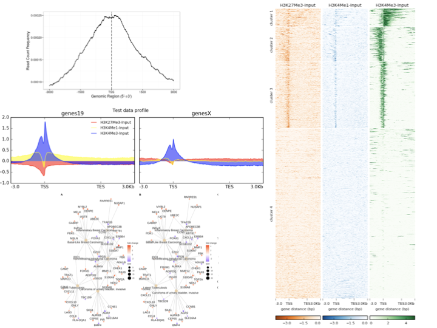

.. below role allows to use the html syntax, for example :raw-html:` `
.. role:: raw-html(raw)
    :format: html

====================
Downstream Analyses
====================

Ater the initial data analysis when the occupancy sites are determined, it is time to annotate the results with nearest genes, identify sequence motifs enriched in the peaks, produce visualisations, perform statistical analyses of differential occupancy and functionally annotate the results with gene sets. This part of the course will guide you through some of these steps.

*source for images for the collage: vignettes for ChIPseeker, deepTools, enrichplot*

:raw-html:` `

These are tutorials for downstream processing of ChIP-seq and ATAC-seq data.

.. toctree::
   :maxdepth: 1

   Peak Annotation <atac-chip-downstream/PeakAnnot_tsao2022.fulldata_rtds.12ix2025.rst>
   Identification of Sequence Motifs <motifs/lab-motifs.rst>
   Differential Accessibility in ATAC-seq data <atac-chip-downstream/PeakDA_tsao2022.fulldata_rtds.12ix2025.rst>
   Detection of differential occupancy in ChIP-seq data using DiffBind <diffBind/lab-diffBinding.rst>
   Signal Visualisation in Functional Genomics <visualisation/lab-visualisation.rst>
   Transcription Factor Footprinting <ATACseq/lab-atac-TFfootprnt.rst>
   Predicting Relevant Transcription Factors <motifAnalyses/motifAnalyses.rst>

