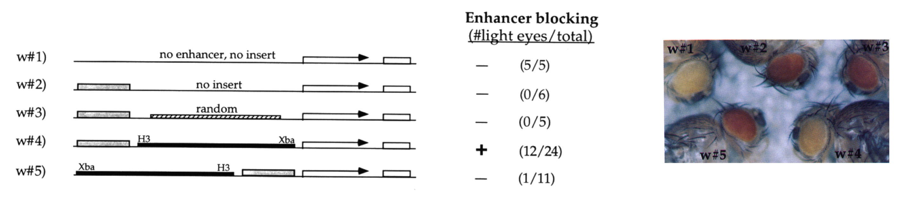
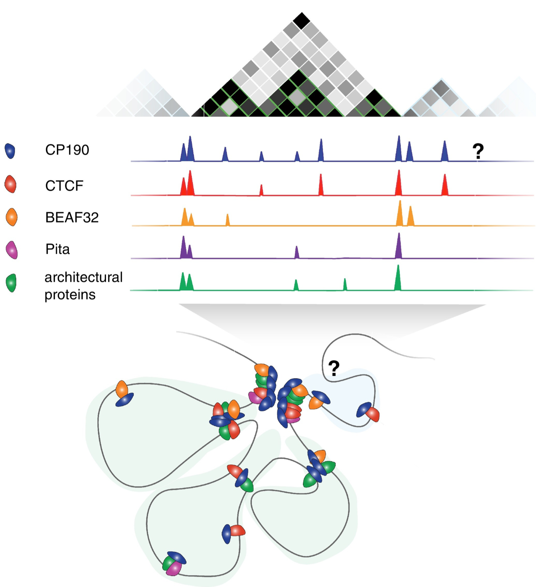

# Genomic overlaps

## Learning outcomes

- To be able to manipulate genomic ranges using the `GRanges` package.

- To compute statistical significance of overlaps between two sets of genomic ranges using randomization tests, and to understand some of the pitfalls when interpreting stuch tests.

### Table of contents
  * [Setting up](#setting-up)
  * [Introduction to genomic ranges](#introduction-to-genomic-ranges)
    + [Operations on a single GRagnes object](#operations-on-a-single-gragnes-object)
    + [Comparing GRanges](#comparing-granges)
  * [Statistical significance of overlaps](#statistical-significance-of-overlaps)
  * [Example with insulator elements](#example-with-insulator-elements)
    + [Different sampling method](#different-sampling-method)

## Setting up

To run this exercise on uppmax, first load the following modules on uppmax:

```{bash eval=FALSE}
module load bioinfo-tools
module load R/4.0.0
module load R_packages/4.0.0
module load RStudio
module load samtools
```

Then set up a working directory, in which you create links to all data files needed for the exercise, e.g with `ln -s /sw/courses/epigenomics/genomic_overlaps/* .`. 

Now start `R`, or `rstudio`.

## Introduction to genomic ranges

Genomic regions can be used to represent the locations of many features on the genome, e.g. genes, enchancers, open chromatin, transcripsion factor binding sites, CpG islands, SNPs and more. Handling genomic regions is useful for a wide variety of bioinformatic applications. Some examples are:

- Find all promoter regions of a group of genes

- What are the closest genes to our transcription factor binding sites?

- Which SNPs overlap the binding sites of a transcription factor we are looking at?

- How much do our transcription factor binding sites overlap heterochromatin or insulator elements? Do they overlap more than expected by chance?

In R, the `GRanges` package provides an easy way to work with genomic regions. More information on the `GRanges` package can be found [here](https://bioconductor.org/packages/release/bioc/vignettes/GenomicRanges/inst/doc/GenomicRangesIntroduction.html).

We will start by looking at some methods to manipulate genomic ranges, using ChIP-seq data from [Dai et al. 2013](http://genesdev.cshlp.org/content/27/6/602.short).  This study, in *Drosophila melanogaster* embryos, examined the protein Insensitive (Insv). Two ChIP-seq experiments were made, on 2-6 hour embryos and 6-12 hour embryos. (The peaks for these data sets were called using the [Quest](http://www.nature.com/nmeth/journal/v5/n9/full/nmeth.1246.html) peak caller, which reports peaks in a slightly odd format: Here peaks are represented by the 2bp sequences corresponding to the peak summits.)

We start by loading the libraries needed for this exercise.


```
library("rtracklayer")
library("regioneR")
library("BSgenome.Dmelanogaster.UCSC.dm3")
library("pheatmap")
```

Next, we load the first Insv data set. We use the function `import.bed`, which reads a file and returns a `GRanges` object. This holds information on one or more regions across a genome. Have a look at it. There are corresponding functions to load gff, bw and bedGraph files too. We also use the function `filterChromosomes` to remove special chromosomes present in the *Drosophila* genome, e.g. heterochromatin and a special "chromosome" made up of unassembled contigs.


*Can you understand the output? How many peaks does this data set have?* 

```{r granges_intro1}
set.seed(1234)

insv.2.6 <- import.bed("insv_2_6h.bed")
insv.2.6 <- filterChromosomes(insv.2.6, organism = "dm3")
insv.2.6

head(start(insv.2.6))
head(end(insv.2.6))
head(width(insv.2.6))
sum(width(insv.2.6))
length(insv.2.6)
```


### Operations on a single GRagnes object

There are several operations you can perform on a `Granges` object: shift al regions to the left or right, change their size, get flanking regions, merge overlapping regions, find everything not covered by the regions etc. Try out a few of these. *Do you understand what these functions do? Otherwise try e.g. `?flank`.*


```
# Get flanking regions
flank(insv.2.6, 10, start=TRUE)
flank(insv.2.6, 10, start=FALSE)

# Shift regions
shift(insv.2.6, 500)
shift(insv.2.6, -500)

# Change size of regions
insv.2.6 + 10
insv.2.6 - 10

# Merge overlapping regions
reduce(insv.2.6 + 249)

# Get everything not covered by the regions
gaps(insv.2.6)
```

### Comparing GRanges

In integrating different data sets, it is often useful to compare several `GRanges` objects, to see how much they overlap, or where they differ. Here we load the other Insv data set, from 6-12 hour embryos, and compare it to the data from 2-6 hours. Since each peak is only represented by the 2 bp peak summit, we start by exteding the peaks so they are 500 bp, and merging overlapping peaks.

Common operations for comparing two `GRanges` are: union (all sequence covered by any of the `GRanges` objects), intersect (all sequence covered by both of the `GRanges` objects), setdiff (all sequence covered by one `GRanges` object but not the other).

```
insv.6.12 <- import.bed("insv_6_12h.bed")
insv.6.12 <- filterChromosomes(insv.6.12, organism = "dm3")
insv.2.6 <- reduce(insv.2.6 + 249)
insv.6.12 <- reduce(insv.6.12 + 249)

insv.2.6 
insv.6.12

# Union
union(insv.2.6, insv.6.12)
union(insv.2.6, gaps(insv.2.6))

# How many bp are present in each peaks set? In any of the peak sets?
sum(width(insv.2.6))
sum(width(insv.6.12))
sum(width(union(insv.2.6, insv.6.12)))

# Intersection
intersect(insv.2.6, insv.6.12)

# How many bp are present in both peak sets?
sum(width(intersect(insv.2.6, insv.6.12)))

# Setdiff
setdiff(insv.2.6, insv.6.12)

# How many bp are prsent in the 2-6 hour peak set, but not in the 6-12 hour peak set?
sum(width(setdiff(insv.2.6, insv.6.12)))

# Can you figure out what this means?
sum(width(setdiff(insv.2.6, insv.6.12))) + sum(width(intersect(insv.2.6, insv.6.12)))
```

If we have two data sets, the function `findOverlaps` calculates which of the regions in the two data sets that overlap.

```
# Which regions overlap?
ol <- findOverlaps(insv.2.6, insv.6.12)
ol

# One range in object A may overlap several ranges in object B, and the other way around
which(duplicated(queryHits(ol)))
```

## Statistical significance of overlaps

Determining if two sets of genomic regions overlap more than expected by chance is a common problem in genomics. Here we will try the `regioneR` package to do this, but there are many other methods available. As you will see this is a quite difficult problen, and the results should be interpreted with caution.

The `regioneR` package uses randomization tests to asses how significant the overlap between two data sets is. The basic idea is to:

1. Calulate the overlap between the two given data sets A and B

2. Create a randomized data set B', with the same number of regions, and the same sizes as B, distributes randomly across the genome.

3. Calculate the overlap between A and B'.

4. Repeat steps 2 and 3 many times (e.g. 1000) to get a distribution of how many overlaps we would expect by chance.

5. Compare the results from step 1 (A vs B) to the results for all the randomized data sets. This makes it possible to calculate a p-value and a z-score. 

To illustrate this, we create a data set of 100 regions, randomly ditributed across the genome. Using the test with 100 randomizations, we check if there is a signficant between the Insv peaks and our random data set. *How do you interpret the results?*


```
# Read sizes of chromosomes
dm3 <- read.table("dm3_chrom_sizes.txt")
dm3 <- filterChromosomes(getGenome(dm3), organism="dm3")

rr <- createRandomRegions(nregions=100, length.mean=500, length.sd=0, genome=dm3)

permRes <- overlapPermTest(A=rr, B=insv.2.6, ntimes=100, alternative="greater", 
													 genome=getGenome(dm3), mc.set.seed=FALSE, verbose=TRUE)
summary(permRes)
plot(permRes)
```


Using the same strategy, we can check if there is a significant overlap between the two Insv data sets, from different time points. *How do you interpret the results?*

```
permRes <- overlapPermTest(A=insv.2.6, B=insv.6.12, ntimes=100, alternative="greater",
													 genome=getGenome(dm3), mc.set.seed=FALSE, verbose=TRUE)
summary(permRes)
plot(permRes)
```


## Example with insulator elements

In [Dai et al. 2015](http://genesdev.cshlp.org/content/29/1/48.short) it was shown that Insv often binds together with insulator proteins (BEAF-32, CP190, CTCF and others) across the *Drosophila* genome. 

Insulator elements were [first described](http://genesdev.cshlp.org/content/10/24/3202.abstract) as DNA elements that can restrict e.g. interactions between enhancers and target genes or the spread of heterochromatin.



Later it was found that insulator elements control DNA looping, so that enhancers and target genes can end up in different loop domains (≈ topologically associated domains, TADs). Image taken from [this](https://www.sciencedirect.com/science/article/pii/S0959437X1500132X) review.



To check for ourselves if Insv overlaps isulator elements, we use some public data on insulator proteins, and compare these to the Insv regions. We start by loading and formatting data.


```
# Add chr
beaf32 <- import.gff3("beaf32.gff3")
cp190 <- import.gff3("cp190.gff3")
ctcf.1 <- import.gff3("ctcf.gff3")

allDataSets <- list(insv.2.6=insv.2.6,
                    insv.6.12=insv.6.12,
		    beaf32=beaf32,
		    cp190=cp190,
		    ctcf.1=ctcf.1)

# These data sets are from different studies, and on different formats. 
# We have to make sure that they are all on the same format, so that all chromosome names match.
lapply(allDataSets, seqlevelsStyle)

for(i in 1:length(allDataSets)){
	seqlevelsStyle(allDataSets[[i]])<-"UCSC"
	allDataSets[[i]] <- filterChromosomes(allDataSets[[i]], organism = "dm3")
}

lapply(allDataSets, seqlevelsStyle)
```


Then, we simply count the overlaps between the various data sets. We loop though all pairs of data sets *i*,*j*, and coout the overlaps. In the matrix below each, entry *i,j,* represents the fraction of regions in data set *i* that overlap with data set *j*. We also plot the results as a heat map, where different levels of overlap are represented by different colors. *Does Insv overlap a lot woth the insulator proteins?*


```
overlapFraction <- matrix(NA, nrow=length(allDataSets), ncol=length(allDataSets))
rownames(overlapFraction) <- names(allDataSets)
colnames(overlapFraction) <- names(allDataSets)
for(i in 1:length(allDataSets)){
	for(j in 1:length(allDataSets)){
		overlapFraction[i,j] <-	numOverlaps(A=allDataSets[[i]], B=allDataSets[[j]])/length(allDataSets[[i]])
	}
}
round(overlapFraction,2)

useCols <- colorRampPalette(c("white", "red"))(100)
pheatmap(overlapFraction, cluster_rows=FALSE, cluster_cols=FALSE, color = useCols, main="% overlap")
```


For comparison, we add data on an unrelated transcription factor, CtBP, and re-run the analysis. *How much does Insv overlap the insulator proteins BEAF-32, CP190 and CTCT, compared to CtBP?*


```
# Load and format CtBp data
ctbp <- import.bed("ctbp.bed")
seqlevelsStyle(ctbp)<-"UCSC"
ctbp <- filterChromosomes(ctbp, organism = "dm3")

allDataSets <- c(allDataSets, ctbp=ctbp)

# Re-run overlap analysis
overlapFraction <- matrix(NA, nrow=length(allDataSets), ncol=length(allDataSets))
rownames(overlapFraction) <- names(allDataSets)
colnames(overlapFraction) <- names(allDataSets)
for(i in 1:length(allDataSets)){
	for(j in 1:length(allDataSets)){
		overlapFraction[i,j] <-	numOverlaps(A=allDataSets[[i]], B=allDataSets[[j]])/length(allDataSets[[i]])
	}
}
round(overlapFraction,2)

useCols <- colorRampPalette(c("white", "red"))(100)
pheatmap(overlapFraction, cluster_rows=FALSE, cluster_cols=FALSE, color = useCols, main="% overlap")
```

We can now check if the overlaps between the different proteins are more common than would be expected by chance. Again, we loop though all pairs of data sets *i*,*j*, but this this we do a randomization test for each pair *i*,*j*, and save the p-values and z-scores. Because this takes a while to run, we only use 50 randomization rounds. (To reduce runtime even more, we only compare each pair of data sets once and don't compare data sets to themselves.)

Looking at the p-values is not very informative, since they are all quite low. To get even lower p-values, we would have to run a lot more randomization rounds, which takes time. (P-values of 1e5 would require 100000 randomizations.) In this case, Z-scores are more informative, since they can provide a measure of how much bigger the overlap between data sets is, compared to randomized data.


```{r overlap_significance}
overlapP <- matrix(NA, nrow=length(allDataSets), ncol=length(allDataSets))
rownames(overlapP) <- names(allDataSets)
colnames(overlapP) <- names(allDataSets)

overlapZ <- matrix(NA, nrow=length(allDataSets), ncol=length(allDataSets))
rownames(overlapZ) <- names(allDataSets)
colnames(overlapZ) <- names(allDataSets)

nTimes <- 50

for(i in 1:length(allDataSets)){
	for(j in 1:length(allDataSets)){
		if(i<j){
			permRes <- overlapPermTest(A=allDataSets[[i]], 
                                                   B=allDataSets[[j]], 
						   ntimes=nTimes, 
						   alternative="greater", 
						   genome=getGenome(dm3), 
						   mc.set.seed=FALSE, 
						   verbose=FALSE)
			overlapP[i,j] <- permRes$numOverlaps$pval
			overlapZ[i,j] <- permRes$numOverlaps$zscore
		}
	}
}

# Fill in the missing values.
for(i in 1:length(allDataSets)){
	for(j in 1:length(allDataSets)){
		if(i>j){
			overlapP[i,j] <- overlapP[j,i]
			overlapZ[i,j] <- overlapZ[j,i]
		}
	}
}
diag(overlapP) <- 0
diag(overlapZ) <- NA

round(overlapP,2)
round(overlapZ,2)

useCols <- colorRampPalette(c("white", "red"))(100)
pheatmap(overlapP, cluster_rows=FALSE, cluster_cols=FALSE, color = useCols, main="P-values")
pheatmap(overlapZ, cluster_rows=FALSE, cluster_cols=FALSE, color = useCols, main="z-scores")
```


### Different sampling method

When testing if the overlap between two data sets is significant, there are many choices that could have a big impact on the results. For example, most transcription factor binding sites are enriched around transcription start sites (TSS). This means that if we use a randomization strategy where we can place regions over the entire genome, we might overestimate the significance of the overlaps.

Below, we check if results change if we instead focus on promoter regions only. For this we load coordinates of promoter regions, here defined as [TSS-1500, TSS+500]. We then only consider binding sites that fall within the prometer regions. As you can see, we still retain most binding sites. In the resampling strategy, we now only now **sample promoter regions instead of sampling random regions across the genome**. *How does this affect the results?*

(Since this randomization strategy is faster than sampling random regions, we now use 500 radnomization rounds.)


```
# Load promoter regions
us <- import.bed("genes1000bpupstream.bed") + 500
seqlevelsStyle(us)<-"UCSC"
us <- filterChromosomes(us, organism = "dm3")

# Only use peaks within promoter regions
allDataSetsUs <- lapply(allDataSets, function(x){GenomicRanges::intersect(x,us,ignore.strand=TRUE) })
lapply(allDataSetsUs , length)

# Re-run ovlerap analysis
overlapP <- matrix(NA, nrow=length(allDataSets), ncol=length(allDataSets))
rownames(overlapP) <- names(allDataSets)
colnames(overlapP) <- names(allDataSets)

overlapZ <- matrix(NA, nrow=length(allDataSets), ncol=length(allDataSets))
rownames(overlapZ) <- names(allDataSets)
colnames(overlapZ) <- names(allDataSets)

nTimes <- 500

for(i in 1:length(allDataSets)){
	for(j in 1:length(allDataSets)){
		if(i<j){
			permRes <- permTest(A=allDataSets[[i]], 
			                    B=allDataSets[[j]], 
					    ntimes=nTimes,
					    randomize.function=resampleRegions, 
					    universe=us,
					    alternative="greater", evaluate.function=numOverlaps,
					    count.once=TRUE, mc.set.seed=FALSE, mc.cores=4)
			overlapP[i,j] <- permRes$numOverlaps$pval
			overlapZ[i,j] <- permRes$numOverlaps$zscore
		}
	}
}

# Fill in the missing values.
for(i in 1:length(allDataSets)){
	for(j in 1:length(allDataSets)){
		if(i>j){
			overlapP[i,j] <- overlapP[j,i]
			overlapZ[i,j] <- overlapZ[j,i]
		}
	}
}
diag(overlapP) <- 0
diag(overlapZ) <- NA

round(overlapP,3)
round(overlapZ,2)

useCols <- colorRampPalette(c("white", "red"))(100)
pheatmap(overlapP, cluster_rows=FALSE, cluster_cols=FALSE, color = useCols, main="P-values")
pheatmap(overlapZ, cluster_rows=FALSE, cluster_cols=FALSE, color = useCols, main="z-scores")
```
