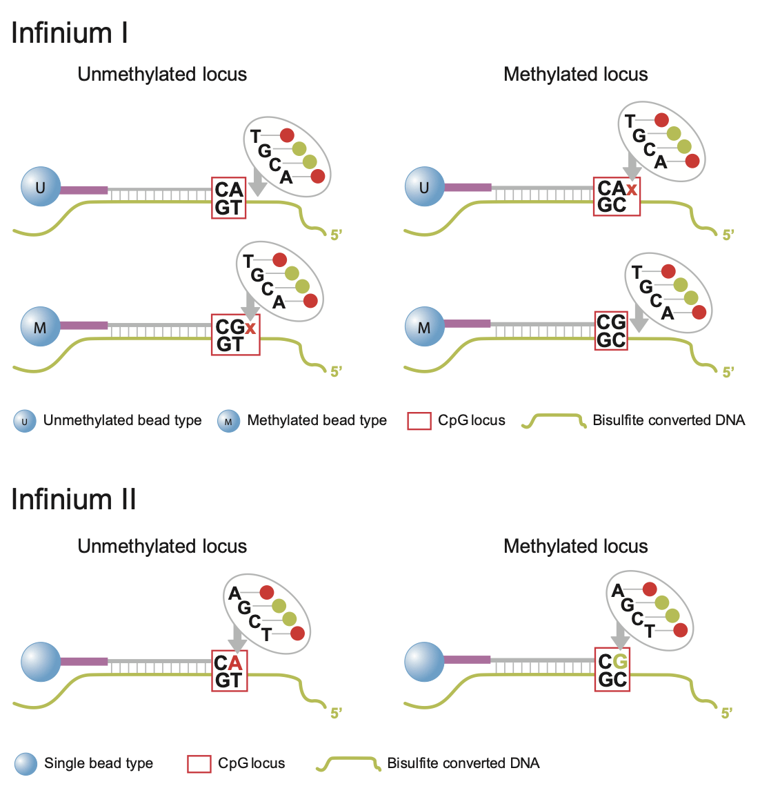
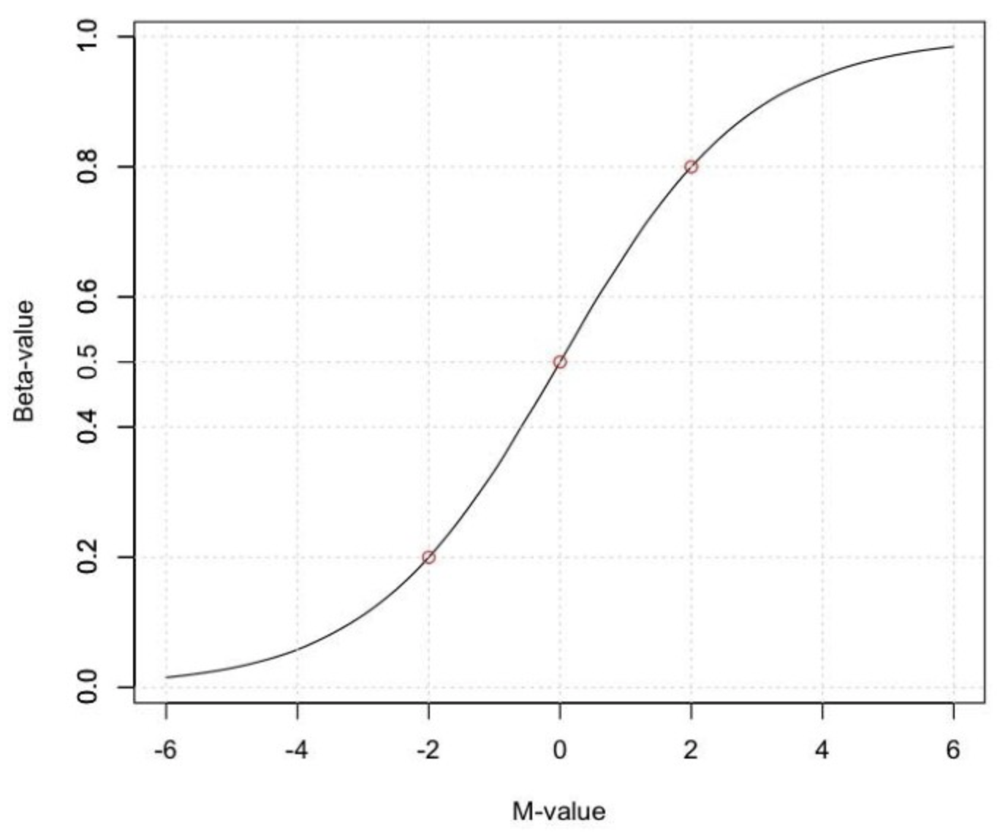
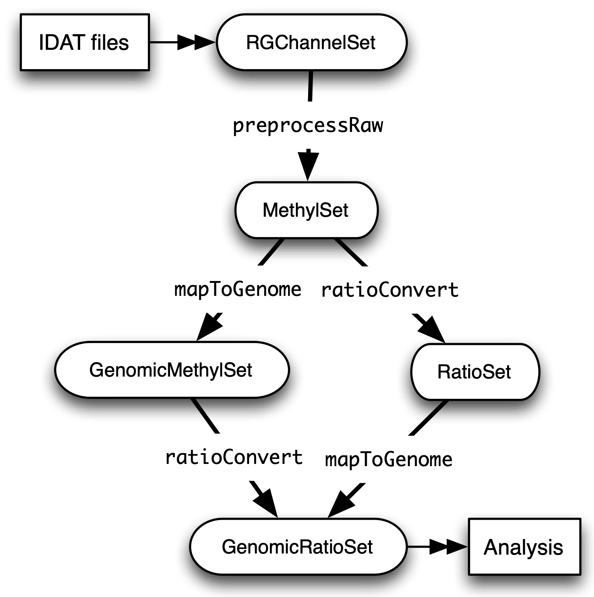

<style TYPE="text/css">
code.has-jax {font: inherit; font-size: 100%; background: inherit; border: inherit;}
</style>
<script type="text/x-mathjax-config">
MathJax.Hub.Config({
    tex2jax: {
        inlineMath: [['$','$'], ['\\(','\\)']],
        skipTags: ['script', 'noscript', 'style', 'textarea', 'pre'] // removed 'code' entry
    }
});
MathJax.Hub.Queue(function() {
    var all = MathJax.Hub.getAllJax(), i;
    for(i = 0; i < all.length; i += 1) {
        all[i].SourceElement().parentNode.className += ' has-jax';
    }
});
</script>
<script type="text/javascript" src="https://cdnjs.cloudflare.com/ajax/libs/mathjax/2.7.4/MathJax.js?config=TeX-AMS_HTML-full"></script>

# DNA Methylation: Array Workflow

**Learning Outcomes**

- High level overview of several array technologies and methylation metrics
- Perform quality check, filtering and normalization of raw data
- Perform differential methylation; both on single CpG as on a regional level
- Gain biological insight by gene ontology analysis

**Table of Contents**
- [DNA Methylation: Array Workflow](#dna-methylation-array-workflow)
  - [Introduction](#introduction)
  - [Load Packages](#load-packages)
  - [Datasets](#datasets)
  - [Load Datasets](#load-datasets)
  - [A Note on Class Structure](#a-note-on-class-structure)
  - [Quality control](#quality-control)
  - [Normalization](#normalization)
    - [preprocessRaw](#preprocessraw)
    - [preprocessIllumina](#preprocessillumina)
    - [preprocessSWAN](#preprocessswan)
    - [preprocessFunnorm](#preprocessfunnorm)
    - [preprocessQuantile](#preprocessquantile)
  - [Data exploration](#data-exploration)
  - [Filtering](#filtering)
  - [Probe-Wise Differential Methylation](#probe-wise-differential-methylation)
  - [Regional Differential Methylation (DMR)](#regional-differential-methylation-dmr)
    - [Location-based Regions](#location-based-regions)
    - [Functional Regions](#functional-regions)
  - [Gene Ontology Testing](#gene-ontology-testing)
  - [Cell Type Composition](#cell-type-composition)

## Introduction

Despite the increasing popularity of sequencing based methods, methylation arrays remain the platform of choice for many epigenome-wide association studies. Their user-friendly and more streamlined data analysis workflow in combination with a lower price per sample make them the preferred tool for - especially larger scale - studies. In this tutorial, an overview of a typical analysis of a Illumina HumanMethylation450 array will be presented. 

But first; a bit of history. Measurement of DNA methylation by Infinium technology (Infinium I) was first employed by Illumina on the HumanMethylation27 (27k) array, which measured methylation at approximately 27,000 CpGs, primarily in gene promoters. Like bisulfite sequencing, the Infinium assay detected methylation status at single base resolution. However, due to its relatively limited coverage the array platform was not truly considered “genome-wide” until the arrival of the 450k array. The 450k array increased the genomic coverage of the platform to over 450,000 gene-centric sites by combining the original Infinium I probes with the novel Infinium II probes. Both probe types employ 50bp probes that query a [C/T] polymorphism created by bisulfite conversion of unmethylated cytosines in the genome. However, the Infinium I and II assays differ in the number of beads required to detect methylation at a single locus. Infinium I assays use two beads per CpG, one for each of the methylated and unmethylated states. In contrast, the Infinium II design uses only one bead type and the methylated state is determined at the single base extension step after hybridization (See Figure 1). In 2016, the 850k array (also called EPIC array) was introduced. This array also uses a combination of the Infinium I and II assays but builds upon the 450k slide with >90% of the original 450K CpGs plus an additional 350,000 CpGs in mainly enhancer regions. As a result of this increase coverage a 450k slide can contain 12 arrays for 12 samples whilst the EPIC has only 8 spaces for 8 samples per array. The EPIC array is replacing the 450K array as the _de facto_ standard for methylation analyses; the data processing for both is however fairly similar.

 
*Fig. 1: (Up) Infinium I and II design.*

Regardless of array type, both the 450k and EPIC record two measurements for each CpG: a methylated intensity (M) and an unmethylated intensity (U). Using these values, the proportion of methylation at each site CpG locus can be determined. The level of methylation at a locus is commonly reported as the Beta-value, _i.e._ the ratio of the methylated probe intensity and the overall intensity:

$$\beta = M/(M + U)$$

Illumina recommends adding a constant offset α (by default, α = 100) to the denominator to regularize Beta value when both methylated and unmethylated probe intensities are low. The Beta-value statistic results in a number between 0 and 1, or 0 and 100%. Under ideal conditions, a value of zero indicates that all copies of the CpG site in the sample were completely unmethylated (no methylated molecules were measured) and a value of one indicates that every copy of the site was methylated.

A second common metric to describe the methylation level is the M-value, _i.e_ the log2 ratio of the intensities of methylated probe versus unmethylated probe:

$$Mvalue = log2(M/U)$$

A M-value close to 0 indicates a similar intensity between the methylated and unmethylated probes, which means the CpG site is about half-methylated, assuming that the intensity data has been properly normalized. Positive M-values mean that more molecules are methylated than unmethylated, while negative M-values mean the opposite. 

Beta and M-values are related to each other but Beta-values are generally preferable for the graphical representation of methylation levels as _percentage methylation_ has a more intuitive biological interpretation. Due to their distributional properties, M-values are more statistically valid for the differential analysis of methylation levels. A thorough comparison of both metrics, can be found [here](https://bmcbioinformatics.biomedcentral.com/articles/10.1186/1471-2105-11-587).


*Fig. 2: Relationship between Beta and M-values.*

In this workflow, we will provide examples of the steps involved in analyzing 450K methylation array data using R and Bioconductor. The different steps include: loading the raw data, quality control, filtering, different normalization methods and probe-wise differential methylation analysis. Additional approaches such as differential methylation analysis of regions, gene ontology analysis and estimating cell type composition will also be presented. 

## Load Packages

This exercise has been set up on Uppmax, so connect to Uppmax as described in . On Uppmax, most packages are already installed, and can be loaded into R after the _R.4.0.0_ and _R_packages_ modules have been loaded. If you are running on Uppmax, start by loading the following modules:

```bash
module load R/4.0.0
module load R_packages/4.0.0
module load RStudio
```

Start the analysis by initiating _rstudio_...

```bash
rstudio
```

Next, run the R commands by copying them from this website into the Rstudio terminal and pressing _Enter_. Start by loading the set of R packages that will be needed during the analysis: _limma_ provides the statistical framework for testing differential methylation. _minfi_, _missMethyl_, _minfiData_ and _DMRcate_ are packages developed to work with methylation data. _Gviz_ and _RColorBrewer_ provide functions for the visualization of the data.

```r
# load packages required for analysis
library("limma")
library("minfi")
library("RColorBrewer")
library("missMethyl")
library("minfiData")
library("Gviz")
library("DMRcate")
library("stringr")
```

Included with _minfo_ is the _IlluminaHumanMethylation450kanno.ilmn12.hg19_ package; it contains all the annotation information for each of the CpG probes on the 450k array. This will be useful later to determine where the differentially methylated probes (hereafter referred to as DMP) are located in a genomic context.

```r
ann450k <- getAnnotation(IlluminaHumanMethylation450kanno.ilmn12.hg19)
# Use the head command to get a quick overview of the data
# head(ann450k)
```

---
**Note**

These packages are of course also available for the later array versions. The EPIC array annotation package is called _IlluminaHumanMethylationEPICanno.ilm10b2.hg19_ and also included in _minfi_.

---

## Datasets

To demonstrate the various aspects of analysing methylation data, we will be using a small, publicly available 450k methylation dataset ([GSE49667](https://www.ncbi.nlm.nih.gov/geo/query/acc.cgi?acc=GSE49667)). The dataset contains 10 samples in total: there are 4 different sorted T-cell types (naive, rTreg, act_naive, act_rTreg, collected from 3 different individuals (M28, M29, M30). An additional birth sample (individual VICS-72098-18-B) is included from another study ([GSE51180[(https://www.ncbi.nlm.nih.gov/geo/query/acc.cgi?acc=GSE51180)]) to illustrate approaches for identifying and excluding poor quality samples.

These datasets have been downloaded to Uppmax prior to the workshop, so you just need to point R towards the directory they are saved. The `list.files` command will return the list of files in the specified directory.

```r
dataDirectory <- "data"
# list the files
list.files(dataDirectory, recursive = TRUE)
```

## Load Datasets

Illumina methylation data is usually obtained in the form of Intensity Data (IDAT) Files. This is a proprietary format that is output by the slide scanner and stores the intensities for each probe on the array. Typically, each IDAT file is approximately 8MB in size. The simplest way to import the raw methylation data into R is using the minfi function `read.metharray.sheet`, along with the path to the IDAT files and a sample sheet. The sample sheet is a CSV (comma-separated) file containing one line per sample, with a number of columns describing each sample. The format expected by the `read.metharray.sheet` function is based on the sample sheet file that usually accompanies Illumina methylation array data. It is also very similar to the targets file described by the limma package. Importing the sample sheet into R creates a dataframe with one row for each sample and several columns. The `read.metharray.sheet` function uses the specified path and other information from the sample sheet to create a column called Basename which specifies the location of each individual IDAT file in the experiment. Import the metadata and have a look at the different samples.

```r
# read in the sample sheet for the experiment
targets <- read.metharray.sheet(dataDirectory, pattern="SampleSheet.csv")
#targets
```

Now we know where the data is located and we have essential information on each samples identity, we can read in the raw intensity data into R using the `read.metharray.exp` function. This creates an _RGChannelSet_ object that contains all the raw intensity data, from both the red and green colour channels, for each of the samples. This is the initial object of a minfi analysis that contains the raw intensities in the green and red channels. Note that this object contains the intensities of the internal control probes as well. Because we read the data from a data sheet experiment, the phenotype data is also stored in the _RGChannelSet_ and can be accessed via the accessor command pData. Also the probed design can be summarized by querying this object. Before starting the actual analysis it is good practice to get a feel of the structure and content of the _RGChannelSet_ object in this way.

```r
# read in the raw data from the IDAT files
rgSet <- read.metharray.exp(targets=targets)

# Get an overview of the data
# rgSet
# pData(rgSet)
# getManifest(rgSet)
```

It might be useful to change the names of the samples into something a little more descriptive.

```r
# give the samples descriptive names
targets$ID <- paste(targets$Sample_Group,targets$Sample_Name,sep=".")
sampleNames(rgSet) <- targets$ID

# Check the names have been updated by looking at the rownames of the phenoData
pData(rgSet)
```

## A Note on Class Structure

minfi generates a number of classes corresponding to various transformations of the raw data. It is important to understand how these classes relate to each other. Figure 2 provides a useful overview. In a first step, IDAT files are collected in a _RGChannelSet_ object, transformed in a _MethylSet_ through a preprocess function and via two functions _ratioConvert_ and _mapToGenome_ (order does not matter) converted into an analysis-ready _GenomicRatioSet_.




*Fig. 2: Flowchart of the different _minfi_ class objects.*

As of now, our dataset is an _RGChannelSet_ object containing the raw intensity data. To proceed, this needs to be transformed into a _MethylSet_ object containing the methylated and unmethylated signals. The most basic way to construct a _MethylSet_ is to use the function _preprocessRaw_ which uses the array design to match up the different probes and color channels to construct the methylated and unmethylated signals. This function does not do any normalization (in a later step we will add normalization, but this step is useful for initial quality control). Do this now for your object and have a look at the changes in the metadata.

```r
MSet <- preprocessRaw(rgSet)
MSet
# Compare to previous object
rgSet
```

The accessors _getMeth_ and _getUnmeth_ can now be used on the _MethylSet_ to get the methylated and unmethylated intensities matrices, if necessary.

```r
head(getMeth(MSet)[,1:3])
head(getUnmeth(MSet)[,1:3])
```

An object of a class _RatioSet_ is designed to store Beta and/or M-values instead of the (un)methylated signals. An optional copy number matrix, CN, the sum of the methylated and unmethylated signals, can be also stored. Mapping a _MethylSet_ to a _RatioSet_ is irreversible, i.e. one cannot technically retrieve the methylated and unmethylated signals from a _RatioSet_. A _RatioSet_ can be created with the function ratioConvert. The function _mapToGenome_ applied to a _RatioSet_ object will add genomic coordinates to each probe together with some additional annotation information. The output object is a _GenomicRatioSet_ 

```r
ratioSet <- ratioConvert(MSet, what = "both", keepCN = TRUE)
# Observe the change of the assays
ratioSet

gset <- mapToGenome(ratioSet)
gset
```

The functions _getBeta_, _getM_ and _getCN_ work on the _GenomicRatioSet_ return respectively the Beta value matrix, M value matrix and a the Copy Number matrix.

```r
beta <- getBeta(gset)
# head(beta)
m <- getM(gset)
# head(m)
cn <- getCN(gset)
# head(cn)
```

Much more annotation data can be extracted from this object (see the _minfi_ [documentation](http://bioconductor.org/packages/release/bioc/vignettes/minfi/inst/doc/minfi.html)). Now we have a analysis ready object, albeit unnormalized. As we will see in a later section, there are several normalization options that automatically take care of the preprocessing and conversion of a _RGChannelSet_ to a _GenomicRatioSet_. But before doing this, an important step is Quality Control

## Quality control

_minfi_ provides a simple quality control plot that uses the log median intensity in both the methylated (M) and unmethylated (U) channels. When plotting these two medians against each other, good samples tend to cluster together, while failed samples tend to separate and have lower median intensities. In general, users should make the plot and make a judgement. The line separating ”bad” from ”good” samples represent a useful cutoff, which is not always very clear and may have to be adapted to a specific dataset. The functions _getQC_ and _plotQC)_ are designed to extract and plot the quality control information from the _MethylSet_. 

```r
qc <- getQC(MSet)
plotQC(qc)
```

Here, the cutoff line suggests 3 "bad" samples. Can you determine which samples these are? [Hint: the _pData_ function might be of help here] In general, a decision of good versus bad quality should be based on multiple metrics, not just one. Therefore, we can additionally look at the detection p-values for every CpG in every sample, which is indicative of the quality of the signal. The method used by _minfi_ to calculate detection p-values compares the total signal (M+U) for each probe to the background signal level, which is estimated from the negative control probes. Very small p-values are indicative of a reliable signal whilst large p-values, for example >0.01, generally indicate a poor quality signal.

Plotting the mean detection p-value for each sample allows us to gauge the general quality of the samples in terms of the overall signal reliability. Samples that have many failed probes will have relatively large mean detection p-values.

```r
# calculate the detection p-values
detP <- detectionP(rgSet)
# head(detP)
```

These p-values can be summarized in a single plot to simplify the comparison between samples

```r
# examine mean detection p-values across all samples to identify any failed samples
barplot(colMeans(detP), las=2, cex.names=0.8, ylab="Mean detection p-values")
abline(h=0.05,col="red")
```

Poor quality samples can be easily excluded from the analysis using a detection p-value cutoff, for example >0.05. For this particular dataset, the _birth_ sample shows a very high mean detection p-value.

The overall density distribution of Beta values for each sample is another useful metric to determine sample quality. Usually, one would expect to see most Beta values to be either close to 0 or 1, indicating most of the CpG sites in the sample are unmethylated or methylated. The _densityPlot_ function plots these distribution for each sample.

```r
phenoData <- pData(MSet)
densityPlot(MSet, sampGroups = phenoData$Sample_Group)
```

Taking these different metrics into account, it seems clear that the _birth_ sample is of lower quality than the other samples. Therefore, we can decide to exclude it from the initial _rgSet_ prior to further analysis.

```r
# select the samples to keep for further analysis
keep <- !colnames(rgSet) == "birth.11"
# subset rgSet
rgSet <- rgSet[,keep]
# Check the sample has been removed
rgSet
# subset target as well
targets <- targets[keep,]
```

NOTE: The 450k array contains several internal control probes that can be used to assess the quality control of different sample preparation steps (bisulfite conversion, hybridization, etc.). The values of these control probes are stored in the initial _RGChannelSet_ and can be plotted by using the function _controlStripPlot_ and by specifying the control probe type. We will not go into the details of each control probe type, but these might be useful to determine the exact reson a sample failed QC.

```r
controlStripPlot(rgSet, controls="BISULFITE CONVERSION II")
# The plots of the different control probes can be exported into a pdf file in one step using the function qcReport
qcReport(rgSet, pdf= "qcReport.pdf")
```


## Normalization

So far, we did not use any normalization to process the data. Due to the intrinsic chip design of 2 types of chemistry probes, data normalization or preprocessing is a **critical step** to consider before data analysis. Additionally, there is often systematic bias between arrays due to a variety of variable experimental conditions such as concentrations of reagents or temperature, especially when the experiments are carried out in several batches. Relevant biological signals may be masked by technical differences, also called batch effects and there are two fundamental ways to deal with them. One possibility is to consider batch effects in the statistical analysis, for instance by introducing a dummy variable for the batch in a linear model. However, batch effects may alter the data in complicated ways for which the statistical model in mind may not be adequate. It might therefore be preferable to remove these technical differences in a preprocessing step. Several distinct preprocessing and normalization procedures are therefore available in _minfi_ (see below). A choice of different options raise of course the question which one is best or most optimal for your particular dataset. This is a difficult question to answer beforehand and selecting the best option is in practice often an iterative procedure. Nevertheless, there are some general guidelines and the authors of _minfi_ have the following to say about this:

>  "Many people have asked us which normalization they should apply to their dataset. Our rule of thumb is the following. If there exist global biological methylation differences between your samples, as for instance a dataset with cancer and normal samples, or a dataset with different tissues/cell types, use the preprocessFunnorm function as it is aimed for such datasets. On the other hand, if you do not expect global differences between your samples, for instance a blood dataset, or one-tissue dataset, use the preprocessQuantile function. In our experience, these two normalization procedures perform always better than the functions preprocessRaw, preprocessIllumina and preprocessSWAN discussed below. For convenience, these functions are still implemented in the minfi package."

### preprocessRaw

As seen before, this function converts a _RGChannelSet_ to a _MethylSet_ by converting the Red and Green channels into a matrix of methylated signals and a matrix of unmethylated signals. No normalization is performed.

Input: _RGChannelSet_ 

Output: _MethylSet_

### preprocessIllumina

Convert a _RGChannelSet_ to a _MethylSet_ by implementing the preprocessing choices as available in Genome Studio: background subtraction and control normalization. Both of them are optional and turning them off is equivalent to raw preprocessing (_preprocessRaw_):

Input: _RGChannelSet_ 

Output: _MethylSet_

### preprocessSWAN

Perform Subset-quantile within array normalization (SWAN) [6], a within-array normalization correction for the technical differences between the Type I and Type II array designs. The algorithm matches the Beta-value distributions of the Type I and Type II probes by applying a within-array quantile normalization separately for different subsets of probes (divided by CpG content). The input of SWAN is a _MethylSet_, and the function returns a _MethylSet_ as well. If an _RGChannelSet_ is provided instead, the function will first call _preprocessRaw_ on the _RGChannelSet_, and then apply the SWAN normalization. 

Input: _RGChannelSet_ or _MethylSet_ 

Output: _MethylSet_

### preprocessFunnorm

The function _preprocessFunnorm_ uses the internal control probes present on the array to infer between-array technical variation. It is particularly useful for studies comparing conditions with known large-scale differences, such as cancer/normal studies, or between-tissue studies. It has been shown that for such studies, functional normalization outperforms other existing approaches. By default, is uses the first two principal components of the control probes to infer the unwanted variation.

Input: _RGChannelSet_ 

Output: _GenomicRatioSet_

### preprocessQuantile

This function implements stratified [quantile normalization](https://en.wikipedia.org/wiki/Quantile_normalization) preprocessing. The normalization procedure is applied to the Meth and Unmeth intensities separately. The distribution of type I and type II signals is forced to be the same by first quantile normalizing the type II probes across samples and then interpolating a reference distribution to which we normalize the type I probes. Since probe types and probe regions are confounded and we know that DNA methylation varies across regions we stratify the probes by region before applying this interpolation. Note that this algorithm relies on the assumptions necessary for quantile normalization to be applicable and thus is not recommended for cases where global changes are expected such as in cancer-normal comparisons as these would be removed by the normalization. 

Input: _RGChannelSet_ 

Output: _GenomicRatioSet_


As we are comparing different blood cell types, which are globally relatively similar, we will apply the preprocessQuantile method to our data [This assumption might not be true; in an actual analysis it would be advised to try and compare different methods]. Note that after normalization, the data is housed in a GenomicRatioSet object; automatically running the steps we did manually to do an iniital quality control. 

```r
# normalize the data; this results in a GenomicRatioSet object
mSetSq <- preprocessQuantile(rgSet) 
```

Compare with the unnormalized data to visualize the effect of the normalization.

```r
# visualise what the data looks like before and after normalization
par(mfrow=c(1,2))
densityPlot(rgSet, sampGroups=targets$Sample_Group,main="Raw", legend=FALSE)
legend("top", legend = levels(factor(targets$Sample_Group)), 
       text.col=brewer.pal(8,"Dark2"))
densityPlot(getBeta(mSetSq), sampGroups=targets$Sample_Group,
            main="Normalized", legend=FALSE)
legend("top", legend = levels(factor(targets$Sample_Group)), 
       text.col=brewer.pal(8,"Dark2"))
```

## Data exploration

After normalization of your data is a good time to look at the similarities and differences between the various samples. One way to do this is by creating a MDS or Multi-Dimenional Scaling plot. This is a method to graphically represent relationships between objects (here the different samples) in multidimensional space onto 2 or 3 dimensional space. Dimension one (or principal component one) captures the greatest source of variation in the data, dimension two captures the second greatest source of variation in the data and so on. Colouring the data points or labels by known factors of interest can often highlight exactly what the greatest sources of variation are in the data. In a good quality dataset, one would hope that biological differences would show up as one of the greatest sources of variation. It is also possible to use MDS plots to decipher sample mix-ups. The following code creates the MDS plot twice but the samples in the left plot are colored according to celltype, while the plot on the right is colored according to "individual". Before you proceed think a moment about what this figure tells you about the sources in variation in the data. Try changing the `dim=c(1,2)` parameter to for example `dim=c(1,3)` or other values to get an even deeper understanding of the variation in the data. 

```r
# MDS plots to look at largest sources of variation
# Create color panel
pal <- brewer.pal(8,"Dark2")
# Plot figures
par(mfrow=c(1,2))
plotMDS(getM(mSetSq), top=1000, gene.selection="common", 
        col=pal[factor(targets$Sample_Group)], dim=c(1,2))
legend("top", legend=levels(factor(targets$Sample_Group)), text.col=pal,
       bg="white", cex=0.7)

plotMDS(getM(mSetSq), top=1000, gene.selection="common",  
        col=pal[factor(targets$Sample_Source)], dim=c(1,2))
legend("top", legend=levels(factor(targets$Sample_Source)), text.col=pal,
       bg="white", cex=0.7)
```

Examining the MDS plots for this dataset demonstrates that the largest source of variation is the difference between individuals. The higher dimensions reveal that the differences between cell types are largely captured by the third and fourth principal components. This type of information is useful in that it can inform downstream analysis. If obvious sources of unwanted variation are revealed by the MDS plots, we can include them in our statistical model to account for them. In the case of this particular dataset, we will include individual to individual variation in our statistical model.

## Filtering

Poor performing probes can obscure the biological signals in the data and are generally filtered out prior to differential methylation analysis. As the signal from these probes is unreliable, by removing them we perform fewer statistical tests and thus lower the multiple testing penalty. We filter out probes that have failed in one or more samples based on detection p-value.

```r
# ensure probes are in the same order in the mSetSq and detP objects
detP <- detectionP(rgSet)
detP <- detP[match(featureNames(mSetSq),rownames(detP)),] 

# remove any probes that have failed in one or more samples; this next line checks for each row of detP whether the number of values < 0.01 is equal to the number of samples (TRUE) or not (FALSE)
keep <- rowSums(detP < 0.01) == ncol(mSetSq) 
table(keep)
# Subset the GenomicRatioSet
mSetSqFlt <- mSetSq[keep,]
mSetSqFlt
```

Because the presence of short nucleotide polymorphisms (or SNPs) inside the probe body or at the nucleotide extension can have important consequences on the downstream analysis, _minfi_ offers the possibility to remove such probes. Can you see why SNP can be a problem in methylation data analysis (Hint: C to T conversions are the most common type of SNP in the human genome)? There is a function in _minfi_ that provides a simple interface for the removal of probes where common SNPs may affect the CpG. You can either remove all probes affected by SNPs (default), or only those with minor allele frequencies greater than a specified value.

```r
mSetSqFlt <- dropLociWithSnps(mSetSqFlt)
mSetSqFlt
```

Once the data has been filtered and normalised, it is often useful to re-examine the MDS plots to see if the relationship between the samples has changed. From the new MDS plots it is apparent that much of the inter-individual variation has been removed as this is no longer the first principal component, likely due to the removal of the SNP-affected CpG probes. However, the samples do still cluster by individual in the second dimension and thus a factor for individual should still be included in the model.

```r
par(mfrow=c(1,2))
plotMDS(getM(mSetSqFlt), top=1000, gene.selection="common", 
        col=pal[factor(targets$Sample_Group)], cex=0.8)
legend("right", legend=levels(factor(targets$Sample_Group)), text.col=pal,
       cex=0.65, bg="white")

plotMDS(getM(mSetSqFlt), top=1000, gene.selection="common", 
        col=pal[factor(targets$Sample_Source)])
legend("right", legend=levels(factor(targets$Sample_Source)), text.col=pal,
       cex=0.7, bg="white")
```

## Probe-Wise Differential Methylation

After all this preprocessing and filtering, the time has come to address an actual biological question of interest! Namely, which CpG sites are differentially differentially methylated between the different cell types? To do this, we will design a linear model in _limma_

As was apparent from the MDS plots, there is an additional factor that we need to take into account when performing the statistical analysis needed to solve this question. In the targets file, there is a column called Sample_Source, which refers to the individuals that the samples were collected from. Hence, when we specify our design matrix, we need to include two factors: individual and cell type. This style of analysis is called a paired analysis; differences between cell types are calculated within each individual, and then these differences are averaged across individuals to determine whether there is an overall significant difference in the mean methylation level for each CpG site. 

NOTE: This design is fit for this dataset, and this dataset only. For future analyses, you will have to adapt the analysis style and design to your particular dataset. The [limma User’s Guide](https://www.bioconductor.org/packages/devel/bioc/vignettes/limma/inst/doc/usersguide.pdf) extensively covers the different types of designs that are commonly used for microarray experiments and how to analyse them in R.

```r
# calculate M-values for statistical analysis: as previously mentioned, M-values have nicer statistical properties and are thus better for use in statistical analysis of methylation data 
mVals <- getM(mSetSqFlt)

# Set up the design matrix for the Differential Methylation analysis
# Define the factor of interest
cellType <- factor(targets$Sample_Group)
# Define is the individual effect that we need to account for
individual <- factor(targets$Sample_Source) 
# use the above to create a design matrix
design <- model.matrix(~0+cellType+individual, data=targets)
colnames(design) <- c(levels(cellType),levels(individual)[-1])
 
# fit the actual linear model to the data
fit <- lmFit(mVals, design)
```

We are interested in pairwise comparisons between the four cell types, taking into account variation between individuals. We perform this analysis on the matrix of M-values in _limma_, obtaining t-statistics and associated p-values for each CpG site. A convenient way to set up the model when the user has many comparisons of interest that they would like to test is to use a contrasts matrix in conjunction with the design matrix. A contrasts matrix will take linear combinations of the columns of the design matrix corresponding to the comparisons of interest, essentially subsetting the data to these comparisons.

```r
# create a contrast matrix for specific comparisons
contMatrix <- makeContrasts(naive-rTreg,
                           naive-act_naive,
                           rTreg-act_rTreg,
                           act_naive-act_rTreg,
                           levels=design)
contMatrix
```

Next, these contrasts are fitted to the model and the statistics and p-values of differential expression are calculated by the function _eBayes_. this function is used to rank genes in order of evidence for differential methylation. We will not delve too deep into the background of this statistical testing framework; if you are interested in this more info can be found [here](Linear models and empirical bayes methods for assessing differential expr…). 

```r
# fit the contrasts
fit2 <- contrasts.fit(fit, contMatrix)
# Rank genes
fit2 <- eBayes(fit2)
```

Using the _topTable_ function in _limma_, the differentially methylated genes per comparison/contrast can be extracted. To order these by p-value, the user can specify sort.by="p". The results of the analysis for the first comparison, naive vs. rTreg, can be saved as a data.frame by setting _coef=1_. The _coef_ parameter explicitly refers to the column in the contrasts matrix which corresponds to the comparison of interest.

```r
# get the table of results for the first contrast (naive - rTreg)
DMPs <- topTable(fit2, num=Inf, coef=1)
head(DMPs)
```

We can add a bit more annotation to this list of CpGs, by adding a _genelist_ parameter to the _topTable_ function. This can be useful to retrieve the location of the CpG, the nearest gene or CpG island and other information.

```r
# Retrieve data from the array annotation package; this is array-specific
ann450kSub <- ann450k[match(rownames(mVals),ann450k$Name),
                      c(1:4,12:19,24:ncol(ann450k))]
DMPs <- topTable(fit2, num=Inf, coef=1, genelist=ann450kSub)
head(DMPs)

# The resulting data.frame can easily be written to a CSV file, which can be opened in Excel.
# write.table(DMPs, file="DMPs.csv", sep=",", row.names=FALSE)
```

It is always a good idea to plot the most differentially methylated sites as a quick sanity check; if the plot does not make sense there might have been an issue with the model design or setup of the contrast matrix. To do this, we first extract the Beta-values (remember these are the preferential values to visualize).

```r
# eXtract Beta-values
bVals <- getBeta(mSetSqFlt)

# Plot most significant differentially methylated CpG
plotCpg(bVals, cpg="cg07499259", pheno=targets$Sample_Group, ylab = "Beta values")
```

Does this plot makes sense? Are the differences in methylation percentage as expected? 

## Regional Differential Methylation (DMR)

### Location-based Regions

Often, differential methylation of a single CpG is not so informative or can be hard to detect. Therefore, knowing whether several CpGs near to each other (or _regions_) are concordantly differentially methylated can be of greater interest.

There are several Bioconductor packages that have functions for identifying differentially methylated regions from 450k data. Some of the most popular are the _dmrFind_ function in the _charm_ package, which has been somewhat superseded for 450k arrays by the _bumphunter_ function in _minfi_, and, the _dmrcate_ in the _DMRcate_ package. They are each based on different statistical methods, but we will be using _dmrcate_ here, as it is based on _limma_ and thus we can use the design and contrast matrix we defined earlier.

We will again start from our matrix of M-values. For this kind of analysis, this matrix has to be annotated with the chromosomal position of the CpGs and their gene annotations. Because in a first step the _limma_ differential methylation analysis for single CpGs will be run again, we need to specify the design matrix, contrast matrix and contrast of interest. More info on the different options can always be found in the manual; _i.e_ by using _?cpg.annotate_ in R.

```r
myAnnotation <- cpg.annotate(object = mVals, 
                             datatype = "array", 
                             what = "M", 
                             analysis.type = "differential", 
                             design = design, 
                             contrasts = TRUE, 
                             cont.matrix = contMatrix, 
                             coef = "naive - rTreg", 
                             arraytype = "450K")
myAnnotation
```

Once we have the relevant statistics for the individual CpGs, we can then use the _dmrcate_ function to combine them to identify differentially methylated regions. Of particular interest here is the _lambda_ parameter; this value is the number of nucleotides that is allowed between significant CpGs before splitting them up in different regions. So a smaller _lambda_ will result in more but smaller regions. For array data, the authors of the _dmrcate_ package currently recommend a lambda of 1000. The main output table DMRs contains all of the regions found, along with their genomic annotations and p-values. To inspect this object and further visualization, you can best use the _extractRanges_ function to create a _GRanges_ object.

```r
DMRs <- dmrcate(myAnnotation, lambda=1000, C=2)
DMRs
results.ranges <- extractRanges(DMRs)
results.ranges
```

Just as for the single CpG analysis, it is a good idea to visually inspect the results to make sure they make sense. For this, use the _DMR.plot_ function. By default, this plot draws the location of the DMR in the genome, the position of nearby genes, the positions of the CpG probes, the Beta value levels of each sample as a heatmap and the mean methylation levels for the various sample groups in the experiment.

```r
# set up the grouping variables and colours
groups <- pal[1:length(unique(targets$Sample_Group))]
names(groups) <- levels(factor(targets$Sample_Group))
cols <- groups[as.character(factor(targets$Sample_Group))]
# draw the plot for the second DMR - first gives error for some reason...
DMR.plot(ranges = results.ranges, 
         dmr = 2, 
         CpGs = mSetSqFlt,
         phen.col = cols, 
         genome = "hg19")
```

### Functional Regions

An alternative approach to detect DMRs is to predefine the regions to be tested; so, as opposed to the previous approach where the regions are defined according to heuristic distance rules we can define regions based on a shared function. For this, we will used the package _mCSEA_ which contains three types of regions for 450K and EPIC arrays: promoter regions, gene body and CpG Islands. _mCSEA_ is based on Gene Set Enrichment analysis (GSEA), a popular methodology for functional analysis that was specifically designed to avoid some drawbacks in the field of gene expression. Briefly, CpG sites are ranked according to a metric (logFC, t-statistic, ...) and an enrichment score (ES) is calculated for each region. This is done by running through the entire ranked CpG list, increasing the score when a CpG in the region is encountered and decreasing the score when the gene encountered is not in the region. A high ES indicates these probes are found high up in the ranked list. In other words, a high (N)ES value means that for the CpG sites in this region there is - on average - a shift towards a higher methylation level. This approach has been [shown](https://academic.oup.com/bioinformatics/article/35/18/3257/5316232) to be more effective to detect smaller but consistent methylation differences.

Here, we will apply this method to the output of the "naive-rTreg" comparison, ranking the CpGs by logFC differences. We specify "promoters" as the type of regions to be considered, but other options such as CpG Islands or gene bodies are possible. NOTE "Promoters" are not really restricted to pure promoters, but also include UTR, 1st Exon and a region upstream of the TSS.

```r
library("mCSEA")
# Create a named vector containing the rank metric (here: logFC)
myRank <- DMPs$logFC
names(myRank) <- rownames(DMPs)

# Reshape the phenotype data to a format suitable for mCSEA
pheno <- as.data.frame(pData(mSetSqFlt))
pheno <- pheno[,"Sample_Group", drop=FALSE]

# Run the mCSEA 
myResults <- mCSEATest(myRank, 
                       bVals, 
                       pheno,
                       regionsTypes = "promoters", 
                       platform = "450k")
head(myResults$promoters)
```

The main results are found in _myResults$promoters_. This data frame contains the (normalized) enrichment score, p-values, total number of associated CpGs and the leading edge CpGs. The leading edge CpGs are the real drivers of the ES; these can be considered the most important CpGs with the largest logFC.
The results of selected results can be visualized using _mCSEAPlot_, by specifying the _regionType_ and the _dmrName_. Here an example of the top hit; the promoter of PRDM8. Note that the gene name indicates the promoter of said gene, since we specified we only consider promoter regions in this analysis. The result of this visualization are the chromosomal location, Beta levels per CpG per sample, leading edge status (green if in leading edge set) and gene annotation.


```r
 mCSEAPlot(myResults, 
           regionType = "promoters", 
           dmrName = "PRDM8",
           transcriptAnnotation = "symbol", 
           makePDF = FALSE)
```

## Gene Ontology Testing

After obtaining a - potentially long - list of significantly differentially methylated CpG sites, one might wonder whether there is a (or multiple) specific biological pathway(s) over-represented in this list. In some cases it is relatively straightforward to link the top differentially methylated CpGs to genes that make biological sense in terms of the cell types or samples being studied, but there may be many thousands of CpGs significantly differentially methylated. Gene-set analysis (GSA) is frequently used to discover meaningful biological patterns from lists of genes generated from high-throughput experiments, including genome-wide DNA methylation studies. The objective is typically to identify similarities between the genes, with respect to annotations available from sources such as the Gene Ontology (GO) or Kyoto Encyclopedia of Genes and Genomes (KEGG).

We can perform this type of analysis using the _gometh_ function in the _missMethyl_ package. This function takes as input a character vector of the names (e.g. cg20832020) of the significant CpG sites, and optionally, a character vector of all CpGs tested. This is recommended particularly if extensive filtering of the CpGs has been performed prior to analysis as it constitutes the "background" out of which any significant CpG could be chosen. For gene ontology testing (default), the user can specify collection="GO”. For testing KEGG pathways, specify collection="KEGG”. In this tutorial, we will continue with the results from the single-probe "naive vs rTreg" comparison and select all CpG sites that have an adjusted p-value of less than 0.05.

```r
# Get the significant CpG sites at less than 5% FDR
sigCpGs <- DMPs$Name[DMPs$adj.P.Val<0.05]
# First 10 significant CpGs
sigCpGs[1:10]
# Total number of significant CpGs at 5% FDR
length(sigCpGs)
# Get all the CpG sites used in the analysis to form the background
all <- DMPs$Name
# Total number of CpG sites tested
length(all)
```


> ## Note on CpG coverage bias
> 
> A key assumption of GSA methods is that all genes have, _a priori_, the same probability of appearing in the list of significant genes. If this is not true, that is, if certain genes are more likely to appear in the list, regardless of the treatments or conditions being investigated, this has the potential to cause misleading results from GSA. This has been [shown](https://academic.oup.com/bioinformatics/article/29/15/1851/265573) to be a major source of bias in genome-wide methylation gene set analysis. Essentially it comes down to this: genes that have more CpGs associated with them will have a much higher probability of being identified as differentially methylated compared to genes with fewer CpGs. As a result gene sets containing many "highly covered" genes will be found to be significantly enriched much easier than other gene sets, regardless of the treatment or condition. For the 450k array, the numbers of CpGs mapping to genes can vary from as few as 1 to as many as 1200. The _gometh_ function takes into account the varying numbers of CpGs associated with each gene on the Illumina methylation arrays. If you want to try alternative methods, keep in mind to check how they handle this source of bias. 

After having defined the significant and background sites, it is time to run the enrichment analysis itself.

```r
# Run enrichment - Can take a bit of time...
gst <- gometh(sig.cpg=sigCpGs, all.cpg=all)
# Top 10 GO categories
topGSA(gst, number=10)
```

While gene set testing is useful for providing some biological insight in terms of what pathways might be affected by abberant methylation, care should be taken not to over-interpret the results. Gene set testing should be used for the purpose of providing some biological insight that ideally would be tested and validated in further laboratory experiments. It is important to keep in mind that we are not observing gene level activity such as in RNA-Seq experiments, and that we have had to take an extra step to associate CpGs with genes.


## Cell Type Composition

As methylation is cell type specific and methylation arrays provide CpG methylation values for a population of cells, biological findings from samples that are comprised of a mixture of cell types, such as blood, can be confounded with cell type composition. In order to estimate the confounding levels between phenotype and cell type composition, the function _estimateCellCounts_ (depending on the package _FlowSorted.Blood.450k_) can be used to estimate the cell type composition of blood samples. The function takes as input a _RGChannelSet_ and returns a cell counts vector for each samples. If there seems to be a large difference in cell type composition in the different levels of the phenotype, it might be needed to include the celltype proportions in the model to account for this confounding. Since we have been working with sorted populations of cells, this was not necessary for our data.

