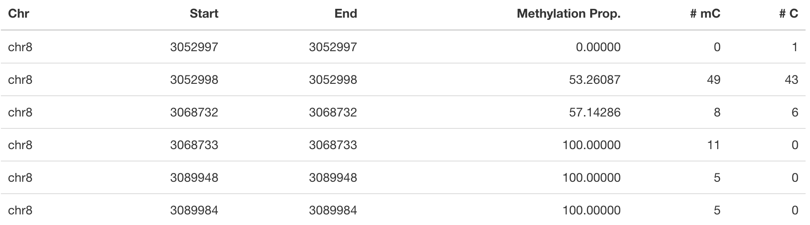
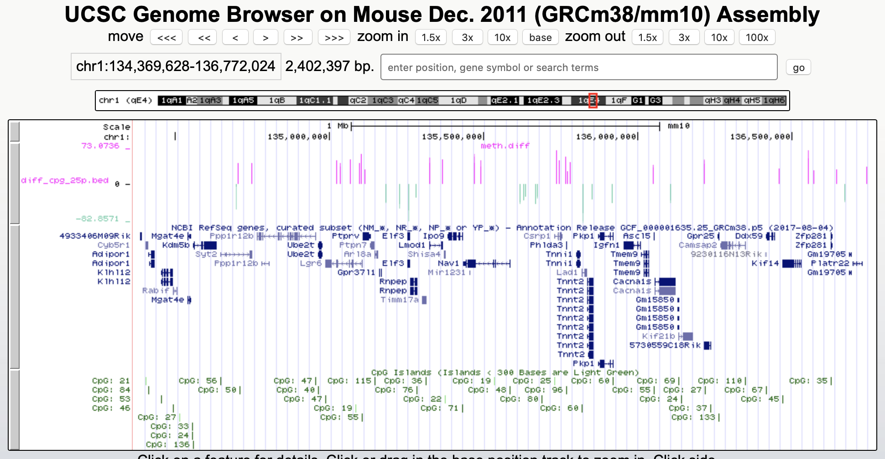

```{r setup, include=FALSE}
knitr::opts_chunk$set(echo = TRUE, message = FALSE, warning = FALSE, eval=FALSE)
```


# Introduction

Since its first use in 1992, bisulfite (BS) sequencing of DNA has become the gold standard for analysis of DNA methylation due to the potential whole-genome coverage and single-base resolution. BS treatment of DNA leads to the conversion of unmodified cytosines to uracil whilst maintaining 5mC unchanged, which, after PCR and sequencing, can be mapped at single base resolution. More recently, BS treatment has been coupled with next generation sequencing (NGS) to yield reduced representation (RRBS) or whole genome (WGBS) data on the global genomic distribution of 5mC. The benefits of WGBS is that it typically reaches a coverage >90% of the CpGs in the human genome in unbiased representation. It allows identification of non-CG methylation as well as identification of partially methylated domains, low methylated regions at distal regulatory elements and DNA methylation valleys in embryonic stem cells. Despite its advantages, WGBS remains the most expensive technique and usually is not applied to large number of samples and requires relatively large quantities of DNA. The reduced representation bisulfite sequencing (RRBS) is another technique, which can also profile DNA methylation at single-base resolution. It combines digestion of genomic DNA with restriction enzymes and sequencing with bisulfite treatment in order to enrich for areas with a high CpG content. Therefore it relies first on digestion of genomic DNA with restriction enzymes, such as MspI which recognises 5’-CCGG-3’ sequences and cleaves the phosphodiester bonds upstream of CpG dinucleotide. It can sequence only CpG dense regions and doesn’t interrogate CpG-deficient regions such as functional enhancers, intronic regions, intergenic regions or in general lowly methylated regions of the genome. 

In comparison to regular DNA sequencing, bisulfite sequencing brings with it some peculiarities. Since BS-seq changes unmethylated cytosines (C) over uracils (U) to thymines (T), subsequent steps for analysis aim for counting the number of C to T conversions and quantifying the methylation proportion per base. This is simply done by identifying C-to-T conversions in the aligned reads and dividing number of Cs by the sum of Ts and Cs for each cytosine in the genome. Being able to do the quantification reliably depends on rigorous quality control before alignment, the choice of alignment method and post-alignment quality control. 


The most obvious one is that to quantify methylation of DNA, bisulfite converted reads have to be compared to an _in silico_ bisulfite-converted genome sequence, referred to as the reference genome, to allow accurate mapping. At each CpG site in the reference genome, an aligned read is called as unmethylated if the sequence is TG (indicating bisulfite conversion) and methylated if the sequence is CG (indicating protection by the methyl group). Other issues to consider are the reduced complexity and the increased degradation that occurs during bisulfite treatment. A best-practices pipeline for the mapping and quantification of bisulfite converted reads has been developed by nf-core (see [methylseq](https://nf-co.re/methylseq)). On Thursday, the use of this and other pipelines through nf-core will be extensively demonstrated. Therefore, in this tutorial we will focus on the downstream analysis, i.e. the part of the analysis after running for example methylseq. 

# Load Packages

Workflows for the downstream analysis of BS data are in general less standardized than those for the analysis of array data and might require a somewhat more advanced knowledge of R to make the most of the data. The workflow we will present today is based on the _methylKit_ R package. This package has been developed as a comprehensive package for the analysis of genome-wide DNA methylation profiles providing functions for clustering, sample quality visualization, differential methylation analysis and feature annotation. 

Start by loading the required packages.

```{r}
# Main analysis package
library("methylKit")
# Annotation package
library("genomation")
```

NOTE: _methylKit_ has an active discussion group [here](https://groups.google.com/g/methylkit_discussion), if you have questions regarding the package and/or analysis.

# Datasets

To showcase a basic analysis, a small dataset has been collected consisting of mouse mammary gland cells. The epithelium of the mammary gland exists in a highly dynamic state, undergoing dramatic changes during puberty, pregnancy, lactation and regression. Characterization of the lineage hierarchy of cells in the mammary epithelium is an important step toward understanding which cells are predisposed to oncogenesis. In this study, the methylation status of two major functionally distinct epithelial compartments: basal and luminal cells were studied. We have 4 Bismark coverage files in total; 2 basal samples and 2 luminal samples. These files contain information about the location of each CpG and the number of reads corresponding to a methylated or unmethylated cytosine (see Table 1 for example). These type of coverage files are a standard output of the bisulfite read mapper Bismark which is a part of the methylseq nf-core pipeline. 


*Table 1: Example of a Bismark coverage files. One of the input types fit for methylKit.*


# Load Datasets

The samples we will be using as input files are Bismark coverage files, which need to be collected in a list R object prior to be loaded in _methylKit_ using the _methRead_ function. Important is that you supply sample location, sample IDs and the genome assembly. Moreover, you should supply which pipeline was used to produce the input files and a _treatment_ parameter indicating which sample is "control" or "0" and which is "test" or "1". Additionally, you can define a minimum read coverage for CpG sites to be included in the object. Depending on the type of input data, additional parameters are available.

NOTE: don't forget to check _?methRead_ for more info about parameter options.

```{r}
# Define the list containing the bismark coverage files.
file.list <- list("Data/P6_1.bismark.cov.gz", 
                  "Data/P6_4.bismark.cov.gz", 
                  "Data/P8_3.bismark.cov.gz", 
                  "Data/P8_6.bismark.cov.gz")

# read the listed files into a methylRawList object making sure the other parameters are filled in correctly.
myobj <- methRead(file.list,
           sample.id=list("Luminal_1","Luminal_2","Basal_1","Basal_2"),
           pipeline = "bismarkCoverage",
           assembly="mm10",
           treatment=c(1,1,0,0),
           mincov = 10
           )
myobj
```

This will result in _methylRawList_ object containing the data and metadata. What do the columns "numCs" and "numTs" in each sample correspond to?

# Descriptive Statistics

With all data collected, we can now have a look at some basic statistics per sample, such as the percentage methylation and coverage. For this, the functions _getMethylationStats_ and _getCoverageStats_ can be used. These stats can be plotted for each strand separately, but since Bismark coverage files do not include the strand origins of each CpG, the _both.strands_ parameter has to be set to FALSE.  _myobj_ is basically a list object in R so by changing the number in the double brackets, you can specify a certain sample. Have a look at the stats for the 4 different different samples. Do they look as expected? 

```{r}
# Get a histogram of the methylation percentage per sample
getMethylationStats(myobj[[1]], plot=TRUE, both.strands=FALSE)
# Get a histogram of the read coverage per sample
getCoverageStats(myobj[[1]], plot=TRUE, both.strands=FALSE)
```

Typically, percent methylation histogram should have two peaks on both ends. In any given cell, any given cytosine is either methylated or not. Therefore, looking at many cells should yield a similar pattern where we see lots of locations with high methylation and lots of locations with low methylation and a lower number of locations with intermediate methylation.

Experiments that are highly suffering from PCR duplication bias will have a secondary peak towards the right hand side of the coverage histogram.

# Filter Step

It might be useful to filter samples based on coverage. In particular, if our samples are suffering from PCR bias it would be useful to discard bases with very high read coverage. Furthermore, we would also like to discard bases that have low read coverage, because a high enough read coverage will increase the power of the statistical tests. The code below filters a _methylRawList_ and discards bases that have coverage below 10 reads (in this case we already did this when reading in the files...) and also discards the bases that have more than 99.9th percentile of coverage in each sample.

```{r}
myobj.filt <- filterByCoverage(myobj,
                      lo.count=10,
                      lo.perc=NULL,
                      hi.count=NULL,
                      hi.perc=99.9)
```

Next, a basic normalization of the coverage values between samples is performed by using a scaling factor derived from differences between the median of the coverage distributions.

```{r}
myobj.filt.norm <- normalizeCoverage(myobj.filt, method = "median")
```

# Merge Data

In order to do further analysis, we will need to extract the bases that are covered in all samples. The following function will merge all samples to one object with base-pair locations that are covered in all samples. Setting _destrand=TRUE_ (the default is _FALSE_) will merge reads on both strands of a CpG dinucleotide. This provides better coverage, but only advised when looking at CpG methylation (for CpH methylation this will cause wrong results in subsequent analyses; can you figure out why?). In addition, setting _destrand=TRUE_ will only work when operating on base-pair resolution, otherwise setting this option _TRUE_ will have no effect. Our data contains no strand info, so the _destrand_ option is not applicable. The _unite_ function will return a _methylBase_ object which will be our main object for all comparative analysis. The _methylBase_ object contains methylation information for regions/bases that are covered in all samples.

```{r}
meth <- unite(myobj.filt.norm, destrand=FALSE)
meth
```


# Filter Data

We might need to filter the CpGs further before exploratory analysis and the downstream differential methylation. For exploratory analysis, it is of general interest to see how samples relate to each other and we might want to remove CpGs that are not variable before doing that. For differential methylation, removing non variable CpGs prior to the analysis will lower the number of tests that needs to be performed, thus improving multiple correction.

```{r}
# get percent methylation matrix
pm=percMethylation(meth)

# calculate standard deviation of CpGs
sds=matrixStats::rowSds(pm)

# Visualize the distribution of the per-CpG standard deviation
hist(sds)

# keep only CpG with standard deviations larger than 5%
meth <- meth[sds > 5]
```


# Data Structure/Outlier Detection

We can check the correlation between samples using _getCorrelation_. This function will either plot scatter plot and correlation coefficients or just print a correlation matrix if _plot=FALSE_. What does this plot tell you about the structure in the data?

```{r}
getCorrelation(meth,plot=TRUE)
```

The data structure can further be visualized in a dendrogram using hierarchical clustering of distance measures derived from each samples' percentage methylation. Check _?clusterSamples_ to see which distance measures and clustering methods are available.

```{r}
clusterSamples(meth, dist="correlation", method="ward", plot=TRUE)
```

Another very useful visualization is obtained by plotting the samples in a principal component space. Using this kind of PCA plot we project multidimensional data (i.e. we have as many dimensions in this data as there are CpG loci in _meth_) into 2 or 3-dimensional space while at the same time maintaining as much variation in the data as possible. Samples that are more alike will be clustered together in PC space, so by looking at this plot we can see what is the largest source of variation in data and whether there are sample swaps and/or outlier samples. _PCASamples_ is a function in _methylKit_ that will perform PCA and plot the first two principal components. What does the PCA plot of our dataset tell you? What is the biggest source of variation on the data? Does it look samples are swapped? Do there seem to be outliers among the samples?

```{r}
PCASamples(meth)
```

# Differential Methylation

### Single CpG Sites

If the basic statistics of the samples look OK and the data structure seems reasonable, we can proceed to the differential methylation step. Differential DNA methylation is usually calculated by comparing the proportion of methylated Cs in a test sample relative to a control. In simple comparisons between such pairs of samples (i.e. test and control), methods such as Fisher’s Exact Test can be applied when there are no replicates for test and control cases. If replicates are available, regression based methods are generally used to model methylation levels in relation to the sample groups and variation between replicates. In addition, an advantage of regression methods over Fisher's exact test is that it allows for the inclusion of sample specific covariates (continuous or categorical) and the ability to adjust for confounding variables. 

The _calculateDiffMeth_ function is the main function to calculate differential methylation in the _methylKit_ package. Depending on the sample size per each set it will either use Fisher’s exact or logistic regression to calculate P-values. In practice, the number of samples per group will determine which of the two methods will be used (logistic regression or Fisher's exact test). If there are multiple samples per group, _methylKit_ will employ the logistic regression test. Otherwise, when there is one sample per group, Fisher's exact test will be used. P-values will automatically be corrected for multiple testing using the Benjamini-Hochberg FDR method. 

In its simplest form, where there are no covariates, the logistic regression will try to model the log odds ratio which is based on the methylation proportion of a CpG, $\pi_i$, using the treatment vector which denotes the sample group membership for the CpGs in the model. Below, the “Treatment” variable is used to predict the log-odds ratio of methylation proportions.

$$log(\pi_i/(1-\pi_i)) = \beta_0 + \beta_1*Treatment_i$$
The logistic regression model is fitted per CpG and we test if the treatment has any effect on the outcome variable or not. In other words, we are testing if $log(\pi_i/(1-\pi_i)) = \beta_0 + \beta_1*Treatment_i$ is a “better” model than $log(\pi_i/(1-\pi_i)) = \beta_0$.

The following code tests for the differential methylation of our dataset; i.e comparing methylation levels between "treatment" (or Luminal samples) and "control" (Basal smaples). Since the example data has replicates, logistic regression will be used.

```{r}
# Test for differential methylation... This might take a few minutes.
myDiff <- calculateDiffMeth(meth, 
                            overdispersion = "MN", 
                            adjust="BH")
myDiff
```

The output of _calculateDiffMeth_ is a _methylDiff_ object containing information about the difference in percentage methylation between treatment and control, and the p- and q-value of the model for all CpG sites. 
Visualize the number of hyper- and hypomethylation events per chromosome, as a percent of the sites with the minimum coverage and differential. By default this is a 25% change in methylation and all samples with 10X coverage.

```{r}
# Overview of percentage hyper and hypo CpGs per chromosome.
diffMethPerChr(myDiff)
```

After q-value calculation, we can select the differentially methylated regions/bases based on q-value and percent methylation difference cutoffs of Treatment versus control. Following bits of code selects the bases that have q-value < 0.01 and percent methylation difference larger than 25%. If you specify _type="hyper"_ or _type="hypo"_ options, you will extract the hyper-methylated or hypo-methylated regions/bases.

```{r}
# get hyper methylated bases and order by qvalue
myDiff25p.hyper <- getMethylDiff(myDiff,
                              difference=25,
                              qvalue=0.01,
                              type="hyper")
myDiff25p.hyper <- myDiff25p.hyper[order(myDiff25p.hyper$qvalue),]

# get hypo methylated bases and order by qvalue
myDiff25p.hypo <- getMethylDiff(myDiff,
                             difference=25,
                             qvalue=0.01,
                             type="hypo")
myDiff25p.hypo <- myDiff25p.hypo[order(myDiff25p.hypo$qvalue),]

# get all differentially methylated bases and order by qvalue
myDiff25p <- getMethylDiff(myDiff,
                        difference=25,
                        qvalue=0.01)
myDiff25p <- myDiff25p[order(myDiff25p$qvalue),]
```

NOTE: If you need to interact with these objects, it is sometimes necessary to first extract the data using the _getData_ function.

If necessary, covariates (such as age, sex, smoking status, ...) can be included in the regression analysis. The function will then try to separate the influence of the covariates from the treatment effect via the logistic regression model. In this case, the test would be whether the full model (model with treatment and covariates) is better than the model with the covariates only. If there is no effect due to the treatment (sample groups), the full model will not explain the data better than the model with covariates only. In _calculateDiffMeth_, this is achieved by supplying the covariates argument in the format of a dataframe. 

### CpG Annotation

To help with the biological interpretation of the data, we will annotate the differentially methylated regions/bases using the _genomation_ package. The most common annotation task is to see where CpGs of interest land in relation to genes and gene parts and regulatory regions: Do they mostly occupy promoter, intronic or exonic regions? Do they overlap with repeats? Do they overlap with other epigenomic markers or long-range regulatory regions? In this example, we read the gene annotation information from a BED file (Browser Extensible Data - genome coordinates and annotation) and annotate our differentially methylated regions with that information using _genomation_ functions. 

NOTE: The annotation tables used below (.bed files) can be downloaded from the [UCSC TableBrowser](https://genome.ucsc.edu/cgi-bin/hgTables). 

- For gene annotation, select "Genes and Gene prediction tracks" from the "group" drop-down menu. Following that, select "Refseq Genes" from the "track" drop-down menu. Select "BED- browser extensible data" for the "output format". Click "get output" and on the following page click "get BED" without changing any options. Save the output as a text file.

- For CpG island annotation, select "Regulation" from the "group" drop-down menu. Following that, select "CpG islands" from the "track" drop-down menu. Select "BED- browser extensible data" for the "output format". Click "get output" and on the following page click "get BED" without changing any options. Save the output as a text file.

```{r}
# First load the annotation data; i.e the coordinates of promoters, TSS, intron and exons
refseq_anot <- readTranscriptFeatures("Data/mm10.refseq.genes.bed")

# Annotate hypermethylated CpGs ("target") with promoter/exon/intron information ("feature"). This function operates on GRanges objects, so we first coerce the methylKit object to GRanges. 
myDiff25p.hyper.anot <- annotateWithGeneParts(target = as(myDiff25p.hyper,"GRanges"),
                                       feature = refseq_anot)

# Summary of target set annotation
myDiff25p.hyper.anot
```

This function creates an _AnnotationByGeneParts_ object, containing - for each target CpG - data such as the nearest transcription start site and the genomic structure it is located on. Several accessor functions from the _genomation_ package allow for interaction with such an object.

```{r}
# View the distance to the nearest Transcription Start Site; the target.row column in the output indicates the row number in the initial target set
dist_tss <- getAssociationWithTSS(myDiff25p.hyper.anot)
head(dist_tss)

# See whether the differentially methylated CpGs are within promoters,introns or exons; the order is the same as the target set
getMembers(myDiff25p.hyper.anot)

# This can also be summarized for all differentially methylated CpGs
plotTargetAnnotation(myDiff25p.hyper.anot, main = "Differential Methylation Annotation")
```

Similarly, it is possible to annotate the differentially methylated CpGs with CpG Island membership using _readFeatureFlank_. Using this function you read from a BED file with feature info (here the location of the CpG Islands) and with the flank parameter you can define a region around these features (here the "shores" are defined as 2000 bases around the Islands).

```{r}
# Load the CpG info
cpg_anot <- readFeatureFlank("Data/mm10.cpg.bed", feature.flank.name = c("CpGi", "shores"), flank=2000)
diffCpGann <- annotateWithFeatureFlank(as(myDiff25p,"GRanges"), feature = cpg_anot$CpGi, flank = cpg_anot$shores, feature.name = "CpGi", flank.name = "shores")

# See whether the CpG in myDiff25p belong to a CpG Island or Shore
head(getMembers(diffCpGann))

# This can also be summarized for all differentially methylated CpGs
plotTargetAnnotation(diffCpGann, main = "Differential Methylation Annotation")
```

In general, this workflow can be used to annotate a CpG list with any set of features contained in a BED file.

### Differentially Methylated Regions

Since we are often more interested in the different methylation of multiple CpGs across samples instead of a single site, we can also summarize methylation information over a set of defined functional regions such as promoters or CpG islands. The function below summarizes the methylation information over a given set of CpG Islands and outputs a _methylRaw_ or _methylRawList_ object depending on the input. We are using the output of _genomation_ functions used above to provide the locations of the Islands. For these regional summary functions, we need to provide regions of interest as GRanges object.

```{r}
# Summarize the original object counts over a certain region, here the CpG Islands
myobj_islands <- regionCounts(myobj, cpg_anot$CpGi)
# Filter the summarized counts by coverage
myobj_islands_filt <- filterByCoverage(myobj_islands,
                      lo.count=10,
                      lo.perc=NULL,
                      hi.count=NULL,
                      hi.perc=99.9)
# Perform simple normalization
myobj_islands_filt_norm <- normalizeCoverage(myobj_islands_filt, method = "median")
# Merge the samples again
meth_islands <- unite(myobj_islands_filt_norm, destrand=FALSE)
```

Now, differential methylation is performed as for the single CpGs.

```{r}
# Test for differential methylation... This might take a few minutes.
myDiff_islands <- calculateDiffMeth(meth_islands)
# Rank by significance
myDiff_islands <- myDiff_islands[order(myDiff_islands$qvalue),]
# get all differentially methylated CpG Islands
myDiff_islands_25p <- getMethylDiff(myDiff_islands,difference=25,qvalue=0.01)
```

And just like for the single CpGs, annotation using the _genomation_ functions is possible.

```{r}
myDiff_islands_25p_ann <- annotateWithGeneParts(as((myDiff_islands_25p), "GRanges"), refseq_anot)
# View the distance to the nearest Transcription Start Site; the target.row column indicates the row number in myDiff_islands_25p
head(getAssociationWithTSS(myDiff_islands_25p_ann))
```


# Visualization

The results of a differential analysis can be exported as a bedGraph; a format that allows display of continuous-valued data in track format. This display type is useful for probability scores, percentages and transcriptome data. By uploading this BED file to a genome browser such as the [UCSC Genome Browser](https://genome.ucsc.edu/cgi-bin/hgTracks?db=mm10&lastVirtModeType=default&lastVirtModeExtraState=&virtModeType=default&virtMode=0&nonVirtPosition=&position=chr1%3A134369628%2D136772024&hgsid=936224469_kTHLULnq2frGTQtwufy02ky7TjXA), you can create custom visualizations of the genome architecture surrounding CpGs or regions of interest. The _bedgraph_ function produces a UCSC compatible file; by specifying the _col.name_ the exact information to be plotted can be collected. For a _methylDiff_ object this can be one of "pvalue", "qvalue" or "meth.diff".

```{r}
bedgraph(myDiff25p, col.name = "meth.diff", file.name = "diff_cpg_25p.bed")
```

A tutorial of the Genome Browser is out of scope for this workshop; but a step-by-step approach for visualizing your own data tracks can be found [here](https://genome.ucsc.edu/goldenPath/help/hgTracksHelp.html#CustomTracks). An example of such a custom visualization of the methylation difference between treatment and control can be seen in Figure 1. Notice how differentially methylated CpGs tend to group together in similarly regulated regions.



*Figure 1: UCSC Genome Browser example with three main annotation tracks. Upper track: percentage methylation difference between treatment and control samples for significantly differential methylated CpGs. Middle track: RefSeq gene structure. Lower track: CpG Island location.*


Exactly how to produce these plots is out of the scope of these exercises, but I encourage you to try it later with for example the bedgraph of all differentially methylated CpGs.

# Alternative workflows

DSS beta-binomial models with empirical Bayes for moderating dispersion.
BSseq Regional differential methylation analysis using smoothing and linear-regression-based tests.
BiSeq Regional differential methylation analysis using beta-binomial models.
MethylSeekR: Methylome segmentation using HMM and cutoffs.
QuasR: Methylation aware alignment and methylation calling, as well as fastQC-like fastq raw data quality check features.

