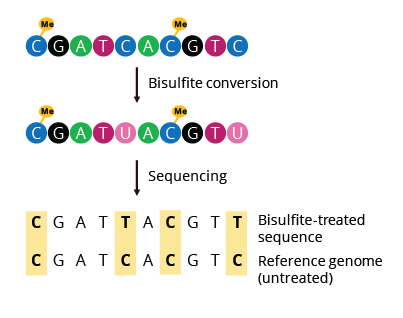
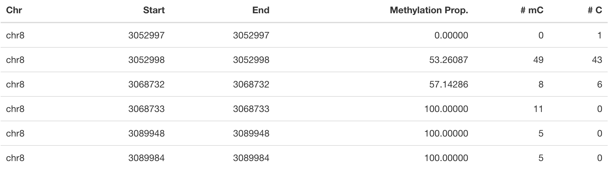
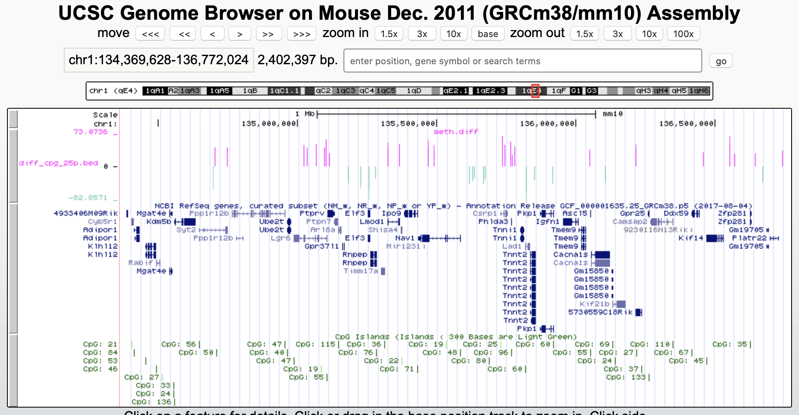

DNA Methylation: Bisulfite Sequencing Workflow
==============================================

**Learning Outcomes**

During this tutorial, you will learn how to use the *methylKit* R package to perform a basic bisulfite sequencing data analysis: loading data, basic quality control and filtering, data exploration and differential methylation at the CpG and regional level.

.. Contents
.. ========

.. contents:: 
    :local:

Introduction
------------

Since its first use in 1992, bisulfite (BS) sequencing of DNA has become the gold standard for analysis of DNA methylation due to the potential whole-genome coverage and single-base resolution. 

There are different protocols available to assess DNA methylation using NGS. The easiest way is to add the bisulfite reaction to the sequencing workflow and do Whole-Genome Bisulfite Sequencing (WGBS). However, this requires sufficient read depths to reliably determine methylation status. When working on an organism with a large genome size, this can lead to high costs for sequencing. The benefits of WGBS are that it typically reaches a coverage >90% of the CpGs in the human genome in unbiased representation. It allows identification of non-CG methylation as well as identification of partially methylated domains, low methylated regions at distal regulatory elements and DNA methylation valleys in embryonic stem cells. Despite its advantages, WGBS remains the most expensive technique and is usually not applied to a large number of samples. 

As an alternative, one could focus the detection of DNA methylation to a specific subset of the genome, thereby reducing the data volume of the experiment and subsequently the cost. One popular approach to this is Reduced Representation Bisulfite Sequencing (RRBS). The fundamental idea of RRBS is to get a “reduced representation" of the genome, with a focus on CpG islands. This involves the addition of restriction enzymes to digest the DNA during the fragmentation step. Typically, the enzyme MspI is used which is methylation insensitive. It cuts at 5’-CCGG-3’ sites, and since the genome is largely depleted of CpGs except for promoters/CpG islands, the "reduced representation" is largely capturing only these promoter regions for further analysis.

Regardless of the approach, the rationale behind bisulfite sequencing is fairly simple. Bisulfite treatment changes unmethylated cytosine (C) via uracil (U) to thymine (T), while methylated cytosines are protected from this conversion. Quantification of methylation is thus simply done by identifying C-to-T conversions in the aligned bisulfite treated reads and dividing the number of Cs by the sum of Ts and Cs for each cytosine in the genome. 

*Fig. 1: Bisulfite sequencing overview.*

Being able to do this quantification reliably depends on rigorous quality control before alignment, the choice of alignment method and post-alignment quality control. Other issues to consider are the reduced complexity and the increased degradation that occurs during bisulfite treatment.  A best-practices pipeline for the mapping and quantification of bisulfite converted reads has been developed by nf-core (see `methylseq <https://nf-co.re/methylseq>`_\ ). On Thursday, the use of this and other pipelines through nf-core will be extensively demonstrated. Therefore, in this tutorial we will focus on the downstream analysis, i.e. the part of the analysis after running for example nf-core methylseq. 

Datasets
--------

To showcase a basic analysis, a small set of samples has been collected consisting of mouse mammary gland cells. The epithelium of the mammary gland exists in a highly dynamic state, undergoing dramatic changes during puberty, pregnancy, lactation and regression. Characterization of the lineage hierarchy of cells in the mammary epithelium is an important step toward understanding which cells are predisposed to oncogenesis. 

In this study, the methylation status of two major functionally distinct epithelial compartments: basal and luminal cells were studied. We have 4 Bismark coverage files in total; 2 basal samples and 2 luminal samples. These files contain information about the location of each CpG and the number of reads corresponding to a methylated or unmethylated cytosine (see Table 1 for example). 

.. note::
   In this tutorial we will be focusing on the downstream analysis of bisulfite sequencing data. Preprocessing steps such as mapping bisulfite treated sequencing reads to a genome and perform methylation calls need to be performed prior to this analysis. Here, we will start from coverage files.These type of coverage files are a standard output of the bisulfite read mapper Bismark which is a part of the `methylseq nf-core pipeline <https://nf-co.re/methylseq>`_. On Thursday, you will learn how to work with these type of nf-core pipelines! 

*Table 1: Example of a Bismark coverage files. One of the input types fit for methylKit.*

Set Up R environment
--------------------

.. note::

   If your session from the Array tutorial is still open, you can continue this exercise in that one. Otherwise set up the environment as you did this morning.

This exercise has been set up to run on Uppmax, so connect to the server as described in :doc:`../setup/lab-setup`. Now, there are two options to set up the R environment. 

**Option A**

The easiest option makes use of the module system on Uppmax. This is the best way to avoid problems with dependencies between packages and avoids the issue of missing system libraries. Sometimes, this option suffers from slow response times when using Rstudio or has issues rendering figures. Becuse of the easy setup it might still be worth trying out this option first.

On Uppmax, most packages are already installed, and can be loaded into R after the *R/4.0.0* and  *R_packages/4.0.0* modules have been loaded. If you are running on Uppmax, start by loading the following modules:

.. code-block:: bash

   module load R/4.0.0
   module load R_packages/4.0.0
   module load RStudio

Start the analysis by initiating *RStudio*... This might take a few seconds and a :code:`libGL error` can be shown before loading the RStudio graphical interface.

.. code-block:: bash

   rstudio

.. note::

   If rstudio runs too slow, you could also decide to run the whole tutorial in the normal R terminal. Instead of ``rstudio`` do

   .. code-block:: bash

      R

   If you do this, you might have to take a few extra steps to show the graphics produced by R. First, check if plotting works by trying ``plot(1:10)`` in the R terminal. If you see the plot, you are good to start the tutorial. If not and you are on Mac; install and open `Xquartz  <https://www.xquartz.org>`_ on your Mac before ssh-ing to rackham. If you are on a PC, follow the instructions on `this website <https://uisapp2.iu.edu/confluence-prd/pages/viewpage.action?pageId=280461906>`_ (under the section "Alternate methods using OS-soecific tools").

Next, run the R commands by copying them from this website into the Rstudio terminal or R terminal and pressing *Enter*. 

**Option B**

Alternatively, we provide a containerized environment consisting of R, Rstudio and the necessary packages for this session. Containers are a relatively new method to package software together with all its dependencies and an operating system. This means the software can easily run within the container on almost any computer or server, greatly simplifying software installation and management. Containers will be discussed in a bit more detail on Thursday. A benefit of using it here is that Rstudio runs a whole lot faster using the container approach. However, to access it from Uppmax, a few more steps are necessary. First, make sure you are connected to your alloted node (described in :doc:`../setup/lab-setup`) and then perform following steps.

.. code-block:: bash

   # Run the startup script; this will start the container and run Rstudio
   sh /sw/courses/epigenomics/DNAmethylation/startup_script.sh

You should see something like this:

.. code-block:: bash

   1. SSH tunnel from your workstation using the following command:

   ssh -N -L 8787:r37.uppmax.uu.se:35616 vincent@rackham.uppmax.uu.se
   
   and point your web browser to http://localhost:8787

   2. log in to RStudio Server using the following credentials:

   user: vincent
   password: epi2021

Now, open a second terminal and run **your** ssh command from 1. Then open your web browser (Safari, Chrome, ...) and go to http://localhost:8787. Here, fill in **your** user and password as in 2. and Rstudio will start.

**Load Libraries**

Workflows for the downstream analysis of Bisulfite sequencing data are in general less standardized than those for the analysis of array data and might require a somewhat more advanced knowledge of R to make the most of the data. The workflow we will present today is based on the `methylKit <https://bioconductor.org/packages/release/bioc/html/methylKit.html>`_ R package. This package has been developed as a comprehensive package for the analysis of genome-wide DNA methylation profiles providing functions for clustering, sample quality visualization and differential methylation analysis. `genomation <https://www.bioconductor.org/packages/release/bioc/vignettes/genomation/inst/doc/GenomationManual.html>`_ will be used to perform feature annotation. 

Start by loading the required packages.

.. code-block:: r

   # Set the correct library path.
   # Do NOT do this if setting up the environment with option B, only option A
   # If you accidently do run the following line with option B, you can do *Session -> Restart R*
   # and run again without this line.
   .libPaths("/sw/apps/R_packages/4.0.0/rackham")
   # Main analysis package
   library("methylKit")
   # Annotation package
   library("genomation")
   library("GenomicRanges")

.. note::
   *methylKit* has an active discussion group `here <https://groups.google.com/g/methylkit_discussion>`_\ , if you have further questions regarding the package and/or analysis.

Load Datasets
-------------

As mentioned above, the samples we will be using as input files are Bismark coverage files, which need to be collected in a list R object prior to be loaded in *methylKit* using the ``methRead`` function. The data files have been uploaded to Uppmax before. Important is that you supply sample location, sample IDs and the genome assembly. Moreover, you should supply which pipeline was used to produce the input files and a ``treatment`` parameter indicating which sample is "control" or "0" and which is "test" or "1". Additionally, you can define a minimum read coverage for CpG sites to be included in the object with ``mincov``. Depending on the type of input data, additional parameters are available.

.. note:: 
   Don't forget to check ``?methRead`` for more info about parameter options.

.. code-block:: r

   # Define the list containing the bismark coverage files.
   file.list <- list(
      "/sw/courses/epigenomics/DNAmethylation/biseq_data/P6_1.bismark.cov.gz", 
      "/sw/courses/epigenomics/DNAmethylation/biseq_data/P6_4.bismark.cov.gz", 
      "/sw/courses/epigenomics/DNAmethylation/biseq_data/P8_3.bismark.cov.gz", 
      "/sw/courses/epigenomics/DNAmethylation/biseq_data/P8_6.bismark.cov.gz")

   # read the listed files into a methylRawList object making sure the other 
   # parameters are filled in correctly.
   myobj <- methRead(file.list,
              sample.id=list("Luminal_1","Luminal_2","Basal_1","Basal_2"),
              pipeline = "bismarkCoverage",
              assembly="mm10",
              treatment=c(1,1,0,0),
              mincov = 10
              )
   
   # check number of samples
   myobj

   # What type of data is stored here?
   head(myobj[[1]])

This will result in ``methylRawList`` object containing the data and metadata. What do the columns "numCs" and "numTs" in each sample correspond to? Can you see how many CpG sites are included in each sample?

.. note::

   If you prefer to run this tutorial locally, you can also download these data filesto your personal computer. To do this, navigate to the folder on your own conputer where you want to deposit the data and execute :code:`scp -r <username>@rackham.uppmax.uu.se:/sw/courses/epigenomics/DNAmethylation/biseq_data .`. Of course, you will also have to install the analysis packages locally!

Descriptive Statistics
----------------------

With all data collected in a single object, we can now have a look at some basic statistics per sample, such as the percentage methylation and coverage. For this, the functions ``getMethylationStats`` and ``getCoverageStats`` can be used. These stats can be plotted for each strand separately, but since Bismark coverage files do not include the strand origins of each CpG, the ``both.strands`` parameter has to be set to FALSE.  ``myobj`` is basically a list object in R so by changing the number in the double brackets, you can specify a certain sample. Have a look at the stats for the 4 different different samples. Do they look as expected? 

.. code-block:: r

   # Get a histogram of the methylation percentage per sample
   # Here for sample 1
   getMethylationStats(myobj[[1]], plot=TRUE, both.strands=FALSE)

Typically, percentage methylation histograms should have peaks on both ends of the distribution. In any given cell, any given cytosine is either methylated or not. Therefore, looking at many cells should yield a similar pattern where we see lots of locations with high methylation and lots of locations with low methylation and a lower number of locations with intermediate methylation. Because bisulfite sequencing has a relatively high error rate, samples between 0% and 10% are usually classified as "unmethylated", and samples between 90% and 100% are classified as "fully methylated", although these thresholds are not fixed.

.. code-block:: r

   # Get a histogram of the read coverage per sample
   getCoverageStats(myobj[[1]], plot=TRUE, both.strands=FALSE)
   # Get percentile data by setting plot=FALSE
   getCoverageStats(myobj[[1]], plot=FALSE, both.strands=FALSE)

Experiments that are suffering from PCR duplication bias will have a secondary peak towards the right hand side of the coverage histogram.

Filter Step
-----------

It might be useful to filter samples based on coverage. In particular, if samples are suffering from PCR bias or overamplification it could be useful to discard bases with very high read coverage. Furthermore, we would also like to discard bases that have very low read coverage, because these tend to produce unreliable and unstable statistics in the downstream analysis. The code below filters a ``methylRawList`` and discards bases that have coverage below 10 reads (in this case we already did this when reading in the files...) and also discards the bases that have more than 99.9th percentile of coverage in each sample.

.. code-block:: r

   myobj.filt <- filterByCoverage(myobj,
                         lo.count=10,
                         lo.perc=NULL,
                         hi.count=NULL,
                         hi.perc=99.9)

Normalization
-------------

Next, a basic normalization of the coverage values between samples is performed by using a scaling factor derived from differences between the median of the coverage distributions. In the dowstream differential analysis, we will be comparing methylation fractions between samples, so one could think that sequence depth would not matter all that much. After all, 40/80 (mC/C) reads is the same fraction as 400/800 (mC/C) reads. However, certain statistical tests (i.e. Fisher's exact test) will result in different p-values depending on the total number of reads. Thus, if the coverage is quite similar across the samples, this step is not really essential, otherwise it might be a good idea to normalize the data. 

.. code-block:: r

   myobj.filt.norm <- normalizeCoverage(myobj.filt, method = "median")

Merge Data
----------

In order to do further analysis, we will need to extract the bases that are covered by reads in all our samples. The following function will merge all samples to one object with base-pair locations that are covered in all samples. Setting ``destrand=TRUE`` (the default is ``FALSE``) will merge reads on both strands of a CpG dinucleotide. This provides better coverage, but only advised when looking at CpG methylation (for CpH methylation this will cause wrong results in subsequent analyses; can you figure out why?). In addition, setting ``destrand=TRUE`` will only work when operating on base-pair resolution, otherwise setting this option ``TRUE`` will have no effect. Our data contains no strand info, so the ``destrand`` option is not applicable. The ``unite`` function will return a ``methylBase`` object which will be our main object for all comparative analysis. The ``methylBase`` object contains methylation information for regions/bases that are covered in all samples.

.. code-block:: r

   meth <- unite(myobj.filt.norm, destrand=FALSE)
   meth

How many bases were kept for downstream analysis?

Further Filtering
-----------------

High-throughput methylation data contains a lot of CpG sites that have no or little variation among study subjects and are not all that informative for downstream analyses. Nonspecific CpG filtering (i.e., not considering phenotype) is a common dimension reduction procedure performed prior to cluster analysis and differential methylation. For exploratory analysis, it is of general interest to see how samples relate to each other and we might want to remove CpGs that are not variable before doing that. For differential methylation, removing non variable CpGs prior to the analysis will lower the number of tests that needs to be performed, thus reducing multiple correction penalties.

The most commonly used and simple method of standard deviation filtering on methylation ratio values (equivalent to Beta values) has been shown to be robust and consistent to different real datasets and would suffice for most occasions.

.. code-block:: r

   # get percent methylation matrix
   pm=percMethylation(meth)

   # calculate standard deviation of CpGs
   sds=matrixStats::rowSds(pm)

   # Visualize the distribution of the per-CpG standard deviation
   # to determine a suitable cutoff
   hist(sds, breaks = 100)

   # keep only CpG with standard deviations larger than 2%
   meth <- meth[sds > 2]

   # This leaves us with this number of CpG sites
   nrow(meth)

We can further remove known C -> T mutations. These locations should be removed from the analysis as they do not represent true bisulfite-treatment-associated conversions. Mutation locations can be stored in a GRanges object, and we can use that to remove the CpGs overlapping with the mutations. In order to do the overlap operation, we will convert the methylKit object to a GRanges object and do the filtering with the ``%over%`` function. The returned object will still be a methylKit object.

.. code-block:: r

   # give the locations of 2 example SNPs
   mut <- GRanges(seqnames=c("chr1","chr18"),
            ranges=IRanges(start=c(3020690, 9853326),
                           end=c(3020690,9853326)))

   # select CpGs that do not overlap with mutations
   meth <- meth[!as(meth,"GRanges") %over% mut, ]

.. note::

   In this example only 2 SNP are removed. If you would like to remove more SNPs, you will have to create an adequate GRanges object. A full description of this is a bit out of the scope of this workshop but one way to do this is by utilizing the `GenomicRanges <https://bioconductor.org/packages/release/bioc/html/GenomicRanges.html>`_ R package. In addition, you will need to download a list of SNPs (for example from Ensembl or dbSNP).

Data Structure/Outlier Detection
--------------------------------

We can check the correlation between samples using ``getCorrelation``. This function will either plot scatter plot and Pearson correlation coefficients or just print a correlation matrix if ``plot=FALSE``. What does this plot tell you about the structure in the data? Which samples resemble each other the most?

.. code-block:: r

   getCorrelation(meth,plot=TRUE)

The data structure can additionally be visualized in a dendrogram using hierarchical clustering of distance measures derived from each samples' percentage methylation. Clustering is used for grouping data points by their similarity. It is a general concept that can be achieved by many different algorithms. Check ``?clusterSamples`` to see which distance measures and clustering methods are available.

.. code-block:: r

   clusterSamples(meth, dist="correlation", method="ward", plot=TRUE)

Another very useful visualization is obtained by plotting the samples in a principal component space. Using this kind of PCA plot we project multidimensional data (i.e. we have as many dimensions in this data as there are CpG loci in ``meth``) into 2 or 3-dimensional space while at the same time maintaining as much variation in the data as possible. Samples that are more alike will be clustered together in PC space, so by looking at this plot we can see what is the largest source of variation in data and whether there are sample swaps and/or outlier samples. ``PCASamples`` is a function in *methylKit* that will perform PCA and plot the first two principal components. What does the PCA plot of our dataset tell you? What is the biggest source of variation on the data? Does it look samples are swapped? Do there seem to be outliers among the samples?

.. code-block:: r

   PCASamples(meth)

Differential Methylation
------------------------

Single CpG Sites
^^^^^^^^^^^^^^^^

If the basic statistics of the samples look OK and the data structure seems reasonable, we can proceed to the differential methylation step. Differential DNA methylation is usually calculated by comparing the proportion of methylated Cs in a test sample relative to a control. In simple comparisons between such pairs of samples (i.e. test and control), methods such as Fisher’s Exact Test can be applied when there are no replicates for test and control cases. If replicates are available, regression based methods are generally used to model methylation levels in relation to the sample groups and variation between replicates. In addition, an advantage of regression methods over Fisher's exact test is that it allows for the inclusion of sample specific covariates (continuous or categorical) and the ability to adjust for confounding variables. 

The ``calculateDiffMeth`` function is the main function to calculate differential methylation in the *methylKit* package. Depending on the sample size per each set it will either use Fisher’s exact or logistic regression to calculate P-values. In practice, the number of samples per group will determine which of the two methods will be used (logistic regression or Fisher's exact test). If there are multiple samples per group, *methylKit* will employ the logistic regression test. Otherwise, when there is one sample per group, Fisher's exact test will be used. P-values will automatically be corrected for multiple testing using the Benjamini-Hochberg FDR method. 

.. note:: 

   In its simplest form, where there are no covariates, the logistic regression will try to model the log odds ratio which is based on the methylation proportion of a CpG, :math:`\pi_i`, using the treatment vector which denotes the sample group membership for the CpGs in the model. Below, the “Treatment” variable is used to predict the log-odds ratio of methylation proportions.

   .. math::
      log(\pi_i/(1-\pi_i)) = \beta_0 + \beta_1*Treatment_i

   The logistic regression model is fitted per CpG and we test if the treatment has any effect on the outcome variable or not. In other words, we are testing if :math:`log(\pi_i/(1-\pi_i)) = \beta_0 + \beta_1*Treatment_i` is a “better” model than :math:`log(\pi_i/(1-\pi_i)) = \beta_0`.

The following code tests for the differential methylation of our dataset; i.e comparing methylation levels between "treatment" (or Luminal samples) and "control" (Basal smaples). Since the example data has replicates, logistic regression will be used.

.. code-block:: r

   # Test for differential methylation... This might take a few minutes.
   myDiff <- calculateDiffMeth(meth, 
                               overdispersion = "MN", 
                               adjust="BH")
   myDiff

The output of ``calculateDiffMeth`` is a ``methylDiff`` object containing information about the difference in percentage methylation between treatment and control, and the p- and q-value of the model for all CpG sites. No reordering, filtering or sorting has happened here yet.

.. code-block:: r

   # Simple volcano plot to get an overview of differential methylation
   plot(myDiff$meth.diff, -log10(myDiff$qvalue))
   abline(v=0)

.. note::

   - Alternatively, the function ``calculateDiffMethDSS`` provides an interface to the beta-binomial model from the *DSS* package. This might sometimes be more statistically sound as it can account for both sampling and epigenetic variability

   - If you want to compare multiple treatment groups, you can do as above using a treatment vector as c(2,2,1,1,0,0) to detect CpGs differing in any of the groups. For specific pairwise comparisons you have to use the ``reorganize`` function and rerun ``calculateDiffMeth`` 

Next, visualize the number of hyper- and hypomethylation events per chromosome, as a percent of the sites with minimum coverage and minimal differential methylation. By default this is a 25% change in methylation and all samples with 10X coverage.

.. code-block:: r

   # Overview of percentage hyper and hypo CpGs per chromosome.
   diffMethPerChr(myDiff)

After q-value calculation, we can select the differentially methylated regions/bases based on q-value and percent methylation difference cutoffs of Treatment versus control. Following bits of code selects the bases that have q-value < 0.01 and percent methylation difference larger than 25%. If you specify ``type="hyper"`` or ``type="hypo"`` options, you will extract the hyper-methylated or hypo-methylated regions/bases.

.. code-block:: r

   # get hyper methylated bases and order by qvalue
   myDiff25p.hyper <- getMethylDiff(myDiff,
                                 difference=25,
                                 qvalue=0.01,
                                 type="hyper")
   myDiff25p.hyper <- myDiff25p.hyper[order(myDiff25p.hyper$qvalue),]

   # get hypo methylated bases and order by qvalue
   myDiff25p.hypo <- getMethylDiff(myDiff,
                                difference=25,
                                qvalue=0.01,
                                type="hypo")
   myDiff25p.hypo <- myDiff25p.hypo[order(myDiff25p.hypo$qvalue),]

   # get all differentially methylated bases and order by qvalue
   myDiff25p <- getMethylDiff(myDiff,
                           difference=25,
                           qvalue=0.01)
   myDiff25p <- myDiff25p[order(myDiff25p$qvalue),]

.. note::
   If you need to interact with these objects, it is sometimes necessary to first extract the data using the ``getData`` function.

If necessary, covariates (such as age, sex, smoking status, ...) can be included in the regression analysis. The function will then try to separate the influence of the covariates from the treatment effect via the logistic regression model. In this case, the test would be whether the full model (model with treatment and covariates) is better than the model with the covariates only. If there is no effect due to the treatment (sample groups), the full model will not explain the data better than the model with covariates only. In ``calculateDiffMeth``, this is achieved by supplying the covariates argument in the format of a dataframe. 

CpG Annotation
^^^^^^^^^^^^^^

To help with the biological interpretation of the data, we will annotate the differentially methylated regions/bases using the *genomation* package. The most common annotation task is to see where CpGs of interest land in relation to genes and gene parts and regulatory regions: Do they mostly occupy promoter, intronic or exonic regions? Do they overlap with repeats? Do they overlap with other epigenomic markers or long-range regulatory regions? In this example, we read the gene annotation information from a BED file (Browser Extensible Data - file format containing genome coordinates and associated annotations) and annotate our differentially methylated regions with that information using *genomation* functions. 

.. note::

    The annotation tables used below (.bed files) can be downloaded from the `UCSC TableBrowser <https://genome.ucsc.edu/cgi-bin/hgTables>`_. 

   - For gene annotation, select "Genes and Gene prediction tracks" from the "group" drop-down menu. Following that, select "Refseq Genes" from the "track" drop-down menu. Select "BED- browser extensible data" for the "output format". Click "get output" and on the following page click "get BED" without changing any options. Save the output as a text file.

   - For CpG island annotation, select "Regulation" from the "group" drop-down menu. Following that, select "CpG islands" from the "track" drop-down menu. Select "BED- browser extensible data" for the "output format". Click "get output" and on the following page click "get BED" without changing any options. Save the output as a text file.

.. code-block:: r

   # First load the annotation data; i.e the coordinates of promoters, TSS, intron and exons
   refseq_anot <- readTranscriptFeatures("/sw/courses/epigenomics/DNAmethylation/biseq_data//mm10.refseq.genes.bed")

   # Annotate hypermethylated CpGs ("target") with promoter/exon/intron 
   # information ("feature"). This function operates on GRanges objects, so we # first coerce the methylKit object to GRanges. 
   myDiff25p.hyper.anot <- annotateWithGeneParts(target = as(myDiff25p.hyper,"GRanges"),
                                          feature = refseq_anot)

   # Summary of target set annotation
   myDiff25p.hyper.anot

.. note::
   The GenomicRanges package defines general purpose containers for storing and manipulating genomic intervals and variables defined along a genome.

This function creates an *AnnotationByGeneParts* object, containing - for each target CpG - data such as the nearest transcription start site and the genomic structure it is located on. Several accessor functions from the *genomation* package allow for interaction with such an object.

.. code-block:: r

   # View the distance to the nearest Transcription Start Site; the target.row column in the output indicates the row number in the initial target set
   dist_tss <- getAssociationWithTSS(myDiff25p.hyper.anot)
   head(dist_tss)

   # See whether the differentially methylated CpGs are within promoters,introns or exons; the order is the same as the target set
   getMembers(myDiff25p.hyper.anot)

   # This can also be summarized for all differentially methylated CpGs
   plotTargetAnnotation(myDiff25p.hyper.anot, main = "Differential Methylation Annotation")

Similarly, it is possible to annotate the differentially methylated CpGs with CpG Island membership using ``readFeatureFlank`` and ``annotateWithFeatureflank``. Using these functions you read from a BED file with feature info (here the location of the CpG Islands) and with the flank parameter you can define a region around these features (here the "shores" are defined as 2000 bases around the Islands).

.. code-block:: r

   # Load the CpG info
   cpg_anot <- readFeatureFlank("/sw/courses/epigenomics/DNAmethylation/biseq_data/mm10.cpg.bed", feature.flank.name = c("CpGi", "shores"), flank=2000)
   diffCpGann <- annotateWithFeatureFlank(as(myDiff25p,"GRanges"), feature = cpg_anot$CpGi, flank = cpg_anot$shores, feature.name = "CpGi", flank.name = "shores")

   # See whether the CpG in myDiff25p belong to a CpG Island or Shore
   head(getMembers(diffCpGann))

   # This can also be summarized for all differentially methylated CpGs
   plotTargetAnnotation(diffCpGann, main = "Differential Methylation Annotation")

In general, this workflow can be used to annotate a CpG list with any set of features contained in a BED file.

Differentially Methylated Regions
^^^^^^^^^^^^^^^^^^^^^^^^^^^^^^^^^

Since we are often more interested in the different methylation of multiple CpGs across samples instead of a single site, we can also summarize methylation information over a set of defined functional regions such as promoters or CpG islands. The function below summarizes the methylation information over a given set of CpG Islands and outputs a *methylRaw* or *methylRawList* object depending on the input. We are using the output of *genomation* functions used above to provide the locations of the Islands. For these regional summary functions, we need to provide regions of interest as GRanges object.

.. code-block:: r

   # Summarize the original object counts over a certain region, here the CpG Islands
   # You can ignore the warnings here...
   myobj_islands <- regionCounts(myobj, cpg_anot$CpGi)
   # Filter the summarized counts by coverage
   myobj_islands_filt <- filterByCoverage(myobj_islands,
                         lo.count=10,
                         lo.perc=NULL,
                         hi.count=NULL,
                         hi.perc=99.9)
   # Perform simple normalization
   myobj_islands_filt_norm <- normalizeCoverage(myobj_islands_filt, method = "median")
   # Merge the samples again
   meth_islands <- unite(myobj_islands_filt_norm, destrand=FALSE)

Now, differential methylation is performed as for the single CpGs.

.. code-block:: r

   # Test for differential methylation... This might take a few minutes.
   myDiff_islands <- calculateDiffMeth(meth_islands)
   # Rank by significance
   myDiff_islands <- myDiff_islands[order(myDiff_islands$qvalue),]
   # get all differentially methylated CpG Islands
   myDiff_islands_25p <- getMethylDiff(myDiff_islands,difference=25,qvalue=0.01)

And just like for the single CpGs, annotation using the *genomation* functions is possible.

.. code-block:: r

   myDiff_islands_25p_ann <- annotateWithGeneParts(as((myDiff_islands_25p), "GRanges"), refseq_anot)
   # View the distance to the nearest Transcription Start Site; the target.row column indicates the row number in myDiff_islands_25p
   head(getAssociationWithTSS(myDiff_islands_25p_ann))

Besides grouping by functional regions, you can also group CpGs in a sliding window along the genome for a more unbiased approach. As for the functional regions, we would start again from the original object but this time group the CpGs in a certain predefined window. After this, the usual ``filterByCoverage``, ``normalizeCoverage`` and ``unite`` functions are used before doing ``calculatedDiffMeth``. Give it a go if you happen to have some spare time at the end of this tutorial!

.. code-block::

   # Reconstruct original object, keeping a lower coverage this time
   myobj_lowCov <- methRead(file.list,
              sample.id=list("Luminal_1","Luminal_2","Basal_1","Basal_2"),
              pipeline = "bismarkCoverage",
              assembly="mm10",
              treatment=c(1,1,0,0),
              mincov = 3
              )

   # Group the counts
   tiles <- tileMethylCounts(myobj_lowCov,win.size=1000,step.size=1000,cov.bases = 10)

   # Inspect data
   head(tiles[[1]])   

Visualization
-------------

The results of a differential analysis can be exported as a bedGraph; a format that allows display of continuous-valued data in track format. This display type is useful for probability scores, percentages and transcriptome data. By uploading this BED file to a genome browser such as the `UCSC Genome Browser <https://genome.ucsc.edu/cgi-bin/hgTracks?db=mm10&lastVirtModeType=default&lastVirtModeExtraState=&virtModeType=default&virtMode=0&nonVirtPosition=&position=chr1%3A134369628%2D136772024&hgsid=936224469_kTHLULnq2frGTQtwufy02ky7TjXA>`_\ , you can create custom visualizations of the genome architecture surrounding CpGs or regions of interest. The ``bedgraph`` function produces a UCSC compatible file; by specifying the ``col.name`` the exact information to be plotted can be collected. For a ``methylDiff`` object this can be one of "pvalue", "qvalue" or "meth.diff".

.. code-block:: r

   bedgraph(myDiff25p, col.name = "meth.diff", file.name = "diff_cpg_25p.bed")

A tutorial of the Genome Browser is out of scope for this workshop; but a step-by-step approach for visualizing your own data tracks can be found `here <https://genome.ucsc.edu/goldenPath/help/hgTracksHelp.html#CustomTracks>`_. An example of such a custom visualization of the methylation difference between treatment and control can be seen in Figure 2. Notice how differentially methylated CpGs tend to group together in similarly regulated regions.

.. note::

  If you want to download from Uppmax, execute following code from a folder on your local computer: :code:`scp <username>@rackham.uppmax.uu.se:diff_cpg_25p.bed .`. Don't forget the trailing :code:`.`! This will download the diff_cpg_25p.bed file to that particular folder.

*Figure 2: UCSC Genome Browser example with three main annotation tracks. Upper track: percentage methylation difference between treatment and control samples for significantly differential methylated CpGs. Middle track: RefSeq gene structure. Lower track: CpG Island location.*

Exactly how to produce these plots is out of the scope of these exercises, but I encourage you to try it later with - for example - the bedgraph of all differentially methylated CpGs.

Gene Set Enrichment
-------------------

Methylation is a DNA mark that can occur anywhere on the genome and is not as directly related to genes as expression data. Therefore, a methylation specific issue in performing gene set testing is how to assign differentially methylated features to genes. In addition, measured CpG sites are not distributed evenly across the genome, and it has been shown that genes that have more CpG sites measured across them are more likely to be detected as differentially methylated compared to genes that have fewer measured CpG sites. Moreover, approximately 10% of gene-annotated CpGs are assigned to more than one gene, violating assumptions of independently measured genes. Thus far, there are very few gene set testing methods designed specifically for DNA methylation data and their usefulness can be very limited. The *MissMethyl*  package was presented in the array tutorial as a potential tool, but is specific for array data.

For bisulfite sequencing data, most often *ad hoc* approaches are used to select a subset of genes associated with differently methylated CpGs or regions. Next, this list of genes can be analyzed with traditional gene set enrichment tools such as *GOseq* (see more info `here <https://academic.oup.com/bioinformatics/article/29/15/1851/265573>`_, where the authors used this package to correct the "CpG sites per gene" bias). 

Alternative workflows
---------------------

DSS 
   beta-binomial models with empirical Bayes for moderating dispersion.
BSseq 
   Regional differential methylation analysis using smoothing and linear-regression-based tests.
BiSeq 
   Regional differential methylation analysis using beta-binomial models.
MethylSeekR 
   Methylome segmentation using HMM and cutoffs.
QuasR
   Methylation aware alignment and methylation calling, as well as fastQC-like fastq raw data quality check features.
