================================
Motif Analyses with ``monaLisa``
================================

:Date: 2025-09-24

.. contents::
   :depth: 2
..

.. raw:: html

   <!-- 
   Author:         Dania Machlab
   About:          This qmd file is used to render the .rst file. To modify or 
                   update the .rst file, please do so in the .qmd file here and 
                   render it. After rendering in RStudio, go to the 
                   workshop-epigenomics-RTDs/docs folder and from the terminal:
                   1. activate the needed conda env set up as described here
                   (https://github.com/NBISweden/workshop-epigenomics-RTDs/blob/master/Contributing.md), 
                   and 2. run "make html". The resulting html files can be found
                   under the workshop-epigenomics-RTDs/docs/_build folder.
   "data" folder:  contains the data/files/objects loaded into and used in this 
                   .qmd file.
   -->

Background
==========

So far, we have seen how transcription factor binding sites (TFBSs) or
motifs can be represented and visualized in matrix form, how the
position weight matrix (PWM) can be used to scan for motif hits against
a reference sequence, for example like the reference genome, and how
these matrices can be retrieved from public databases like
`Jaspar <https://jaspar.elixir.no/download/data/2024/sites/MA1102.3.sites>`__.

Now we will make use of these functionalities and use additional tools
to enrich or select for TFs are likely to be key players in experimental
differences we observe between different conditions. As mentioned, the
effect of TF binding can be indirectly observed via associated changes
in transcription, chromatin accessibility, DNA methylation and histone
modifications. Given such data types, one may for example pose the
question: which TFs could be explaining the observed changes in
accessibility we see? To address such questions, we will be using the
Bioconductor package called
`monaLisa <https://bioconductor.org/packages/monaLisa/>`__, short for
**mo**\ tif a\ **na**\ lysis with **Lisa**.

Learning outcomes
=================

- Be aware of potential sequence composition biases before motif
  enrichment analysis.

- Perfrom binned motif enrichment analysis and be able to interpret the
  results.

- Select motifs via regression framework.

- Understand the nuances and differences between both approaches.

Libraries
=========

We start by loading the needed packages. If necessary, use
``BiocManager::install()`` to install missing packages. Note that we
will need to work with the latest version of ``monaLisa`` if using
``ggplo2>=4.0.0``.

.. container:: cell

   .. code:: r

      suppressPackageStartupMessages({
        library(monaLisa)
        library(BiocParallel)
        library(ggplot2)
        library(ComplexHeatmap)
        library(circlize)
        library(GenomicRanges)
        library(BSgenome.Mmusculus.UCSC.mm39)
        library(JASPAR2024)
        library(TFBSTools)
        library(SummarizedExperiment)
        library(RSQLite)
      })

      # ## To install the latest tool versions, and from the current bioconductor release (3.21)
      # pkgs <- c("monaLisa", "BiocParallel", "ggplot2", "ComplexHeatmap", "circlize", 
      #           "GenomicRanges", "BSgenome.Mmusculus.UCSC.mm39", "JASPAR2024", "TFBSTools", 
      #           "SummarizedExperiment", "RSQLite")
      # bioc <- "3.21" # with R 4.5
      # #libPath <- "/path/to/custom/folder/if/desired"
      # BiocManager::install(pkgs = pkgs, 
      #                      update = TRUE, 
      #                      ask = TRUE, 
      #                      checkBuilt = FALSE, 
      #                      force = FALSE,
      #                      # lib = libPath,
      #                      version = bioc) 

      # ## if you need to install a specific version of a package you can do so as follows
      # remotes::install_version("ggplot2", version = "3.5.2")

The Dataset
===========

We give a quick recap on the dataset we are dealing with and which was
used in the ATAC-seq sections of the tutorials: When CD8+ T-cells
encounter antigens they expand and differentiate into effector cells,
undergoing marked changes on the chromatin and gene expression levels.
`Tsao, Kaminski et al. <https://doi.org/10.1126/sciimmunol.abi4919>`__
investigated how these changes depend on the basic leucine zipper
ATF-like transcription factor Batf. To this end, they generated
inducible Batf conditional knock out (cKO) CD8+ T-cells derived from the
P14 T-cell receptor transgenic mouse. The Batf cKO P14 CD8+ T-cells were
transferred to recipient mice, which were then infected with the
lymphocytic choriomeningitis virus to drive the CD8+ T-cells into
differentiation to effector cells. These cells were sorted and collected
for ATAC-seq. Here we use this dataset to look at the differences in
accessibility between ``Batf-cKO`` and ``Wt`` and ask the question,
which TFs could explain these observed changes in accessibility?

We start by loading in the ``RDS`` file called
``FiltPeaks.DA.TMM.annot.rds`` which was generated in previous
exercises. This is a ``GRanges`` object containing the annotated merged
peak regions, as well as log-fold changes in accessibility for
``Batf-cKO`` vs ``Wt``. We will subset the enhancer peaks which we
define as being at least 1kb away from any TSS. We will rely on the
annotations column to extract these regions. This includes the regions
called “Promoter (1-2kb)”, “Promoter (2-3kb)” and “Distal Intergenic”.

.. container:: cell

   .. code:: r

      # read in the GRanges object
      gr <- readRDS("data/FiltPeaks.DA.TMM.annot.rds")
      gr

   .. container:: cell-output cell-output-stdout

      ::

         GRanges object with 64900 ranges and 13 metadata columns:
                 seqnames              ranges strand |             peakID        logFC
                    <Rle>           <IRanges>  <Rle> |        <character>    <numeric>
               1       17   66268427-66269247      * | merged_peaks_28038     -1.61077
               2        6 122504236-122505014      * | merged_peaks_51767     -1.50849
               3        1 155076669-155077704      * |  merged_peaks_2997     -1.51788
               4        1   95195320-95196614      * |  merged_peaks_1873     -1.15764
               5        2 162944874-162945676      * | merged_peaks_36974     -1.14102
             ...      ...                 ...    ... .                ...          ...
           64896        5 108776489-108778144      * | merged_peaks_47263  4.47468e-06
           64897       12 112545059-112545410      * | merged_peaks_15084 -3.28064e-05
           64898        X 157942836-157943040      * | merged_peaks_64640 -1.50181e-05
           64899        8 124532298-124532993      * | merged_peaks_59589 -5.77357e-06
           64900        2 127180736-127181714      * | merged_peaks_35900  3.16729e-06
                         FDR        gc             annotation   geneChr geneStart
                   <numeric> <numeric>            <character> <integer> <integer>
               1 1.11065e-85  0.436054      Distal Intergenic        17  66261129
               2 1.08402e-82  0.480103 Intron (ENSMUST00000..         6 122499458
               3 2.05814e-77  0.500965                 3' UTR         1 155070767
               4 6.69054e-69  0.461776      Distal Intergenic         1  95183688
               5 3.50249e-68  0.503113      Distal Intergenic         2 162934819
             ...         ...       ...                    ...       ...       ...
           64896     0.99997  0.589372       Promoter (<=1kb)         5 108777636
           64897     0.99997  0.542614      Distal Intergenic        12 112555218
           64898     0.99997  0.487805      Distal Intergenic        20 157868216
           64899     0.99997  0.652299       Promoter (<=1kb)         8 124532724
           64900     0.99997  0.526047       Promoter (<=1kb)         2 127180559
                   geneEnd geneStrand             geneId       transcriptId
                 <integer>  <integer>        <character>        <character>
               1  66265392          1 ENSMUSG00000139744 ENSMUST00000355127
               2 122505594          1 ENSMUSG00000030116 ENSMUST00000126357
               3 155077993          1 ENSMUSG00000026470 ENSMUST00000194158
               4  95184535          2 ENSMUSG00000099592 ENSMUST00000190584
               5 162934943          1 ENSMUSG00002076785 ENSMUST00020181897
             ...       ...        ...                ...                ...
           64896 108791896          1 ENSMUSG00000013495 ENSMUST00000146207
           64897 112581391          1 ENSMUSG00000037679 ENSMUST00000101029
           64898 157929646          2 ENSMUSG00000138115 ENSMUST00000345594
           64899 124562026          1 ENSMUSG00000019478 ENSMUST00000118535
           64900 127199571          1 ENSMUSG00000050468 ENSMUST00000059839
                 external_gene_name distanceToTSS
                        <character>     <numeric>
               1            Gm65735          7298
               2              Mfap5          4778
               3               Stx6          5902
               4             Gm5264        -10785
               5            Gm56299         10055
             ...                ...           ...
           64896            Tmem175             0
           64897               Inf2         -9808
           64898            Gm61902        -13190
           64899              Rab4a             0
           64900               Astl           177
           -------
           seqinfo: 21 sequences from an unspecified genome; no seqlengths

   .. code:: r

      # keep enhancers at least 1kb away from any TSS and not in any gene
      keep <- gr$annotation %in% c("Distal Intergenic", "Promoter (1-2kb)", "Promoter (2-3kb)")
      gr <- gr[keep]
      table(gr$annotation)

   .. container:: cell-output cell-output-stdout

      ::

         Distal Intergenic  Promoter (1-2kb)  Promoter (2-3kb) 
                      9701              5633              4469 

   .. code:: r

      # specify chr naming convention
      seqlevelsStyle(BSgenome.Mmusculus.UCSC.mm39) <- "NCBI"

      # subset autosomal enhancers
      keep <- seqnames(gr) %in% 1:19
      gr <- gr[keep]
      table(gr$annotation)

   .. container:: cell-output cell-output-stdout

      ::

         Distal Intergenic  Promoter (1-2kb)  Promoter (2-3kb) 
                      9392              5550              4419 

   .. code:: r

      # fix enhancer names
      names(gr) <- paste0("e_", 1:length(gr))
      head(gr)

   .. container:: cell-output cell-output-stdout

      ::

         GRanges object with 6 ranges and 13 metadata columns:
               seqnames              ranges strand |             peakID     logFC
                  <Rle>           <IRanges>  <Rle> |        <character> <numeric>
           e_1       17   66268427-66269247      * | merged_peaks_28038  -1.61077
           e_2        1   95195320-95196614      * |  merged_peaks_1873  -1.15764
           e_3        2 162944874-162945676      * | merged_peaks_36974  -1.14102
           e_4       19   17241967-17242651      * | merged_peaks_31308  -1.36160
           e_5        6 122509800-122510274      * | merged_peaks_51769  -1.10413
           e_6       17   87180093-87180462      * | merged_peaks_28593  -1.80282
                       FDR        gc        annotation   geneChr geneStart   geneEnd
                 <numeric> <numeric>       <character> <integer> <integer> <integer>
           e_1 1.11065e-85  0.436054 Distal Intergenic        17  66261129  66265392
           e_2 6.69054e-69  0.461776 Distal Intergenic         1  95183688  95184535
           e_3 3.50249e-68  0.503113 Distal Intergenic         2 162934819 162934943
           e_4 1.86157e-52  0.436496  Promoter (1-2kb)        19  17243348  17243702
           e_5 2.66334e-43  0.475789 Distal Intergenic         6 122499458 122505594
           e_6 2.51476e-42  0.443243 Distal Intergenic        17  87147458  87148144
               geneStrand             geneId       transcriptId external_gene_name
                <integer>        <character>        <character>        <character>
           e_1          1 ENSMUSG00000139744 ENSMUST00000355127            Gm65735
           e_2          2 ENSMUSG00000099592 ENSMUST00000190584             Gm5264
           e_3          1 ENSMUSG00002076785 ENSMUST00020181897            Gm56299
           e_4          2 ENSMUSG00000117946 ENSMUST00000237419            Gm50280
           e_5          1 ENSMUSG00000030116 ENSMUST00000126357              Mfap5
           e_6          1 ENSMUSG00000099798 ENSMUST00000189953            Gm29168
               distanceToTSS
                   <numeric>
           e_1          7298
           e_2        -10785
           e_3         10055
           e_4          1051
           e_5         10342
           e_6         32635
           -------
           seqinfo: 21 sequences from an unspecified genome; no seqlengths

Let us have a look at the enhancers we have and check if there is a
relationship between logFC and GC content. We have already done quality
checks like this in previous sections of the tutorial. Are there any
sequence biases associated with the log-fold changes in accessibility?

.. container:: cell

   .. code:: r

      # logFC vs GC content
      par(mfrow=c(1,2))
      plot(gr$gc, gr$logFC, pch = ".")
      abline(h = 0, col = "red", lty = 5)
      smoothScatter(gr$gc, gr$logFC)
      abline(h = 0, col = "red", lty = 5)

   .. container:: cell-output-display

      |image1|

We see no dependence of the logFC in accessibility on the GC content.
This is also what we have seen previously.

As mentioned, we posed the question: which motifs could explain the
changes in accessibility we see between ``Batf-cKO`` and ``Wt``. To
predict and select potential motifs, we will use the ``monaLisa``
package, which offers two main approaches:

1. Binned enrichment approach: the enhancer sequences are binned by
   their logFC, and motif enrichment is calculated in each bin vs the
   rest. This is done independently for each motif. Internally, this
   approach utilizes the sequence composition corrections between
   foreground and background sequences which
   `Homer <http://homer.ucsd.edu/homer>`__ does.
2. Regression approach: here motifs compete against each other for
   selection and those that are more likely to explain the logFCs are
   selected.

Both approaches are valid ways to answer the question we posed, but do
so from a different angle. More details on both approaches will be
described below as we explore and apply them to our dataset.

Binned motif enrichment analysis
================================

For this approach we are closely following the main
`vignette <https://bioconductor.org/packages/release/bioc/vignettes/monaLisa/inst/doc/monaLisa.html>`__
from ``monaLisa``. Briefly, we will take the logFC vector across
enhancer regions, draw a histogram of the logFCs, bin the histogram,
test for motif enrichment per bin for each TF and finally visualize the
results.

Bin by log-fold changes in accessibility
----------------------------------------

Before proceeding with the motif enrichment analysis, we want to make
sure that the regions we are using have similar sizes, to avoid any
length biases in the comparisons between the different bins. We will
resize the regions to a fixed size around the midpoint of each region,
corresponding to the median region size.

.. container:: cell

   .. code:: r

      # region size distribution
      summary(width(gr))

   .. container:: cell-output cell-output-stdout

      ::

            Min. 1st Qu.  Median    Mean 3rd Qu.    Max. 
           112.0   325.0   445.0   511.8   618.0  8618.0 

   .. code:: r

      # resize the regions and trim out-of bounds ranges
      gr <- trim(resize(gr, width = median(width(gr)), fix = "center"))
      summary(width(gr))

   .. container:: cell-output cell-output-stdout

      ::

            Min. 1st Qu.  Median    Mean 3rd Qu.    Max. 
             445     445     445     445     445     445 

Let us examine the histogram depicting the logFCs across the enhancers
and create bins. In order to have robust calculations in enrichment, it
is recommended to have at least a couple of hundred sequences per bin.
Here, we will have 800 regions or sequences per bin, and additionally
set a min absolute logFC above which to bin.

.. container:: cell

   .. code:: r

      # plot log2FC histogram
      ggplot(data = data.frame(logFC = gr$logFC)) + 
        geom_histogram(aes(x = logFC), bins = 100, fill = "steelblue") + 
        xlab("Batf cKO vs Wt logFC") + 
        theme_bw()

   .. container:: cell-output-display

      |image2|

   .. code:: r

      # bin the histogram
      bins <- bin(x = gr$logFC, binmode = "equalN", nElement = 800, 
                  minAbsX = 0.3)

      table(bins)

   .. container:: cell-output cell-output-stdout

      ::

         bins
          [-3.64,-0.768] (-0.768,-0.549] (-0.549,-0.416] (-0.416,-0.335] (-0.335,-0.272] 
                     800             800             800             800             800 
          (-0.272,0.318]   (0.318,0.406]   (0.406,0.568]    (0.568,2.02] 
                   12961             800             800             800 

   .. code:: r

      # plot binned histogram
      plotBinDensity(x = gr$logFC, b = bins) + 
        xlab("logFC")

   .. container:: cell-output-display

      |image3|

Before proceeding with the enrichment analysis, let’s check if there is
any sequence bias associated with the bins. ``monaLisa`` offers some
plotting functions for this purpose.

.. container:: cell

   .. code:: r

      # extract DNA sequences of the enhancers
      seqs <- getSeq(BSgenome.Mmusculus.UCSC.mm39, gr)

      # by GC fraction
      plotBinDiagnostics(seqs = seqs, bins = bins, aspect = "GCfrac")

   .. container:: cell-output-display

      |image4|

   .. code:: r

      # by dinucleotide frequency
      plotBinDiagnostics(seqs = seqs, bins = bins, aspect = "dinucfreq")

   .. container:: cell-output-display

      |image5|

We note a small tendency for the bin with the most negative logFC values
to have lower GC content. This is also reflected in the heatmap with the
dinucleotide frequencies, with that (first) bin being slightly more
AT-rich. We will keep this in mind when we examine the enriched motifs.
We will want to see if mostly GC-poor motifs are enriched in this bin.
That could indicate that the built-in sequence composition corrections
were not enough. For now we just make note of it.

Get PWMs from Jaspar
--------------------

We load the PWMs of vertebrate TFs from Jaspar.

.. container:: cell

   .. code:: r

      # extract PWMs of vertebrate TFs from JASPAR2024
      JASPAR2024 <- JASPAR2024()
      JASPARConnect <- RSQLite::dbConnect(RSQLite::SQLite(), db(JASPAR2024))
      pwms <- getMatrixSet(JASPARConnect,
                           opts = list(tax_group = "vertebrates",
                                       collection="CORE",
                                       matrixtype = "PWM"))

      # disconnect Db
      RSQLite::dbDisconnect(JASPARConnect)

Run binned enrichment
---------------------

We can now run the motif enrichment analysis. We will do the enrichment
per bin vs all other bins, which is the default option in
``calcBinnedMotifEnrR``. To learn more about the other available
options, which can be controlled via the ``background`` parameter, see
the help page of the function.

The p-value for the enrichment test is calculated using Fisher’s exact
test. We illustrate this more with the contingency table below. Given a
specific bin, for each motif, we end up with a table of weighted counts
as shown below. They are weighted to correct for sequence composition
differences between the foreground and background sets, where foreground
reflects the sequences belonging to the bin being testes, and background
sequences from all other bins.

============== =========== ==============
\              with TF hit with no TF hit
============== =========== ==============
**foreground** a           b
**background** c           d
============== =========== ==============

.. container:: cell

   .. code:: r

      # motif enrichment using 4 cores
      se <- calcBinnedMotifEnrR(seqs = seqs, 
                                bins = bins, 
                                pwmL = pwms, 
                                background = "otherBins", 
                                BPPARAM = MulticoreParam(4))
      se

   .. container:: cell-output cell-output-stdout

      ::

         class: SummarizedExperiment 
         dim: 879 9 
         metadata(5): bins bins.binmode bins.breaks bins.bin0 param
         assays(7): negLog10P negLog10Padj ... sumForegroundWgtWithHits
           sumBackgroundWgtWithHits
         rownames(879): MA0004.1 MA0069.1 ... MA1602.2 MA1722.2
         rowData names(5): motif.id motif.name motif.pfm motif.pwm
           motif.percentGC
         colnames(9): [-3.64,-0.768] (-0.768,-0.549] ... (0.406,0.568]
           (0.568,2.02]
         colData names(6): bin.names bin.lower ... totalWgtForeground
           totalWgtBackground

The resulting object is a ``SummarizedExperiment`` object. Briefly,
these classes are a convenient way to store matrices of the same
dimensions as well as any row and column metadata. In our case, the rows
correspond to the motifs and the columns to the bins. The figure below
illustrates what this class of objects looks like and more details can
be found on
`Bioconductor <https://bioconductor.org/packages/release/bioc/vignettes/SummarizedExperiment/inst/doc/SummarizedExperiment.html>`__.

|image6|

.. container:: cell

   .. code:: r

      # assays (matrices)
      assays(se)

   .. container:: cell-output cell-output-stdout

      ::

         List of length 7
         names(7): negLog10P negLog10Padj ... sumBackgroundWgtWithHits

   .. code:: r

      head(assays(se)$log2enr)

   .. container:: cell-output cell-output-stdout

      ::

                  [-3.64,-0.768] (-0.768,-0.549] (-0.549,-0.416] (-0.416,-0.335]
         MA0004.1     0.05597966      0.04640559    -0.189753535     -0.06415103
         MA0069.1     0.17975718      0.25349055     0.150531770      0.13207467
         MA0071.1     0.16204117      0.07953121    -0.038933264      0.05030480
         MA0074.1    -0.28030942      0.04941143     0.016441742      0.09012599
         MA0101.1     0.04348448      0.15824544    -0.004039081      0.04565927
         MA0107.1     0.11901851      0.21733994    -0.124788897      0.10166630
                  (-0.335,-0.272] (-0.272,0.318] (0.318,0.406] (0.406,0.568]
         MA0004.1     -0.32381212     0.07752202    0.24423267    0.11737879
         MA0069.1      0.10083004    -0.11308572   -0.02621159   -0.19109729
         MA0071.1     -0.03616484    -0.02764498   -0.01907538   -0.03344962
         MA0074.1     -0.32978473     0.23169199   -0.17188287   -0.37803402
         MA0101.1     -0.28496525    -0.05683605    0.03327832    0.05179975
         MA0107.1     -0.10959571    -0.08295046   -0.19209122    0.17039864
                  (0.568,2.02]
         MA0004.1  -0.15042189
         MA0069.1  -0.01945742
         MA0071.1   0.01519093
         MA0074.1  -0.09446126
         MA0101.1   0.25093533
         MA0107.1   0.17052358

Let’s visualize the results of the enrichment analysis. We can use the
plot function provided by ``monaLisa`` to do this.

.. container:: cell

   .. code:: r

      # select strongly enriched motifs
      sel <- apply(assay(se, "negLog10Padj"), 1, 
                   function(x) max(abs(x), 0, na.rm = TRUE)) > 4.0
      sum(sel)

   .. container:: cell-output cell-output-stdout

      ::

         [1] 41

   .. code:: r

      seSel <- se[sel, ]

      # plot
      plotMotifHeatmaps(x = seSel, which.plots = c("log2enr", "negLog10Padj"), 
                        width = 2.0, cluster = TRUE, maxEnr = 2, maxSig = 10, 
                        show_motif_GC = TRUE)

   .. container:: cell-output-display

      |image7|

   .. code:: r

      # plot with motif sequence logos
      SimMatSel <- motifSimilarity(rowData(seSel)$motif.pfm)
      range(SimMatSel)

   .. container:: cell-output cell-output-stdout

      ::

         [1] 0.1332093 1.0000000

   .. code:: r

      # create hclust object, similarity defined by 1 - Pearson correlation
      hcl <- hclust(as.dist(1 - SimMatSel), method = "average")
      plotMotifHeatmaps(x = seSel, which.plots = c("log2enr", "negLog10Padj"), 
                        width = 1.8, cluster = hcl, maxEnr = 2, maxSig = 10,
                        show_dendrogram = TRUE, show_seqlogo = TRUE,
                        width.seqlogo = 1.2)

   .. container:: cell-output-display

      |image8|

.. _section-1:

The Fos/Jun motif is particularly enriched in bins corresponding to
negative logFC values, so regions which lost accessibility in the
BatfKO. Coming back to our earlier note of a tendency to have GC-poor
sequences in the first bin with the most negative logFCs, we don’t see
purely AT-rich motifs enriched in this bin, hinting that the internal
sequence bias corrections were good enough. Furthermore, The rest of the
bins with negative logFCs also show enrichments of the Fos/Jun motif.
Seeing a gradient of enrichment the more extreme the logFC values are
adds another layer of confidence in the enrichment results.

Binned k-mer enrichment analysis
--------------------------------

Sometimes one may want to perform the binned enrichment analysis in a
more unbiased way, without using known motifs from a database. We
perform this on our dataset and look at which kmers are enriched. We
will set the kmer size to 6 base pairs.

.. container:: cell

   .. code:: r

      # binned kmer enrichment
      seKmer <-  calcBinnedKmerEnr(seqs = seqs, bins = bins, kmerLen = 6, 
                                includeRevComp = TRUE, BPPARAM = MulticoreParam(4))

      # enriched kmers
      selKmer <- apply(assay(seKmer, "negLog10Padj"), 1, 
                     function(x) max(abs(x), 0, na.rm = TRUE)) > 4
      sum(selKmer)

   .. container:: cell-output cell-output-stdout

      ::

         [1] 14

   .. code:: r

      seKmerSel <- seKmer[selKmer, ]

      # calculate similarity between enriched kmers and enriched motifs
      pfmSel <- rowData(seSel)$motif.pfm
      sims <- motifKmerSimilarity(x = pfmSel,
                                  kmers = rownames(seKmerSel),
                                  includeRevComp = TRUE)
      dim(sims)

   .. container:: cell-output cell-output-stdout

      ::

         [1] 41 14

   .. code:: r

      # plot kmers and motif similarity
      maxwidth <- max(sapply(TFBSTools::Matrix(pfmSel), ncol))
      seqlogoGrobs <- lapply(pfmSel, seqLogoGrob, xmax = maxwidth)
      hmSeqlogo <- rowAnnotation(logo = annoSeqlogo(seqlogoGrobs, which = "row"),
                                 annotation_width = unit(1.5, "inch"), 
                                 show_annotation_name = FALSE
      )

      Heatmap(sims, 
              show_row_names = TRUE, row_names_gp = gpar(fontsize = 8),
              show_column_names = TRUE, column_names_gp = gpar(fontsize = 8),
              name = "Similarity", column_title = "Selected TFs and enriched k-mers",
              col = colorRamp2(c(0, 1), c("white", "red")), 
              right_annotation = hmSeqlogo)

   .. container:: cell-output-display

      |image9|

We can appreciate the enriched k-mers corresponding to the enriched
motifs from earlier.

Regression-based analysis
=========================

Another method to find relevant motifs is via a regression-based
approach. As opposed to the binned approach, where each motif is tested
independently for enrichment, the regression framework allows motifs to
compete against each other for selection. Following our example, the aim
is to select those which are more likely to explain the observed changes
in accessibilty we see across the enhancers. In ``monaLisa``, stability
selection with randomized lasso is the implemented regression method of
choice. For more details about the method, see the details section in
the ``randLassoStabSel`` function, as well as the publication from
`Meinshausen and
Bühlmann <https://doi.org/10.1111/j.1467-9868.2010.00740.x>`__. Briefly,
with lasso stability selection, the lasso regression is performed
multiple times on subsets of the response vector and predictor matrix,
and each predictor (TF) end up with a selection probability which is
simply the number of times it was selected divided by the total number
of times a regression was done. With the randomized lasso, a *weakness*
parameter is additionally used to vary the lasso penalty term λ to a
randomly chosen value between [λ, λ/weakness] for each predictor. This
type of regularization has advantages in cases where the number of
predictors exceeds the number of observations, in selecting variables
consistently, demonstrating better error control and not depending
strongly on the penalization parameter (Meinshausen and Bühlmann 2010).

First, we will create the predictor matrix in our regression framework.
This will consist of the predicted TF binding sites (TFBSs) across the
enhancers. We use the PWMs from Jaspar to scan for motif hits across the
enhancers, using a minimum score of 10 for a match.

.. container:: cell

   .. code:: r

      # scan for motif hits across enhancer sequences
      #   (this step takes a few seconds)
      hits <- findMotifHits(query = pwms, subject = seqs, min.score = 10.0,
                            BPPARAM = BiocParallel::MulticoreParam(4))
      head(hits)

   .. container:: cell-output cell-output-stdout

      ::

         GRanges object with 6 ranges and 4 metadata columns:
               seqnames    ranges strand |     matchedSeq    pwmid pwmname     score
                  <Rle> <IRanges>  <Rle> | <DNAStringSet>    <Rle>   <Rle> <numeric>
           [1]      e_1       1-8      + |       AAGTGTGA MA0801.1     MGA   11.3951
           [2]      e_1       1-8      + |       AAGTGTGA MA0803.1   TBX15   10.8442
           [3]      e_1       1-8      + |       AAGTGTGA MA0805.1    TBX1   12.1899
           [4]      e_1       1-8      + |       AAGTGTGA MA0806.1    TBX4   11.1102
           [5]      e_1       1-8      + |       AAGTGTGA MA0807.1    TBX5   10.0778
           [6]      e_1       1-9      + |      AAGTGTGAG MA0800.2   EOMES   10.1016
           -------
           seqinfo: 19361 sequences from an unspecified genome

   .. code:: r

      # add columns reflecting motif ID and name (for ease of interpretability later)
      hits$pwmIdName <- paste0(hits$pwmid, "_", hits$pwmname)

      # create TFBS matrix (unique motif IDs are shown as columns rather than the names)
      TFBSmatrix <- unclass(table(factor(seqnames(hits), levels = seqlevels(hits)),
                                  factor(hits$pwmIdName, levels = unique(hits$pwmIdName))))
      TFBSmatrix[1:6, 1:6]

   .. container:: cell-output cell-output-stdout

      ::

              
               MA0801.1_MGA MA0803.1_TBX15 MA0805.1_TBX1 MA0806.1_TBX4 MA0807.1_TBX5
           e_1            7              7             7             7             7
           e_2            0              0             0             0             0
           e_3            1              1             1             1             1
           e_4            0              0             0             0             0
           e_5            1              1             1             1             1
           e_6            0              0             0             1             0
              
               MA0800.2_EOMES
           e_1             10
           e_2              0
           e_3              1
           e_4              0
           e_5              1
           e_6              0

   .. code:: r

      # remove TF motifs with 0 binding sites (if any) in all regions
      zero_TF <- colSums(TFBSmatrix) == 0
      sum(zero_TF)

   .. container:: cell-output cell-output-stdout

      ::

         [1] 0

   .. code:: r

      TFBSmatrix <- TFBSmatrix[, !zero_TF]

We add the fraction of G+C and CpG observed/expected ratio as predictors
to the matrix, to ensure that selected TF motifs are not just detecting
a simple trend in GC or CpG composition.

.. container:: cell

   .. code:: r

      # calculate G+C and CpG obs/expected
      fMono <- oligonucleotideFrequency(seqs, width = 1L, as.prob = TRUE)
      fDi <- oligonucleotideFrequency(seqs, width = 2L, as.prob = TRUE)
      fracGC <- fMono[, "G"] + fMono[, "C"]
      oeCpG <- (fDi[, "CG"] + 0.01) / (fMono[, "G"] * fMono[, "C"] + 0.01)

      # add GC and oeCpG to predictor matrix
      TFBSmatrix <- cbind(fracGC, oeCpG, TFBSmatrix)
      TFBSmatrix[1:6, 1:6]

   .. container:: cell-output cell-output-stdout

      ::

                fracGC     oeCpG MA0801.1_MGA MA0803.1_TBX15 MA0805.1_TBX1 MA0806.1_TBX4
         e_1 0.4269663 0.2625459            7              7             7             7
         e_2 0.4876404 0.4251465            0              0             0             0
         e_3 0.4674157 0.4697612            1              1             1             1
         e_4 0.4471910 0.4351891            0              0             0             0
         e_5 0.4786517 0.3186635            1              1             1             1
         e_6 0.4539326 0.3939226            0              0             0             1

Next we run stability selection with randomized lasso. Since this is a
stochastic process, we will need to set the seed to reproduce our
results.

.. container:: cell

   .. code:: r

      # run randomized lasso stability selection
      set.seed(123)
      se <- randLassoStabSel(x = TFBSmatrix, y = gr$logFC, cutoff = 0.8)
      se

   .. container:: cell-output cell-output-stdout

      ::

         class: SummarizedExperiment 
         dim: 19361 856 
         metadata(12): stabsel.params.cutoff stabsel.params.selected ...
           stabsel.params.call randStabsel.params.weakness
         assays(1): x
         rownames(19361): e_1 e_2 ... e_19360 e_19361
         rowData names(1): y
         colnames(856): fracGC oeCpG ... MA2100.1_ZSCAN16 MA0735.2_GLIS1
         colData names(30): selProb selected ... regStep26 regStep27

   .. code:: r

      # selected TFs
      sel <- colnames(se)[se$selected]
      sel

   .. container:: cell-output cell-output-stdout

      ::

         [1] "MA1142.2_FOSL1::JUND" "MA0835.3_BATF3"       "MA0002.3_Runx1"      
         [4] "MA0791.2_POU4F3"      "MA0645.2_ETV6"       

As mentioned, motifs are competing against each other for selection
here. A known challenge with regression methods is colinearity between
the predictors. This is worth keeping in mind for very highly correlated
TFBSs. If we have two TFs with highly similar motifs explaining the
logFC, only one of them may end up being selected. It is also worth
remembering to focus on interpreting the motifs rather than the
particular TF name.

Let’s have a look at the stability paths of the motifs. These paths show
the selection probability as a function of the regularization step. The
strength of the regularization increases from left to right and the
stronger the regularization, the less motifs are selected. The motifs
above the minimum selection probability at the last step are the final
selected ones. These paths can give an indication of how strongly a
particular motif can explain the logFC in accessibility, by being
selected fairly early and then consistently along the regulalrization
steps. It can also show how well the selected motifs separate from the
non-selected ones and how strong the signal is.

.. container:: cell

   .. code:: r

      plotStabilityPaths(se, labelPaths = TRUE)

   .. container:: cell-output-display

      |image10|

Based on these, BATF3 is the first motif to be selected which indicates
that this motif quite strongly explains the logFC compared to the rest.
This may be expected since this TF was knocked down.

Let’s look at where the GC and CpG content predictors fall on these
paths.

.. container:: cell

   .. code:: r

      plotStabilityPaths(se, labelPaths = TRUE, labelNudgeX = 3,
                         labels = c("fracGC", "oeCpG"))

   .. container:: cell-output-display

      |image11|

They have very low selection probabilities and were not contributing to
explaining the logFC in accessibility. What if we want to get a sense of
the direction in which the selected motifs explain accessibility
changes: towards positive logFC values indicating more accessibility in
KO, or toward negative logFC values indicating more accessibility in the
Wt? To reflect that, we can plot the selection probabilities multiplied
by the sign of the correlation to the logFC vector.

.. container:: cell

   .. code:: r

      plotSelectionProb(se, directional = TRUE, ylimext = 1) 

   .. container:: cell-output-display

      |image12|

BATF3, Runx1 and FOSL1::JUND explain negative changes in accessibility,
so enhancers which were more accessible in Wt and lost that
accessibility in the Batf-KO. The motifs for BATF3 and FOSL1::JUND were
also enriched in the binned approach, in bins with lower logFC values.
Interestingly Runx1 only shows up here. Let’s have a look at the motif
seqlogo to see if that motif came up in the enrichment approach under
another TF name.

.. container:: cell

   .. code:: r

      # get PFM
      JASPAR2024 <- JASPAR2024()
      JASPARConnect <- RSQLite::dbConnect(RSQLite::SQLite(), db(JASPAR2024))
      pfm <- getMatrixByID(x = JASPARConnect, ID = "MA0002.3")
      RSQLite::dbDisconnect(JASPARConnect)
      name(pfm)

   .. container:: cell-output cell-output-stdout

      ::

         [1] "Runx1"

   .. code:: r

      # plot seqlogo
      seqLogo(x = toICM(pfm))

   .. container:: cell-output-display

      |image13|

We did not see this motif in the binned approach. Perhaps this could
only be selected in context with the rest of the motifs. We can also
have a closer look at some of the enhancers which have predicted binding
sites for a motif of interest, ordering by absolute logFC in
accessibility as a means of ranking the most important ones. Let’s look
at such top enhancers for the Runx1 motif.

.. container:: cell

   .. code:: r

      # TF on interest
      TF <- sel[3]
      TF

   .. container:: cell-output cell-output-stdout

      ::

         [1] "MA0002.3_Runx1"

   .. code:: r

      # identify enhancerswhich contain perdicted TFBSs 
      i <- which(assay(se, "x")[, TF] > 0) 

      # order by absolute logFC
      o <- order(abs(gr$logFC[i]), decreasing = TRUE)
      gr[i][o]

   .. container:: cell-output cell-output-stdout

      ::

         GRanges object with 7865 ranges and 13 metadata columns:
                   seqnames              ranges strand |             peakID        logFC
                      <Rle>           <IRanges>  <Rle> |        <character>    <numeric>
             e_946       17   32327657-32328101      * | merged_peaks_26931     -3.36110
             e_586        3   21776693-21777137      * | merged_peaks_38008     -2.77391
             e_940       10   76572614-76573058      * |  merged_peaks_6105     -2.28866
             e_104        8   95554605-95555049      * | merged_peaks_58633     -2.20077
             e_165        1   52458595-52459039      * |   merged_peaks_710     -2.11577
               ...      ...                 ...    ... .                ...          ...
           e_19350       15   97396226-97396670      * | merged_peaks_23110 -1.85648e-04
           e_19354        5 148713152-148713596      * | merged_peaks_49032  1.61644e-04
           e_19345        1 194914907-194915351      * |  merged_peaks_4361 -1.30662e-04
           e_19357        1   66934978-66935422      * |  merged_peaks_1135 -4.34532e-05
           e_19359       11   46321910-46322354      * |  merged_peaks_8973  4.34149e-05
                           FDR        gc        annotation   geneChr geneStart   geneEnd
                     <numeric> <numeric>       <character> <integer> <integer> <integer>
             e_946 1.10436e-02  0.464912  Promoter (1-2kb)        17  32297771  32326324
             e_586 7.03546e-04  0.462500 Distal Intergenic         3  21765445  21766624
             e_940 1.06377e-02  0.536680 Distal Intergenic        10  76562417  76566107
             e_104 2.54669e-14  0.522727  Promoter (1-2kb)         8  95549649  95553342
             e_165 4.66155e-10  0.511111 Distal Intergenic         1  52466578  52469655
               ...         ...       ...               ...       ...       ...       ...
           e_19350    0.999918  0.516393 Distal Intergenic        15  97366414  97367594
           e_19354    0.999918  0.505714  Promoter (1-2kb)         5 148714721 148715615
           e_19345    0.999906  0.444238 Distal Intergenic         1 194910586 194910706
           e_19357    0.999918  0.424396  Promoter (1-2kb)         1  66935758  66936885
           e_19359    0.999918  0.473822 Distal Intergenic        11  46327752  46331685
                   geneStrand             geneId       transcriptId external_gene_name
                    <integer>        <character>        <character>        <character>
             e_946          2 ENSMUSG00000121449 ENSMUST00000183934            Pdxk-ps
             e_586          1 ENSMUSG00000105440 ENSMUST00000365735            Gm31693
             e_940          2 ENSMUSG00000112291 ENSMUST00000218963            Gm48276
             e_104          2 ENSMUSG00000031781 ENSMUST00000162357            Ciapin1
             e_165          1 ENSMUSG00000122096 ENSMUST00000250730            Gm69377
               ...        ...                ...                ...                ...
           e_19350          2 ENSMUSG00000143807 ENSMUST00000379400            Gm63280
           e_19354          1 ENSMUSG00000085740 ENSMUST00000335092      4930505K14Rik
           e_19345          1 ENSMUSG00002076810 ENSMUST00020183637            Gm56030
           e_19357          2 ENSMUSG00000124891 ENSMUST00000266817            Gm69843
           e_19359          1 ENSMUSG00000020397 ENSMUST00000152119               Med7
                   distanceToTSS
                       <numeric>
             e_946         -1385
             e_586         11271
             e_940         -6600
             e_104         -1244
             e_165         -7671
               ...           ...
           e_19350        -28733
           e_19354         -1172
           e_19345          4275
           e_19357          1292
           e_19359         -5429
           -------
           seqinfo: 21 sequences from an unspecified genome; no seqlengths

Additional resources
====================

This tutorial has closely followed the vignettes provided in the
``monaLisa`` package. They are referenced below, as well additional
reading material.

- ``monaLisa``\ ’s binned motif enrichment vignette:
  https://bioconductor.org/packages/release/bioc/vignettes/monaLisa/inst/doc/monaLisa.html

- ``monaLisa``\ ’s regression vignette:
  https://bioconductor.org/packages/release/bioc/vignettes/monaLisa/inst/doc/selecting_motifs_with_randLassoStabSel.html

- Recent publications which have benchmarked several tools looking at TF
  selection or enrichment:

  - Gerbaldo, F. E., Sonder, E., Fischer, V., Frei, S., Wang, J., Gapp,
    K., Robinson, M. D., & Germain, P.-L. (2024). On the identification
    of differentially-active transcription factors from ATAC-seq data.
    *PLOS Computational Biology, 20*\ (10), e1011971.
    https://doi.org/10.1371/journal.pcbi.1011971

  - Santana, L. S., Reyes, A., Hoersch, S., Ferrero, E., Kolter, C.,
    Gaulis, S., & Steinhauser, S. (2024). Benchmarking tools for
    transcription factor prioritization. *Computational and Structural
    Biotechnology Journal, 23*, Article
    1274-1287. https://doi.org/10.1016/j.csbj.2024.03.016

- Stability selection paper: Meinshausen, N., & Bühlmann, P. (2010).
  Stability selection. *Journal of the Royal Statistical Society: Series
  B (Statistical Methodology), 72*\ (4),
  417–473. https://doi.org/10.1111/j.1467-9868.2010.00740.x

- Improved error bounds on stability selection: Shah, R. D., & Samworth,
  R. J. (2013). Variable selection with error control: Another look at
  stability selection. *Journal of the Royal Statistical Society: Series
  B (Statistical Methodology), 75*\ (1),
  55–80. https://doi.org/10.1111/j.1467-9868.2011.01034.x

Session
=======

.. container:: cell

   .. code:: r

      date()

   .. container:: cell-output cell-output-stdout

      ::

         [1] "Wed Sep 24 07:39:23 2025"

   .. code:: r

      sessionInfo()

   .. container:: cell-output cell-output-stdout

      ::

         R version 4.5.1 (2025-06-13)
         Platform: aarch64-apple-darwin20
         Running under: macOS Sequoia 15.6.1

         Matrix products: default
         BLAS:   /Library/Frameworks/R.framework/Versions/4.5-arm64/Resources/lib/libRblas.0.dylib 
         LAPACK: /Library/Frameworks/R.framework/Versions/4.5-arm64/Resources/lib/libRlapack.dylib;  LAPACK version 3.12.1

         locale:
         [1] en_US.UTF-8/en_US.UTF-8/en_US.UTF-8/C/en_US.UTF-8/en_US.UTF-8

         time zone: Europe/Stockholm
         tzcode source: internal

         attached base packages:
         [1] stats4    grid      stats     graphics  grDevices utils     datasets 
         [8] methods   base     

         other attached packages:
          [1] RSQLite_2.4.3                      SummarizedExperiment_1.38.1       
          [3] Biobase_2.68.0                     MatrixGenerics_1.20.0             
          [5] matrixStats_1.5.0                  TFBSTools_1.46.0                  
          [7] JASPAR2024_0.99.7                  BiocFileCache_2.16.0              
          [9] dbplyr_2.5.0                       BSgenome.Mmusculus.UCSC.mm39_1.4.3
         [11] BSgenome_1.76.0                    rtracklayer_1.68.0                
         [13] BiocIO_1.18.0                      Biostrings_2.76.0                 
         [15] XVector_0.48.0                     GenomicRanges_1.60.0              
         [17] GenomeInfoDb_1.44.0                IRanges_2.42.0                    
         [19] S4Vectors_0.46.0                   BiocGenerics_0.54.0               
         [21] generics_0.1.4                     circlize_0.4.16                   
         [23] ComplexHeatmap_2.24.1              ggplot2_4.0.0                     
         [25] BiocParallel_1.42.2                monaLisa_1.14.1                   

         loaded via a namespace (and not attached):
          [1] DBI_1.2.3                   bitops_1.0-9               
          [3] stabs_0.6-4                 rlang_1.1.6                
          [5] magrittr_2.0.3              clue_0.3-66                
          [7] GetoptLong_1.0.5            compiler_4.5.1             
          [9] png_0.1-8                   vctrs_0.6.5                
         [11] pwalign_1.4.0               pkgconfig_2.0.3            
         [13] shape_1.4.6.1               crayon_1.5.3               
         [15] fastmap_1.2.0               labeling_0.4.3             
         [17] caTools_1.18.3              Rsamtools_2.24.1           
         [19] rmarkdown_2.29              UCSC.utils_1.4.0           
         [21] DirichletMultinomial_1.50.0 purrr_1.0.4                
         [23] bit_4.6.0                   xfun_0.52                  
         [25] glmnet_4.1-9                cachem_1.1.0               
         [27] jsonlite_2.0.0              blob_1.2.4                 
         [29] DelayedArray_0.34.1         parallel_4.5.1             
         [31] cluster_2.1.8.1             R6_2.6.1                   
         [33] RColorBrewer_1.1-3          Rcpp_1.1.0                 
         [35] iterators_1.0.14            knitr_1.50                 
         [37] Matrix_1.7-4                splines_4.5.1              
         [39] tidyselect_1.2.1            abind_1.4-8                
         [41] yaml_2.3.10                 doParallel_1.0.17          
         [43] codetools_0.2-20            curl_6.4.0                 
         [45] lattice_0.22-7              tibble_3.3.0               
         [47] withr_3.0.2                 S7_0.2.0                   
         [49] evaluate_1.0.4              survival_3.8-3             
         [51] pillar_1.11.0               filelock_1.0.3             
         [53] KernSmooth_2.23-26          foreach_1.5.2              
         [55] RCurl_1.98-1.17             scales_1.4.0               
         [57] gtools_3.9.5                glue_1.8.0                 
         [59] seqLogo_1.74.0              tools_4.5.1                
         [61] TFMPvalue_0.0.9             GenomicAlignments_1.44.0   
         [63] XML_3.99-0.18               Cairo_1.6-2                
         [65] tidyr_1.3.1                 colorspace_2.1-1           
         [67] GenomeInfoDbData_1.2.14     restfulr_0.0.16            
         [69] cli_3.6.5                   S4Arrays_1.8.1             
         [71] dplyr_1.1.4                 gtable_0.3.6               
         [73] digest_0.6.37               ggrepel_0.9.6              
         [75] SparseArray_1.8.0           rjson_0.2.23               
         [77] farver_2.1.2                memoise_2.0.1              
         [79] htmltools_0.5.8.1           lifecycle_1.0.4            
         [81] httr_1.4.7                  GlobalOptions_0.1.2        
         [83] bit64_4.6.0-1              

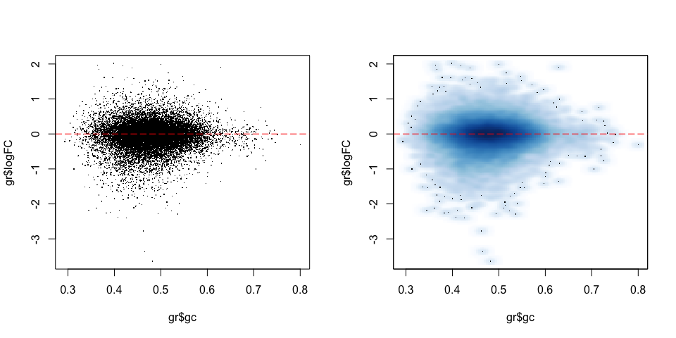
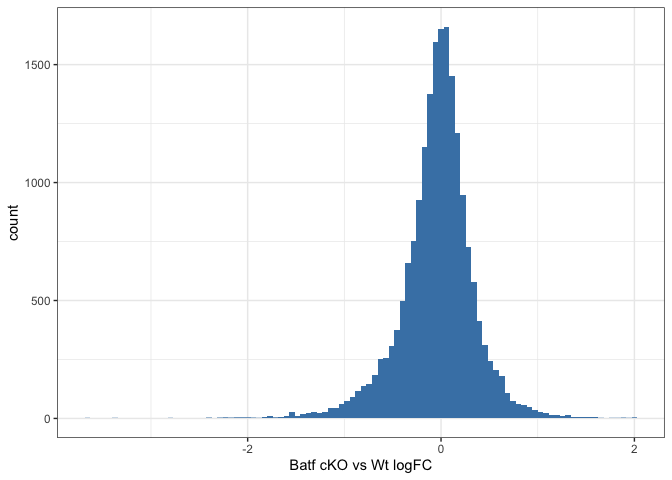

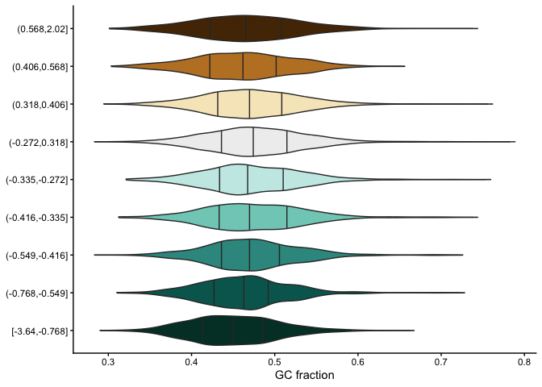
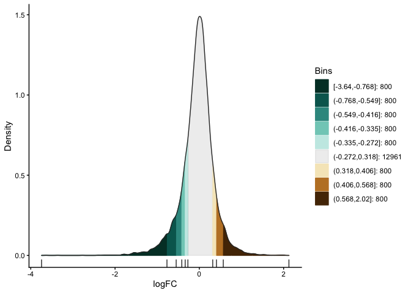
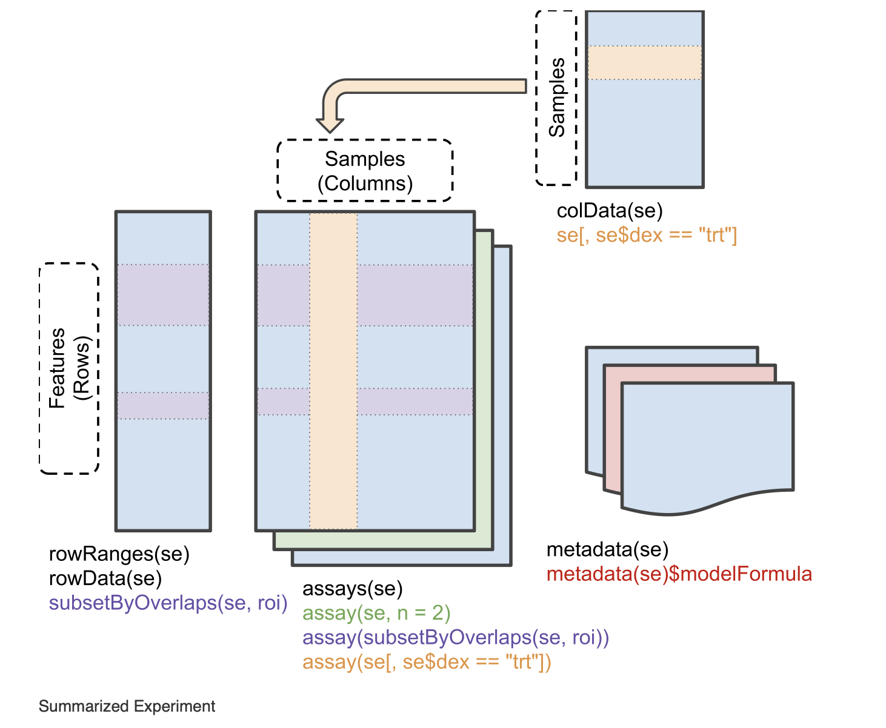
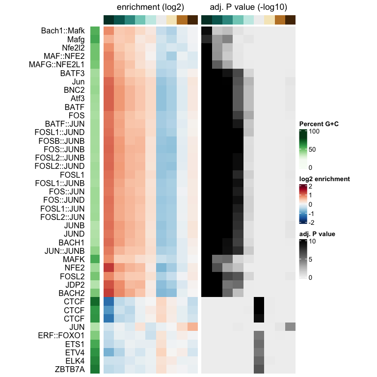
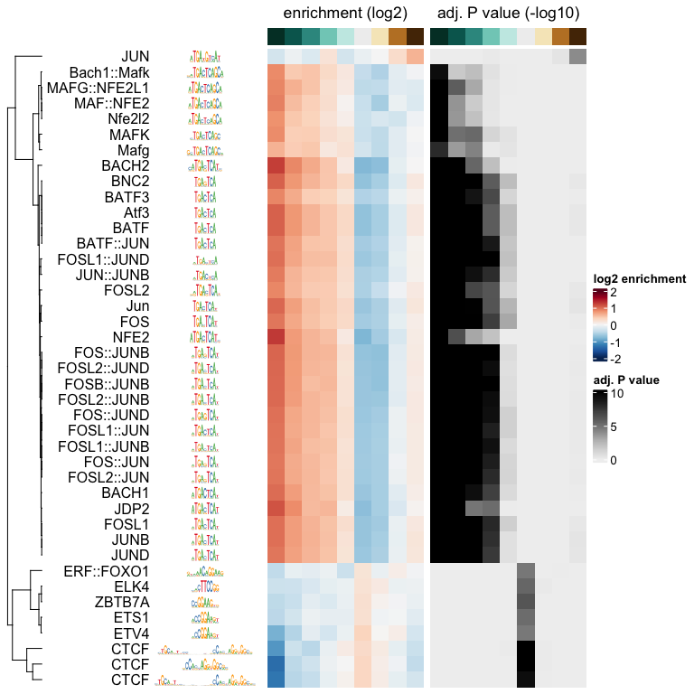
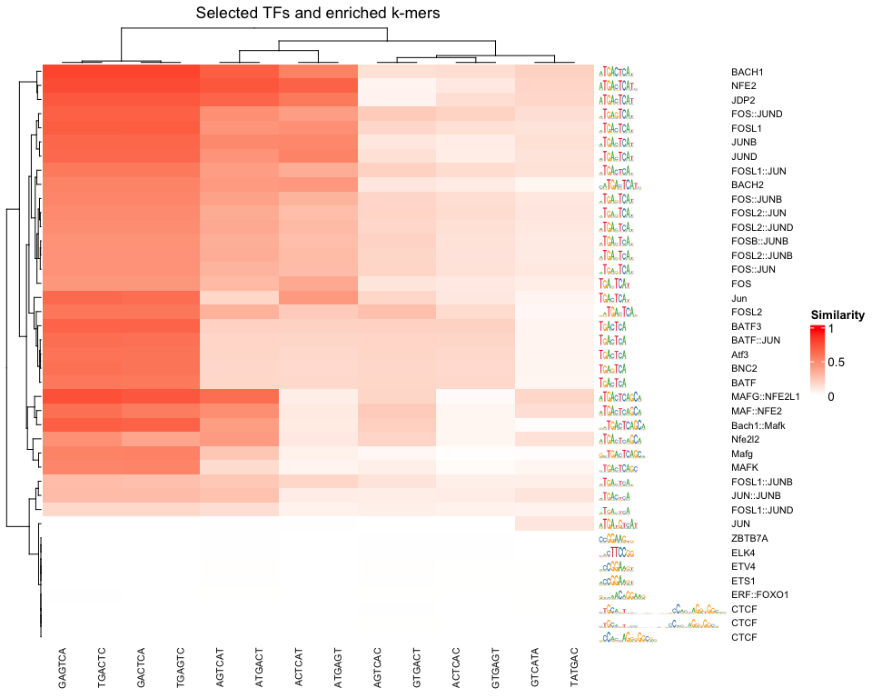
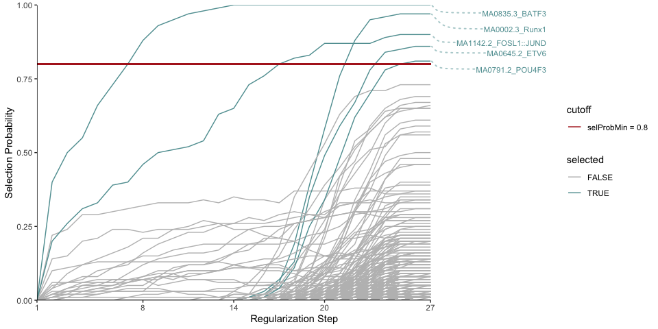
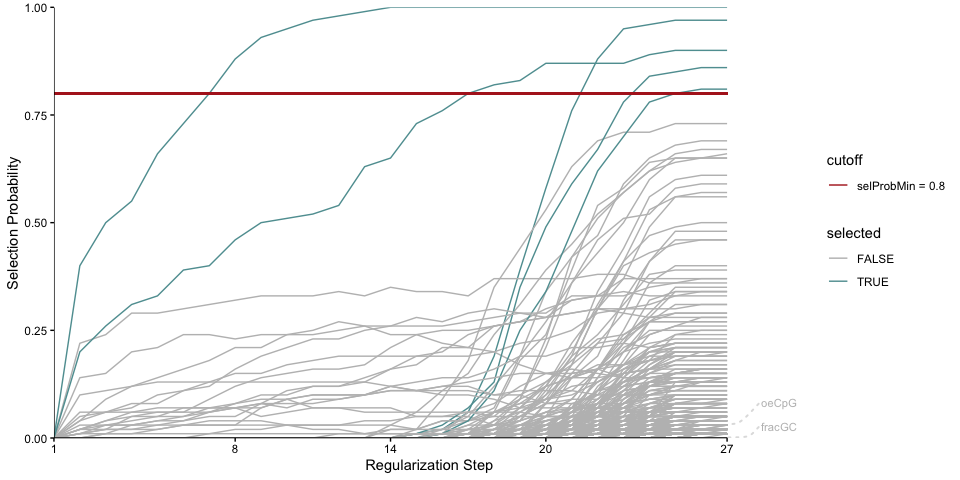
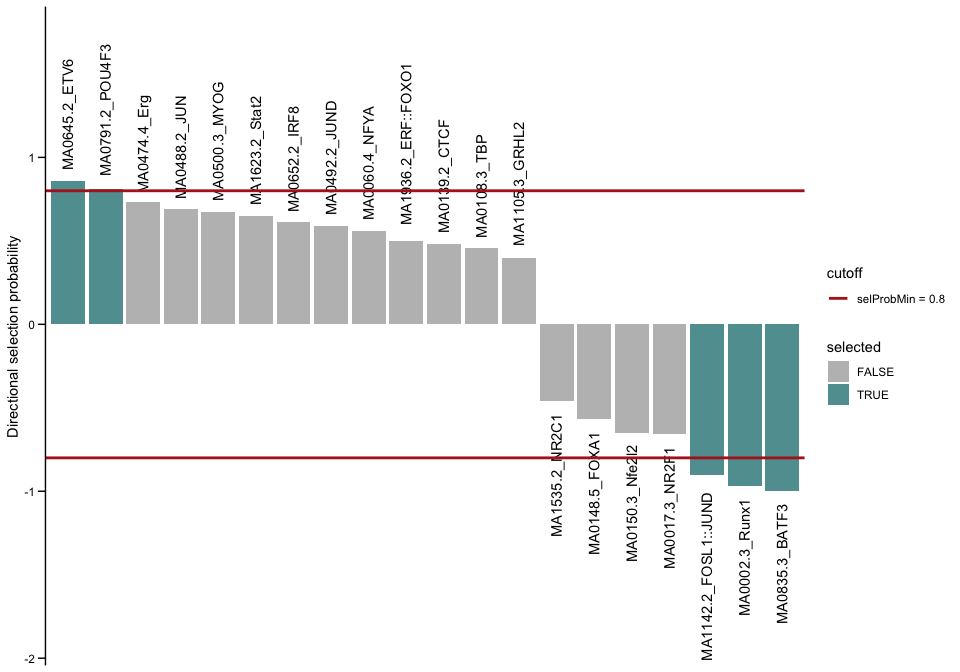
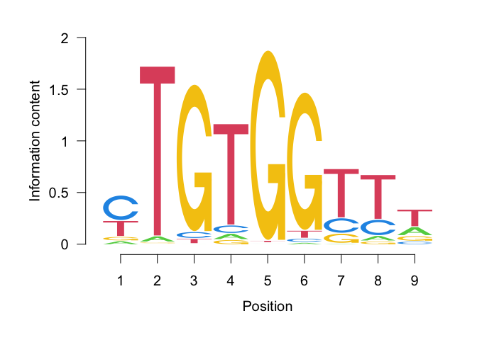
