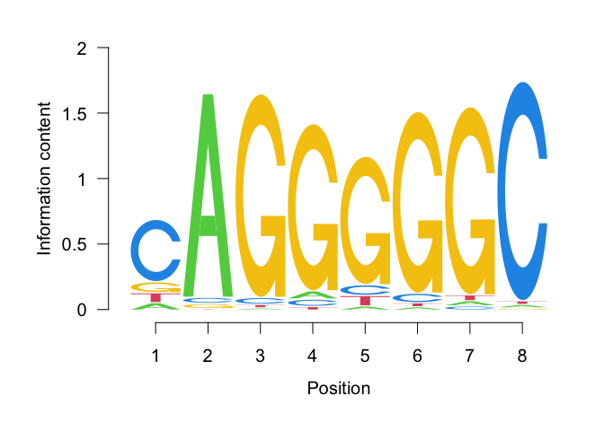

====================================================================
Motifs: representing them and searching for hits against a reference
====================================================================

:Date: 2025-08-15

.. raw:: html

   <!-- 
   Author:         Dania Machlab
   About:          This qmd file is used to render the .rst file. To modify or 
                   update the .rst file, please do so in the .qmd file here and 
                   render it.
   "data" folder:  contains the data/files/objects loaded into and used in this 
                   .qmd file.
   -->

Background
==========

DNA-binding proteins, called transcription factors (TFs), play key roles
in gene expression regulation, including the regulation of cellular
functions and during organismal development. The TF binding sites
(TFBSs) tend to be in the range of 6-12 base pairs (bp) long `(Spitz and
Furlong, 2012) <https://doi.org/10.1038/nrg3207>`__. The effect of their
binding can be indirectly observed via associated changes in
transcription, chromatin accessibility, DNA methylation and histone
modifications.

Here, we will examine how the TFBSs, also called motifs, can be
represented in the form of nucleotide (rows) x position (columns)
matrices, such as the position weight matrix (PWM). We will learn how
such matrices can be created, downloaded from public databases like
Jaspar, and use them to scan against a reference sequence in search for
predicted motif hits.

Learning outcomes
=================

-  understand how motifs can be represented in nucleotide x sequence
   position matrices.
-  understand the differences between the position frequency matrix
   (PFM), position probability matrix (PPM), position weight matrix
   (PWM), and information content matrix (ICM), and learn how these
   matrices can be constructed.
-  learn how to load PWMs in ``R`` and scan for motif hits against a
   reference.

Libraries
=========

We start by loading the needed packages. If necessary, use
``BiocManager::install()`` to install missing packages.

.. container:: cell

   .. code:: r

      suppressPackageStartupMessages({
        library(TFBSTools)
        library(Biostrings)
        library(JASPAR2024)
        library(RSQLite)
        library(BSgenome.Mmusculus.UCSC.mm10)
        library(TxDb.Mmusculus.UCSC.mm10.knownGene)
        library(GenomicRanges)
        library(monaLisa)
      })

Motif databases
===============

As mentioned, TFBSs or motifs can be represented in matrices with rows
corresponding to the nucleotides, namely :math:`A`, :math:`C`,
:math:`G`, and :math:`T`, and columns corresponding to the position
along the binding site. The position frequency matrix (PFM), also called
the position count matrix (PCM), shows the count each nucleotide
contributes at a particular position. Such matrices can be obtained from
publicly available databases like `Jaspar <https://jaspar.elixir.no>`__
(`Sandelin et al. <https://doi.org/10.1093/nar/gkh012>`__) and
`Hocomoco <https://hocomoco11.autosome.org>`__ (`Vorontsov, Eliseeva,
Zinkevich, et al. <https://doi.org/10.1093/nar/gkad1077>`__). We will
focus on Jaspar, which is also available as Bioconductor packages like
`JASPAR2024 <https://bioconductor.org/packages/JASPAR2024/>`__.

.. raw:: html

   <!-- 
   [JASPAR](https://jaspar.elixir.no) is an open-access database that provides TF binding preferences in the form of position frequency matrices (PFMs), where columns represent positions along the binding site, rows represent nucleotides (A,C,G and T), and the entries show the counts of each nucleotide at a given position. PFMs are generated by aligning DNA binding-site sequences from high-quality experiments such as ChIP-seq, protein binding microarrays, and SELEX-based methods, along with incorporating curated external motifs. More details about this can be found on the [JASPAR website](https://jaspar.elixir.no/docs/).
   -->

`Jaspar <https://jaspar.elixir.no>`__ is an open-access database that
provides TF binding preferences in the form of position frequency
matrices (PFMs). PFMs are generated by aligning DNA binding-site
sequences from high-quality experiments such as ChIP-seq, protein
binding microarrays, and SELEX-based methods, along with incorporating
curated external motifs. More details about this can be found on the
Jaspar `website <https://jaspar.elixir.no/docs/>`__.

Position frequency matrix
=========================

As stated, the PFM depicts the frequencies of the nucleotides i.e. the
number of times each nucleotide occurs at each position along the motif.

To illustrate this more we will use the CTCFL motif as an example, read
in the DNA sequences which we have downloaded from
`Jaspar <https://jaspar.elixir.no/download/data/2024/sites/MA1102.3.sites>`__,
and produce the corresponding PFM. We will use the ``Biostrings``
package to read the sequences and represent them as a ``DNAStringSet``
object, which is a convenient way to represent and manipulate DNA
sequences in ``R``. See the
`vignette <https://bioconductor.org/packages/release/bioc/vignettes/Biostrings/inst/doc/Biostrings2Classes.pdf>`__
from the ``Biostrings`` package for more details.

.. container:: cell

   .. code:: r

      # read in the TFBS sequences
      CTCFLsequencesFile <- "data/MA1102.3.sites"
      CTCFLsequences <- readDNAStringSet(CTCFLsequencesFile)
      CTCFLsequences

   .. container:: cell-output cell-output-stdout

      ::

         DNAStringSet object of length 18037:
                 width seq                                           names               
             [1]     8 CAGGGGGC                                      hg38_chr1:869925-...
             [2]     8 CAGGGGGC                                      hg38_chr1:904775-...
             [3]     8 GAGGGGGC                                      hg38_chr1:925040-...
             [4]     8 CAGGGGGC                                      hg38_chr1:945418-...
             [5]     8 GAGGGGGC                                      hg38_chr1:951563-...
             ...   ... ...
         [18033]     8 AAGGGGGC                                      hg38_chrX:1550575...
         [18034]     8 GAGGGGGC                                      hg38_chrX:1552166...
         [18035]     8 CAGGGGGA                                      hg38_chrX:1552168...
         [18036]     8 CAGGGGGC                                      hg38_chrX:1554355...
         [18037]     8 GAGGGGGC                                      hg38_chrX:1556122...

We can see that we have a total of 18037 sequences of the TF binding
site. Next, we generate the PFM by counting the nucleotide occurrences
per position.

.. container:: cell

   .. code:: r

      # create PFM by counting nucleotide occurrences per position
      pfm <- consensusMatrix(CTCFLsequences)
      pfm <- pfm[c("A", "C", "G", "T"), ]
      pfm

   .. container:: cell-output cell-output-stdout

      ::

            [,1]  [,2]  [,3]  [,4]  [,5]  [,6]  [,7]  [,8]
         A  1301 17270    86   684   349   193   351   181
         C 12867   413   481   600  1141   767   270 17593
         G  2033   329 17285 16511 15425 16819 17001    68
         T  1836    25   185   242  1122   258   415   195

Position probability matrix
===========================

We can now calculate the probability of observing each nucleotide at a
particular position by dividing counts by the total count per position.

.. math::

   PPM_{ij} = \frac{count_{ij}}{\sum_{i}{count_{ij}}}

Where :math:`i` is the nucleotide and :math:`i \in \{A, C, G, T\}`, and
:math:`j` is the position along the motif.

.. container:: cell

   .. code:: r

      # calculate PPM
      ppm <- sweep(x = pfm, MARGIN = 2, STATS = colSums(pfm), FUN = "/")
      ppm

   .. container:: cell-output cell-output-stdout

      ::

                 [,1]       [,2]        [,3]       [,4]       [,5]       [,6]       [,7]
         A 0.07212951 0.95747630 0.004767977 0.03792205 0.01934912 0.01070023 0.01946000
         C 0.71336697 0.02289738 0.026667406 0.03326496 0.06325886 0.04252370 0.01496923
         G 0.11271276 0.01824028 0.958307923 0.91539613 0.85518656 0.93247214 0.94256251
         T 0.10179076 0.00138604 0.010256695 0.01341687 0.06220547 0.01430393 0.02300826
                  [,8]
         A 0.010034928
         C 0.975383933
         G 0.003770028
         T 0.010811110

   .. code:: r

      # all positions now sum to 1
      colSums(ppm)

   .. container:: cell-output cell-output-stdout

      ::

         [1] 1 1 1 1 1 1 1 1

We can now calculate the probability of observing a certain motif
sequence by multiplying the probabilities of each nucleotide per
position. Let us look at some examples below.

.. container:: cell

   .. code:: r

      p_CAGACGGC <- ppm["C", 1] * ppm["A", 2] * ppm["G", 3] * ppm["A", 4] * 
        ppm["C", 5] * ppm["G", 6] * ppm["G", 7] * ppm["C", 8] 
      p_CAGACGGC

   .. container:: cell-output cell-output-stdout

      ::

                   C 
         0.001346111 

   .. code:: r

      p_AATTGGTT <- ppm["A", 1] * ppm["A", 2] * ppm["T", 3] * ppm["T", 4] * 
        ppm["G", 5] * ppm["G", 6] * ppm["T", 7] * ppm["T", 8] 
      p_AATTGGTT

   .. container:: cell-output cell-output-stdout

      ::

                    A 
         1.885169e-09 

In this PPM, we do not have any zero counts for any given nculeotide and
position. What would happen if we did? Let us suppose that
``pfm["T", 7]`` had a count of zero and therefore ``ppm["T", 7]`` is
also zero. Multiplying by zero would result in ``p_AATTGGTT = 0``. This
issue can especially emerge when starting from a low number of sequences
to construct the PFM. To avoid low count issues, we will add a
peudo-count :math:`p` of 1 per position, to the PFM. This corresponds to
a pseudo-count of :math:`p/N` for each entry in the matrix, where
:math:`N` is the total number number of nucleotides, and :math:`N=4` in
our case. We will then re-calculate the PPM.

.. math::

   PPM_{ij} = \frac{count_{ij}+\frac{p}{N}}{\sum_{i}{count_{ij}+p}}

.. container:: cell

   .. code:: r

      # set p and N
      pseudooCount <- 1
      N <- nrow(pfm)

      # add pseudo-count to PFM and re-calculate PPM
      pfmWithPseudo <- pfm + pseudooCount/N
      ppm <- sweep(x = pfmWithPseudo, MARGIN = 2, STATS = colSums(pfm), FUN = "/")
      ppm

   .. container:: cell-output cell-output-stdout

      ::

                 [,1]       [,2]        [,3]       [,4]       [,5]       [,6]       [,7]
         A 0.07214337 0.95749016 0.004781837 0.03793591 0.01936298 0.01071409 0.01947386
         C 0.71338083 0.02291124 0.026681266 0.03327882 0.06327272 0.04253756 0.01498309
         G 0.11272662 0.01825414 0.958321783 0.91540999 0.85520042 0.93248600 0.94257637
         T 0.10180462 0.00139990 0.010270555 0.01343073 0.06221933 0.01431779 0.02302212
                  [,8]
         A 0.010048789
         C 0.975397793
         G 0.003783889
         T 0.010824971

Position weight matrix
======================

The position weight matrix (PWM) is also known as the position-specific
scoring matrix or the logodds scoring matrix. Here, log-odds scores are
calculated by comparing the probabilities we have in the PPM to the
probabilities of observing each nucleotide outside of a binding site
(background nucleotide probabilities). Assuming a uniform background, in
which each nucleotide has an equal probability, would give us the
following background probabilities for each nucleotide:
:math:`p(A) = p(C) = p(G) = p(T) = 0.25`. The log-odds scores can be
obtained as follows:

.. math::

   PWM_{ij}=log_2\Bigl(\frac{PPM_{ij}}{B_i}\Bigr) 

Where :math:`i` is the nucleotide, :math:`j` is the position along the
motif, and :math:`B_i` is the background probability for nucleotide
:math:`i`. Thanks to the pseudo-count we have added, we will avoid
situations where we are taking the :math:`log_2(0)` which is
:math:`-Inf`.

.. container:: cell

   .. code:: r

      # define background probabilities
      (B <- c("A" = 0.25, "C" = 0.25, "G" = 0.25, "T" = 0.25))

   .. container:: cell-output cell-output-stdout

      ::

            A    C    G    T 
         0.25 0.25 0.25 0.25 

   .. code:: r

      # calculate PWM
      pwm <- log2(sweep(x = ppm, MARGIN = 2, STATS = B, FUN = "/"))
      pwm

   .. container:: cell-output cell-output-stdout

      ::

                [,1]      [,2]      [,3]      [,4]      [,5]      [,6]      [,7]
         A -1.792989  1.937330 -5.708219 -2.720292 -3.690555 -4.544347 -3.682317
         C  1.512744 -3.447801 -3.228029 -2.909252 -1.982273 -2.555119 -4.060521
         G -1.149100 -3.775632  1.938582  1.872490  1.774334  1.899154  1.914681
         T -1.296125 -7.480460 -4.605342 -4.218319 -2.006493 -4.126047 -3.440835
                [,8]
         A -4.636835
         C  1.964063
         G -6.045915
         T -4.529493

The score for a specific sequence can now be calculated by combining the
PWM scores at each position. For example the score for ``CAGACGGC`` is:

.. container:: cell

   .. code:: r

      pwm["C", 1] + pwm["A", 2] + pwm["G", 3] + pwm["A", 4] + pwm["C", 5] + pwm["G", 6]+ pwm["G", 7] + pwm["C", 8]

   .. container:: cell-output cell-output-stdout

      ::

                C 
         6.463989 

In this manner, PWMs can be used to scan for motif matches against a
reference DNA sequence. The ``matchPWM`` function from the
``Biostrings`` can be used to do that. Matches with greater that the set
``min.score`` will be called as predicted binding sites. ``min.score``
can be set as a fixed empiric number or as a character reflecting the
percentage of the highest possible score. See the ``matchPWM`` function
for more details. Let us try scanning for this motif against a given DNA
string.

.. container:: cell

   .. code:: r

      # reference DNA sequence (this is typically the reference genome)
      refDNA <-"GCCTATACAGACGGCGTTGGATATACGCAGACGGCTGTGA"
      matchPWM(pwm, subject = refDNA, min.score = 6)

   .. container:: cell-output cell-output-stdout

      ::

         Views on a 40-letter DNAString subject
         subject: GCCTATACAGACGGCGTTGGATATACGCAGACGGCTGTGA
         views:
               start end width
           [1]     8  15     8 [CAGACGGC]
           [2]    28  35     8 [CAGACGGC]

.. container::

      **Exercise**

      Using the PWM we have created, calculate the score for sequence
      ``CAGGGGGC``. Then, using the ``matchPWM`` function and setting
      ``min.score=10``, find the motif matches in the following
      reference sequence:
      ``GGCAGGGGGCTGCCCCGACAGACGGCCTAGGTATGCTGTTCCCACAGGGGGCTCTTCCGGGGTGTCAGGGGGCTT``.

      .. raw:: html

         

         
Show solution

      .. container:: cell

         .. code:: r

            # reference DNA sequence (this is typically the reference genome)
            refDNA <- "GGCAGGGGGCTGCCCCGACAGACGGCCTAGGTATGCTGTTCCCACAGGGGGCTCTTCCGGGGTGTCAGGGGGCTT"
            matchPWM(pwm, subject = refDNA, min.score = 10)

         .. container:: cell-output cell-output-stdout

            ::

               Views on a 75-letter DNAString subject
               subject: GGCAGGGGGCTGCCCCGACAGACGGCCTAGGTAT...CCACAGGGGGCTCTTCCGGGGTGTCAGGGGGCTT
               views:
                     start end width
                 [1]     3  10     8 [CAGGGGGC]
                 [2]    45  52     8 [CAGGGGGC]
                 [3]    66  73     8 [CAGGGGGC]

      .. raw:: html

         

| 

Information content matrix
==========================

The information content matrix (ICM) can additionally reflect which
positions along the motif are more or less conserved. To have a better
understanding of this, we need to first introduce some key concepts in
information theory, a field established by Claude Shannon with his
influential publication in 1948, entitled `“A Mathematical Theory of
Communication” <https://doi.org/10.1002/j.1538-7305.1948.tb01338.x>`__.
We will largely borrow explanations from David McKay’s book “Information
Theory, Inference, and Learning Algorithms”, which offers great
explanations and deeper dives into the topic for those interested.

Let us consider a random variable :math:`X` with an outcome :math:`x`.
The **Shannon information content** of :math:`x` is defined as
:math:`h(x)=log_2\frac{1}{p(x)}`, where :math:`p(x)` is the probability
of outcome :math:`x`. It is measured in bits since we are using
:math:`log_2`, and reflects a measure of surprise from an outcome. For
example, an outcome with probability of 1 is not surprising and provides
no information: :math:`log_2(1)=0`. Whereas an outcome with a very low
probability is more surprising and provides more information were it to
happen. For example, assume the following probabilities of observing the
outcome of a random variable :math:`X`: :math:`p(x=0)=0.4` and
:math:`p(x=1)=0.6`. You could imagine a bent coin with binary outcomes.
The Shannon information content for outcome :math:`x=0` is
:math:`h(x=0)=log_2\frac{1}{p(x=0)}=log_2\frac{1}{0.4}\approx1.322`.

The **entropy** represents the average Shannon information content of an
outcome and is:

.. math::

   H(X)=\sum_{x}p(x)log_2\frac{1}{p(x)}

Following our example from above, the entropy of :math:`X` is

.. math::

   \begin{aligned}
   H(X) &= \sum_{x}p(x)log_2\frac{1}{p(x)} \\
        &= p(x=0)log_2\frac{1}{p(x=0)} + p(x=1)log_2\frac{1}{p(x=1)} \\
        &= 0.4log_2\frac{1}{0.4} + 0.6log_2\frac{1}{0.6} \\
        &\approx 0.971
   \end{aligned}  

We can think of it as an average measure of surprise. Another name for
the entropy is the uncertainty. You may notice that it is maximized when
we have uniform probabilities.

Coming back to our motif, we want to calculate the bits per position,
which reflect the degree of conservation of the positions. We calculate
this by taking the maximum uncertainty per position and subtracting the
actual uncertainty at that position. As mentioned, uncertainty (entropy)
is maximum when all outcomes have equal probabilities. In our case, the
outcome is the specific instance of a nucleotide. We thus have 4
outcomes (:math:`A`, :math:`C`, :math:`G`, and :math:`T`). In a
scenario, where all nucleotides are equally likely, there is no
*preference* for any particular nucleotide. Assuming equal probabilities
of :math:`\frac{1}{N}` for each nucleotide, where :math:`N` is the total
number of nucleotides, the maximum entropy, or total information content
:math:`IC_{total}`, can be calculated as follows:

.. math::

   \begin{aligned}
   IC_{total} &= \sum_{x}p(x)log_2\frac{1}{p(x)} \\
              &= N*\frac{1}{N}log_2N \\
              &= log_2N \\
              &= log_24 \\
              &= 2
   \end{aligned}           

The actual uncertainty :math:`U` per position is

.. math::

   \begin{aligned}
   U &= \sum_{x}p(x)log_2\frac{1}{p(x)} \\
     &= -\sum_{x}p(x)log_2p(x)
   \end{aligned}

The final information content :math:`IC_{final}` per position is:

.. math::

   \begin{aligned}
   IC_{final} &= IC_{total}-U \\
              &= 2-U
   \end{aligned}

When :math:`U=0` (when one nucleotide has a probability of 1),
:math:`IC_{final}=2-0=2` and you know the nucleotide with no
uncertainty.

Following our example motif, let us calculate :math:`IC_{final}` for
each position.

.. container:: cell

   .. code:: r

      # total information content (maximum uncertainty)
      IC_total <- log2(4)
      IC_total

   .. container:: cell-output cell-output-stdout

      ::

         [1] 2

   .. code:: r

      # actual uncertainty per position
      U <- -colSums(apply(X = ppm, MARGIN = 2, FUN = function(x){
        x*log2(x)
      }))
      U  

   .. container:: cell-output cell-output-stdout

      ::

         [1] 1.3117860 0.3035231 0.3030486 0.5426832 0.8044259 0.4456293 0.4071408
         [8] 0.2028718

   .. code:: r

      # final information content per position
      IC_final <- IC_total - U
      IC_final

   .. container:: cell-output cell-output-stdout

      ::

         [1] 0.688214 1.696477 1.696951 1.457317 1.195574 1.554371 1.592859 1.797128

Finally, to get the ICM where the height of each nulceotide (letter)
shows the bits each nucleotide contributes, we will multiply the
probability of each nucleotide by :math:`IC_{final}` per position.

.. container:: cell

   .. code:: r

      # ICM
      icm <- sweep(x = ppm, MARGIN = 2, STATS = IC_final, FUN = "*")
      icm

   .. container:: cell-output cell-output-stdout

      ::

                 [,1]        [,2]        [,3]       [,4]       [,5]       [,6]
         A 0.04965008 1.624359931 0.008114546 0.05528464 0.02314987 0.01665366
         C 0.49095866 0.038868386 0.045276813 0.04849778 0.07564722 0.06611914
         G 0.07758003 0.030967734 1.626225532 1.33404237 1.02245549 1.44942889
         T 0.07006336 0.002374898 0.017428633 0.01957282 0.07438782 0.02225515
                 [,7]        [,8]
         A 0.03101912 0.018058961
         C 0.02386595 1.752914869
         G 1.50139141 0.006800133
         T 0.03667100 0.019453860

   .. code:: r

      # create ICMatrix object to use the seqLogo function from TFBSTools
      icmatrix <- ICMatrix(ID = "MA1102.3", 
                           name = "CTCFL", 
                           profileMatrix = icm)
      icmatrix

   .. container:: cell-output cell-output-stdout

      ::

         An object of class ICMatrix
         ID: MA1102.3
         Name: CTCFL
         Matrix Class: Unknown
         strand: +
         Pseudocounts: 
         Schneider correction: 
         Tags: 
         list()
         Background: 
            A    C    G    T 
         0.25 0.25 0.25 0.25 
         Matrix: 
                 [,1]        [,2]        [,3]       [,4]       [,5]       [,6]
         A 0.04965008 1.624359931 0.008114546 0.05528464 0.02314987 0.01665366
         C 0.49095866 0.038868386 0.045276813 0.04849778 0.07564722 0.06611914
         G 0.07758003 0.030967734 1.626225532 1.33404237 1.02245549 1.44942889
         T 0.07006336 0.002374898 0.017428633 0.01957282 0.07438782 0.02225515
                 [,7]        [,8]
         A 0.03101912 0.018058961
         C 0.02386595 1.752914869
         G 1.50139141 0.006800133
         T 0.03667100 0.019453860

   .. code:: r

      # draw motif sequence logo 
      seqLogo(icmatrix)

   .. container:: cell-output-display

      |image1|

This is a useful way to visualize motifs, and get a sense of how
conserved the sequence is.

Scanning for motif hits
=======================

Now that we have a good understanding of the PWM and the other matrices,
let us see how we can load a list of PWMs from Jaspar and what useful
functions are at our disposal. We will extract the list of all
vertebrate TFs.

.. container:: cell

   .. code:: r

      # extract PFMs of vertebrate TFs from JASPAR2024
      JASPAR2024 <- JASPAR2024()
      JASPARConnect <- RSQLite::dbConnect(RSQLite::SQLite(), db(JASPAR2024))
      pfmList <- TFBSTools::getMatrixSet(JASPARConnect, 
                                         opts = list(tax_group = "vertebrates", 
                                                     collection="CORE", 
                                                     matrixtype = "PFM")
      )
      pfmList

   .. container:: cell-output cell-output-stdout

      ::

         PFMatrixList of length 879
         names(879): MA0004.1 MA0069.1 MA0071.1 MA0074.1 ... MA1721.2 MA1602.2 MA1722.2

   .. code:: r

      pfmList[[1]]

   .. container:: cell-output cell-output-stdout

      ::

         An object of class PFMatrix
         ID: MA0004.1
         Name: Arnt
         Matrix Class: Basic helix-loop-helix factors (bHLH)
         strand: +
         Tags: 
         $alias
         [1] "HIF-1beta,bHLHe2"

         $description
         [1] "aryl hydrocarbon receptor nuclear translocator"

         $family
         [1] "PAS domain factors"

         $medline
         [1] "7592839"

         $remap_tf_name
         [1] "ARNT"

         $symbol
         [1] "ARNT"

         $tax_group
         [1] "vertebrates"

         $tfbs_shape_id
         [1] "11"

         $type
         [1] "SELEX"

         $unibind
         [1] "1"

         $collection
         [1] "CORE"

         $species
                  10090 
         "Mus musculus" 

         $acc
         [1] "P53762"

         Background: 
            A    C    G    T 
         0.25 0.25 0.25 0.25 
         Matrix: 
           [,1] [,2] [,3] [,4] [,5] [,6]
         A    4   19    0    0    0    0
         C   16    0   20    0    0    0
         G    0    1    0   20    0   20
         T    0    0    0    0   20    0

   .. code:: r

      # we can convert the PFMs to PWMs
      pwmList <- toPWM(pfmList)
      pwmList[[1]]@profileMatrix

   .. container:: cell-output cell-output-stdout

      ::

                 [,1]      [,2]      [,3]      [,4]      [,5]      [,6]
         A -0.3081223  1.884523 -4.700440 -4.700440 -4.700440 -4.700440
         C  1.6394103 -4.700440  1.957772 -4.700440 -4.700440 -4.700440
         G -4.7004397 -2.115477 -4.700440  1.957772 -4.700440  1.957772
         T -4.7004397 -4.700440 -4.700440 -4.700440  1.957772 -4.700440

   .. code:: r

      # Alternatively, we can directly load the PWMs
      pwmList <- TFBSTools::getMatrixSet(JASPARConnect, 
                                         opts = list(tax_group = "vertebrates", 
                                                     collection="CORE", 
                                                     matrixtype = "PWM")
      )
      pwmList[[1]]@profileMatrix

   .. container:: cell-output cell-output-stdout

      ::

                 [,1]      [,2]      [,3]      [,4]      [,5]      [,6]
         A -0.3081223  1.884523 -4.700440 -4.700440 -4.700440 -4.700440
         C  1.6394103 -4.700440  1.957772 -4.700440 -4.700440 -4.700440
         G -4.7004397 -2.115477 -4.700440  1.957772 -4.700440  1.957772
         T -4.7004397 -4.700440 -4.700440 -4.700440  1.957772 -4.700440

   .. code:: r

      # pwmList is a PWMatrixList object
      # we can look at the structure and information available on the first motif
      str(pwmList[[1]])

   .. container:: cell-output cell-output-stdout

      ::

         Formal class 'PWMatrix' [package "TFBSTools"] with 8 slots
           ..@ pseudocounts : num 0.8
           ..@ ID           : chr "MA0004.1"
           ..@ name         : chr "Arnt"
           ..@ matrixClass  : chr "Basic helix-loop-helix factors (bHLH)"
           ..@ strand       : chr "+"
           ..@ bg           : Named num [1:4] 0.25 0.25 0.25 0.25
           .. ..- attr(*, "names")= chr [1:4] "A" "C" "G" "T"
           ..@ tags         :List of 13
           .. ..$ alias        : chr "HIF-1beta,bHLHe2"
           .. ..$ description  : chr "aryl hydrocarbon receptor nuclear translocator"
           .. ..$ family       : chr "PAS domain factors"
           .. ..$ medline      : chr "7592839"
           .. ..$ remap_tf_name: chr "ARNT"
           .. ..$ symbol       : chr "ARNT"
           .. ..$ tax_group    : chr "vertebrates"
           .. ..$ tfbs_shape_id: chr "11"
           .. ..$ type         : chr "SELEX"
           .. ..$ unibind      : chr "1"
           .. ..$ collection   : chr "CORE"
           .. ..$ species      : Named chr "Mus musculus"
           .. .. ..- attr(*, "names")= chr "10090"
           .. ..$ acc          : chr "P53762"
           ..@ profileMatrix: num [1:4, 1:6] -0.308 1.639 -4.7 -4.7 1.885 ...
           .. ..- attr(*, "dimnames")=List of 2
           .. .. ..$ : chr [1:4] "A" "C" "G" "T"
           .. .. ..$ : NULL

   .. code:: r

      # we can access some entries with the functions shown below on an example
      # PWMatrix, but they can also be used on the PWMatrixList
      motif <- pwmList[[1]]
      # ... motif name
      name(motif)

   .. container:: cell-output cell-output-stdout

      ::

         [1] "Arnt"

   .. code:: r

      # ... motif ID
      ID(motif)

   .. container:: cell-output cell-output-stdout

      ::

         [1] "MA0004.1"

   .. code:: r

      # ... used background probabilities
      bg(motif)

   .. container:: cell-output cell-output-stdout

      ::

            A    C    G    T 
         0.25 0.25 0.25 0.25 

   .. code:: r

      # ... motif tags
      tags(motif)

   .. container:: cell-output cell-output-stdout

      ::

         $alias
         [1] "HIF-1beta,bHLHe2"

         $description
         [1] "aryl hydrocarbon receptor nuclear translocator"

         $family
         [1] "PAS domain factors"

         $medline
         [1] "7592839"

         $remap_tf_name
         [1] "ARNT"

         $symbol
         [1] "ARNT"

         $tax_group
         [1] "vertebrates"

         $tfbs_shape_id
         [1] "11"

         $type
         [1] "SELEX"

         $unibind
         [1] "1"

         $collection
         [1] "CORE"

         $species
                  10090 
         "Mus musculus" 

         $acc
         [1] "P53762"

   .. code:: r

      # disconnect
      dbDisconnect(JASPARConnect)

As we have seen, PWMs can be used to predict TFBSs against a reference
sequence. To illustrate this, let us use some of the PWMs we have loaded
from Jaspar above, to scan against hits at the gene promoters from the
UCSC mouse reference genome. We will use the ``findMotifHits`` function
from the ``monaLisa`` package to scan for motif hits. This function uses
``Biostrings::matchPWM`` internally to scan for matches, but
additionally allows for the ``subject`` argument to accept
``DNAStringSet`` or ``GRanges`` objects. It also allows for
parallelization across PWMs with the ``BPPARAM`` argument.

.. container:: cell

   .. code:: r

      # get promoters as GRanges object
      promoters <- trim(promoters(TxDb.Mmusculus.UCSC.mm10.knownGene,
                             upstream = 1000, downstream = 500))

   .. container:: cell-output cell-output-stderr

      ::

         Warning in valid.GenomicRanges.seqinfo(x, suggest.trim = TRUE): GRanges object contains 1 out-of-bound range located on sequence
           chr4_JH584295_random. Note that ranges located on a sequence whose length is
           unknown (NA) or on a circular sequence are not considered out-of-bound (use
           seqlengths() and isCircular() to get the lengths and circularity flags of the
           underlying sequences). You can use trim() to trim these ranges. See
           ?`trim,GenomicRanges-method` for more information.

   .. code:: r

      # extract promoter sequences
      promoterSeqs <- getSeq(BSgenome.Mmusculus.UCSC.mm10, promoters)
      promoterSeqs

   .. container:: cell-output cell-output-stdout

      ::

         DNAStringSet object of length 142446:
                  width seq                                          names               
              [1]  1500 CCCTTTTGGATAGATTCTAGG...GATTTATGAGTAAGGGATGT ENSMUST00000193812.1
              [2]  1500 TTCTGAGGAGAGTGGCTCATA...AGGTAGCAACAGATATGGCA ENSMUST00000082908.1
              [3]  1500 GTCTACCACATAGTTGCACAT...GCAATAGAAATTTGTTAAAA ENSMUST00000192857.1
              [4]  1500 TGCGGTATGTTCATGTATACA...AATTTACCAATGCCACACAG ENSMUST00000161581.1
              [5]  1500 TGATTAAGAAAATTCCCTGGT...TTGGTGTGGTAGTCACGTCC ENSMUST00000192183.1
              ...   ... ...
         [142442]  1500 NNNNNNNNNNNNNNNNNNNNN...CACATCTGCTTTCAGATTTC ENSMUST00000184505.1
         [142443]  1500 CATGCTGACACCCCAATGGGG...AACACTGCAGAAGATGGAGG ENSMUST00000178705.1
         [142444]  1500 TGAGAACACTGCAGAAGATGG...ATTAAAGATTGTTTTTTCTC ENSMUST00000180206.1
         [142445]  1500 TTCCAGGTCCTACCATGTGAG...TGTGTACACCAGGCTGGCCT ENSMUST00000179505.7
         [142446]  1500 CGTTTTTCAGTTTTCTCACCA...TTTTTTTCGAGACTGGGTTT ENSMUST00000178343.1

   .. code:: r

      # choose first 5 PWM as an example
      pwms <- pwmList[1:5]
      name(pwms)

   .. container:: cell-output cell-output-stdout

      ::

            MA0004.1    MA0069.1    MA0071.1    MA0074.1    MA0101.1 
              "Arnt"      "PAX6"      "RORA" "RXRA::VDR"       "REL" 

   .. code:: r

      # scan for motif hits
      hits <- findMotifHits(query = pwms,
                            subject = promoterSeqs,
                            min.score = 10.0,
                            method = "matchPWM",
                            BPPARAM = BiocParallel::MulticoreParam(5))
      hits

   .. container:: cell-output cell-output-stdout

      ::

         GRanges object with 250935 ranges and 4 metadata columns:
                                seqnames    ranges strand |      matchedSeq    pwmid
                                   <Rle> <IRanges>  <Rle> |  <DNAStringSet>    <Rle>
                [1] ENSMUST00000193812.1   915-924      - |      TGGCATTTCC MA0101.1
                [2] ENSMUST00000082908.1   768-781      - |  TTTATGCATCATAT MA0069.1
                [3] ENSMUST00000192857.1 1059-1072      - |  TTAATGCATCAGTG MA0069.1
                [4] ENSMUST00000192857.1 1090-1099      - |      ATTGAGGTCA MA0071.1
                [5] ENSMUST00000192183.1   662-671      + |      TTCAGGGTCA MA0071.1
                ...                  ...       ...    ... .             ...      ...
           [250931] ENSMUST00000180206.1 1176-1185      - |      AAGCAGGTCA MA0071.1
           [250932] ENSMUST00000179505.7   238-252      + | GGGTCCTAGAGTTTG MA0074.1
           [250933] ENSMUST00000179505.7 1333-1342      + |      TGGTTTTTCC MA0101.1
           [250934] ENSMUST00000178343.1   261-275      + | GGGTCCTAGAGTTTG MA0074.1
           [250935] ENSMUST00000178343.1 1356-1365      + |      TGGTTTTTCC MA0101.1
                      pwmname     score
                        <Rle> <numeric>
                [1]       REL   10.5180
                [2]      PAX6   10.4507
                [3]      PAX6   13.8810
                [4]      RORA   12.6983
                [5]      RORA   12.3224
                ...       ...       ...
           [250931]      RORA   11.1253
           [250932] RXRA::VDR   12.0611
           [250933]       REL   10.4383
           [250934] RXRA::VDR   12.0611
           [250935]       REL   10.4383
           -------
           seqinfo: 142446 sequences from an unspecified genome

   .. code:: r

      # we can summarize the number of predicted hits per promoter in matrix format
      hitsMatrix <- table(factor(seqnames(hits), levels = names(promoterSeqs)),
                          factor(hits$pwmname, levels = name(pwms)))
      head(hitsMatrix)

   .. container:: cell-output cell-output-stdout

      ::

                               
                                Arnt PAX6 RORA RXRA::VDR REL
           ENSMUST00000193812.1    0    0    0         0   1
           ENSMUST00000082908.1    0    1    0         0   0
           ENSMUST00000192857.1    0    1    1         0   0
           ENSMUST00000161581.1    0    0    0         0   0
           ENSMUST00000192183.1    0    0    2         0   1
           ENSMUST00000193244.1    0    0    1         0   0

It is good to remember that these are predicted TF binding sites. By
making use of additionally available information, like ATAC-seq data,
and focusing on accessible regions of the DNA, one could reduce the
number of false hits. Ultimately, to find true binding sites for a
particular TF, ChIP-seq experiments are needed. Still, as we will see in
the section to come, predicted binding sites can be useful to look for
TFs that are consistently enriched, and come up with a list of candidate
TFs that could be playing key roles in our biological system of
interest.

Additional material
===================

The contents of this tutorial were inspired by several available
resources which are listed below and serve as additional reading
material for those interested:

-  David McKay’s book “Information Theory, Inference, and Learning
   Algorithms” is a great resource with introductions to key concepts as
   well as deeper dives.

-  The ``universalmotif`` `Bioconductor
   package <https://bioconductor.org/packages/universalmotif/>`__
   contains additional vignettes, including
   `explanations <%3Chttps://bioconductor.org/packages/release/bioc/vignettes/universalmotif/inst/doc/IntroductionToSequenceMotifs.pdf>`__
   on the discussed motif matrices and how to derive them, as well as
   additional material.

-  The ``TFBSTools`` `Bioconductor
   package <https://bioconductor.org/packages/TFBSTools/>`__ vignette
   found
   `here <https://bioconductor.org/packages/release/bioc/vignettes/TFBSTools/inst/doc/TFBSTools.html>`__.

Session information
===================

.. container:: cell

   .. code:: r

      date()

   .. container:: cell-output cell-output-stdout

      ::

         [1] "Fri Aug 15 16:38:30 2025"

   .. code:: r

      sessionInfo()

   .. container:: cell-output cell-output-stdout

      ::

         R version 4.5.1 (2025-06-13)
         Platform: aarch64-apple-darwin20
         Running under: macOS Sequoia 15.6

         Matrix products: default
         BLAS:   /Library/Frameworks/R.framework/Versions/4.5-arm64/Resources/lib/libRblas.0.dylib 
         LAPACK: /Library/Frameworks/R.framework/Versions/4.5-arm64/Resources/lib/libRlapack.dylib;  LAPACK version 3.12.1

         locale:
         [1] en_US.UTF-8/en_US.UTF-8/en_US.UTF-8/C/en_US.UTF-8/en_US.UTF-8

         time zone: Europe/Stockholm
         tzcode source: internal

         attached base packages:
         [1] stats4    stats     graphics  grDevices utils     datasets  methods  
         [8] base     

         other attached packages:
          [1] monaLisa_1.14.0                          
          [2] TxDb.Mmusculus.UCSC.mm10.knownGene_3.10.0
          [3] GenomicFeatures_1.60.0                   
          [4] AnnotationDbi_1.70.0                     
          [5] Biobase_2.68.0                           
          [6] BSgenome.Mmusculus.UCSC.mm10_1.4.3       
          [7] BSgenome_1.76.0                          
          [8] rtracklayer_1.68.0                       
          [9] BiocIO_1.18.0                            
         [10] GenomicRanges_1.60.0                     
         [11] RSQLite_2.4.1                            
         [12] JASPAR2024_0.99.7                        
         [13] BiocFileCache_2.16.0                     
         [14] dbplyr_2.5.0                             
         [15] Biostrings_2.76.0                        
         [16] GenomeInfoDb_1.44.0                      
         [17] XVector_0.48.0                           
         [18] IRanges_2.42.0                           
         [19] S4Vectors_0.46.0                         
         [20] BiocGenerics_0.54.0                      
         [21] generics_0.1.4                           
         [22] TFBSTools_1.46.0                         

         loaded via a namespace (and not attached):
          [1] DBI_1.2.3                   bitops_1.0-9               
          [3] stabs_0.6-4                 rlang_1.1.6                
          [5] magrittr_2.0.3              clue_0.3-66                
          [7] GetoptLong_1.0.5            matrixStats_1.5.0          
          [9] compiler_4.5.1              png_0.1-8                  
         [11] vctrs_0.6.5                 pwalign_1.4.0              
         [13] pkgconfig_2.0.3             shape_1.4.6.1              
         [15] crayon_1.5.3                fastmap_1.2.0              
         [17] caTools_1.18.3              Rsamtools_2.24.0           
         [19] rmarkdown_2.29              UCSC.utils_1.4.0           
         [21] DirichletMultinomial_1.50.0 purrr_1.0.4                
         [23] bit_4.6.0                   xfun_0.52                  
         [25] glmnet_4.1-9                cachem_1.1.0               
         [27] jsonlite_2.0.0              blob_1.2.4                 
         [29] DelayedArray_0.34.1         BiocParallel_1.42.1        
         [31] parallel_4.5.1              cluster_2.1.8.1            
         [33] R6_2.6.1                    RColorBrewer_1.1-3         
         [35] Rcpp_1.1.0                  SummarizedExperiment_1.38.1
         [37] iterators_1.0.14            knitr_1.50                 
         [39] splines_4.5.1               Matrix_1.7-3               
         [41] tidyselect_1.2.1            abind_1.4-8                
         [43] yaml_2.3.10                 doParallel_1.0.17          
         [45] codetools_0.2-20            curl_6.4.0                 
         [47] lattice_0.22-7              tibble_3.3.0               
         [49] withr_3.0.2                 KEGGREST_1.48.1            
         [51] evaluate_1.0.4              survival_3.8-3             
         [53] circlize_0.4.16             pillar_1.11.0              
         [55] filelock_1.0.3              MatrixGenerics_1.20.0      
         [57] foreach_1.5.2               RCurl_1.98-1.17            
         [59] ggplot2_3.5.2               scales_1.4.0               
         [61] gtools_3.9.5                glue_1.8.0                 
         [63] seqLogo_1.74.0              tools_4.5.1                
         [65] TFMPvalue_0.0.9             GenomicAlignments_1.44.0   
         [67] XML_3.99-0.18               grid_4.5.1                 
         [69] tidyr_1.3.1                 colorspace_2.1-1           
         [71] GenomeInfoDbData_1.2.14     restfulr_0.0.16            
         [73] cli_3.6.5                   S4Arrays_1.8.1             
         [75] ComplexHeatmap_2.24.1       dplyr_1.1.4                
         [77] gtable_0.3.6                digest_0.6.37              
         [79] SparseArray_1.8.0           rjson_0.2.23               
         [81] farver_2.1.2                memoise_2.0.1              
         [83] htmltools_0.5.8.1           lifecycle_1.0.4            
         [85] httr_1.4.7                  GlobalOptions_0.1.2        
         [87] bit64_4.6.0-1              

