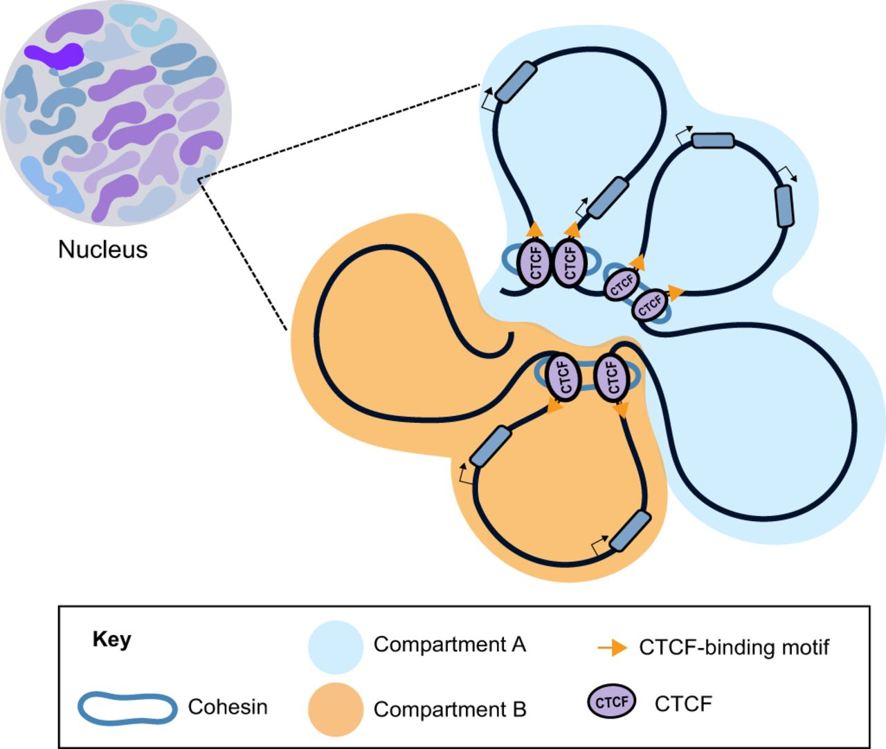
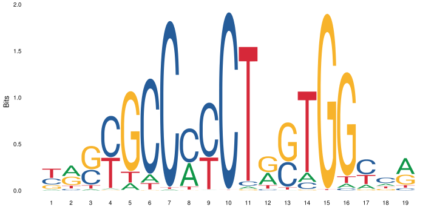

.. below role allows to use the html syntax, for example :raw-html:` `
.. role:: raw-html(raw)
    :format: html

=========================
Motif finding exercise
=========================

In this exercise we will try a few *de-novo* motif finding programs on data sets from human and mouse. We will also compare the motifs we find to a database of known motifs.

.. Contents
.. =========

.. contents::
    :local:

0. Set up
============

Log in to Uppmax, and start an interactive session.

Load the modules we will use in the exercise:

.. code-block:: bash

	module load bioinfo-tools
	module load BEDTools
	module load HOMER

Create a working directory where you will do the exercise, and go there. For example:

.. code-block:: bash

	mkdir motif_lab
	cd motif_lab

Note that the programs used in this exercise produce html output. You view these directly on Uppmax, though this is a bit slow. Otherwise you can copy the files to you local computer, and open them there.

1. Download CTCF data
=======================

First, we will look at a ChIP-seq experiment using an antibody against *CTCF*. *CTCF* (CCCTC-binding factor) is a zinc-finger protein that functions as a transcription factor. It also has insulator activity and is important for the 3D structure of chromatin, through formation of chromatin loops.

*CTCF* is a well studied protein, and many ChIP-seq data sets are available for CTCF. Its DNA motif is `well known <http://jaspar.genereg.net/matrix/MA0139.1/?revcomp=1>`_ (as you can tell from its name).

We will use `this data set <https://www.encodeproject.org/experiments/ENCSR572DUJ/>`_, from ENCODE. This page shows information about this particular experiment, along the experimental protocols and analysis pipelines used. Scroll down a bit and select the tab "File details". Now you will see a list of files available for download. We will use the bed files with "pseudoreplicated idr thresholded peaks". Download this file:

.. code-block:: bash

	wget https://www.encodeproject.org/files/ENCFF693MYU/@@download/ENCFF693MYU.bed.gz
	gunzip ENCFF693MYU.bed.gz

2. Prepare peak data
======================

The peaks are on the "narrowPeak bed format", described `here <https://genome.ucsc.edu/FAQ/FAQformat.html#format12>`_

Have a look at the file:

.. code-block:: bash

	less ENCFF693MYU.bed

It's often a good idea to just use the peaks with the strongest signal for motif finding. This is becuase a) motif finding programs have a hard time handling large inputs, and b) the peaks with the strongest signal are most likely to be true binding sites and to contain the motif of interest. Therefore, we will run motif finding on the top 500 peaks. To get the top 500 peaks, we first sort the peaks on "signalValue" in column 7 (using the ``sort`` command) and then take the first 500 peaks (using the ``head`` command):

.. code-block:: bash

	sort -k 7,7nr  ENCFF693MYU.bed | head -n 500 > ENCFF693MY_top500.bed

Have look at the resulting file:

.. code-block:: bash

	less ENCFF693MY_top500.bed

3. Prepare sequence data
=============================

Next, we need to get the genome sequence at these 500 peaks. Since repeat elements can confuse the motif finding programs, we will use a repeat-masked version of the genome, where all repeat sequences have been replaced with Ns. Create a soft link to the repeat masked genome in you working directory:

.. code-block:: bash

	ln -s /sw/courses/epigenomics/motif_finding/hg38.masked.fa* .

We will now use ``bedTools`` to extract the genome sequence for the 500 peaks:

.. code-block:: bash

	bedtools getfasta -fo CTCF_top500_peak_seq.fa -fi hg38.masked.fa -bed ENCFF693MY_top500.bed

You can see the documentation for the program you just used `here <https://bedtools.readthedocs.io/en/latest/content/tools/getfasta.html>`_. Now, have a look at the fasta file produced:

.. code-block:: bash

	less CTCF_top500_peak_seq.fa

4. Use the MEME suite for motif finding
==========================================

We will now run some programs from the MEME suite. These are available on Uppmax though the ``MEMEsuite`` module, but currently there are some problems with this installation. Instead, we will run the programs inside a container. For more information on containers, we refer to the course `Tools for reproducible research <https://nbis-reproducible-research.readthedocs.io/en/course_2104/singularity/>`_.

First we try DREME, which is a fast program that looks for regular expressions (documentation `DREME <http://meme-suite.org/doc/dreme-tutorial.html>`_). This takes a few minutes to run:

.. code-block:: bash

  singularity exec \
    /sw/courses/epigenomics/motif_finding/meme.sif \
    dreme -p CTCF_top500_peak_seq.fa -oc dreme_out

DREME produces several output files. Take a look at the html file:

.. code-block:: bash

	firefox dreme_out/dreme.html

You see a list of motifs represented as regular expressions and sequence logos, along with e-values and some links.

Next, we will try MEME-ChIP. This is a wrapper that runs several programs, including MEME, Spamo and Centrimo. It takes bit longer to run, around 10 minutes:

.. code-block:: bash

  singularity exec \
    /sw/courses/epigenomics/motif_finding/meme.sif \
    meme-chip -oc meme_chip_out CTCF_top500_peak_seq.fa

This produces several output files. The file ``meme_chip_out/meme-chip.html`` is a good starting point to look at the results. Open this file in a web browser:

.. code-block:: bash

	firefox meme_chip_out/meme-chip.html

Here you can see all motifs found by MEME, with e-values etc.

**What can you learn from all this output? Did MEME find the expected motif? Did it find other motifs? Where are the motifs located in the peaks? How are the motifs located with respect to each other?**

5. What are the motifs we have found?
========================================

Often when we find a motif, we want to see if it is similar to any motif that is already known. One tool to do this is called Tomtom, and is part of the same suite of programs as MEME etc. To try this, open the MEME-chip output again.

There used to be a simple interface where motifs found be MEME could directly be exported to Tomtom, but this doesn't work well. Instead we will upload the motifs manually. To do this go to the Tomtom `web interface <http://meme-suite.org/tools/tomtom>`_.

For the top motif, paste the following count matrix in the box under "Input query motifs". Then click "Start Search".

.. code-block:: bash

  11  142  293   23
   4  305    3  157
  16    4  416   33
  21  416    9   23
   1  465    1    2
 166  284   12    8
   0  306    1  163
   1  468    0    1
  10   21   12  427
 135   33  251   51
   4  110  345   11
  24  111   10  325
   1    1  466    2
   6   16  425   23
  67  288   24   90

For the second motif, use the following count matrix:

.. code-block:: bash

  20   17   21   35
   9   17   52   15
  20   23   25   25
  20    0   63   10
   0    7   74   12
  46   25    3   19
  88    1    0    4
   2   74    0   17
   0    4    0   89
   0    0   93    0
   0   93    0    0
  80    1   12    0
   2   14   69    8
   4   55   34    0
  11   56    8   17

**What is the top scoring motif? Does it look similar to the motif we found? What about other motifs further down the list?**

6. Try HOMER
================

Finally, we will try another popular motif finding software, HOMER. Here we will look at a
`CTCF chipseq experiment from mouse <https://www.encodeproject.org/experiments/ENCSR000CBJ/>`_. First, download the bed file with the peaks and select the top 500 peaks:

.. code-block:: bash

	wget https://www.encodeproject.org/files/ENCFF311HPG/@@download/ENCFF311HPG.bed.gz
	gunzip ENCFF311HPG.bed.gz
	sort -k 7,7nr ENCFF311HPG.bed | head -n 500 > mouse_CTCF_top500.bed

Then run HOMER on the top 500 peaks. Note that HOMER comes with a number of pre-formatted genomes, so you just give it the coordinates of the peaks and tell it which genome you are looking at. This can take a while to run, around 20-30 minutes.

Have a look at the resulting html file. Here you can see a list of *de-novo* motifs found and which known motifs these are similar to. The program also scans the peaks for all known motifs, and indicates which motifs are enriched on the peak region. Klick on *Known Motif Enrichment Results* to see the results.

.. code-block:: bash

	findMotifsGenome.pl mouse_CTCF_top500.bed mm10 homer_out_mouse_ctcf -size 200 -mask -preparsedDir tmp_homer/
	firefox homer_out_mouse_ctcf/homerResults.html

**What does HOMER find? Is this output easy to interpret?**

.. ----

.. Written by: Jakub Westholm
.. rst by: Agata Smialowska
