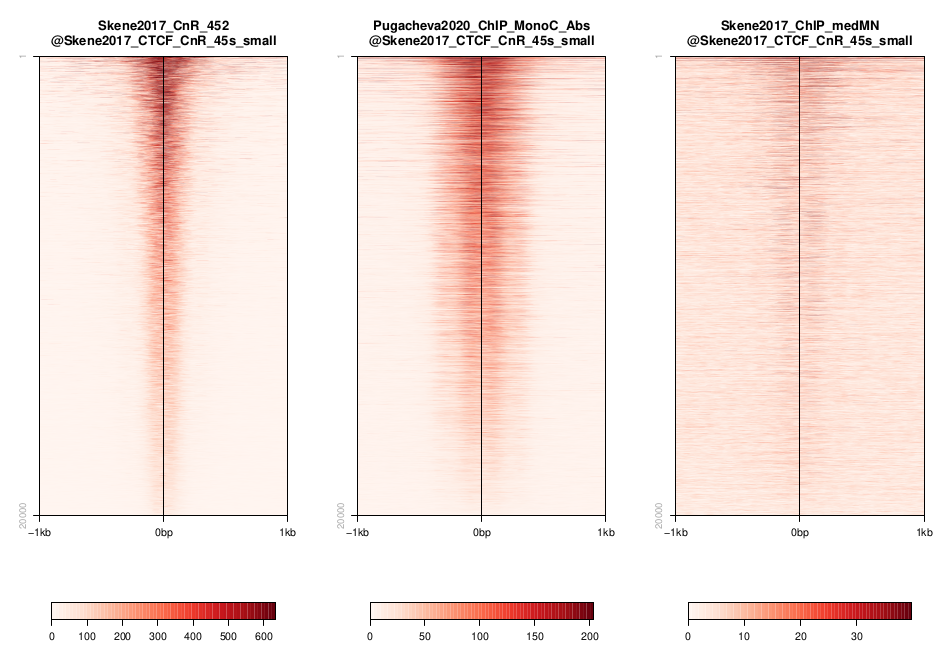

.. below role allows to use the html syntax, for example :raw-html:` `
.. role:: raw-html(raw)
    :format: html

=================================================
In-situ methods: CUT&RUN and ChIP data for CTCF
=================================================

.. Contents
.. ========

.. contents:: 
    :local:

Background
=============

CTCF (CCCTC-binding factor) is a very general architectural protein that mediates interchromosomal or intrachromosomal interactions. By recruiting additional structural proteins like condensin, they create chromatin loops and contact points. CTCF is a sequence-specific binding factor with a well-known sequence motif. There are 55,000-65,000 theoretical binding sites in the human genome (predicted by the consensus sequence). Of these, 5000 appear to be occupied by CTCF in every tissue/cell type, whereas up to 60% are used cell-type specifically. DNA methylation modulates CTCF binding (lowering CTCF affinity). Given the plethora of knowledge and datasets available one would think that there is a universal agreement on where CTCF binds in which cell type. However, different ChIP-Seq data and alternative profiling methods actually give different qualitative and certainly quantitative answers. 

So we will look at a comparison of CUT&RUN and different ChIP datasets to understand why and how different datasets report different binding sites.

.. image:: Figures/00_CTCF.png
	:target: Figures/00_CTCF.png
	:alt:

*Fig. 1: Features of CTCF-binding sites in the genome*

Datasets
==========

The datasets used correspond to two publications: 

Skene PJ, Henikoff S. An efficient targeted nuclease strategy for high-resolution mapping of DNA binding sites. Elife 2017.
https://elifesciences.org/articles/21856

Pugacheva, Elena M., et al. CTCF mediates chromatin looping via N-terminal domain-dependent cohesin retention. Proceedings of the National Academy of Sciences 117.4 (2020).
https://www.pnas.org/content/117/4/2020

They can be found on GEO (GSE84474 and GSE137216). See below a table with the samples included in this example:

In Skene and Henikoff, they compare CUT&Run to their own ChIP (special optimized native ChIP for CTCF they say).

.. list-table:: Table 1. Files in Skene et al. 2017 used in this exercise.
   :widths: 25 40
   :header-rows: 1

   * - GEO Accession
     - Sample
   * - GSM2247150
     - NBIS_Skene2017_K562_CTCF_ChIP_loMN
   * - GSM2247152 
     - NBIS_Skene2017_K562_CTCF_ChIP_medMN    
   * - GSM2247154 
     - NBIS_Skene2017_K562_CTCF_ChIP_hiMN     
   * - GSM2433137 
     - NBIS_Skene2017_K562_CTCF_CnR_15s       
   * - GSM2433139 
     - NBIS_Skene2017_K562_CTCF_CnR_3m        
   * - GSM2433140 
     - NBIS_Skene2017_K562_CTCF_CnR_45s       
   * - GSM2433141 
     - NBIS_Skene2017_K562_CTCF_CnR_5s        
   * - GSM2433142 
     - NBIS_Skene2017_K562_CTCF_CnR_9m        

In Pugacheva et. all, they perform a crosslinking ChIP for CTCF. They’ve been using different antibodies just to be sure that they are ChIPing the right thing.

.. list-table:: Table 2. Files in Pugacheva et al. 2020 used in this exercise.
   :widths: 25 40
   :header-rows: 1

   * - GEO Accession
     - Sample
   * - GSM4073237
     - NBIS_Pugacheva2020_K562_ChIP_CTCF_MonoC_Abs
   * - GSM4073240 
     - NBIS_Pugacheva2020_K562_ChIP_CTCF_MonoN_Abs_Rep1    
   * - GSM4073238 
     - NBIS_Pugacheva2020_K562_ChIP_CTCF_RabbitC_Abs     
   * - GSM4073242 
     - NBIS_Pugacheva2020_K562_ChIP_Mix_of_CTCF_PolyC_Abs       
   * - GSM4073239 
     - NBIS_Pugacheva2020_K562_ChIP_IGG_Abs_Control        

You can find many more CTCF datasets In the `Cistrome database <http://cistrome.org/db>`_!

Data preprocessing
====================

Primary analysis of the initial FASTQ files was performed beforehand. Reads were mapped with ``bowtie2`` with default parameters. Resulting BAM files were deduplicated using Picard and blacklisted regions were removed. Peak files were generated using ``MACS2`` using very standard parameters: ``--qval cutoff 0.01``. In this case no replicates were used to call the peaks. BigWig files were generated with ``deepTools`` to 1x coverage. Resulting files are available under ``/sw/courses/epigenomics/quantitative_chip_simon/K562_CTCF_CnR``

.. attention::
   You can download bigWig and peak annotations. Most of what we are going to do can be done locally on aregular laptop. When this is not the case, Uppmax-specific instructions will be given. In case something does not work properly, the output of most of these is available also in the workshop folder and in this documentation.

When running things on Uppmax, copy the files to your home directory:

.. code-block:: bash

    cd
    mkdir -p quant_chip/bw
    cd quant_chip/bw
    
    cp /sw/courses/epigenomics/quantitative_chip_simon/K562_CTCF_CnR/*.bw .
    
    # Or you can create symlinks for the bigWig files instead:
    for i in /sw/courses/epigenomics/quantitative_chip_simon/K562_CTCF_CnR/*.bw; do ln -s ${i}; done

Manual inspection of bigwig profiles with IGV
==============================================

Besides quality control tools and exploratory analyses, it is usually a good idea to have a look at the data without any further processing to have an idea about how it looks like. It can help spot technical issues or processing problems.

If you have not done it yet, download a copy of the bigWig and peaks to your local laptop:

.. code-block:: bash

    scp <youruser>@rackham.uppmax.uu.se:/sw/courses/epigenomics/quantitative_chip_simon/K562_CTCF_CnR/*.bw <path/to/your/local/folder>

Open IGV and import the bigWig files. You should see something like this:

**Q: Note down some observations concerning following questions:**

- How are the samples similar and how are they different?
- Can you make a prediction about the peak calling result?

Go to this site ``chr1:27,389,733-27,973,162``
(corresponding to `Figure 8 <https://elifesciences.org/articles/21856/figures#fig8>`_ ).

**Q: Are peaks shared, or unique to a specific technique?**

Quality Control
================

Quality Control metrics are very important to understand whether the experiment worked or not and spot possible caveats that may come up before further analysis. As mentioned in other tutorials, some metrics that can be useful are:

- Library complexity estimates and duplication rates.
- Sample clustering (PCA, correlation).
- Insert size distribution.
- Cumulative enrichment.

Correlation plots
-----------------

One way to look at similarity between ChIP dataset is to partition the signal in bins of a fixed size and compute a pairwise correlation value between distributions. 

This can be done using ``deepTools``.

This is a time consuming step that would need to be done on Uppmax. Move to the directory where you copied bigWig files on Uppmax. If you followed the same names, it would be:

.. code-block:: bash
    
    cd ~/quant_chip

Load deepTools (and bioinfo-tools module beforehand):

.. code-block:: bash
    
    module load bioinfo-tools
    module load deepTools

``deepTools`` needs that you first compute a bin matrix. From this, many other things can be done, such as correlation plots and PCA:

.. code-block:: bash

    # Labels basically follow alphabetical order (which is the way blob *.bw will expand).
    # But if you want to be totally sure, it’s better to spell out the order, as there may be 
    # some surprises: https://unix.stackexchange.com/questions/368318/does-the-bash-star-wildcard-always-produce-an-ascending-sorted-list
    
    multiBigwigSummary bins -b \
        ./bw/NBIS_Pugacheva2020_K562_ChIP_CTCF_MonoC_Abs.GRCh38.bw \
        ./bw/NBIS_Pugacheva2020_K562_ChIP_CTCF_MonoN_Abs_Rep1.GRCh38.bw \
        ./bw/NBIS_Pugacheva2020_K562_ChIP_CTCF_RabbitC_Abs.GRCh38.bw \
        ./bw/NBIS_Pugacheva2020_K562_ChIP_IGG_Abs_Control.GRCh38.bw \
        ./bw/NBIS_Pugacheva2020_K562_ChIP_Mix_of_CTCF_PolyC_Abs.GRCh38.bw \
        ./bw/NBIS_Skene2017_K562_CTCF_ChIP_hiMN.GRCh38.bw \
        ./bw/NBIS_Skene2017_K562_CTCF_ChIP_loMN.GRCh38.bw \
        ./bw/NBIS_Skene2017_K562_CTCF_ChIP_medMN.GRCh38.bw \
        ./bw/NBIS_Skene2017_K562_CTCF_CnR_15s.GRCh38.bw \
        ./bw/NBIS_Skene2017_K562_CTCF_CnR_3m.GRCh38.bw \
        ./bw/NBIS_Skene2017_K562_CTCF_CnR_452.GRCh38.bw \
        ./bw/NBIS_Skene2017_K562_CTCF_CnR_5s.GRCh38.bw \
        ./bw/NBIS_Skene2017_K562_CTCF_CnR_9m.GRCh38.bw \
        -bs 5000 -p 10 -o ./bins_table.npz --outRawCounts ./bins_table.tab \
        --labels \
        Pugacheva2020_ChIP_MonoC \
        Pugacheva2020_ChIP_MonoN \
        Pugacheva2020_ChIP_RabbitC \
        Pugacheva2020_ChIP_Control \
        Pugacheva2020_ChIP_Mix \
        Skene2017_ChIP_hiMN \
        Skene2017_ChIP_loMN \
        Skene2017_ChIP_medMN \
        Skene2017_CnR_15s \
        Skene2017_CnR_3m \
        Skene2017_CnR_452 \
        Skene2017_CnR_5s \
        Skene2017_CnR_9m

.. note::
    The parameter ``--outRawCounts`` is not necessary and usually not generated, as the same values are saved in ``bins_table.npz`` in a way they occupy less space. But raw counts are text, so you can basically peek at the values directly using ``head`` or ``more``.

The ``.npz`` matrix is then used by ``deepTools`` to produce other plots. For our correlation plot:

.. code-block:: bash

    plotCorrelation --corData ./bins_table.npz \
        --plotFile ./correlation_spearman_all.png \
        --whatToPlot heatmap \
        --corMethod spearman

This will generate a correlation plot based on genome-wide 5kb bins.

**Q: Check out how the datasets cluster - does it make sense? Is the overall clustering following the biological target/control or underlying batch effect?**

Cumulative enrichment
---------------------

Also known as fingeprint plots, these give a feeling about the signal to noise ratio of each signal. You
can understand more about what they exactly mean in `deepTools` `documentation <https://deeptools.readthedocs.io/en/develop/content/tools/plotFingerprint.html#id6>`_

You can plot this with ``deepTools as well``. This requires the BAM files and takes quite a bit to compute. You can symlink the bam files from: ``/sw/courses/epigenomics/quantitative_chip_simon/K562_CTCF_CnR/bam/`` the same way as before.

.. attention:: 
    This is a time consuming step that is recommended to do on Uppmax. You can also leave this for later and look at the results.

You can plot them.

.. code-block:: bash
    
    plotFingerprint -b \
      ./bam/NBIS_Skene2017_K562_CTCF_ChIP_hiMN.GRCh38.bam \
      ./bam/NBIS_Skene2017_K562_CTCF_ChIP_loMN.GRCh38.bam \
      ./bam/NBIS_Skene2017_K562_CTCF_ChIP_medMN.GRCh38.bam \
      ./bam/NBIS_Skene2017_K562_CTCF_CnR_15s.GRCh38.bam \
      ./bam/NBIS_Skene2017_K562_CTCF_CnR_3m.GRCh38.bam \
      ./bam/NBIS_Skene2017_K562_CTCF_CnR_45s.GRCh38.bam \
      ./bam/NBIS_Skene2017_K562_CTCF_CnR_5s.GRCh38.bam \
      ./bam/NBIS_Skene2017_K562_CTCF_CnR_9m.GRCh38.bam \
      -o ./hg38/bins/fingerprint_Skene2017.pdf \
      --labels \
      Skene2017_ChIP_hiMN \
      Skene2017_ChIP_loMN \
      Skene2017_ChIP_medMN \
      Skene2017_CnR_15s \
      Skene2017_CnR_3m \
      Skene2017_CnR_452 \
      Skene2017_CnR_5s \
      Skene2017_CnR_9m \
      -p 10

The resulting plot should look like:

.. image:: Figures/03_fingerprint1.png
	:target: Figures/03_fingerprint1.png
	:alt:

**Q: What do you think it means in terms of quality of experiments?**
**Do you see different groups of samples? Go to IGV and browse through the tracks.**
**How do each of these groups look? Fingerprint supports the difference CUT&RUN authors argue - That it has less background.**

Clearly, the CUT&Run data scores better by QC compared to the CTCF ChIP presented in this paper. But how about comparing to the Pugacheva CTCF ChIP datasets?

.. code-block:: bash

    plotFingerprint -b \
      ./bam/NBIS_Pugacheva2020_K562_ChIP_CTCF_MonoC_Abs.GRCh38.bam \
      ./bam/NBIS_Pugacheva2020_K562_ChIP_CTCF_MonoN_Abs_Rep1.GRCh38.bam \
      ./bam/NBIS_Pugacheva2020_K562_ChIP_CTCF_RabbitC_Abs.GRCh38.bam \
      ./bam/NBIS_Pugacheva2020_K562_ChIP_IGG_Abs_Control.GRCh38.bam \
      ./bam/NBIS_Pugacheva2020_K562_ChIP_Mix_of_CTCF_PolyC_Abs.GRCh38.bam \
      -o ./hg38/bins/fingerprint_Pugacheva2020.pdf \
      --labels Pugacheva2020_ChIP_MonoC Pugacheva2020_ChIP_MonoN Pugacheva2020_ChIP_RabbitC     Pugacheva2020_ChIP_Control Pugacheva2020_ChIP_Mix \
      -p 10

**Q: How does Pugacheva CTCF ChIP measure up with the CUT&Run? Given that the Skene CTCF ChIP was done under native conditions (no crosslinker) and Pugacheva CTCF ChIP (formaldehyde crosslinked), what do you think could be the problem with the native ChIP?**

Peak calling
============

Peaks were called with MACS2 using standard parameters.

.. attention::
    This is a step that could be better fine tuned to each experimental setting. 

Again, it is usually a good idea to inspect visually the files, so you can have a feeling on whether the peaks were correctly called and how the samples look like.

.. image:: Figures/05_IGV_peaks.png
	:target: Figures/05_IGV_peaks.png
	:alt:

**Q: Given the QC you did above, does the peak calling confirm the quality differences amongst the samples? Does a higher signal/noise allows to identify more peaks? Call peaks more confidently?**

Number of peaks per sample
--------------------------

A simple `wc` count per peak file allows you to quickly check how many peaks you got:

.. code-block:: bash

    94019 Pugacheva2020_ChIP_Mix_of_CTCF_PolyC_Abs.narrowPeak
    65837 Pugacheva2020_ChIP_CTCF_MonoC_Abs.narrowPeak
    50420 Pugacheva2020_ChIP_CTCF_RabbitC_Abs.narrowPeak
    40077 Pugacheva2020_ChIP_CTCF_MonoN_Abs_Rep1.narrowPeak
    828 Pugacheva2020_ChIP_IGG_Abs_Control.narrowPeak
    
    67164 Skene2017_CTCF_CnR_9m.narrowPeak
    52647 Skene2017_CTCF_CnR_3m.narrowPeak
    34678 Skene2017_CTCF_CnR_452.narrowPeak
    3782 Skene2017_CTCF_ChIP_loMN.narrowPeak
    3348 Skene2017_CTCF_ChIP_medMN.narrowPeak
    2897 Skene2017_CTCF_CnR_15s.narrowPeak
    2413 Skene2017_CTCF_CnR_5s.narrowPeak
    1611 Skene2017_CTCF_ChIP_hiMN.narrowPeak

Peaks overlap using ``intervene``
------------------------------------

``intervene`` is an easy to use tool to look for overlaps between BED files. It relies on ``bedtools``, but saves some work when looking at different sets of files. You can install it using ``pip`` as they 
 `explain <https://intervene.readthedocs.io/en/latest/install.html>`_

.. attention::
    There is no ``intervene`` module on Uppmax. If you want to run it there, you can probably install it using your usual ``conda`` environment or `pyenv`. See how to set ``pyenv`` `here <https://www.uppmax.uu.se/support/user-guides/python-modules-guide/>`_. 

You can generate venn diagrams (pairwise or more). For example, we may want to look at how much two of the CTCF ChIP peaks from Pugacheva 2020 agree:

.. code-block::
    
    intervene venn --in ./peaks/Pugacheva2020_ChIP_CTCF_Mono*.narrowPeak

This will output:

.. image:: Figures/06_venn_1.png
	:target: Figures/06_venn_1.png
	:alt:

As you can see there is a lot of overlap but MonoC dataset called much more peaks than MonoN.

Note that this can also be refined by setting overlap thresholds. See intervene documentation for the possibilities. The default behavior is to count any overlap as overlap.

A way of looking broadly at a set of BED files an the overlap between them is to do pairwise comparison:

.. code-block:: bash

    intervene pairwise --in ./peaks/*.narrowPeak 

will generate a plot like this.

.. image:: Figures/07_venn_pairwise.png
	:target: Figures/07_venn_pairwise.png
	:alt:

Very different numbers of peaks. 

**Q: How do you think the number of peaks relate to the fingerprint? (the ones with the most accentuated fingerprint are the ones showing larger amounts of peaks, however the difference is not such for some of the CnR samples. Why can that be?**

This has actually been noted in the CnR paper. They say that too scarce background read coverage can throw off traditional peak callers, thus they develop their own peak caller for CnR data.

**Q: Now that you have peaks, think about what you could do with the peak information. How to make sense of the peaks? Would you use the dataset with the most or the least peaks for downstream analysis?**

.. note::
    ``MACS`` doesn’t just give peaks, it also assigns a score. High/confident peaks have high score. Small peaks have low score. It is not apparent from the analysis above, but it is quite likely that if you would pick the top 5000 scored peaks from each dataset, the overlap would be extremely good.

Comparison between methods
==========================

As an example, we are going to look at one peak set representative for each method: CnR_45s, CTCF_ChIP_medMN from Skene 2017 and ChIP_MonoC from Pugacheva 2020.

We can look at the overlap between them in a venn diagram:

There are quite some differences  between approaches, and one of the peak sets is very small compared to the others.

.. note::
    These venn diagrams are not size proportional. Automatically drawing size-proportional set intersections is a complex problem. `eulerr` is an `R package <https://cran.r-project.org/web/packages/eulerr/vignettes/introduction.html>`_ that does a really nice job at approximating this. However it’s only for drawing, not for computing the actual intersections.

Heatmaps
=========

The fact that there are loci marked as peak in one dataset that do not appear in another does not mean that there is no signal there. It could not be called as peak due to lack of statistical power, the signal being weaker or a combination of other factors. Remember the example in the slides - some peaks don’t make the calling threshold, but still represent sites of enrichment:

So another way to look at this is to plot the signal of every dataset in a given peakset, for instance. This was run on a subset of 20000 peaks from Skane2017_CnR_45s. 

These heatmaps can be generated using ``seqplots``. ``seqplots`` is an ``R`` package that can be installed
from ``Bioconductor``. It can be run as a shiny app on a browser or from ``Rstudio``. You can check
how to use it `in this link <https://bioconductor.org/packages/release/bioc/vignettes/seqplots/inst/doc/SeqPlotsGUI.html>`_.

**Q: how does the data compare? Note the difference in scale amongst the samples. What other features are different? Which dataset would be better to identify the CTCF binding motif?**

.. note::
    In the Skene paper, the make a biological interpretation regarding the difference in peaks seen in native ChIP and CUT&Run. They call the peaks uniquely present in CUT&Run “indirect binding sites” because they infer that those peaks are not directly bound by CTCF. The tagging of sites potentially in intact nuclei works through space, thus tagging not only the loci that is bound by CTCF, but also those regions that are nearby in space (Hi-C contacts). So it is important to note that CUT&Run may report ‘indirect’ or ‘shadow’ peaks that do not represent bona fide binding sites. For CTCF in principle the distinction should be easy since the ‘shadow’ peaks should not have CTCF binding motif.

