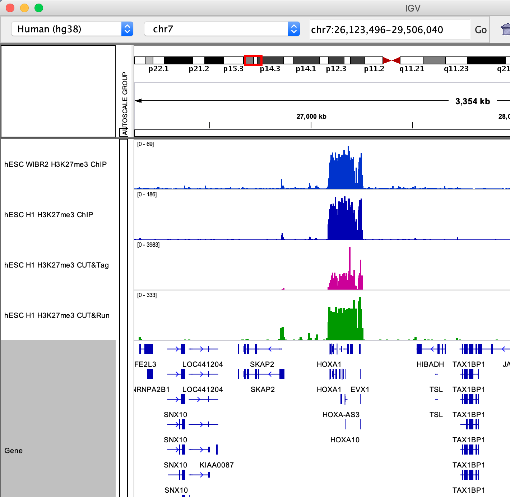
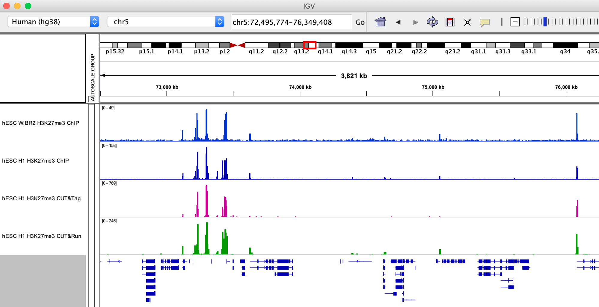
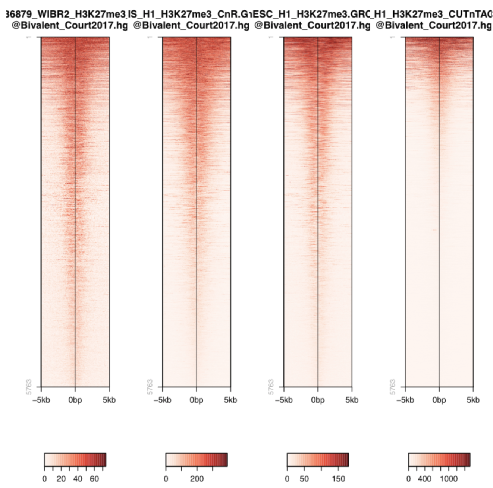
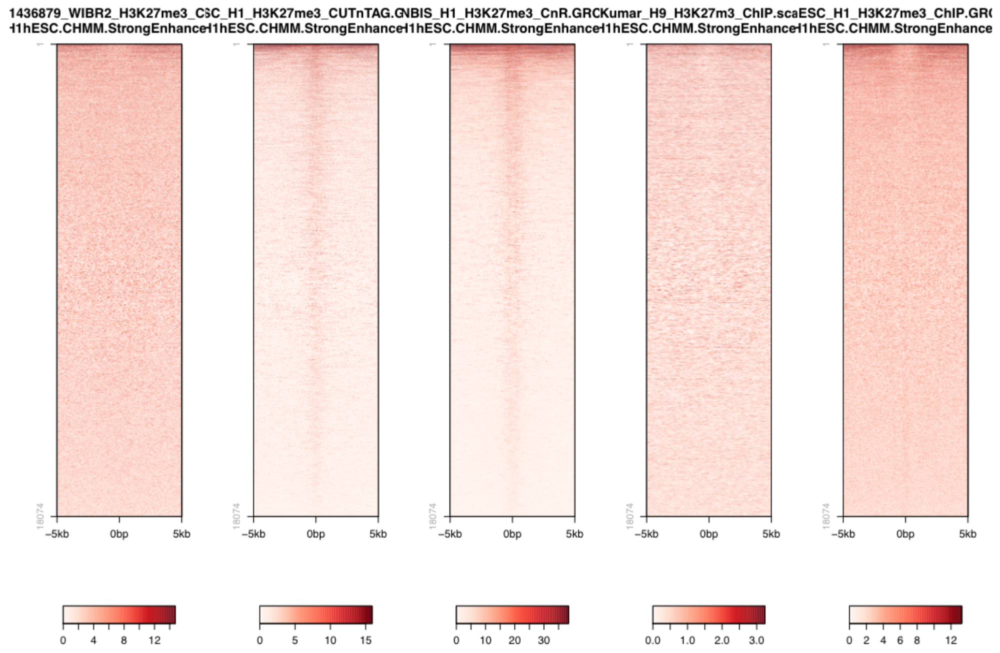

.. below role allows to use the html syntax, for example :raw-html:` `
.. role:: raw-html(raw)
    :format: html

===========================================
Analysis of CUT&Tag H3K27me3 dataset
===========================================

.. Contents
.. ========

.. contents:: 
    :local:

Background
==========

H3K27me3 is a histone modification associated with facultative heterochromatin, i.e. chromatin that is silenced in some but not all cell types within a body. It is written by Polycomb Repressive Complex 2. Important PRC2 targets are HOX gene cluster which delineate the body plan during embryogenesis. HOX genes are silenced in pluripotent stem cells before the come into action during early development.

Datasets
========

.. list-table:: Table 1. H3K27me3 datasets used in this exercise.
   :widths: 25 40 40
   :header-rows: 1

   * - GEO Accession
     - Sample
     - Reference
   * - GSM3536498
     - hESC_H1_H3K27me3_CnT
     - Kaya-Okur *et al.* 2019 [1]_
   * - GSM3677833 
     - NBIS_H1_H3K27me3_CnR   
     - Meers *et al.* 2019 [2]_ 
   * - 
     - hESC_H1_H3K27me3_ChIP     
     - 
   * - GSM1436879 
     - WIBR2_H3K27me3_ChIP
     - Theunissen *et al.* 2019 [3]_

H3K27me3-enriched regions from Court *et al.* 2019 [4]_: ``Bivalent_primed.hg38.bed`` (lift-overed from hg19).

Data preprocessing
==================

Primary analysis of the initial FASTQ files was performed beforehand. Reads were mapped with bowtie2 with default parameters. Resulting BAM files were deduplicated using Picard and blacklisted regions were removed. BigWig files were generated with deepTools to 1x coverage. Resulting files are available under ``/sw/courses/epigenomics/quantitative_chip_simon/hESC_H3K27me3``.

You can download bigWig and peak annotations. Most of what we are going to do can be done locally on a regular laptop. When this is not the case, Uppmax-specific instructions will be given. In case something does not work properly, the output of most of these is available also in the workshop folder and in this documentation.

When running things on Uppmax, copy the files to your home directory:

.. code-block:: bash

    cd
    mkdir -p cnt_chip/bw
    cd cnt_chip/bw
    
    cp /sw/courses/epigenomics/quantitative_chip_simon/hESC_H3K27me3/bw/*.bw .
    
    # Or you can create symlinks for the bigWig files instead:
    for i in /sw/courses/epigenomics/quantitative_chip_simon/hESC_H3K27me3/bw/*.bw; do ln -s ${i}; done

Manual inspection of bigWig files using IGV
===========================================

HOXA locus.

Smaller H3K27me3 domains.

**Q: What are your first impressions browsing the H3K27me3 data? Consider the Y axis used for each dataset and what it means regarding signal/noise ratio.**

Let’s look more systematically at known H3K27me3 peaks. We are using a published BED file of bivalent domains (Court *et al.* 2017 [4]_ ).

.. warning::
    These plots were generated in the past using ``seqplots``. Unfortunately, this package `is now deprecated <https://bioconductor.org/packages/release/bioc/html/seqplots.html>`_. You can still
    use older versions of R and this package, or just generate plots like this using another tool, like :code:`deepTools`. You can see more in their `documentation <https://deeptools.readthedocs.io/en/develop/>`_. And there are also examples in other tutorials, such as the MINUTE-ChIP data tutorial in this section.

**Q: The heatmaps show a similar colorscale but the signal to noise varies a lot (note the scale of CUT&TAG 0-1000!). Could there be a problem with CUT&Tag?**

A common critique about the in-situ methods is that they may be generating false-positive peaks at accessible sites of the genome, since MNase likes to cut open chromatin and Tn5 also is known to integrate best in open chromatin (ATAC-Seq!).

So we could also plot the signal over active enhancers which are 1) known to have open chromatin and 2) are decorated by H3K27ac, thus **cannot have H3K27me3**.

**Q: Is the aforementioned concern about false-positive peaks justified (consider the scale used here and above)?**

References
===============

.. [1] Kaya-Okur, Hatice S., et al. "CUT&Tag for efficient epigenomic profiling of small samples and single cells." Nature communications 10.1 (2019): 1930.
.. [2] Meers, Michael P., Derek H. Janssens, and Steven Henikoff. "Pioneer factor-nucleosome binding events during differentiation are motif encoded." Molecular cell 75.3 (2019): 562-575.
.. [3] Theunissen, Thorold W., et al. "Systematic identification of culture conditions for induction and maintenance of naive human pluripotency." Cell stem cell 15.4 (2014): 471-487.
.. [4] Court, Franck, and Philippe Arnaud. "An annotated list of bivalent chromatin regions in human ES cells: a new tool for cancer epigenetic research." Oncotarget 8.3 (2017).
