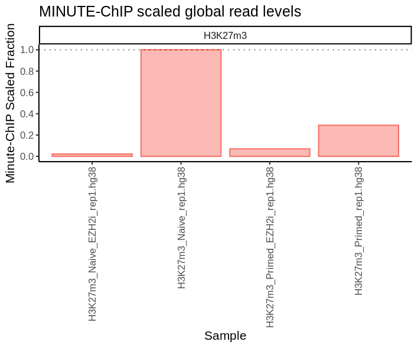
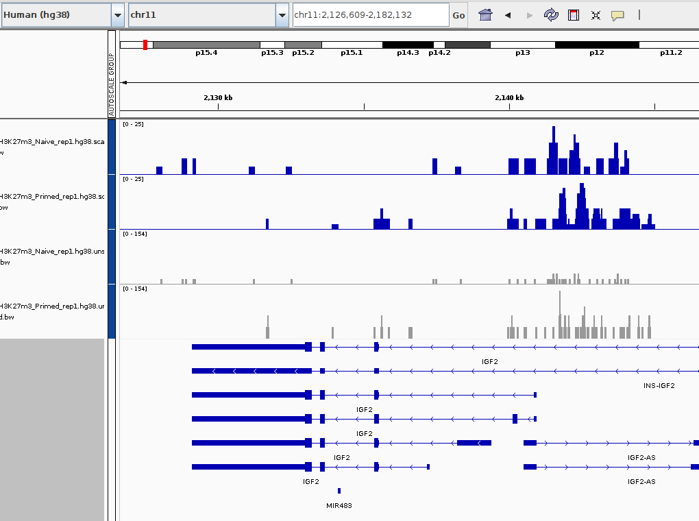
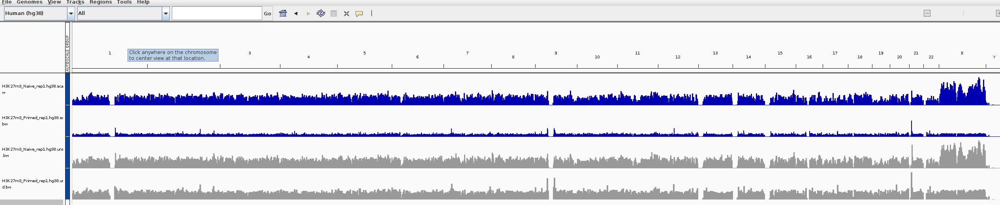

.. below role allows to use the html syntax, for example :raw-html:` `
.. role:: raw-html(raw)
    :format: html

MINUTE-ChIP
===========

.. Contents
.. ========

.. contents:: 
    :local:

Background
----------

Quantitative ChIP-seq methods allow us to compare the effect of DNA-protein interactions across samples. In our lab we developed **MINUTE-ChIP**, a multiplexed quantitative ChIP-seq method. 

To process the data with produce with this method, we developed Minute. Minute takes multiplexed MINUTE-ChIP FASTQ files and outputs a set of normalized, scaled bigWig files that can be directly compared across conditions.

We are going to analyse H3K27m3 data from human ESCs, where we have shown that Naive cells H3K27m3 landscape looks very different when compared to Primed cells in a quantitative manner.

This tutorial has two parts:

1. **Primary analysis**: Run a minute workflow on a small set of FASTQ files.
2. **Downstream analysis**: Look at the resulting bigWig files using usual bioinformatics tools.

In order to make this tutorial last a reasonable time, the **primary analysis** part is independent from the second part, as it runs only on a subset of the data you can see in the second part. During the **primary analysis**
you will see H3K27m3 data output for replicate 1 of our experiments. In the **downstream analysis** you can look at the three replicates together.

What you will learn:

- Apply the Minute data-processing pipeline to a set of MINUTE-ChIP fastq files.
- Visualize differences between unscaled and scaled bigWig files, using standard tools like IGV, seqtools. 
- Understand how quantitative ChIP results are different from traditional ChIP, using as example H3K27m3 data on human ESCs.

Primary analysis
----------------

Minute runs on `Snakemake <https://snakemake.readthedocs.io/en/stable>`_, a workflow management system that is based on python and inspired on makefile rules. You will learn more about workflow management on the Nextflow and nf-core tutorials, but let this first part of the tutorial serve as an example of how to run a different workflow, and give you an idea of the things that need to be done before getting to the downstream analysis.

Conda environment
^^^^^^^^^^^^^^^^^

To make sure you have all the necessary tools to run Minute, you can set up a conda environment using a :code:`environment.yml` specification file:

.. code-block:: bash

  module load bioinfo-tools
  module load conda

  conda env create -f /proj/epi2021/nobackup/minute_chip/minute-main/environment.yml -n minute_lab 

.. warning::
  There seems to be a problem with recent versions of :code:`tbb`, a :code:`bowtie2` dependency. We haven’t fixed yet this in the main repo, but you can downgrade tbb to a compatible version:

  .. code-block:: bash

    conda activate minute_lab
    conda install tbb=2020.2

  This will ask you if you want to downgrade :code:`tbb`. Say yes.

If you run into problems configuring this, there is a copy of a conda environment at: /proj/epi2021/nobackup/minute_chip/condaenv/minute_lab
It could work if you just:

.. code-block:: bash

  export CONDA_ENVS_PATH=/proj/epi2021/nobackup/minute_chip/condaenv/
  conda activate /proj/epi2021/nobackup/minute_chip/condaenv/minute_lab

Files
^^^^^ 

We will be using H3K27m3 data from our `publication <https://www.biorxiv.org/content/10.1101/2021.08.21.457215v1>`_:

Kumar, B., Navarro, C., Winblad, N., Schell, J. P., Zhao, C., Lanner, F., & Elsässer, S. J. (2021). Polycomb Repressive Complex 2 shields naïve human pluripotent cells from trophectoderm differentiation. bioRxiv.

In particular, we are going to look at Naïve vs Primed cells, and as control we have EZH2-inhibitor treatment, which removes H3K27m3 from the cells, creating a baseline for technical background.

There are 3 replicates for each condition. In the first part of the tutorial you will run replicate 1, and results for all replicates are available in the second part.

.. code-block:: bash
  
  # Create your primary analysis directory
  mkdir -p my_primary/fastq
  cd my_primary/fastq

  # Create symlinks to our fastq files
  for i in /proj/epi2021/nobackup/minute_chip/primary/*.fastq.gz; do ln -s ${i}; done
  cd ..
  cp /proj/epi2021/nobackup/minute_chip/primary/*.tsv
  cp /proj/epi2021/nobackup/minute_chip/primary/*.yaml

Now, this is how your file structure should look like:

- fastq/ - Contains all the fastq.gz files in the table below.
- libraries.tsv
- groups.tsv
- config.yaml

Minute needs three configuration files to run:

:code:`config.yaml`: Contains information about reference mapping: where the fasta files and bowtie2 indexes are, and a blocklist to remove artifact-prone regions before scaling:

.. code-block:: yaml

  references:
    hg38:  # Arbitrary name for this reference. This is also used in output file names.
      # Path to a reference FASTA file (may be gzip-compressed).
      # A matching Bowtie2 index must exist in the same location.
      fasta: "/proj/epi2021/nobackup/minute_chip/reference/hg38.fa"

      # Path to a BED file with regions to exclude
      exclude: "/proj/epi2021/nobackup/minute_chip/reference/hg38.blocklist.bed"

  # Length of the 5' UMI
  umi_length: 6

  # Fragment length (insert size)
  fragment_size: 150

:code:`libraries.tsv`: Contains information about the demultiplexing. In our case, the barcodes are skipped because we have the already demultiplexed FASTQ files. The raw FASTQ
mate 1 contains a 6nt UMI followed by a 8nt barcode that identifies the sample.

.. code-block::

  H3K27m3_Naive   1       .       H3K27m3-ChIP_H9_naive_rep1
  H3K27m3_Primed  1       .       H3K27m3-ChIP_H9_primed_rep1
  H3K27m3_Naive_EZH2i     1       .       H3K27m3-ChIP_H9_naive_EZH2i_rep1
  H3K27m3_Primed_EZH2i    1       .       H3K27m3-ChIP_H9_primed_EZH2i_rep1
  Input_Naive     1       .       IN-ChIP_H9_naive_rep1
  Input_Primed    1       .       IN-ChIP_H9_primed_rep1
  Input_Naive_EZH2i       1       .       IN-ChIP_H9_naive_EZH2i_rep1
  Input_Primed_EZH2i      1       .       IN-ChIP_H9_primed_EZH2i_rep1

:code:`groups.tsv`: Contains *scaling* information. Reads are normalized to matching sample input read counts, and in each scaling group, the first sample is used as reference. This has two implications:

1. Reference sample is normalized to 1x genome coverage.
2. Rest of samples values are directly comparable to the reference and across themselves.

Additionally, we may have some spike-in data from another reference, so Minute allows to map to different references in the same run. So :code:`groups.tsv` has also 

.. code-block::

  H3K27m3_Naive   1       Input_Naive     H3K27m3 hg38
  H3K27m3_Naive_EZH2i     1       Input_Naive_EZH2i       H3K27m3 hg38
  H3K27m3_Primed  1       Input_Primed    H3K27m3 hg38
  H3K27m3_Primed_EZH2i    1       Input_Primed_EZH2i      H3K27m3 hg38

.. list-table:: Table 1. Files used in this tutorial.
   :widths: 25 25 20 10 40
   :header-rows: 1

   * - IP
     - Cell type
     - Treatment
     - Rep
     - File
   * - H3K27m3
     - Naive
     - Untreated
     - 1
     - H3K27m3-ChIP_H9_naive_rep1_R{1,2}.fastq.gz
   * - H3K27m3
     - Naive
     - Untreated
     - 2
     - H3K27m3-ChIP_H9_naive_rep2_R{1,2}.fastq.gz
   * - H3K27m3
     - Naive
     - Untreated
     - 3
     - H3K27m3-ChIP_H9_naive_rep3_R{1,2}.fastq.gz
   * - H3K27m3
     - Naive
     - EZH2i
     - 1
     - H3K27m3-ChIP_H9_naive_EZH2i_rep1_R{1,2}.fastq.gz
   * - H3K27m3
     - Naive
     - EZH2i
     - 2
     - H3K27m3-ChIP_H9_naive_EZH2i_rep2_R{1,2}.fastq.gz
   * - H3K27m3
     - Naive
     - EZH2i
     - 3
     - H3K27m3-ChIP_H9_naive_EZH2i_rep3_R{1,2}.fastq.gz
   * - H3K27m3
     - Naive
     - Untreated
     - 1
     - H3K27m3-ChIP_H9_primed_rep1_R{1,2}.fastq.gz
   * - H3K27m3
     - Primed
     - Untreated
     - 2
     - H3K27m3-ChIP_H9_primed_rep2_R{1,2}.fastq.gz
   * - H3K27m3
     - Primed
     - Untreated
     - 3
     - H3K27m3-ChIP_H9_primed_rep3_R{1,2}.fastq.gz
   * - H3K27m3
     - Primed
     - EZH2i
     - 1
     - H3K27m3-ChIP_H9_primed_EZH2i_rep1_R{1,2}.fastq.gz
   * - H3K27m3
     - Primed
     - EZH2i
     - 2
     - H3K27m3-ChIP_H9_primed_EZH2i_rep2_R{1,2}.fastq.gz
   * - H3K27m3
     - Primed
     - EZH2i
     - 3
     - H3K27m3-ChIP_H9_primed_EZH2i_rep3_R{1,2}.fastq.gz

   * - Input
     - Naive
     - Untreated
     - 1
     - IN-ChIP_H9_naive_rep1_R{1,2}.fastq.gz
   * - Input
     - Naive
     - Untreated
     - 2
     - IN-ChIP_H9_naive_rep2_R{1,2}.fastq.gz
   * - Input
     - Naive
     - Untreated
     - 3
     - IN-ChIP_H9_naive_rep3_R{1,2}.fastq.gz
   * - Input
     - Naive
     - EZH2i
     - 1
     - IN-ChIP_H9_naive_EZH2i_rep1_R{1,2}.fastq.gz
   * - Input
     - Naive
     - EZH2i
     - 2
     - IN-ChIP_H9_naive_EZH2i_rep2_R{1,2}.fastq.gz
   * - Input
     - Naive
     - EZH2i
     - 3
     - IN-ChIP_H9_naive_EZH2i_rep3_R{1,2}.fastq.gz
   * - Input
     - Primed
     - Untreated
     - 1
     - IN-ChIP_H9_primed_rep1_R{1,2}.fastq.gz
   * - Input
     - Primed
     - Untreated
     - 2
     - IN-ChIP_H9_primed_rep2_R{1,2}.fastq.gz
   * - Input
     - Primed
     - Untreated
     - 3
     - IN-ChIP_H9_primed_rep3_R{1,2}.fastq.gz
   * - Input
     - Primed
     - EZH2i
     - 1
     - IN-ChIP_H9_primed_EZH2i_rep1_R{1,2}.fastq.gz
   * - Input
     - Primed
     - EZH2i
     - 2
     - IN-ChIP_H9_primed_EZH2i_rep2_R{1,2}.fastq.gz
   * - Input
     - Primed
     - EZH2i
     - 3
     - IN-ChIP_H9_primed_EZH2i_rep3_R{1,2}.fastq.gz

Normally, we run Minute on the multiplexed data. However, our pipeline can skip that step and go directly to the mapping and scaling.

Running Minute
^^^^^^^^^^^^^^ 

So if you already got your files, you need to run:

.. code-block:: bash

  conda activate minute_lab

  # Move to the directory where you copied the files
  cd my_primary

  # Run snakemake
  snakemake -p /proj/epi2021/nobackup/minute_chip/minute-main/Snakefile -j 4

:code:`-j` is the number of jobs or cores used by Snakemake. Depending on how many there are available on your node, you can raise this value.
The amount of files in this part of the tutorial is small enough to be possible to run in a local computer. For 4 out of 8 cores running on my laptop
(intel i7), this took around 4 hours to run. If you run this locally, consider not to use all the available cores you have, since you still need
to run other things on the side and it may eat up your RAM memory as well (more tasks means usually more memory use).

Essentially, the steps performed by Minute are:

- Demultiplex the reads and remove contaminated sequences (this is skipped in this execution).
- Map each condition to a reference genome.
- Deduplicate the reads.
- Remove excluded regions (such as artifact-prone regions, repeats, etc).
- Calculate scaling factors based on number of reads mapped and matching input conditions.
- Generate 1x coverage and scaled bigWig files from alignment using the calculated scaling factors.
- QC at every step (fastQC, Picard insert size metrics, duplication rates, etc) are gathered and output in the form of MultiQC report.

.. warning::
  When the demultiplexing is skipped, FastQC metrics are off, because they are calculated over a library size that it is very small, when they should
  be calculated over the whole pool. 

.. note::
  If the pipeline crashes at some point and you want to resume where it ran:

  .. code-block:: bash

    snakemake -p /proj/epi2021/nobackup/minute_chip/minute-main/Snakefile -j 4 --rerun-incomplete

After the pipeline is run, you will have the following folders:

- :code:`final/`: Contains final files: bigWig files, BAM files and demultiplexed FASTQ files (in this case, the same as your input).
- :code:`reports/`: Some reports on QC and scaling.
- :code:`log/`: Log output from each step.
- :code:`stats/`: Some stats files generated at each step.

Scaling info
^^^^^^^^^^^^ 

Scaling info is very relevant output, you will see the following figure under reports:

*Fig. 1: Global scaling for H3K27m3 replicate 1*

What you see here is that Naive has around 3 times as much H3K27m3 than Primed cells, and that EZH2i treatment removes the majority of H3K27m3.

IGV tracks
^^^^^^^^^^ 

You can take the final/bigwig files and look at them on IGV. Here you can see IGF2 gene, where once scaled, H3K27m3 decoration seems around the same values
Primed vs Naïve, information that is lost in unscaled files.

*Fig. 2: IGV screenshot of bigWig tracks at IGF2 gene. Gray tracks are unscaled, blue tracks are scaled. Here, Primed looks higher than Naïve, but upon scaling, values are similar.*

*Fig. 3: Overview of tracks. Gray tracks are unscaled, blue tracks are scaled.*

**Q: How is the global distribution of primed H3K27m3 changing upon scaling? Why do Naïve samples look the same both scaled and unscaled?**

.. note::
  Make sure you select the scaled tracks together and click on *group autoscale* so all the scales match.

Downstream analysis
-------------------

Files
^^^^^ 

Now you will get a copy of all the bigWig files.

.. code-block:: bash
  
  # Create your primary analysis directory
  mkdir my_downstream
  cd my_downstream

  mkdir bw

  cp /proj/epi2021/nobackup/minute_chip/downstream/*.bw bw/
  cp /proj/epi2021/nobackup/minute_chip/downstream/*.bed .

There should be :code:`unscaled` and :code:`scaled` bigWig files, plus a set of genes marked as Bivalent: :code:`Bivalent_Court2017.hg38.bed`. This annotation
comes from:

Court, F., & Arnaud, P. (2017). An annotated list of bivalent chromatin regions in human ES cells: a new tool for cancer epigenetic research. Oncotarget, 8(3), 4110.

Additionally, some bigWig tracks are pooled. These ones are all the replicates pooled together.

Looking at bivalent genes
^^^^^^^^^^^^^^^^^^^^^^^^^

You can look at these using `deepTools <https://deeptools.readthedocs.io/en/develop/>`_. deepTools is a suite to process sequencing data.

.. note::
  If you just ran the primary analysis before, and you have an active :code:`minute_lab` conda environment, you probably don't need to load the deepTools module anyway. Otherwise, you can do:

  .. code-block:: bash

    module load bioinfo-tools
    module load deepTools

We can use :code:`computeMatrix scale-regions` to calculate the values we will plot afterwards.

.. code-block:: bash

  computeMatrix scale-regions --downstream 3000 --upstream 3000 \
    -S ./bw/H3K27*pooled.hg38.scaled.bw \
    -R Bivalent_Court2017.hg38.bed \
    -o bivalent_mat_scaled.npz --outFileNameMatrix bivalent_values_scaled.tab -p 8

  computeMatrix scale-regions --downstream 3000 --upstream 3000 \
    -S ./bw/H3K27*pooled.hg38.unscaled.bw \
    -R Bivalent_Court2017.hg38.bed -o bivalent_mat_unscaled.npz \
    --outFileNameMatrix bivalent_values_unscaled.tab -p 8

.. note:: 
  This backslash `\\` means the command is not complete. So if you paste this to terminal you need to paste the whole thing. If you have problems with this, you can just paste it to a text editor and put it in one line, removing all the backslashes. For instance, here are the equivalent one liners for this:

  .. code-block:: bash

      computeMatrix scale-regions --downstream 3000 --upstream 3000 -S ./bw/H3K27*pooled.hg38.scaled.bw -R Bivalent_Court2017.hg38.bed -o bivalent_mat_scaled.npz --outFileNameMatrix bivalent_values_scaled.tab -p 8
      computeMatrix scale-regions --downstream 3000 --upstream 3000 -S ./bw/H3K27*pooled.hg38.unscaled.bw -R Bivalent_Court2017.hg38.bed -o bivalent_mat_unscaled.npz --outFileNameMatrix bivalent_values_unscaled.tab -p 8

.. note::
  You can adapt the :code:`-p` parameter to match the number of processors you allocated.

Then you can generate a plot by doing:

.. code-block:: bash
  
  plotProfile -m bivalent_mat_scaled.npz -o scaled_bivalent_profile.png --perGroup
  plotProfile -m bivalent_mat_unscaled.npz -o unscaled_bivalent_profile.png --perGroup

.. admonition:: Scaled vs unscaled results
   :class: dropdown, hint

   .. image:: Figures/minute_05_unscaled_bivalent_profile.png
          :width: 500px

   .. image:: Figures/minute_04_scaled_bivalent_profile.png
          :width: 500px

**Q: How do the scaled Naïve vs Primed differ when you move away from the gene body?**
You can check this by playing with the parameters :code:`--downstream` and :code:`--upstream` when running `computeMatrix`.

.. admonition:: Example command
   :class: dropdown, hint

     .. code-block:: bash

       computeMatrix scale-regions --downstream 5000 --upstream 5000 -S ./bw/H3K27*pooled.hg38.scaled.bw -R Bivalent_Court2017.hg38.bed -o bivalent_mat_scaled.npz --outFileNameMatrix bivalent_values_scaled.tab -p 8
    

**Q: How do the scaled vs unscaled plots differ? What do you think that means?**

.. admonition:: Explanation
   :class: dropdown, hint

    What is making all the difference is the real H3K27m3 background across the genome. You see in the scaled plots that Naïve is higher across. So what happens is that the "peaks" in naïve look smaller with such background, and if there is no absolute scaling that makes it possible to compare Naïve vs Primed, Naïve looks flat, as you saw in the unscaled plot. 

**Q: Is this a general effect, or is it dominated by a few loci?**

Hint: You can look at this using deepTools plotHeatmap function. It will take as input the matrix you calculated with :code:`computeMatrix` and generate a heatmap.

Genome-wide bin distribution
^^^^^^^^^^^^^^^^^^^^^^^^^^^^

Another way of looking at the general effect of the scaling genome-wide is using deepTools :code:`multiBigwigSummary` tool to generate bin average profiles genome-wide and look at their
distribution.

.. code-block:: bash

  multiBigwigSummary bins -b ./bw/H3K27*pooled.hg38.scaled.bw ./bw/H3K27*pooled.hg38.unscaled.bw -o 10kb_bins.npz --outRawCounts 10kb_bins.tab -bs 10000 -p 10

This will generate a :code:`10kb_bins.tab` tab-delimited file that contains mean coverage per 10kb bin across the genome for the different bigWig files. You can import this table into :code:`R` and
look at the bin distribution using some simple :code:`ggplot` commands.

.. note::
  Since you already have run RStudio in other tutorials, you can use any approach you have used before for running R. Just note that you need to have access to this `10kb_bins.tab` you just created. You can also do it locally in your computer, if you have a Rstudio version installed, and you will not need very unusual tools.

First, import the data into a data frame:

.. code-block:: R

  # Note it is important the :code:`comment.char` parameter, as deepTools inserts a :code:`#`, which is the default comment in R, so it will not read the header properly otherwise
  df <- read.table("./10kb_bins.tab", header=T, sep= "\t", comment.char = "")

  # You can check that this has reasonable names
  colnames(df)

**Q: How do replicates look?**

