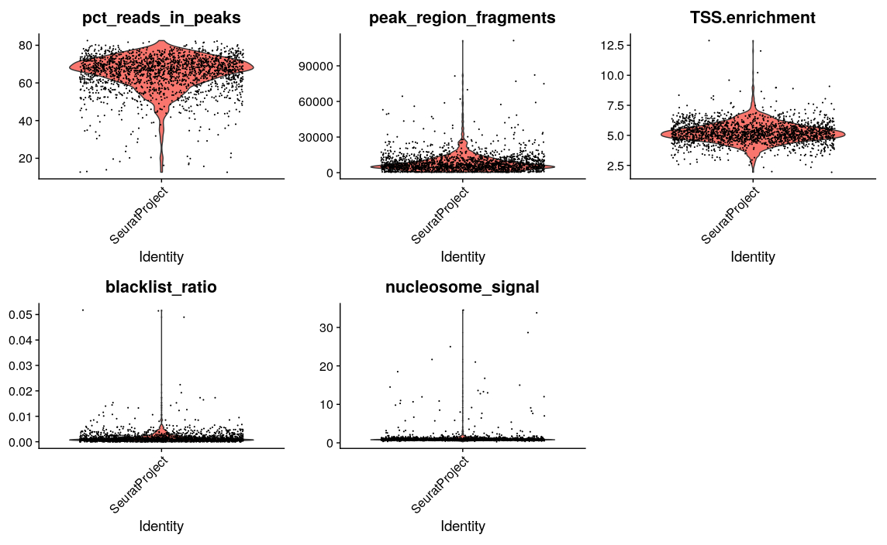
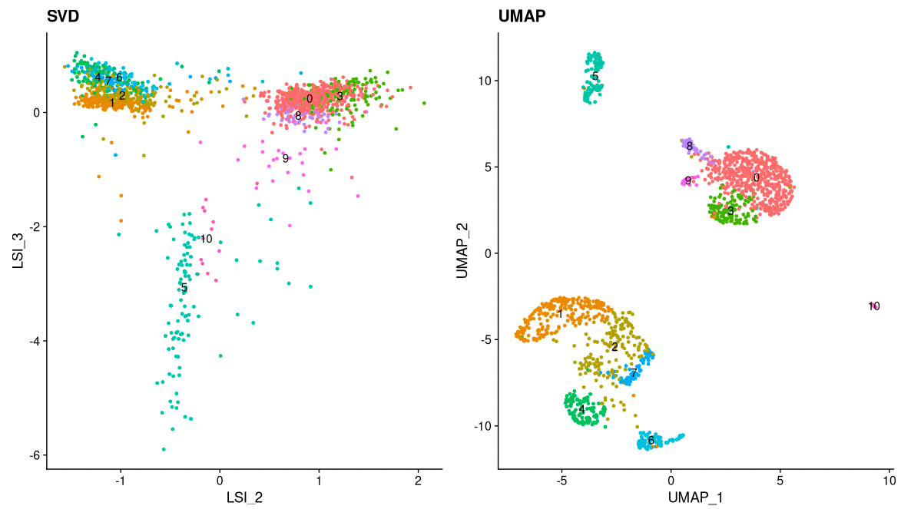
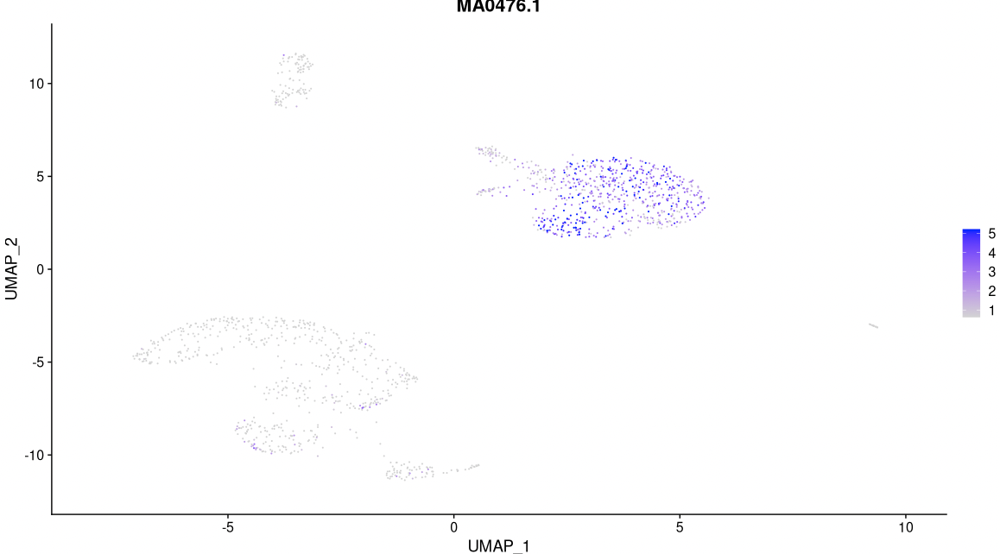
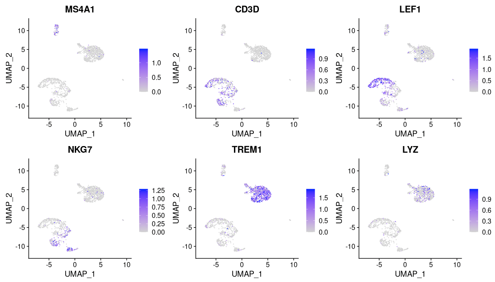
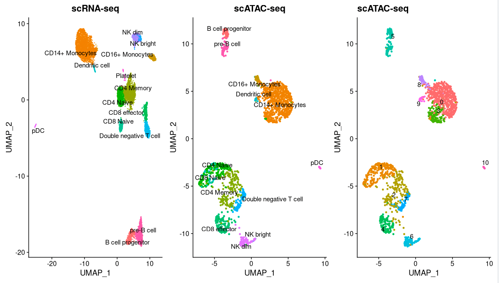
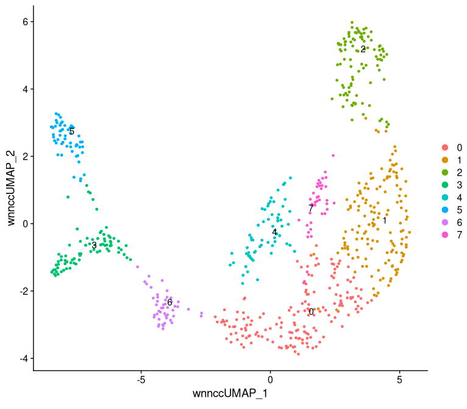
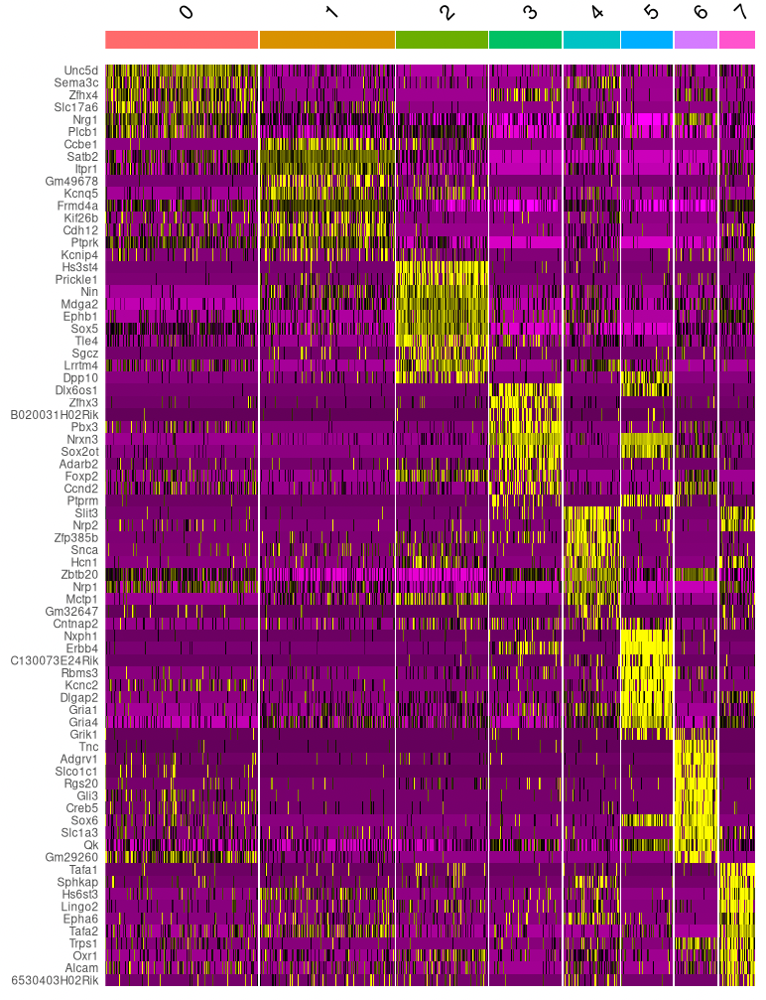

# Integrating scATAC-seq and scRNA-seq data

## Learning outcomes

- Being able to run the basic steps for quality control, normalization, dimensionality reduction, clustering and visualization of single cell ATAC-seq data

- Being able to combine single cell ATAC-seq data with RNA-seq data, to better infer cell types.

- Being able to run the basic steps for quality control, normalization, dimensionality reduction, clustering and visualization of single cell multio-omics (RNA-seq + ATAC-seq) data


**Table of contents**

- [Integrating scATAC-seq and scRNA-seq data](#integrating-scatac-seq-and-scrna-seq-data)
  - [Learning outcomes](#learning-outcomes)
  - [Setting up](#setting-up)
    - [Backup method for setting up](#backup-method-for-setting-up)
  - [Analysis of single cell ATAC-seq data](#analysis-of-single-cell-atac-seq-data)
    - [Loading scATAC-seq data](#loading-scatac-seq-data)
    - [Quality control](#quality-control)
    - [Normalization and initial dimensionality reduction](#normalization-and-initial-dimensionality-reduction)
    - [Clustering and further dimensionality reduction](#clustering-and-further-dimensionality-reduction)
    - [Motif analysis](#motif-analysis)
      - [Identifying enriched motifs](#identifying-enriched-motifs)
      - [Motif activity scores](#motif-activity-scores)
  - [Integrate with scRNA-seq data](#integrate-with-scrna-seq-data)
    - [Gene activity matrix](#gene-activity-matrix)
    - [Label transfer](#label-transfer)
    - [Differentially accessible regions, again](#differentially-accessible-regions-again)
    - [Annotating regions](#annotating-regions)
    - [Visualization](#visualization)
  - [Analysis of multi-omics data](#analysis-of-multi-omics-data)


## Setting up

### Option A

The easiest way to run this exercise, which we recommend, is on Uppmax using the module system. To do this, start an interactive session like you have done for the previous days, and then do

```bash
cd <some directory where you work with this course>

mkdir -p sc_lab/data
cd sc_lab/data
ln -s /sw/courses/epigenomics/sc_atac_seq/* .
cd ..

module purge
module load bioinfo-tools
module load R_packages/4.1.1
module load RStudio

rstudio &
```

Now you should be ready to go!

### Option B

An alternative option, is to run the exercise on Uppmax but in a container instead of using the module system. This is a bit more tricky, but there are several advantages:

- You can also use packages that have not previously been installed in Uppmax modules.

- You can use the same containers on other computers, and if you use the same container several years from now you are still sure that you are using exactly the same versions of all tools as you did before. This is great for reproducibility. (Please see the course [Tools for reproducible research](https://uppsala.instructure.com/courses/73110) is you are interested in containers, workflows etc.)

To set up this exercise using this option, you have to go through the following steps:

Log in to uppmax, and start an interactive session.


Create a new dirctory for the exercise, and go there

```
mkdir -p sc_lab
cd sc_lab
```

Run the following script on uppmax, to start Rstudio

```
/sw/courses/epigenomics/sc_atac_seq/startup_script.sh
```

This script will print some instructions, e.g.

```
SSH tunnel from your workstation using the following command:  

 ssh -N -L 8787:r142.uppmax.uu.se:36611 jacke@rackham.uppmax.uu.se

and point your web browser to http://localhost:8787 

```


On your local computer, run the ssh command printed above

Finally, start a web browser on your local computer, and go to [http://localhost:8787](http://localhost:8787).

You should now see Rstudio in you web browser, and can start the exercise.


.. ### Option C

.. If this doesn't work for some reason (*e.g.* if you don't have an account on uppmax), you can run the exercise entirely on your local computer. This has been tested on Mac, but chances are that it also works on Linux and Windows. Also note that R uses around 13Gb RAM running the commands in the exercise.

.. First, set up the directory where you will work


.. ```bash
.. cd <some directory where you work with this course>

.. mkdir -p sc_lab/data
.. cd sc_lab/data
.. ```

.. Install mamba, following the instructions [here](https://mamba.readthedocs.io/en/latest/micromamba-installation.html). Then, set .. up the environment using the commands below. This takes approximately one hour, depending on your network connection:

.. ```bash
.. curl https://raw.githubusercontent.com/NBISweden/workshop-epigenomics-RTDs/master/docs/content/tutorials/scAtacSeq/environment_epigenomics2023.yaml > environment_epigenomics2023.yaml

.. mamba env create -n environment_epigenomics2023 -f environment_epigenomics2023.yaml
.. ```
 
.. NOTE: The commands above don't work with new Macs with the new Apple chips (M1, M2 etc.). If you have a Mac from 2021 or later, instead run:

.. ```bash
.. curl https://raw.githubusercontent.com/NBISweden/workshop-epigenomics-RTDs/master/docs/content/tutorials/scAtacSeq/environment_epigenomics2023.yaml > environment_epigenomics2023.yaml

.. curl https://raw.githubusercontent.com/fasterius/dotfiles/main/scripts/intel-conda-env.sh > intel-conda-env.sh

.. chmod a+x intel-conda-env.sh

.. ./intel-conda-env.sh mamba env create -n environment_epigenomics2023 -f environment_epigenomics2023.yaml
.. ```

.. Next download the data needed for the exercise (5.4 Gb, make sure you delete the files when you no longer need them):

.. ```bash
.. # download data for exercise
.. curl -OJ https://export.uppmax.uu.se/naiss2023-23-349/sc_atac_seq/atac_v1_pbmc_10k_filtered_peak_bc_matrix.h5
.. curl -OJ https://export.uppmax.uu.se/naiss2023-23-349/sc_atac_seq/atac_v1_pbmc_10k_fragments.tsv.gz
.. curl -OJ https://export.uppmax.uu.se/naiss2023-23-349/sc_atac_seq/atac_v1_pbmc_10k_fragments.tsv.gz.tbi
.. curl -OJ https://export.uppmax.uu.se/naiss2023-23-349/sc_atac_seq/atac_v1_pbmc_10k_singlecell.csv
.. curl -OJ https://export.uppmax.uu.se/naiss2023-23-349/sc_atac_seq/e18_mouse_brain_fresh_5k_atac_fragments.tsv.gz
.. curl -OJ https://export.uppmax.uu.se/naiss2023-23-349/sc_atac_seq/e18_mouse_brain_fresh_5k_atac_fragments.tsv.gz.tbi 
.. curl -OJ https://export.uppmax.uu.se/naiss2023-23-349/sc_atac_seq/e18_mouse_brain_fresh_5k_filtered_feature_bc_matrix.h5
.. curl -OJ https://export.uppmax.uu.se/naiss2023-23-349/sc_atac_seq/e18_mouse_brain_fresh_5k_per_barcode_metrics.csv
.. curl -OJ https://export.uppmax.uu.se/naiss2023-23-349/sc_atac_seq/pbmc_10k_v3.rds
.. curl -OJ https://export.uppmax.uu.se/naiss2023-23-349/sc_atac_seq/pbmc_granulocyte_sorted_10k_atac_fragments.tsv.gz
.. curl -OJ https://export.uppmax.uu.se/naiss2023-23-349/sc_atac_seq/pbmc_granulocyte_sorted_10k_atac_fragments.tsv.gz.tbi
.. curl -OJ https://export.uppmax.uu.se/naiss2023-23-349/sc_atac_seq/pbmc_granulocyte_sorted_10k_filtered_feature_bc_matrix.h5
.. cd ..
.. ```

.. Finally, activate the environment and start Rstudio.

.. ```bash
.. mamba activate environment_epigenomics2023
.. open -na Rstudio
.. ```

.. If everything has worked, you should now see Rstudio, and can start the exercise.


## Analysis of single cell ATAC-seq data

[Seurat](https://satijalab.org/seurat/) is the most widley used tool to analyze scRNA-seq data. Recently, this R package has been extended to support chromatin data, *e.g.* ATAC. This extension package is called [Signac](https://satijalab.org/signac/index.html). `Seurat` makes it possbile to integrate data from different technologies. Here, we will look at how `Seurat` and `Signac` can be used to integrate scATAC-seq and scRNA-seq data. This exercise is based on [this](https://stuartlab.org/signac/articles/pbmc_vignette), [this](https://satijalab.org/seurat/articles/atacseq_integration_vignette) and [this](https://stuartlab.org/signac/articles/motif_vignette) tutorial, using data on human peripheral blood mononuclear cells (PBMCs) provided by 10x Genomics. We will use data that have already been pre-processed using CellRanger. The starting point is a count matrix, with the number of reads in each peak in each cell, along with some meta data.

We start by loading the required packages: `Seurat`, `Signac`, some annotation packages and some packages for plotting.


```R
library(Signac)
library(Seurat)
library(GenomeInfoDb)
library(EnsDb.Hsapiens.v75)
library(patchwork)
library(JASPAR2020)
library(TFBSTools)
library(BSgenome.Hsapiens.UCSC.hg19)
library(BSgenome.Mmusculus.UCSC.mm10)
library(EnsDb.Mmusculus.v79)
library(tidyverse)
library(pheatmap)
library(scRNAseq)
library(SingleR)
set.seed(1234)
```

### Loading scATAC-seq data

The ATAC-seq data consists of four files, that are created with CellRanger.

- A count file. The rows are regions (peaks) and the colums are cells. Each entry *i,j* is the number of reads mapping to region *i* in cell *j*.

- A meta data file, with some overall statistics for each cell

- A fragment file, with information on all sequenced fragments (where it maps to the genome, which cell barcode is associated and how many PCR duplicates were found)

- An index file connected to the fragment file. This is like an index file for a bam file, to make it possible to quickly find fragments for a certain genomic region, without having to search the entire file.

The PBMC data set contains ATAC-seq data on 74836 regions in 9277 cells. The corresponding RNA-seq data covers 19089 genes in 9432 cells. To make the commands in this exercise run a bit faster, we will only analyze a set of 2000 (randomly selected) cells. If you have the time and interest, you can analyze the full data set by commenting out the corresponding line of code.

Here, we create a `ChromatinAssay` object from the count matrix (and a link to the fragment file). This object stores the genomic regions, count data, and also possibly gene annotations and information on sequence motifs. There are many ways to interact with a `ChromatinAssay` object, see [this](https://stuartlab.org/signac/articles/data_structures.html) vignette.

We then create a `Seurat` object from the `ChromatinAssay`, together with meta data about cells and gene annotations.

```R
counts <- Read10X_h5(filename = "data/atac_v1_pbmc_10k_filtered_peak_bc_matrix.h5")
counts <- counts[, sample(ncol(counts), 2000)] # Only use 2000 cells, to make commands run faster.

metadata <- read.csv(
    file = "data/atac_v1_pbmc_10k_singlecell.csv",
    header = TRUE,
    row.names = 1
)

chrom_assay <- CreateChromatinAssay(
    counts = counts,
    sep = c(":", "-"),
    genome = 'hg19',
    fragments = 'data/atac_v1_pbmc_10k_fragments.tsv.gz',
    min.cells = 10,
    min.features = 200
)

pbmc <- CreateSeuratObject(
    counts = chrom_assay,
    assay = "peaks",
    meta.data = metadata
)

# Extract gene annotations from EnsDb
annotations <- GetGRangesFromEnsDb(ensdb = EnsDb.Hsapiens.v75)

# Change to UCSC style since the data was mapped to hg19
seqlevelsStyle(annotations) <- 'UCSC'
genome(annotations) <- "hg19"

# Add the gene information to the object
Annotation(pbmc) <- annotations

# Inspect the objects we have created
pbmc
pbmc[['peaks']]
granges(pbmc)
```

### Quality control

The next step is to do some quality control (QC) on the ATAC-seq data. There are several qualtiy measures to consider:

- **Fragment sizes**, determined from paired-end sequencing data. For each cell we can quantify the fragment sizes by calculating the ratio of nucleosome size fragments (147-294 nucleotides) to nucleosome-free fragments (<147 nucleotides). Open chromatin corresponds to short DNA fragments, so we want to remove cells with too few short DNA fragments, coming from open chromatin.

- **Enrichment at transcription start sites (TSS).** Since chromatin is often open around TSS, we expect there to be an enrichment of fragments around these sites. This is quantified by collecting all fragments mapping around TSS to form an aggregate distribution, and comparing the highest level of fragments to the level of fragments 1000bp up and downstream of the TSS.

- **Number of fragments in peaks**. This represents the complexity and sequencing depth for each cell. Too many reads might indicate artefacts, such as several cells sharing a barcode.

- **Fraction of reads in peaks**. This represents how well that ATAC protocol has worked, and we typically reqiure at least 15% of all fragments to be in peaks.

- **Reads in blacklist regions.** The [ENCODE](https://www.encodeproject.org) project has defined lists of [blacklist regions](https://github.com/Boyle-Lab/Blacklist). These are problematic regions (typically repeats) that often have high signals in next-generation sequencing experiments regardless of cell line or experiment. Cells with a realtively high ratio of reads mapping to blacklist regions, compared to peaks, often represent technical artifacts and should be removed.

This takes a while to run (around 10 minutes).

```R
# Compute nucleosome signal score per cell
pbmc <- NucleosomeSignal(object = pbmc)

# Compute TSS enrichment score per cell
pbmc <- TSSEnrichment(object = pbmc, fast = FALSE)

# Add blacklist ratio and fraction of reads in peaks
pbmc$pct_reads_in_peaks <- pbmc$peak_region_fragments / pbmc$passed_filters * 100
pbmc$blacklist_ratio <- pbmc$blacklist_region_fragments / pbmc$peak_region_fragments

gc()

pbmc$high.tss <- ifelse(pbmc$TSS.enrichment > 2, 'High', 'Low')
TSSPlot(pbmc, group.by = 'high.tss') + NoLegend()
```


```R
pbmc$nucleosome_group <- ifelse(pbmc$nucleosome_signal > 4, 'NS > 4', 'NS < 4')
FragmentHistogram(object = pbmc, group.by = 'nucleosome_group')
```

```R
VlnPlot(
    object = pbmc,
    features = c('pct_reads_in_peaks', 'peak_region_fragments',
                 'TSS.enrichment', 'blacklist_ratio', 'nucleosome_signal'),
    pt.size = 0.1,
    ncol = 3
)
```



After calculating the qualtiy statistics, we apply (some rather arbitrary) cutoffs, to remove outlier cells. *How many cells do we have left after quality filtering in this example?*


```R
pbmc <- subset(
    x = pbmc,
    subset = peak_region_fragments > 3000 &
             peak_region_fragments < 20000 &
             pct_reads_in_peaks > 15 &
             blacklist_ratio < 0.05 &
             nucleosome_signal < 4 &
             TSS.enrichment > 2
)
pbmc
```


### Normalization and initial dimensionality reduction

**Normalization:** `Signac` performs term frequency-inverse document frequency (TF-IDF) normalization. This is a two-step normalization procedure, often used in natural language processing, that both normalizes across cells to correct for differences in sequencing depth, and across peaks to give higher values to more rare peaks.

**Feature selection:** To reduce noise, we sometimes only use some features (*i.e.* peaks) when we cluster cells. Often this is the peaks with the strongest signal, *i.e.* most reads, or the ones present in most cells. Here, we will use all peaks, but you can play around with this yourself. Try setting `min.cutoff = 'q75'` to use the top 25% peaks).

**Dimension reduction:** We next run singular value decomposition (SVD) on the normalized data matrix, using the features (peaks) selected above. This returns a reduced dimension representation of the matrix, similar to the output of PCA.

From the singular value decomposition, we get a set of components. The first of these components often correlates with sequencing depth, rather than any biologically meaningful signal. We can therefore remove this component in the following analysis.

```R
pbmc <- RunTFIDF(pbmc)
pbmc <- FindTopFeatures(pbmc, min.cutoff = 'q0')
pbmc <- RunSVD(pbmc)

DepthCor(pbmc)
```

### Clustering and further dimensionality reduction

Now, we can cluster the cells to find groups that belong to the same cell types. It is possible to plot the results from the SVD, but these often are not informative. Instead, we use the UMAP algorithm, which shows a better separation between the cell types. If you are interested, the paper describing UMAP can be found [here](https://arxiv.org/abs/1802.03426).

```R
pbmc <- RunUMAP(object = pbmc, reduction = 'lsi', dims = 2:34)
pbmc <- FindNeighbors(object = pbmc, reduction = 'lsi', dims = 2:34, k.param=13)
pbmc <- FindClusters(object = pbmc, verbose = FALSE)

p1 <- DimPlot(object = pbmc, label = TRUE, dims = c(2, 3), reduction = "lsi") +
    NoLegend()  +
    ggtitle('SVD')

p2 <- DimPlot(object = pbmc, label = TRUE) +
    NoLegend() +
    ggtitle('UMAP')

p1 | p2
```




This might be a good time to save your data, so you don't have to re-run all your analysis if you have problems with Uppmax or the network. To load the data later, type `load(file="pbmc.Rda")`.


```R
save(pbmc, file="pbmc.Rda")
```

### Motif analysis

We can also analyze motif occurrence in the peaks, to see how this varies between the different cell types.

#### Identifying enriched motifs

First, we will look at motifs that are enriched in a set of peaks, *e.g.* in peaks that show differential accessibility between two cell types. *Do you notice anything particular about these motifs?*


```R
# Get a list of motif position frequency matrices from the JASPAR database
pfm <- getMatrixSet(
    x = JASPAR2020,
    opts = list(species = "Homo sapiens", all_versions = FALSE)
)

# Scan the DNA sequence of each peak for the presence of each motif
motif.matrix <- CreateMotifMatrix(
    features = granges(pbmc$peaks),
    pwm = pfm,
    genome = 'hg19',
    use.counts = FALSE
)
dim(motif.matrix)
as.matrix(motif.matrix[1:10,1:10])
```


```R
# Create a new Mofif object to store the results
motif <- CreateMotifObject(
    data = motif.matrix,
    pwm = pfm
)

# Add the Motif object to the assay
pbmc <- SetAssayData(
    object = pbmc,
    assay = 'peaks',
    slot = 'motifs',
    new.data = motif
)
pbmc$peaks@motifs

# Calculate statistics for each peak: GC content, length, dinucleotide frequencies etc.
# These are used in the test of motif enrichment
pbmc$peaks <- RegionStats(object = pbmc$peaks, genome = BSgenome.Hsapiens.UCSC.hg19)

# Find differentially accessible peaks in cluster 0 compared to cluster 1
da_peaks <- FindMarkers(
    object = pbmc,
    ident.1 = "0",
    ident.2 = "1",
    only.pos = TRUE,
    min.pct = 0.2,
    test.use = 'LR',
    latent.vars = 'peak_region_fragments'
)

# Get the top differentially accessible peaks, with lowest p-values
top.da.peak <- rownames(da_peaks[da_peaks$p_val < 1e-20, ])

# Find motifs enriched in these top differentially accessible peaks
enriched.motifs <- FindMotifs(
    object = pbmc,
    features = top.da.peak
)
head(enriched.motifs)
```

```R
# Have a look at the most enriched motifs. Do you anything particular about these motifs?
MotifPlot(
    object = pbmc,
    motifs = head(rownames(enriched.motifs))
)
```

#### Motif activity scores

We can also compute a per-cell motif activity score by running chromVAR. The motif activity score for a motif M is based on the number of reads mapping to peaks with motif M, after normalization correction for various biases: GC content, average number of reads mapping across all cells etc. You can read more about chromVar [here](https://www.nature.com/articles/nmeth.4401). Motif activity scores allow us to visualize motif activities per cell.

It is also possible to directly test for differential activity scores between cell types, without looking at peaks with differential binding. This tends to give similar results as performing an enrichment test on differentially accessible peaks between the cell types (shown above).

This takes a while to run (around 5 minutes on Uppmax).

```R
# Use chromVAR to calculate the motif activities of all motifs in all cells.
pbmc <- RunChromVAR(
    object = pbmc,
    genome = BSgenome.Hsapiens.UCSC.hg19,
    verbose = TRUE
)

# Look at results
pbmc$chromvar
GetAssayData(pbmc$chromvar)[1:10,1:3]

# Have a look at the activitiy of the FOS motif, which has id MA0476.1
DefaultAssay(pbmc) <- 'chromvar'
FeaturePlot(
    object = pbmc,
    features = "MA0476.1",
    min.cutoff = 'q10',
    max.cutoff = 'q90',
    pt.size = 0.1
)
```


```R
# Look for motifs that have differential activity between clusters 0 and 1.
differential.activity <- FindMarkers(
    object = pbmc,
    ident.1 = '0',
    ident.2 = '1',
    only.pos = TRUE,
    test.use = 'LR',
    min.pct = 0.2,
    latent.vars = 'nCount_peaks'
)

MotifPlot(
    object = pbmc,
    motifs = head(rownames(differential.activity)),
    assay = 'peaks'
)
```




## Integrate with scRNA-seq data

In this section, we will compare the scATAC-seq data to scRNA-seq data from a similar starting material (although not from exatcly the same cells). Since it is easier to figure out which cell types clusters correspond to in scRNA-seq data, we will then use the scRNA-seq data to annotate the clusters in the scATAC-seq data. (Note that if you have multi-omics data, with RNA-seq and ATAC-seq from the same cells, you don't need to take the extra detour to gene activity scores, but can use instead your RNA-seq data to annotate cell types.)

### Gene activity matrix

Gene activity scores capture how much open chromatin there is in the promoter regions of each gene (by defualt 2000bp upstream). The assumption here is that open chromatin is a proxy for gene expression. Gene activity scores are represented as a matrix, with one row per gene and one column per cell. This makes the gene activitiy scores directly compatible with single cell RNA-seq data.

Calculating the gene activity scores takes around 10 minutes for 2000 cells and all genes.

```R
DefaultAssay(pbmc) <- 'peaks'

gene.activities <- GeneActivity(pbmc)

# Add the gene activity matrix to the Seurat object as a new assay and normalize it
pbmc[['RNA']] <- CreateAssayObject(counts = gene.activities)
pbmc <- NormalizeData(
    object = pbmc,
    assay = 'RNA',
    normalization.method = 'LogNormalize',
    scale.factor = median(pbmc$nCount_RNA)
)
GetAssayData(pbmc$RNA)[1:10,1:3]
```


```R
DefaultAssay(pbmc) <- 'RNA'
FeaturePlot(
    object = pbmc,
    features = c('MS4A1', 'CD3D', 'LEF1', 'NKG7', 'TREM1', 'LYZ'),
    pt.size = 0.1,
    max.cutoff = 'q95',
    ncol = 3
)
```




### Label transfer

Having computed the gene activity scores, we are now ready to combine the ATAC-seq data with the RNA-seq data.

We start by finding anchors, *i.e.* pairs of cells, one from ATAC-seq and one from RNA-seq. This is done by first projecting ATAC-seq and RNA-seq data into the same space, and then find pairs of cells one from ATAC-seq and the other from RNA-seq that are mutual nearest neighbors (MNNs). These are further filtered and the reliable pairs are then used as anchors.

These anchors can then be used to project the ATAC-seq data onto the RNA-seq data and find the cell type annotation of the nearby cells. This way annotations from the RNA-seq data can be transferred to the ATAC-seq data. This is sometimes referred to as **label transfer**.

*How well do you think this worked? Can you see if some cells types are missing or merged?*

```R
# Load the pre-processed scRNA-seq data for PBMCs
pbmc_rna <- readRDS("data/pbmc_10k_v3.rds")

# Find anchors
transfer.anchors <- FindTransferAnchors(
    reference = pbmc_rna,
    query = pbmc,
    reduction = 'cca'
)

predicted.labels <- TransferData(
    anchorset = transfer.anchors,
    refdata = pbmc_rna$celltype,
    weight.reduction = pbmc[['lsi']],
    dims = 2:30
)

pbmc <- AddMetaData(object = pbmc, metadata = predicted.labels)
gc()


plot1 <- DimPlot(
    object = pbmc_rna,
    group.by = 'celltype',
    label = TRUE,
    repel = TRUE) + NoLegend() + ggtitle('scRNA-seq')

plot2 <- DimPlot(
    object = pbmc,
    group.by = 'predicted.id',
    label = TRUE,
    repel = TRUE) + NoLegend() + ggtitle('scATAC-seq')

plot3 <- DimPlot(
    object = pbmc,
    label = TRUE,
    repel = TRUE) + NoLegend() + ggtitle('scATAC-seq')

plot1 | plot2 | plot3

pbmc <- RenameIdents(
    object = pbmc,
    '0' = 'CD14 Mono',
    '1' = 'CD4/8 Naive',
    '2' = 'CD4 Memory (DN T)',
    '3' = 'CD14 Mono',
    '4' = 'CD8 Effector',
    '5' = 'pre-B/pro-B',
    '6' = 'NK dim/bright',
    '7' = 'Double neg. T',
    '8' = 'CD16 Mono',
    '9' = 'DC',
    '10' = 'pDC'
)
```




### Differentially accessible regions, again

Now, we will once again look at differentially accessible regions, this time between *CD4/8 Naive* cells and *CD14 Mono* cells (since we now can say what cell types these clusters represent.) We can plot the signal in this region in a couple of different ways. *Do you understand what these plots mean?*


```R
# Change back to working with peaks instead of gene activities
DefaultAssay(pbmc) <- 'peaks'

# Find differentially acessible regions
da_peaks <- FindMarkers(
    object = pbmc,
    ident.1 = "CD4/8 Naive",
    ident.2 = "CD14 Mono",
    min.pct = 0.2,
    test.use = 'LR',
    latent.vars = 'peak_region_fragments'
)
head(da_peaks)
```

```R
# Plot the signal for the most differentially acessable region.
plot1 <- VlnPlot(
    object = pbmc,
    features = rownames(da_peaks)[1],
    pt.size = 0.1,
    idents = c("CD4/8 Naive","CD14 Mono")
)

plot2 <- FeaturePlot(
    object = pbmc,
    features = rownames(da_peaks)[1],
    pt.size = 0.1
)

plot1 | plot2
```

### Annotating regions

Genomic coordinates are difficult to interpret on their own, and often it is interesting to know which genes are near or at the genomic regions. Below, for each region, we find the nearest gene and the distance to it. This makes it easy to check for regions near genes of interest, and to analyze genes further, *e.g.* through a Gene Ontology analysis.

```R
open_cd4naive <- rownames(da_peaks[da_peaks$avg_log2FC > 0.5, ])
open_cd14mono <- rownames(da_peaks[da_peaks$avg_log2FC < -0.5, ])

closest_genes_cd4naive <- ClosestFeature(pbmc, regions = open_cd4naive)
closest_genes_cd14mono <- ClosestFeature(pbmc, regions = open_cd14mono)
head(closest_genes_cd4naive)
head(closest_genes_cd14mono)
```

### Visualization

It is often informative to plot the ATAC-seq signal for a particular genomic region, and group this by cluster, cell type or some other meta data. We can either plot the aggregate signal for a group with `coveragePlot` or the signal for individual cells, with `tilePlot`. More info about plotting genomic region can be found [here](https://satijalab.org/signac/articles/visualization.html).


```R
CoveragePlot(
    object = pbmc,
    region = rownames(da_peaks)[1],
    extend.upstream = 40000,
    extend.downstream = 40000,
    peaks=TRUE
)
```

```R
TilePlot(
    object = pbmc,
    region = rownames(da_peaks)[1],
    idents = c('CD14 Mono', 'CD4/8 Naive'),
    extend.upstream = 40000,
    extend.downstream = 40000
)
```


## Analysis of multi-omics data

Recently, single cell multi-omics methods that run several assays on the same cells have become available. One such method is [Chromium Single Cell Multiome from 10X genomics](https://www.10xgenomics.com/products/single-cell-multiome-atac-plus-gene-expression), which simultaneously measures gene expression (RNA-seq) and chromatin accessibility (ATAC-seq) in the same nuclei. This makes it possible to identify cell types and states based on both gene expression and accessibility. It also makes it easy to use external gene expression data to annotate your cells, and at the same time study the chromatin accessibility in the cells. In this exercise, we will look at a public data set downloaded from 10X genomics, from [embyomic mouse brain](https://www.10xgenomics.com/resources/datasets/fresh-embryonic-e-18-mouse-brain-5-k-1-standard-2-0-0). You will load both the RNA-seq and ATAC-seq data into the same `Seurat` object and do some simple pre-processing as was done for the ATAC-seq data above. Then, you will run joint clustering and visuaization of the combined data set, and finally use the gene expression measurements together with a public data set to annotate the cells.

Before you start, save the `Seurat` object from previous analysis, and then remove all R objects to free up memory.

```R
save(pbmc, file="pbmc.Rda")
rm(list = ls())
gc()
```

Now, read the count tables for the mouse brain data into R. Both tables are in the same file, while the meta data is in a separate file.

```R
inputdata_10x <- Read10X_h5("data/e18_mouse_brain_fresh_5k_filtered_feature_bc_matrix.h5")
rna_counts <- inputdata_10x$`Gene Expression`
mt_index <- grepl("^mt-", rownames(rna_counts))
atac_counts <- inputdata_10x$Peaks
rm(inputdata_10x)

# Only use 1000 cells, to make commands run faster, and use less memory
cell_sample <- sample(ncol(rna_counts), 1000) 
atac_counts <- atac_counts[, cell_sample] 
rna_counts <- rna_counts[, cell_sample]

metadata <- read.csv(
    file = "data/e18_mouse_brain_fresh_5k_per_barcode_metrics.csv",
    header = TRUE,
    row.names = 1
)
```

We start by creating a `Seurat` object with the RNA-seq data.

```R
seurat_multi <- CreateSeuratObject(counts = rna_counts, meta.data = metadata)
```

Then, we create a `ChromatinAssay` object from the ATAC-seq data, as we did for the ATAC-seq data above. We add the `ChromatinAssay` to the `Seurat` object with the RNA-seq data. Now, the same `Seurat` object holds two assays, one for each data type. *Can you see what these assays are called? Can you see how many peaks and expressed genes we have in our data?*

```R
# Extract gene annotations from EnsDb
annotations <- GetGRangesFromEnsDb(ensdb = EnsDb.Mmusculus.v79)
seqlevelsStyle(annotations) <- 'UCSC'
genome(annotations) <- "mm10"

# Load RNA data
seurat_multi <- CreateSeuratObject(counts = rna_counts, meta.data = metadata)


# Load ATAC-seq data
chrom_assay <- CreateChromatinAssay(
    counts = atac_counts,
    sep = c(":", "-"),
    genome = 'mm10',
    fragments = 'data/e18_mouse_brain_fresh_5k_atac_fragments.tsv.gz',
    min.cells = 10,
    min.features = 1
)


seurat_multi[["ATAC"]] <- chrom_assay

DefaultAssay(seurat_multi) <- "ATAC"

# Add the gene information to the object
Annotation(seurat_multi) <- annotations

# Inspect the object we have created
seurat_multi
granges(seurat_multi)
```

Next, we calculate quality measures to filter out low quality cells. This step takes around 10 minutes. It's similar to what was done for the ATAC-seq data above, but now we have quality measures from both RNA-seq and ATAC-seq. *How many cells are left after filtering?*

```R
# Compute nucleosome signal score per cell
seurat_multi <- NucleosomeSignal(object = seurat_multi)

# Compute TSS enrichment score per cell
seurat_multi <- TSSEnrichment(object = seurat_multi, fast = FALSE)

# Add blacklist ratio and fraction of reads in peaks
seurat_multi$pct_reads_in_peaks <- seurat_multi$atac_peak_region_fragments / seurat_multi$atac_fragments * 100

# Plots
VlnPlot(
    object = seurat_multi,
    features = c('gex_mapped_reads', 'nFeature_RNA', 'nCount_ATAC', 
                 'nFeature_ATAC', 'pct_reads_in_peaks', 'atac_peak_region_fragments',
                 'TSS.enrichment', 'nucleosome_signal'),
    pt.size = 0.1,
    ncol = 4
)

seurat_multi <- subset(
    x = seurat_multi,
    subset = atac_peak_region_fragments > 2000 &
             atac_peak_region_fragments < 20000 &
             pct_reads_in_peaks > 15 &
             nucleosome_signal < 4 &
             TSS.enrichment > 2 &
             nFeature_RNA > 1000 &
             nFeature_RNA < 5000
)
seurat_multi
```

Normalization is done on the ATAC-seq and RNA-seq data separately. ATAC-seq data are normalized similar to the example above, while RNA-seq data are normalized using the default `Seurat` methods.

```R
# Normalize ATAC-seq data
seurat_multi <- RunTFIDF(seurat_multi)
seurat_multi <- FindTopFeatures(seurat_multi, min.cutoff = 'q5')
seurat_multi <- RunSVD(seurat_multi, reduction.name = "ATAC_lsi",)

# Normalize RNA-seq data
DefaultAssay(seurat_multi) <- "RNA"
seurat_multi <- NormalizeData(seurat_multi, normalization.method = "LogNormalize")
seurat_multi <- FindVariableFeatures(seurat_multi, selection.method = "vst", nfeatures = 2000)
seurat_multi <- ScaleData(seurat_multi)
seurat_multi <- RunPCA(seurat_multi)
```

Let's visualize the data. First, we look at RNA-seq and ATAC-seq data separately. *Do you think RNA-seq and ATAC-seq give similar clusterings of the cells?* 

```R
# Cluster and visualize RNA-seq
DefaultAssay(seurat_multi) <- "RNA"
seurat_multi <- FindNeighbors(seurat_multi, reduction = "pca", dims = 1:30)
seurat_multi <- FindClusters(seurat_multi, resolution = 0.5)
seurat_multi <- RunUMAP(seurat_multi, dims = 1:30)
DimPlot(seurat_multi, label = T, label.size = 4, repel = TRUE)


# Cluster and visualize ATAC-seq
DefaultAssay(seurat_multi) <- "ATAC"
seurat_multi <- FindNeighbors(seurat_multi, reduction = "ATAC_lsi", dims = 2:30)
seurat_multi <- FindClusters(seurat_multi, resolution = 0.5)
seurat_multi <- RunUMAP(seurat_multi, dims = 2:30)
DimPlot(seurat_multi, label = T, label.size = 4, repel = TRUE)


# Which clusters from RNA- and ATAC-seq overlap?
table(seurat_multi$RNA_snn_res.0.5, seurat_multi$ATAC_snn_res.0.5)
pheatmap(table(seurat_multi$RNA_snn_res.0.5, seurat_multi$ATAC_snn_res.0.5))
```

Then we analyze the combined data.

```R
# Analyze combined data set, with Weighted Nearest Neighbor method
seurat_multi <- FindMultiModalNeighbors(seurat_multi, reduction.list = list("pca", "ATAC_lsi"), 
                                        dims.list = list(1:30, 2:30), k.nn = 30, snn.graph.name = "wsnn_cc",
                                        knn.graph.name = "wknn_cc", weighted.nn.name = "weighted.nn_cc")
seurat_multi <- RunUMAP(seurat_multi, nn.name = "weighted.nn_cc", reduction.name = "wnn_cc_umap",
                        reduction.key = "wnnccUMAP_")
seurat_multi <- FindClusters(seurat_multi, graph.name = "wsnn_cc", algorithm = 3,
                             verbose = F) 
DimPlot(seurat_multi, reduction = "wnn_cc_umap", label = T, label.size = 4, repel = TRUE)
```



Let's continue with the clusters based on both RNA- and ATAC-seq data. For each of these clusters, we can check if there are genes that are exclusively expressed in that cluster (or at least at much higher levels than in other clusters). These can be used as marker genes, to get an indication of what cell types the clusters contain. (Note that when we use multi-omics data we can use the RNA-seq directly to quantify gene expression, without having to approximate it with gene activity scores like we did in the ATAC-seq example.)  

Using the code below, we find markers for each cluster and plot the most significant ones.

```R
# Cell type markers
DefaultAssay(seurat_multi) <- "RNA"
cluster_markers <- FindAllMarkers(seurat_multi, only.pos = TRUE, min.pct = 0.25, logfc.threshold = 0.25)

cluster_markers %>%
  group_by(cluster) %>%
  top_n(n = 10, wt = avg_log2FC) -> top10
DoHeatmap(seurat_multi, features = top10$gene) + NoLegend()
```




A more systematic approach than just looking at cluster-specific genes, is to compare the cells in our data set to a reference data set with cell type annotations. There are many methods available for this. In this exercise, we will use [SingleR](https://www.nature.com/articles/s41590-018-0276-y). `SingleR` correlates the cells in a data set to annotated cell types in a reference data set using only variable genes.

For annotating the cells, we will use an annotated data set on mouse brains from [Zeisel et al. (2015)](https://www.science.org/doi/10.1126/science.aaa1934). We load and pre-process the data set, making sure to pre-process it in exactly the same way as our data. (Note that this data set is from postnatal mice, so it's not ideal for annotating cells from embryos like we have in our data. But here we just use it as an illustration.)

```R
# Load and normalize Zeisel et al. (2015) dataset
zeisel_sce <- ZeiselBrainData()
seurat_zeisel <- CreateSeuratObject(counts = assay(zeisel_sce))
seurat_zeisel <- NormalizeData(seurat_zeisel, normalization.method = "LogNormalize")
seurat_zeisel <- FindVariableFeatures(seurat_zeisel, selection.method = "vst", nfeatures = 2000)
seurat_zeisel <- ScaleData(seurat_zeisel)
seurat_zeisel <- RunPCA(seurat_zeisel)
```

Then, we are ready to run the actual cell annotation. This method produces a score for each cell in our data set and each cell type in the reference set, indicating how similar the cell is to the cell type in the reference data. *Which cell types seem to be represented in our data? Do different clusters of cells seem to contain different cell types?*

```R
# Cell type annotation with singleR
cell_type_pred <- SingleR(test=as.matrix(GetAssayData(object = seurat_multi, slot = "data")), 
                          ref=as.matrix(GetAssayData(object = seurat_zeisel, slot = "data")), 
                          labels=zeisel_sce$level1class,
                          sd.thresh = 0.5,
                          de.method="wilcox")

# See how many cell could be annotated, and how did not pass the confidence threshold
table(Label=cell_type_pred$labels,
      Lost=is.na(cell_type_pred$pruned.labels))

# Plot scores for each cell and cell type
plotScoreHeatmap(cell_type_pred)

# Overlaps between clusters and cell types
tab <- table(cluster=seurat_multi$seurat_clusters, label=cell_type_pred$labels) 
pheatmap::pheatmap(log10(tab+10))

# Plot the UMAP based on RNA and ATAC, labelled with the cell types
seurat_multi$cell_annot <- cell_type_pred$labels
DimPlot(seurat_multi, reduction = "wnn_cc_umap", group.by = "cell_annot", label = TRUE, label.size = 3, repel = TRUE)
```

After the cell types have been annotated, there is a lot of additional analysis that can be done on the multi-omics data. Some questions that can be investigated are:

- Which promoters and enhancers become active in different cell types and conditions?
- Can we see if any transcription factor binding sites are active in different cell types and conditions?
- Are some genes primed for expression, *e.g.* the promoters show an open chromatin state, but the gene is not expressed yet?
- ..

Congratulations! You have now reached the end of this exercise, and hopefully you know more about how to analyze single cell ATAC-seq and multi-omics data than when you started.
