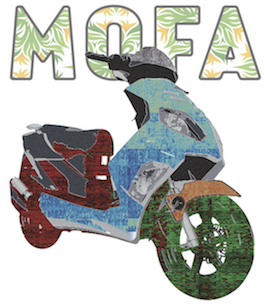

# Unsupervised data integration

This is a bonus exercise, for those of you who are interested and have some time over. It is from the course [Omics Integration and Systems Biology](https://uppsala.instructure.com/courses/67276), and the lab was created by **Nikolay Oskolkov**. In this exervise you will analyze a single cell data set with chromatin accessebility (scATACseq), DNA methylation (scBSseq) and gene expression (scRNAseq) data, using MOFA.




<style>
div.blue { background-color:#e6f0ff; border-radius: 5px; padding: 20px;}
</style>
<div class = "blue">

Note that this [tutorial](https://uppsala.instructure.com/courses/67276/pages/lab-unsupervised-integration-through-mofa2) only serves as a guide and not meant to be taken as a copy-and-paste exercise.
The [tutorial](https://uppsala.instructure.com/courses/67276/pages/lab-unsupervised-integration-through-mofa2) will give you a general framework in how to use MOFA as a tool to integrate multidimensional data and how to interpret MOFA's results.


</div>


## Learning outcomes

- apply feature selection methods on multi -omics data 

- apply an unsupervised method for data integration, and interpret the results


## Setup

This has been tested on Uppmax. First load these modules

```
module load bioinfo-tools
module load R/4.0.0
module load R_packages/4.0.0
```

You also need to install some python code that MOFA needs.

```
pip install mofapy
```

Then, get the data for the exercise, and go to the data directory

```
git clone https://github.com/NikolayOskolkov/UnsupervisedOMICsIntegration.git
cd UnsupervisedOMICsIntegration
```

Now you are ready to start `R` or `rstudio`.

## The exercise

The instructions for the exercise are [here](https://uppsala.instructure.com/courses/67276/pages/lab-unsupervised-integration-through-mofa2). First, there is short introduction to MOFA. For the exercise, scroll down to "Prepare scNMT Data Set for MOFA". 
