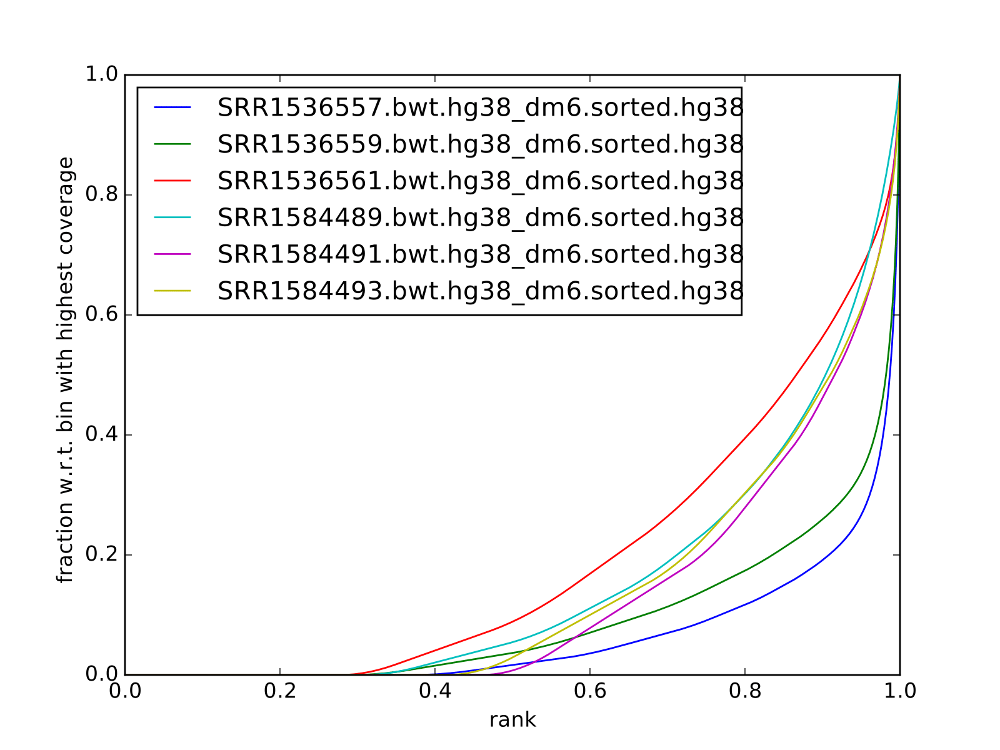
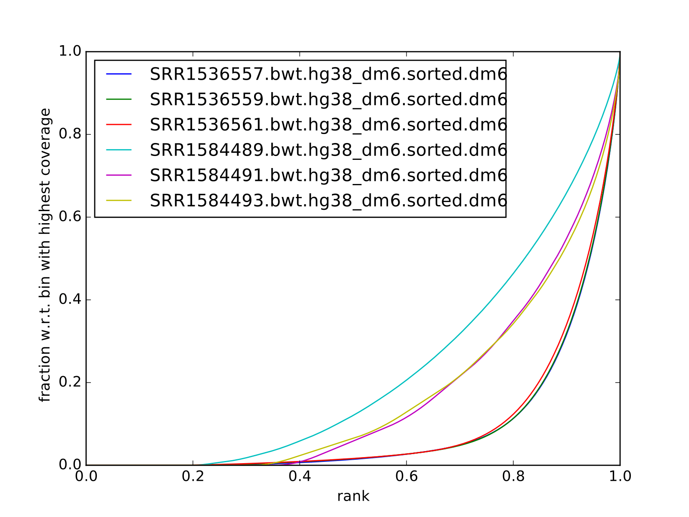

# ChIP-seq with exogenous chromatin spike


<!-- version 1
still experimental, to be improved
7 xi 2018
 -->


## Requirements


* R 3.5.0 (2018-04-23) or newer

* Bioconductor packages:
	
	* ChIPSeqSpike
	* BSgenome.Hsapiens.UCSC.hg38


## Data

We will use ChIP-seq of H3K79me2 from Orlando et al, 2014 ("Quantitative ChIP-Seq Normalization Reveals Global Modulation of the Epigenome"). 

The histone H3 lysine-79 dimethyl (H3K79me2) modification is catalyzed by the DOT1L protein and is associated with the release of paused RNA Polymerase II and licensing of transcriptional elongation. This modification is typically deposited within the 5′ regions of genes.


The experimental design was as follows:

* Jurkat cells were treated with selective DOT1L inhibitor EPZ5676 to globally deplete H3K79me2;
* chromatin from treated and untreated cells was mixed in different proportions (here we use two conditions: 100 % treated and 50-50% treated + untreated) to mimic a global change in abundance of H3K79me2
* chromatin from *Drosophila* S2 cells was added in a 1:2 ratio (1 S2 cell per 2 Jurkat cells) which provided a constant “reference” amount of H3K79me2 per human cell. 


GEO accession is `GSE60104`
ENA accession is ` PRJNA257491`

files in the dataset:

sample | GEO accession | SRA accession
--- | --- | --- 
Jurkat_K79_100%_R1 | GSM1465008 | SRR1536561
Jurkat_K79_100%_R2 | GSM1464998 | SRR1536551
Jurkat_K79_50%_R1 | GSM1465006 | SRR1536559
Jurkat_WCE_100%_R1 | GSM1511469 | SRR1584493
Jurkat_WCE_100%_R2 | GSM1511474 |SRR1584498
Jurkat_WCE_50%_R1 | GSM1511467 | SRR1584491


## Data preparation

All data processing steps were already performed.

Raw fastq reads were filtered so that low quality bases and adapters were removed. Reads were mapped to the composite reference which consisted of **hg38** and **dm6** using `bowtie`. Only reads with one best alignemnt were retained. Alignments were split by reference using `samtools` and were subset to **chromosome 1** for hg38 and **chromosome 2L** for dm6.

Quality metrics were computed for each bam split by reference genome.

Fixed-step bigWig files were generated as follows:

* genome coverage of data in `bam` files at 1 bp resolution was calculated using `bedtools`

* covareage was converted to fixed step `wig` files using https://gist.github.com/svigneau/8846527/bedgraph_to_wig.pl using step size 100

* `wig` was converted to `bigWig` using UCSC toolkit using chrom.sizes for `hg38` downloaded from UCSC genome browser

```
bedtools genomecov -bga -ibam in.bam >out.bg

bedgraph_to_wig.pl --bedgraph out.bg --wig out.wig --step 100

wigToBigWig out.wig chrom.sizes final.bw

```

All files necessary to execute the code in `R` can be copied from Rackham from:

`/sw/share/compstore/courses/ngsintro/chipseq/exospike/exospike.tar.gz`


After copying the files please decompress the archive and note the path to folder `/chip_exo_spike` on your local system.

## Fingerprint plots

all reads mapped to `hg38` (i.e. not subset):

<br>

all reads mapped to `dm6` (i.e. not subset):

<br>


## Disclaimer

Please be aware that this is an experimental code, and as such does not represent any golden standard for analyses of this type. This is my exploration of the topic of using exogenous chromatic spike for ChIP-seq. I will aim to keep updating it with further steps of the analysis, once I get there.


## Using `ChIPSeqSpike` for ChIPseq signal scaling

This workflow is based on https://github.com/descostesn/BiocNYC-ChIPSeqSpike.

The scaling procedure works on computers with *non-Windows* operating systems. This includes Uppmax, so you can use `salloc` command to book a node and follow the workflow remotely.


### Files and directories

In `R`:

```
workdir="/path/to/chip_exo_spike"
setwd(workdir)

bam_path=file.path(workdir,"bam")
bw_path=file.path(workdir,"tracks")
exp_data=file.path(workdir,"exp_data.csv")

#you will have to copy the initial bigwig tracks to the output folder at a later stage
#output_folder=file.path(workdir,"results")
#dir.create(output_folder)

#so until the package code is fixed:
output_folder=bw_path
```

You can inspect the file `exp_data.csv` to familiarize yourself with the structure:

```
info=read.table(exp_data, sep=",")
head(info)
```


### Scaling of signal to exogenous chromatin spike

Load the library and create the object:
```
library(ChIPSeqSpike)

cs <- spikeDataset(exp_data, bam_path, bw_path)
```

Calculate the size factors based on numbers of mapped reads:

```
cs <- estimateScalingFactors(cs, verbose = TRUE)
```

```
> spikeSummary(cs)
                endoScalFact exoScalFact endoCount exoCount
H3K79me2_0         0.5367522   1.0216143   1863057   978843
input              1.1604563          NA    861730       NA
H3K79me2_50        0.6604427   0.7663511   1514136  1304885
input              2.9039209          NA    344362       NA
H3K79me2_100_r1    1.5994012   0.3687641    625234  2711761
input              2.5008003          NA    399872       NA
H3K79me2_100_r2    2.6171433   0.6153835    382096  1625003
input              7.7456934          NA    129104       NA
```


**RPM scaling.** The first normalization applied to the data is the ‘Reads Per Million’ (RPM) mapped reads. The method ‘scaling’ is used to achieve this normalization using default parameters.

```
cs <- scaling(cs, outputFolder = output_folder)
```

You are supposed to obtain files `*-RPM.bw` after this step.


**Input subtraction.** This step is to subtract background (from input samples) from signal. The `inputSubtraction` method simply subtracts scores of the input DNA experiment from the corresponding ones.

```
cs <- inputSubtraction(cs)
```

You are supposed to obtain `*-RPM-BGSub.bw` after this step.

**RPM scaling reversal.** After RPM and input subtraction normalization, the RPM normalization is reversed in order for the data to be normalized by the exogenous scaling factors.

```
cs<- scaling(cs, reverse = TRUE)
```

`*-RPM-BGSub-reverted.bw` files after this step.

**Exogenous Scaling.** Finally, exogenous scaling factors are applied to the data.

```
cs <- scaling(cs, type = "exo")
```

The end result: `*-RPM-BGSub-reverted-spiked.bw` files after this step.


**Extracting binding values.** The last step of data processing is to extract and format binding scores in order to use plotting methods. The `extractBinding` method extracts binding scores at different locations and stores these values in the form of PlotSetArray objects and matrices. The scores are retrieved on annotations provided in a `gff` file. If one wishes to focus on peaks, their coordinates should be submitted at this step. The genome name must also be provided. For details about installing the required `BSgenome` package corresponding to the endogenous organism, see the BSgenome package documentation.

Please note that this steps may take a long time.

```
gff=file.path(workdir,"hg38_refseq_chr1.gtf")
library(BSgenome.Hsapiens.UCSC.hg38)

cs <- extractBinding(cs, gff_vec=gff, genome="hg38")
```

After this step, save the workspace

```
save.image(file = "chipseqspike.RData")
```

To load the data:

```
load("chipseqspike.RData")
```


### Data visualization.

`ChIPSeqSpike` offers several graphical methods for normalization diagnosis and data exploration. These choices enable one to visualize each step of the normalization through exploring intersamples differences using profiles, heatmaps, boxplots and correlation plots.

When performing this exercise on Uppmax, save the plots to pdf for viewing:

```
pdf("filename.pdf")
## here command to produce the plot
dev.off()
```


#### Visualization with gene meta-profiles

The first step of spike-in normalized ChIP-Seq data analysis is an inter-sample comparison by meta-gene or meta-annotation profiling. The method `plotProfile` automatically plots all experiments at the start, midpoint, end and composite locations of the annotations provided to the method extractBinding in gff format. The effect of each transformation on a particular experiment can be visualized with `plotTransform`.


```
## Plot spiked-in data
plotProfile(cs, legends = TRUE)

## Add profiles before transformation
plotProfile(cs, legends = TRUE, notScaled=TRUE)

## Visualize the effect of each transformation on each experiment
plotTransform(cs, legends = TRUE, separateWindows = TRUE)
```


#### Visualization with Boxplots

`boxplotSpike` plots boxplots of the mean values of ChIP-seq experiments on the annotations given to the `extractBinding` method. 


```
## Boxplot of the spiked-in data
boxplotSpike(cs, outline = FALSE)

## Boxplot of the raw data
boxplotSpike(cs,rawFile = TRUE, spiked = FALSE, outline=FALSE)

## Boxplot of all transformations
boxplotSpike(cs,rawFile = TRUE, rpmFile = TRUE, bgsubFile = TRUE, revFile = TRUE, spiked = TRUE, outline = FALSE)
```

#### Correlation plots

The `plotCor` method plots the correlation between ChIP-seq experiments using heatscatter plot.

```
## Log transform correlation plot of spiked data with heatscatter representation
plotCor(cs, rawFile = FALSE, rpmFile = FALSE,  bgsubFile = FALSE,  revFile = FALSE, spiked = TRUE,  main = "heatscatter",  method_cor = "spearman", add_contour = FALSE,  nlevels = 10,  color_contour = "black", method_scale = "log",  allOnPanel = TRUE, separateWindows = FALSE,  verbose = FALSE)

## Plot as above with raw data
plotCor(cs, rawFile = TRUE, rpmFile = FALSE,  bgsubFile = FALSE,  revFile = FALSE, spiked = FALSE,  main = "heatscatter",  method_cor = "spearman", add_contour = FALSE,  nlevels = 10,  color_contour = "black", method_scale = "log",  allOnPanel = TRUE, separateWindows = FALSE,  verbose = FALSE)

## Correlation table comparing all transformations
corr_matrix <- plotCor(cs, rawFile = TRUE, rpmFile = TRUE, bgsubFile = TRUE, revFile = TRUE, spiked = TRUE, heatscatterplot = FALSE, verbose = TRUE)
```

## What to do next

* use scaled `bigWig` tracks to view the signal in IGV
* use `bed` files produced from scaled `bigWigs` to perform peak calling for instance with MACS2
* differential binding analysis using `csaw` (more appropriate for broad marks) inputing the scaling factors obtained from scaling by `ChIPSeqSpike`
* perform the normalisation / scaling directly in `csaw`    
* use scaled `bed` / `bigwig` for data exploration using PCA and MA plots
