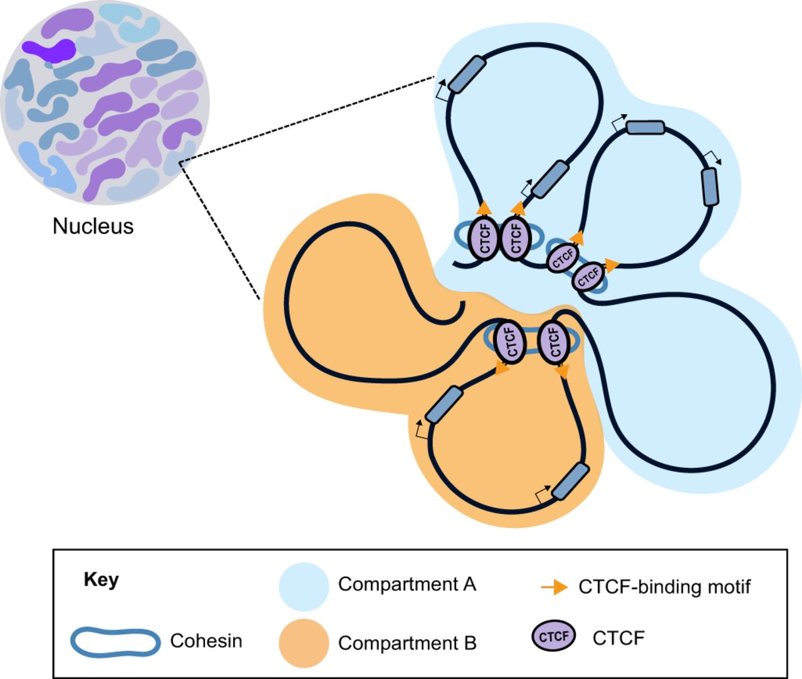
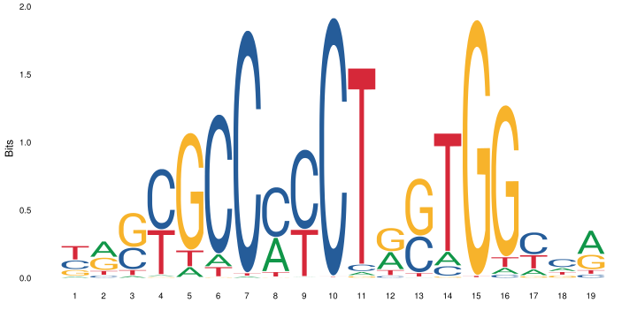

# Motif finding exercise

In this exercise we will try a few *de-novo* motif finding programs on data sets from human and mouse. We will also compare the motifs we find to a database of known motifs.


## 0. Set up

Log in to Uppmax, and start an interactive session.

Load the modules we will use in the exercise:

```
module load bioinfo-tools
module load BEDTools
module load MEMESuite
module load HOMER
```

Create a working directory where you will do the exercise, and go there. For example:

```
mkdir motif_lab
cd motif_lab
```

Note that the programs used in this exercise produce html output. You view these directly on Uppmax, although this is a bit slow. Otherwise you can copy the files to you local computer, and open them there.


## 1. Download CTCF data
First, we will look at a ChIP-seq experiment using an antibody against *CTCF*. *CTCF* (CCCTC-binding factor) is a zinc-finger protein that functions as a transcription factor. It also has insulator activity and is important for the 3D structure of chromatin, through formation of chromatin loops.



*CTCF* is a well studied protein, and many ChIP-seq data sets are available for CTCF. Its DNA motif is [well known](http://jaspar.genereg.net/matrix/MA0139.1/?revcomp=1) (as you can tell from its name).



We will use [this data set](https://www.encodeproject.org/experiments/ENCSR572DUJ/), from ENCODE. This page shows information about this particular experiment, along the experimental protocols and analysis pipelines used. Scroll down a bit and select the tab "File details". Now you will see a list of file available for download. We will use the bed files with "pseudoreplicated idr thresholded peaks". Download this file:

```
wget https://www.encodeproject.org/files/ENCFF693MYU/@@download/ENCFF693MYU.bed.gz
gunzip ENCFF693MYU.bed.gz
```


## 2. Prepare peak data

The peaks are on the "narrowPeak bed format", described [here](https://genome.ucsc.edu/FAQ/FAQformat.html#format12)

Have a look at the file:

```
less ENCFF693MYU.bed
```

It's often a good idea to just use the peaks with the strongest signal for motif finding. This is becuase a) motif finding programs have a hard time handeling large inputs, and b) the peaks with the strongest signal are most likely to be true binding sites and to contain the motif of interest. Therefore, we will run motif finding on the top 500 peaks. To get the top 500 peaks, we first sort the peaks on "signalValue" in column 7 (using the `sort` command) and then take the first 500 peaks (using the `head` command):

```
sort -k 7,7nr  ENCFF693MYU.bed | head -n 500 > ENCFF693MY_top500.bed
```

Have look at the resulting file:

```
less ENCFF693MY_top500.bed
```

## 3. Prepare sequence data
Next, we need to get the genome sequence at these 500 peaks. Since repeat elements can confuse the motif finding programs, we will use a repeat-masked version of the genome, where all repeat sequences have been replaced with Ns. Create a soft link to the repeat masked genome in you working directory:

```
ln -s /sw/share/compstore/courses/ngsintro/chipseq/data/refence_genomes/hg38.masked.fa* .
```

We will now use `bedTools` to extract the genome sequence for the 500 peaks:

```
bedtools getfasta -fo CTCF_top500_peak_seq.fa -fi hg38.masked.fa -bed ENCFF693MY_top500.bed
```

You can see the documentation for the program you just used [here](https://bedtools.readthedocs.io/en/latest/content/tools/getfasta.html). Now, have a look at the fasta file produced:

```
less CTCF_top500_peak_seq.fa
```

## 4. Use the MEME suite for motif finding
First we try DREME, which is a fast program that looks for regular expressions (documentation [here](http://meme-suite.org/doc/dreme-tutorial.html)). This takes around 5 minutes to run:

```
dreme -p CTCF_top500_peak_seq.fa -oc dreme_out
```

DREME produces several output files. Take a look at the html file:

```
firefox dreme_out/dreme.html 
```

You see a list of motifs represented as regular expressions and sequence logos, along with e-values and some links.


Next, we will try MEME-ChIP. This is a wrapper that runs several programs, including DREME, MEME, and Centrimo. It takes bit longer to run, around 10 minutes:

```
meme-chip -oc meme_chip_out CTCF_top500_peak_seq.fa
``` 

This produces several output files. The file `meme_chip_out/dreme_out/dreme.html` is basically the same file as we saw in the previous step. There is also an output file from MEME, a different motif finding program:

```
firefox meme_chip_out/meme_out/meme.html
```

Here you can see all motifs found by MEME, with e-values etc.

MEME-ChIP also runs a program called centrimo, which looks at where the motifs are located, relative the peaks. It also produces a html file with the results:

```
firefox meme_chip_out/centrimo_out/centrimo.html
```

Finally, it summarizes the results of DREME, MEME and Centrimo:

```
firefox meme_chip_out/meme-chip.html 
```

**What can you learn from all this output? Do the programs find the expected motif? Do they find other motifs? Where are the motifs located in the peaks?**


## 5. What are the motifs we have found?
Often when we find a motif, we want to see if it is similar to any motif that is already known. One tool to do this is called Tomtom, and is part of the same suite of programs as MEME etc. MEME and DREME actually have convenient functions to directly look up motifs with Tomtom. To try this, open the MEME output again.

```
firefox meme_chip_out/meme_out/meme.html
```

Click on the rightward-pointing arrow next to the first motif (under *Submit/Download*). You can then select which tool you want to submit your motif to. Tomtom is already pre-selected, so just click on *Submit*. This takes you to the Tomtom website, where you click on *Start search*. After a short while you will see a page called *Results*. Clicking on *Tomtom HTML output* takes you to the result page. Here you can see the results of matching the motif we found (the "query motif") to Tomtom's data base.

**What is the top scoring motif? Does it look similar to the motif we found? What about other motifs further down the list?**

You can also access Tomtom directly from the [web site](http://meme-suite.org/tools/tomtom), or run it from the command line.


## 6. Try a data set from the previous execise
In the previous exercise you analyzed *REST* ChIP-seq data. The DNA specificity of this transcription factor is [known](http://jaspar.genereg.net/search?q=rest), so it's interesting to see if we are able to recover the same (or a similar) motif.

In the previous exercise an earlier version of the human genome, hg19, was used. Also, only peaks on chromosomes 1 and 2 were considered. We have prepared a file with repeat-masked hg19 sequence from chromosomes 1 and 2. Create a soft link to this file in you work directory

```
ln -s /sw/share/compstore/courses/ngsintro/chipseq/data/refence_genomes/hg19_chr_1_2.masked.fa* .
```

Then copy one of the peak files from the previous exercise to work directory 

```
cp /sw/share/compstore/courses/ngsintro/chipseq/results/peaks_bed/hela_1_peaks.chr12.bed rest_peaks.chr12.bed
```

Now you are ready to repeat all steps on the new peak set: select the top 500 peaks, get repeat masked genome sequence for these peaks and run motif finding.

```
sort -k 7,7nr rest_peaks.chr12.bed | head -n 500 > rest_top500.bed
bedtools getfasta -fo rest_top500_peak_seq.fa -fi hg19_chr_1_2.masked.fa -bed rest_top500.bed
dreme -p rest_top500_peak_seq.fa -oc dreme_out_rest
meme-chip -oc meme_chip_out_rest rest_top500_peak_seq.fa
```

**What do the programs find? Do DREME and MEME find similar motifs? Do these look like the known REST site? Do the motifs you found resemble any known motifs in Tomtom's data base?**


## 7. Try HOMER
Finally, we will try another popular motif finding software, HOMER. Here we will look at a [CTCF chip-seq experiment from mouse](https://www.encodeproject.org/experiments/ENCSR000CBJ/). First, download the bed file with the peaks and select the top 500 peaks:

```
wget https://www.encodeproject.org/files/ENCFF311HPG/@@download/ENCFF311HPG.bed.gz
gunzip ENCFF311HPG.bed.gz
sort -k 7,7nr ENCFF311HPG.bed | head -n 500 > mouse_CTCF_top500.bed
```

Then run HOMER on the top 500 peaks. Note that HOMER comes with a number of pre-formatted genomes, so you just give it the coordinates of the peaks and tell it which genome you are looking at.

Have a look at the resuling html file. Here you can see a list of *de-novo* motifs found and which known motifs these are similar to. The program also scans the peaks for all known motifs, and indicates which motifs are enriched on the peak region. Klick on *Known Motif Enrichment Results* to see the results.
 
```
findMotifsGenome.pl mouse_CTCF_top500.bed mm10 homer_out_mouse_ctcf -size 200 -mask -preparsedDir tmp_homer/
firefox homer_out_mouse_ctcf/homerResults.html
```

**What does HOMER find? is this output easy to interpret?**


